# Begin Here — Anki Cards

Q: What is the core thesis of Learn UI Design?
A: "Beautiful, high-quality interface design, as much as it might feel subjective or arbitrary or magic, is not. It's actually based in logic and rationale. And very importantly, that logic is learnable."

Q: How many units does Learn UI Design have, and what's the high-level shape of the curriculum?
A: 7 units. Each unit answers a problem left by the previous one — Fundamentals leaves you with clean-but-boring designs, which the brand-translation units (Color, Typography, Imagery) solve, then platforms and communication wrap it up.

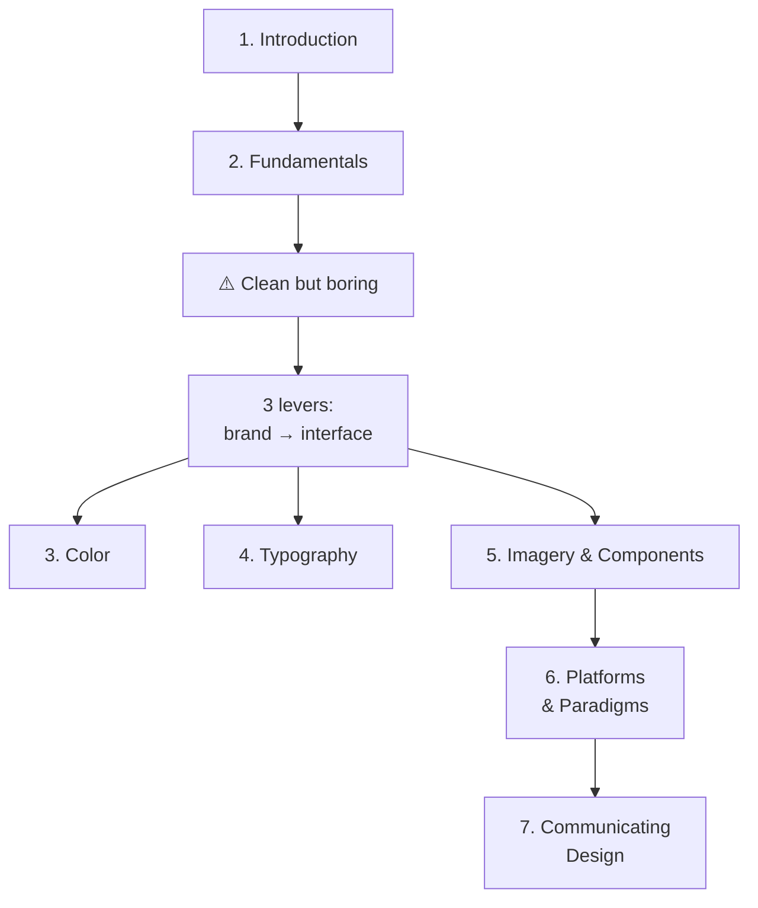
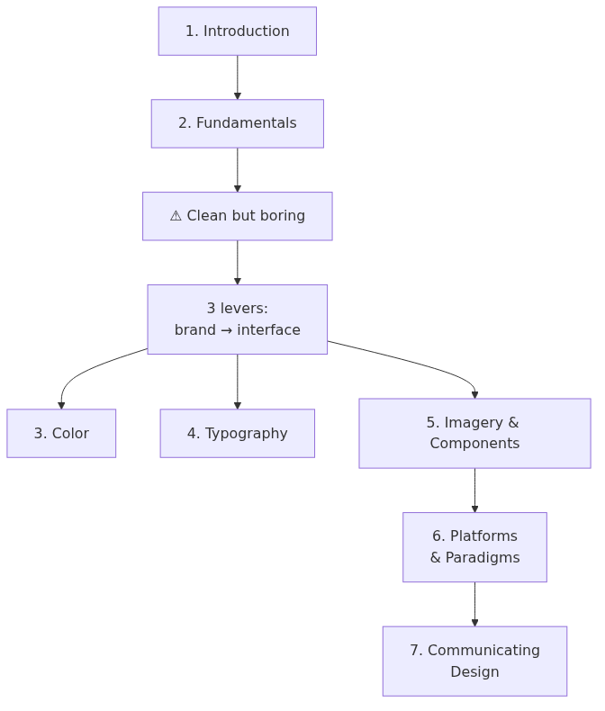

Q: What is Unit 1 of Learn UI Design about?
A: Setting up your workspace and getting your mindset right — laying the groundwork so you can design confidently and quickly down the road.

Q: What skills does Unit 2 (Fundamentals) cover, and how broadly do they apply?
A: Alignment, whitespace, consistency, sizing, etc. They apply to **every single design you ever do** — whether low-brand (neat, clean, simple) or high-brand (opinionated, outspoken, full of style).

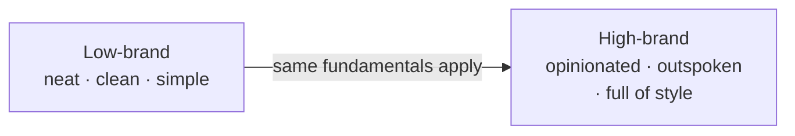
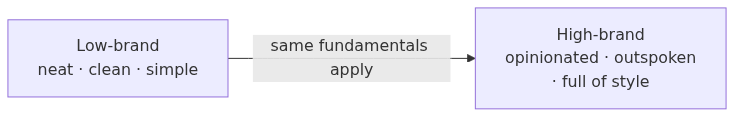

Q: What is Eric's definition of "brand" in this course?
A: A catch-all term for the adjectives or phrases you'd want your viewer to use to describe your site, business, or application.

Q: What is the "Six Strategies of Simplicity"?
A: The capstone lesson of Unit 2 — a master algorithm for building clean, simple designs, built on everything in the Fundamentals unit.

Q: After the Fundamentals unit, what's the problem Eric warns you'll likely run into?
A: Your designs look neat, modern, and organized — but they're kind of boring. "And while that's a great problem to have, it's still a problem."

Q: What's the solution to the "clean but boring" problem after Fundamentals?
A: Get good at translating between your brand and your interface — using three levers: Color, Typography, and Imagery. "And lo and behold, those are the next three units of Learn UI Design."

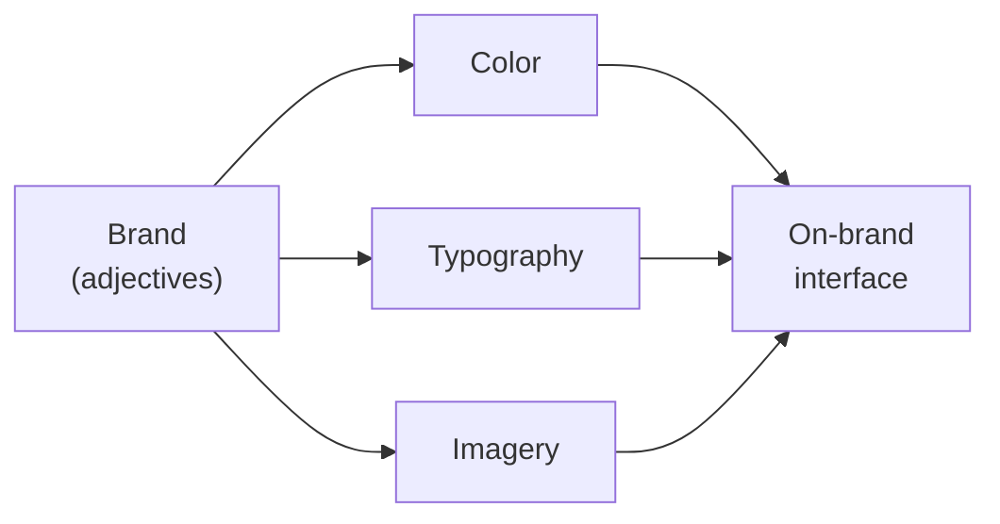
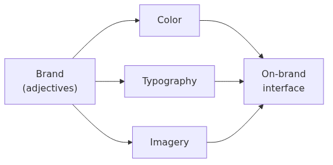

Q: Why does Eric say color is the easiest of the brand-translation areas to gain proficiency in?
A: Because every color is comprised of just three numbers. "If something is made of numbers, it can be very easy to see the patterns in it."

Q: How does Eric structure the color sub-skills?
A: Like three concentric circles: zero colors (grayscale) → one color (theme + variations) → many colors (palettes). Each builds on the previous.

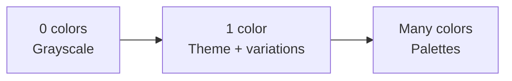
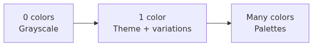

Q: Why is grayscale (zero colors) such an important starting point in the color unit?
A: Many projects and brands use only grayscale anyway, so it's useful on its own — and it's also a critical building block for everything that follows.

Q: What are the "archetypal palettes"?
A: Eric's claim that despite billions of color possibilities, most good palettes fall into one of four categories. They're presented as building blocks for exploring other palette ideas.

Q: Why is typography taught as a skill-based unit rather than a numeric one like color?
A: Unlike color, you can't boil down a font and how to use it into just a couple of numbers — so a skill-based approach is used instead.

Q: What are the two fundamental skills in UI typography per Eric?
A: 1) Choosing good fonts, 2) Styling fonts well.

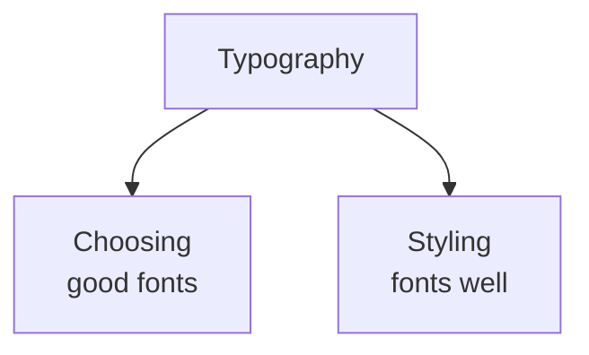
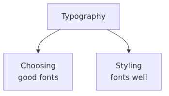

Q: What is the Good Fonts Table?
A: A Figma resource Eric uses in his own design practice — a database of 100+ high-quality, free or very cheap fonts, categorized by type and brand, with features, usage notes, and links.

Q: For higher-brand sites, what's Eric's approach to understanding how a font portrays a brand?
A: A font is just a set of mildly complex shapes that match each other. Any statement about how a font *feels* is really a statement about shapes. "If you can identify shapes, then you can also identify a font's brand."

Q: What are the three areas Eric breaks "styling fonts well" into?
A: 1) Typographic rules (always follow), 2) Heuristics / rules of thumb, 3) Common typographical design patterns from professional work.

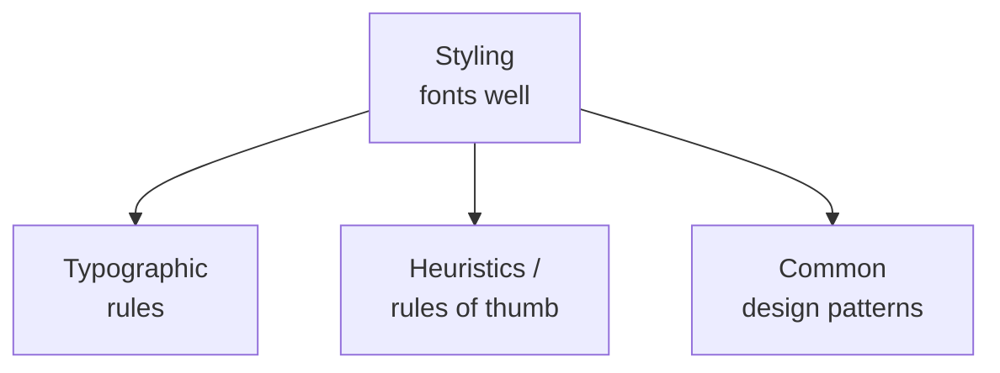
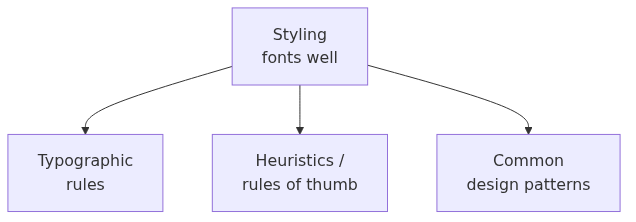

Q: Why does Eric keep breaking topics into skills and subskills?
A: "I promise, this is not accidental. It's actually for your benefit." If you're overwhelmed, the structure is a sigh of relief — you can chip away at skills one at a time. If you're experienced, you can go straight to your weaknesses and shore them up.

Q: What three types of imagery does Unit 5 cover?
A: Photography, illustrations, and icons. The unit also covers design-system components (buttons, text boxes, dropdowns, radio buttons, etc.) — always with an eye to matching the target brand.

Q: What does Unit 6 (Digital Platforms & Paradigms) cover?
A: All the specific concerns of digital design: accessibility, responsive design, and the idiosyncrasies of iOS and Android.

Q: What does Unit 7 (Communicating Design) cover?
A: Every situation where you present your work — design presentations and feedback, developer handoff, design portfolios, and design interviews. "It's all in there."

Q: Can you watch Learn UI Design lessons in any order?
A: Yes. "By and large, you can watch these lessons in any order you prefer." Go straight through or skip around to the skills you want to improve first.

Q: How does Eric want students to think about the course's longevity?
A: As a lifetime resource — not a sprint. "Each time you dive into a video, whether it's for the first time or subsequent times, you learn something new, just like talking to a knowledgeable friend would do."

Q: What's the one software requirement, and why doesn't Eric mandate a specific tool?
A: A UI design app. He recommends Figma (industry standard, what he uses) — but the course is about underlying principles of beautiful design, not a specific tool. Use whatever you're comfortable with.

Q: What does Eric say is the single most important thing for actually getting better at design?
A: Grappling with the knowledge — applying it in live practice. "You may understand something about how to fix some designs, but you will not really improve at actually designing. If you want to improve at actually designing, you need to actually design."

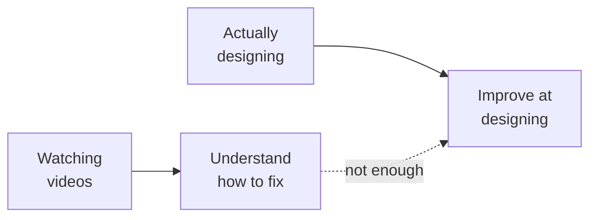
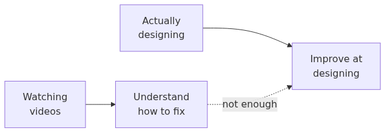

Q: What two practical ways does Eric suggest for "grappling" with the material?
A: 1) Focused exercises per lesson (e.g. practice alignment alone without worrying about color/type). 2) Work on your own project alongside the course — every hiccup is a future "aha" moment.

Q: What's Eric's advice for when you start to spin your wheels and feel stuck?
A: Don't burn out — get feedback from a knowledgeable professional. "Getting good feedback just cuts through the noise so well and is a much better use of time than just kind of grinding your gears and getting discouraged."

Q: What is the homework for this introduction lesson?
A: A **baseline design** — produce a design now to capture where you're at, then redesign the same screens at the end of the course to see what you've learned.

Q: Scenario — you've finished Unit 2 and your designs look organized and modern but feel lifeless. Which units address this, and via what concept?
A: Units 3, 4, and 5 (Color, Typography, Imagery) — they teach the three levers for translating your **brand** into the interface so it stops feeling boring.

Q: Scenario — you're starting a brand new low-brand product and want to pick colors. Where in the three concentric circles should you start, and why?
A: Start with grayscale (zero colors). Many low-brand products use only grayscale plus variations on one base color — and grayscale is the foundation for everything else in the color unit.

Q: Scenario — you're choosing a font for a strong, opinionated high-brand site. What mental move does Eric recommend?
A: Think of the font as a set of shapes. Identify which shapes evoke the brand mood you want — "If you can identify shapes, then you can also identify a font's brand."

Q: Scenario — a friend says "I've been watching all 35 hours and I still can't design well." What's Eric's diagnosis?
A: Watching alone gives you understanding of how to *fix* designs but doesn't make you better at designing. You need to actually design and grapple with it — ideally with feedback from a knowledgeable professional.
