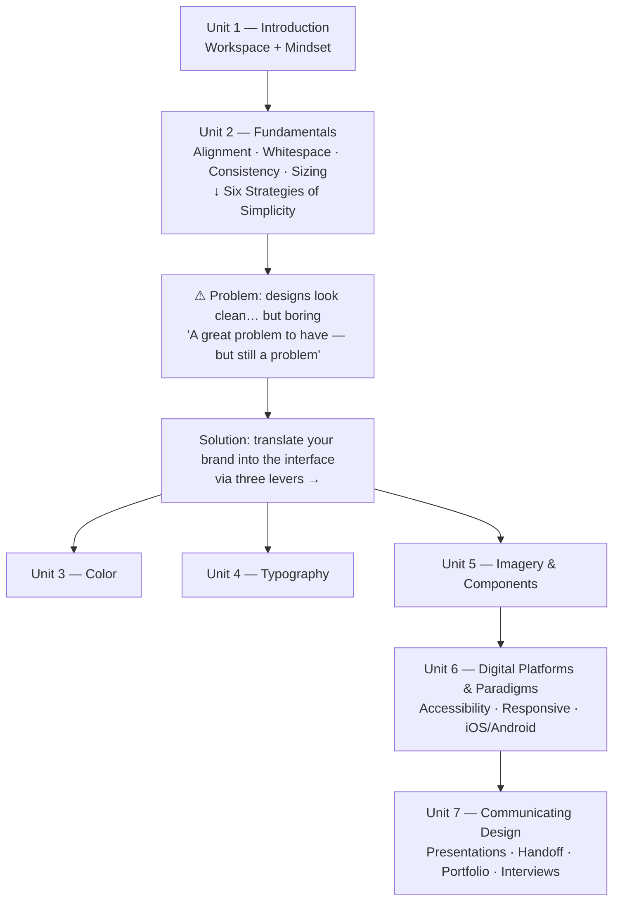
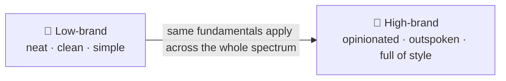
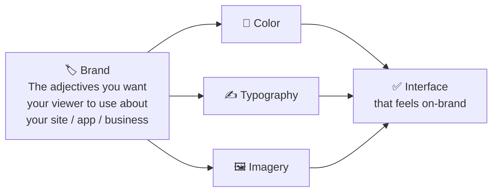
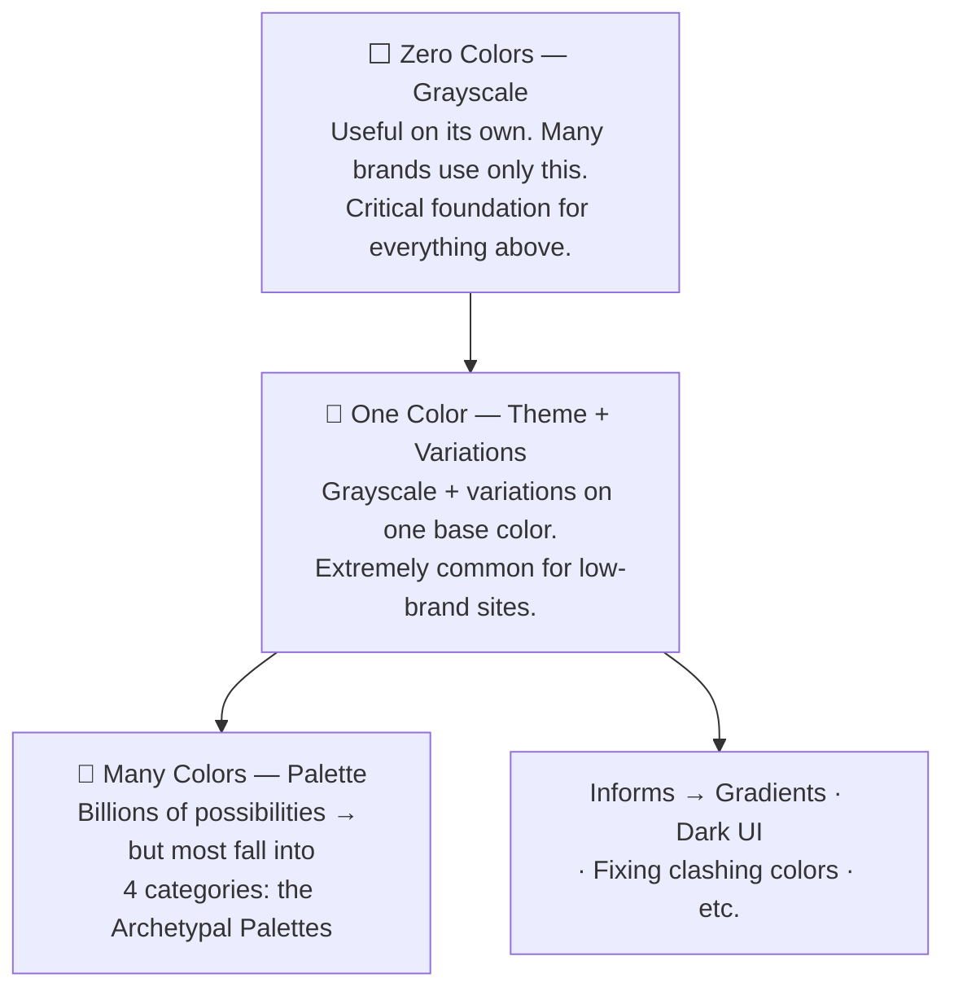
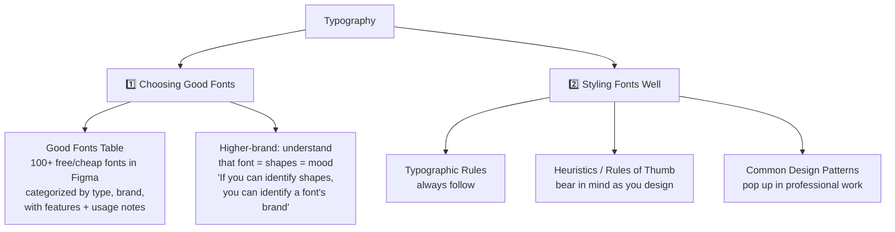
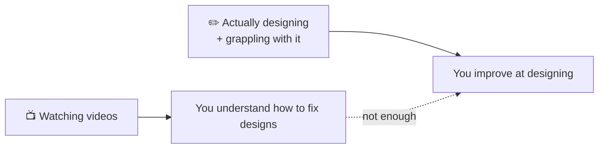

# Begin Here — Learn UI Design Intro

## Core Thesis

> "Beautiful, high-quality interface design, as much as it might feel subjective or arbitrary or magic, is not. It's actually based in logic and rationale. And very importantly, that logic is learnable."

Eric notes upfront that he doesn't love soft intro content like this — but says there's a point to it, because Learn UI Design has a **different and opinionated take** on how to teach UI design. And while there are over 5,000 students in the course (from basically every single industry-leading company), the explanations and frameworks differ quite a bit from what he'd call mainstream design curriculum.

---

## Course Structure (7 Units)

The units aren't arbitrary — each one answers a specific problem left by the previous one:

---

### Unit 1 — Introduction
Setting up your workspace and getting your mindset right. Laying the groundwork so you can design confidently and quickly down the road.

### Unit 2 — Fundamentals

These are the skills you're going to use in **every single design you ever do**, whether it's something that:
- Merely needs to be kind of neat and clean and simple → Eric calls this **low-brand**
- Or something that needs to be visually much more opinionated, outspoken, and full of style → **high-brand**

Fundamental skills: alignment, whitespace, consistency, sizing, etc.

The unit culminates in a lesson called the **Six Strategies of Simplicity** — it sort of builds on everything you've learned in the unit thus far and caps it off with a **master algorithm for building clean, simple designs**.

> After fundamentals, you might run into this problem: your designs look neat, they look modern, they look organized — but they're *kind of boring*. "And while that's a great problem to have, it's still a problem."

---

### The Brand Problem → Three Levers

The solution: you need to get good at **translating between your brand and your interface**.

**Brand** is a catch-all term for the adjectives or phrases — or however you'd want your viewer to describe your site, business, or application.

When translating brand into an interface, there are three main levers:

"And lo and behold, those are the next three units of Learn UI Design."

---

### Unit 3 — Color

Color is the easiest of these areas to gain proficiency in — because every single color is comprised of just **three numbers**. "If something is made of numbers, it can be very easy to see the patterns in it."

Eric thinks of color as being comprised of several sub-skills that build out on top of each other, **like three concentric circles**:

- **Innermost — Zero colors (grayscale)**: Many projects and brands use only grayscale anyway, so this is already useful in its own right. But it's also a critical building block for the next skill.
- **Middle — One color (theme + variations)**: It's extremely common for a fairly low-brand site to have basically nothing but grayscale, maybe some imagery, and then variations on one base color. The idea of creating variations on a base color actually informs how you approach **all the rest of color** — gradients, dark UI, fixing clashing colors, etc.
- **Outer — Many colors (palette)**: Despite the fact that there are billions of possibilities, Eric finds that so many good palettes really fall into one of four categories. He calls these the **archetypal palettes** — presented in the course as building blocks for exploring other interesting palette ideas.

---

### Unit 4 — Typography

Significantly more complex than color — because unlike color, you can't boil down a font and how you use it into just a couple of numbers. So a **skill-based approach** is used instead.

Eric is fond of saying that in UI typography, there are really only **two fundamental skills**:

> **An aside on the skill/subskill breakdown:** "Have you noticed, by the way, that I'm always breaking things down into skills and subskills? I promise, this is not accidental. It's actually for your benefit." The idea: if you're totally overwhelmed by typography, knowing there's a structure in which everything fits together will be a huge boon — a sigh of relief, because you can chip away at those skills one at a time. But even if you're fairly experienced, knowing how things are broken down lets you go to where your weaknesses are and really shore those up.

**Choosing good fonts** is actually fairly easy to hack — "which means you can get quite good at it without really deeply understanding what's going on underneath the surface."

That's why you have access to the **Good Fonts Table**: a Figma resource that Eric uses all the time in his own design practice. It's a database of 100+ high-quality, free or very cheap fonts — categorized by type, by brand, and listed with features, usage notes, and links.

For higher-brand sites, it does become necessary to understand how a specific font portrays a specific brand. Eric's approach: "a font is just a set of mildly complex shapes that match each other." So any statement about how a font *feels* or what mood it's trying to evoke is really just a statement about **shapes**. "If you can identify shapes, then you can also identify a font's brand. It's going to be great."

**Styling fonts well** is perhaps even more open-ended than choosing fonts — but it's broken into three areas:
1. **Typographic rules** — things you should basically always be following
2. **Heuristics / rules of thumb** — to bear in mind as you design with type
3. **Common typographical design patterns** — things that just pop up time and time again in high-quality, professional type work

Overall, "this will allow us to take the deepest and most complex part of UI design and make it tractable and logical."

---

### Unit 5 — Imagery & Components

Covers the three main types of imagery that appear in UI:
- Photography
- Illustrations
- Icons

Also covers the different sorts of components that appear in design systems: buttons, text boxes, dropdowns, radio buttons, etc. (There's more in this unit too — that's just the gist of it.)

Throughout: not just how to make these elements look great, but also how to make them **match the brand** you're trying to achieve.

### Unit 6 — Digital Platforms & Paradigms

All the specific concerns that come up doing digital design — everything from accessibility to responsive design to the idiosyncrasies of iOS and Android design.

### Unit 7 — Communicating Design

All the times where you need to present your work to others in any capacity:
- Giving a design presentation and getting feedback
- Developer handoff
- Creating a design portfolio
- Design interviews

"It's all in there."

---

## Practical Notes

- **Watch order is flexible** — "By and large, you can watch these lessons in any order you prefer." Go straight through, or skip around to whatever skills you'd like to improve on first.
- **Adjust speed** — "Seeing as though this course is over 35 hours of video content, I understand that that is a lot." Use the gear icon below to switch to 1.5x or 2x.
- **Lifetime access** — "Please don't feel like this course is a sprint. I want this course to be a lifetime resource that you can refer to again and again. And each time you dive into a video, whether it's for the first time or subsequent times, you learn something new, just like talking to a knowledgeable friend would do."
- **One software requirement** — a UI design app. Eric recommends Figma (industry standard, what he uses for his own day-to-day design work) — but Learn UI Design is not a course about a specific tool. It's a course about more underlying and unchanging principles of beautiful design. Use whichever tool you feel most comfortable with.

---

## Related Courses by Eric Kennedy

Learn UI Design is all about **visual design**. Eric also has two other courses:
- **Learn UX Design** — making software simple and usable; covers user research, usability testing, wireframing, and heuristics for creating simple, intuitive apps.
- **Landing Page Academy** — doing the copywriting for high-converting landing pages and making them look spectacular.

---

## How to Actually Get Better

> "One thing that we've seen replicate again and again in the science of education is that the more you grapple with the knowledge you're trying to learn, the more you try and apply it in different ways and in live practice — even though that can be much more challenging than just sitting back and watching some videos — it will help you learn it better and remember it longer."

If you do that, you will build your design instinct. You will get better at describing design.

> "You may understand something about how to fix some designs, but you will not really improve at actually designing. If you want to improve at actually designing, you need to actually design."

Ways to do this:
- **Focused exercises per lesson** — e.g. in the alignment lesson, go practice alignment without having to worry about color and typography and all the rest.
- **Work on your own project** alongside the course — the more hiccups you run into in your design process, the more opportunities there are to have an "aha" moment watching these videos in the near future.

**Don't burn out.** Despite the encouragement to grapple and struggle with the design a little bit, Eric doesn't want you to burn out. From his own experience: whenever you start to feel like you're spinning your wheels and stuck, **get feedback from a knowledgeable professional**. "Getting good feedback just cuts through the noise so well and is a much better use of time than just kind of grinding your gears and getting discouraged."

---

## Homework

Do a **baseline design** — get a baseline sense of where you're at when beginning the course. Then, at the end, you can redesign those same screens and get a sense of what you've learned.

*(As with all homework assignments in the course — scroll down to the homework subhead below the video to read about it.)*

---

*"So whichever lesson you proceed to next, I just want to say thank you again for enrolling in Learn UI Design, and I wish you all the best on your design journey."*
