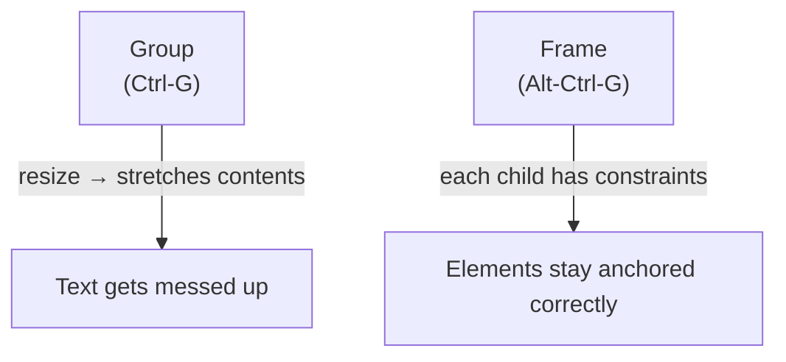
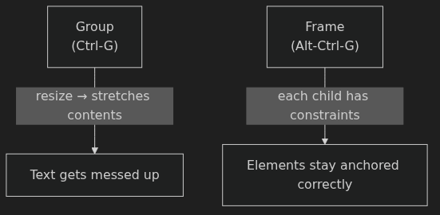
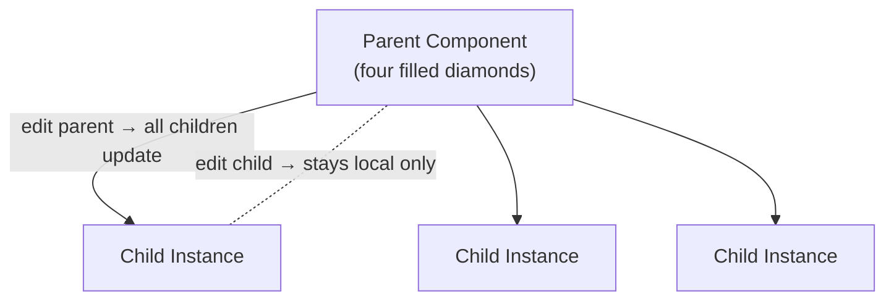
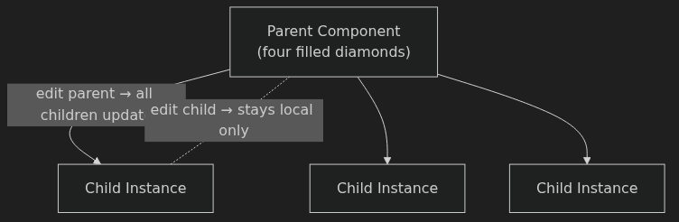
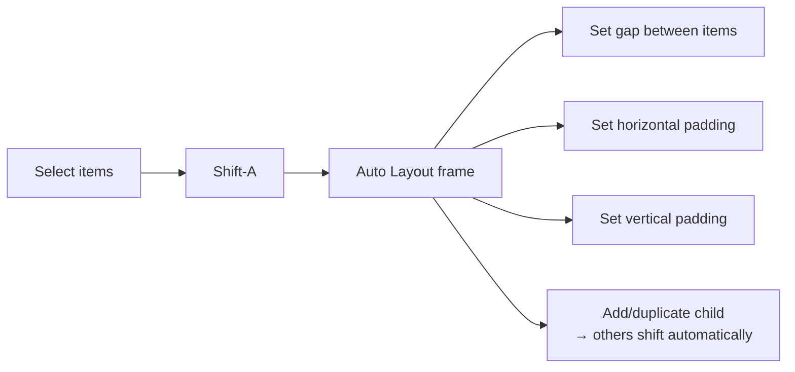
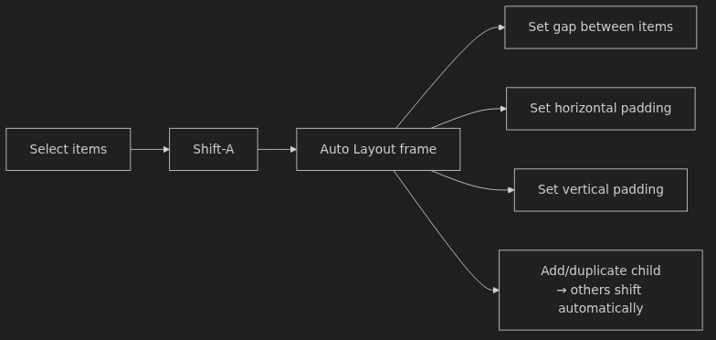

# Introduction to Figma — Anki Cards

Q: What is a Frame in Figma, and how is it different from just drawing on the canvas?
A: A frame (hotkey `F` or `A`) is a container for your design — equivalent to an artboard. It lets you design within a defined boundary (e.g., a phone-sized screen) and supports constraints, clipping, and auto layout. Layers outside a frame float freely on the infinite canvas.

Q: Why does the instructor say to pick your own phone model when creating a frame?
A: Because how a design looks on a laptop screen can be very different from how it looks on an actual phone. Choosing your exact model lets you preview the design at true size using the Figma mobile app on your device.

Q: What do Shift-2 and Shift-0 do in Figma?
A: Shift-2 zooms to fit the selected element on screen. Shift-0 brings it to 100% actual size. These are the two zooms the instructor uses almost exclusively.

Q: What is the difference between "Auto Height" and "Fixed Size" for text boxes in Figma?
A: Fixed Size clips or overflows content if you type more than fits. Auto Height makes the box grow and shrink with the content — this is the mode you almost always want.

Q: What is the difference between Layer Opacity and Fill Opacity in Figma?
A: Layer opacity (the `%` next to "Layer") affects the entire layer including any text on top of it. Fill opacity affects only the fill color — text and other elements on the same layer stay fully opaque. Use fill opacity when you want a translucent background without dimming the text.

Q: What is unique about Figma's pen tool compared to other vector tools?
A: In most vector tools, each point connects to exactly two segments. In Figma, **a point can connect to three or more segments** (vector networks), so you can draw branching shapes — like an arrow — as a single layer.

Q: What is the key difference between Groups (`Ctrl-G`) and Frames (`Alt-Ctrl-G`) in Figma?
A: Resizing a group stretches its contents, including text — text gets messed up. Frames support **constraints** on each child element (anchor to left, right, center, etc.), so elements stay positioned correctly when the frame resizes. Use frames for anything you might need to resize.

Q: How does Ctrl-D duplication work, and why is it useful for lists?
A: Ctrl-D duplicates the selected layer at the **same offset as your last move**. If you Alt-drag a to-do item 48px down, then press Ctrl-D repeatedly, each new item appears exactly 48px below the previous — giving you a perfectly spaced list with no manual measuring.

Q: What is the parent/child rule for Components in Figma?
A: Changes to the **parent component** propagate instantly to all child instances (even across pages or files). Changes to a **child instance** stay local and do not affect the parent or siblings.

Q: What are Component Variants in Figma, and when do you use them?
A: Variants let one component have multiple visual states (e.g., `complete: false` vs `complete: true`). Instead of keeping two separate components in sync manually, you define states once on the parent — then on any child instance you flip the property to switch the visual instantly.

Q: What does Auto Layout do, and what is its most classic use?
A: Auto Layout (`Shift-A`) turns a frame into a smart container that automatically spaces and adjusts its children when content changes. Its most classic use is **a button**: wrap a text box in an auto layout frame, set padding, and the button automatically resizes to fit any label text.

Q: How do you set a layer's opacity to 75% without clicking the opacity field?
A: Press `7` then `5` in rapid succession while the layer is selected. Figma interprets two quick digits as a two-digit value. Single digit: `1`–`9` = 10%–90%, `0` = 100%, double-tap `0` quickly = 0%.

Q: What is the minimum tap target size the instructor cites for iPhone, and why does it matter?
A: 44 × 44 pixels. Apple's HIG specifies this as the minimum for a tappable element so a fingertip can reliably hit it. Keep interactive shapes at least this large even if the visible icon is smaller.

Q: When should you use SVG vs PNG when exporting from Figma?
A: SVG for icons, logos, or any vector that needs to scale infinitely without blurring. PNG for most other sharing (screenshots, mockups). JPEG is smaller but slightly blurry — generally avoid it. PDF is for posters or slide decks.

Q: What export size should you use when posting a design image in a student community?
A: 1x — the design at its drawn size. 2x outputs at double the pixel dimensions, which is larger than necessary and makes the viewer zoom to 50% to see it as intended.

Q: What do Soft Light and Overlay blend modes do, and when do you use them?
A: They make overlapping translucent elements feel more integrated rather than just stacked. Use when two semi-transparent layers look jarring or disconnected on top of each other.

Q: What does Ctrl-P toggle in Figma, and when should you use it?
A: Pixel Preview — shows individual pixels and aliasing (blurring across pixel grid boundaries) at high zoom. Use it to check whether your vector paths are aligned to the pixel grid, which minimizes edge blurriness.

Q: How do you constrain movement to a single axis while dragging in Figma?
A: Hold **Shift** while dragging. This locks movement to horizontal or vertical, preventing accidental off-axis drift.

Q: How do you quickly measure the pixel distance between two elements in Figma?
A: Select one element, then hold **Alt** while hovering over another. Figma shows the pixel gap between them inline on the canvas.

Q: You have a button with text inside a rectangle. You want it to auto-resize when the label changes. What do you do?
A: Select the text and rectangle together, press **Shift-A** to wrap them in an Auto Layout frame, then set the padding. The frame will expand or contract to fit any text you put inside.

Q: You created a text box by clicking and dragging, but the box clips text when you type more than one line. What do you change?
A: Switch the text sizing mode from **Fixed Size** to **Auto Height** in the right panel. The box will then grow vertically as you type.

Q: You have five to-do items and want to add a "strikethrough + dimmed" state that you can toggle per item without touching the others. What Figma feature handles this?
A: **Component Variants.** Create a parent component with two variants (e.g., `complete: false` and `complete: true`), style each differently, then flip the property on individual child instances as needed.

Q: You want a sidebar element to stay pinned to the right edge when you resize its parent frame. What do you configure?
A: Set the element's **constraint** to anchor to the right (in the constraints panel when the child layer is selected inside a Frame). Groups don't support this — you must be inside a Frame, not a Group.

Q: You're reviewing a design with a client and want them to leave feedback directly on the design without needing a Figma account. How?
A: Share a link with "anyone with the link can view." Viewers can use the comment tool (`C`) in the browser viewer without signing up, and they won't trigger editor billing.
