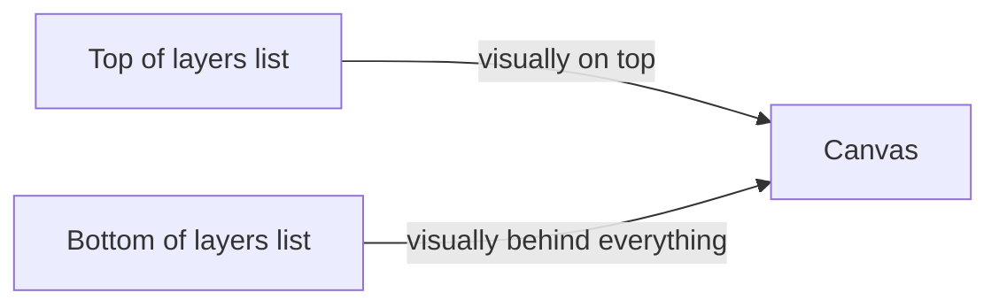
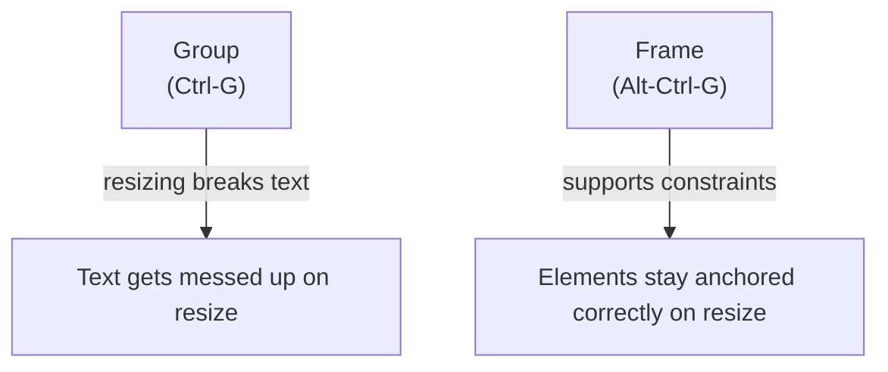
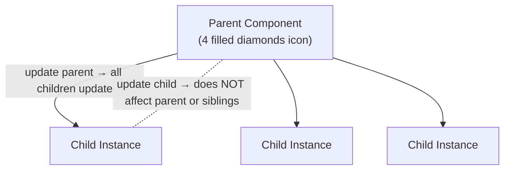
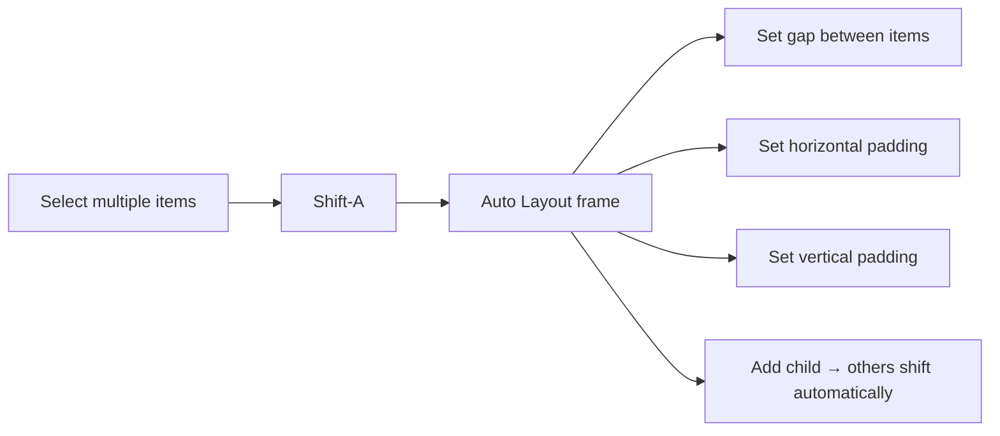

# Introduction to Figma

> "This is not everything, it's just sort of the basics."

This lesson covers the 80/20 of Figma — roughly 20% of Figma's total functionality, yet 80% of what the instructor actually does throughout the entire video course. Follow along by building the same sample project.

**Sample project:** A phone lock screen that shows your to-do list and gives you an intentional mindset when you open your phone.

---

## The Canvas

- A blank page with a **gray canvas** that scrolls infinitely in all directions
- Everything you place on it also appears as a **layer** in the layers panel on the left

> "Layers are on the left, your styling is on the right. That's a fairly typical pattern."

---

## Frames (Artboards)

**Hotkey: `F` or `A`** — these are synonymous (frame = artboard)

- A frame **contains your design** — if you're designing for a phone, you want a frame the size of a phone screen
- Select from the preset list (Phone → choose your actual phone model)

> "The reason I say to choose your own phone size is because at the end of this, we're going to use the Figma app and bring up the design on our phone, because it's a weird reality of designing for phones, but how it appears on your laptop or your desktop can be really different from how it appears when it's actually on your device."

### Zooming

Two zooms the instructor uses almost exclusively:
- **Shift-2** — zoom to the selection (fit selected element on screen)
- **Shift-0** — bring the selection to 100% actual size

---

## Text Tool

**Hotkey: `T`**

> "You'll find that basically 100% of the time, that's what I'm doing."

- Click and drag to define the text box width, then type
- **Ctrl-Enter** confirms/exits the text box
- **Ctrl-B** — bold (same as everywhere)
- Font size: type directly, or use **Up Arrow** (+1px) or **Shift-Up Arrow** (+10px)

### Text sizing modes
When you click-and-drag, text defaults to **fixed size**. Switch to **Auto Height** (the more common mode) so the box grows and shrinks with the content.

### Font mentions
- **Babus Neue** — available on Google Fonts (included with Figma), but for the full weight range (thin through bold), download the full version and use the **desktop Figma app** (one of the few real differences between browser and desktop app)
- **Input Sans Narrow** — $5 per weight; free alternative is **JetBrains Mono**

### Advanced text styling
Three-dot menu → **Decoration** → Strikethrough (for completed to-do items)

---

## Spacing & Alignment

### Measuring spacing (Alt key)
Hold **Alt** while hovering — Figma shows the pixel distance between the selected layer and whatever you hover over.

> "Since we're designers, we want it to be even. We want it to be exactly the same on both sides."

### Rulers
**Hotkey: Shift-R** — toggles rulers on/off. Drag from the ruler edge to create a **guide line** at an exact pixel value.

- iPhone default margin = 16px; instructor uses 32px (doubled) for a more noticeable indent
- Width math example: frame is 375px wide → right ruler at 375 − 32 = 343px

### Moving elements
- Arrow keys: move 1px
- **Shift + Arrow**: move 10px
- **Ctrl + Up/Down**: adjust the bottom edge (height) by 1px
- **Ctrl + Left/Right**: adjust the right edge (width) by 1px
- Hold **Shift** while dragging to constrain movement to one axis

### Multiple selection spacing
Select multiple items with the same spacing → Figma shows the spacing value inline on the property panel and lets you type a new value to update all at once.

---

## Fills, Colors & Opacity

### Setting a fill (background color)
Select a layer → Fills section in the right panel → click the color swatch

Ways to set white:
- Drag the color picker slider to white
- Type the hex value `FFFFFF` (or just `F` — Figma auto-completes it)
- Press **Ctrl-C** to activate the eyedropper, click any white element
- Press **I** — another eyedropper shortcut
- Type `white` directly in the hex field — that also works

### Gradients
Change fill type from Solid to Gradient. Can adjust colors at each stop and **drag the handles** to change direction (e.g., top-left to bottom-right for diagonal).

### Layer opacity
Two ways:
1. Type directly in the opacity field, or use **Up/Down arrows** (with **Shift** for increments of 10)
2. **Press a number key** while an element is selected: `1` = 10%, `2` = 20%, … `0` = 100%; for 0%, double-tap `0` quickly; for values like 25%, press `2` then `5` in rapid succession

### Fill opacity vs. layer opacity
- **Layer opacity** (the `%` next to "Layer") affects the entire layer including any text on it
- **Fill opacity** affects only the fill/color — the text stays fully opaque

### Blend modes
Next to the layer opacity is the blend mode dropdown. **Soft Light** and **Overlay** are good for making overlapping translucent elements feel more integrated.

---

## Shapes

### Rectangle
**Hotkey: `R`** — click and drag

- Minimum tap target on iPhone: **44 × 44 pixels** (applies to any tappable element)
- Resize edges with Ctrl + Arrow keys; hold **Shift** for 10px increments

### Circle / Oval
**Hotkey: `O`**

- Hold **Shift** while dragging for a **perfect circle**
- Hold **Alt** to resize from the center
- To keep it a circle AND resize from center: hold **Shift + Alt** while dragging a corner

### Border radius
Change in the right panel → corner radius field. Match roundness to the feel of your font (rounded font → rounded corners = consistent style).

### Stroke vs. Fill
**Hotkey: Shift-X** — toggles between fill and stroke (a border/outline). Toggle back and forth: Fill → Stroke → Fill.

Stroke width: set directly in the panel; `1.5` is often consistent with thin text.

---

## The Pen Tool

**Hotkey: `P`**

Used for custom shapes and icons (the checkmark, the up-arrow in this project).

- Click to place points; Figma draws paths between them
- Hold **Shift** to constrain to 45° angles
- Press **Enter** to finish drawing
- Stroke options: round vs. square cap; round vs. mitered join (choose to match the design's character — rounded font → rounded join)

### Vector networks (Figma-unique)
In most vector tools, each point connects to exactly two other points. In Figma, **a point can connect to three or more segments** — allowing you to draw branching shapes (like an arrow) as a single layer.

> "If you know anything about drawing vector shapes, that's a little bit unique to Figma. It's kind of nice, though."

### Pixel Preview
**Ctrl-P** — toggles Pixel Preview mode. At high zoom you can see individual pixels; this mode shows aliasing (blurring across pixel boundaries). Good habit: try to align your vector paths to the pixel grid to minimize aliasing.

---

## Line Tool

Available from the toolbar — draws straight lines. Useful for underlines, dividers, etc.

---

## Layers Panel

**Layer order matters.** Top of list = appears in front; bottom = appears behind.

### Reordering layers
- **Ctrl ]** — move up one layer
- **Ctrl [** — move down one layer
- **Ctrl Alt ]** — move to very top
- **Ctrl Alt [** — move to very bottom
- Can also click and drag layers in the panel

### Locking
Hover over a layer in the panel → lock icon. Locked layers **cannot be selected** (drag-select skips them). Toggle: **Ctrl-Shift-L**

### Hiding
Hover over a layer → eye icon. Toggle visibility: **Ctrl-Shift-H**

### Selecting through nested layers
- **Ctrl-click** — click through to a deeply nested child layer directly on canvas
- **Shift-Enter** — jump from a child layer to its parent layer selection
- **Enter** — go into a group/frame to select children

---

## Groups vs. Frames

**Groups** are a quick way to move things together, but **resizing a group stretches its contents**, including text — bad.

**Frames** are like groups but smarter. Each child element in a frame gets **constraints** — rules for how it behaves when the frame resizes:
- Anchor to left / right / center / left-and-right
- This is why use `Alt-Ctrl-G` instead of `Ctrl-G` when you want responsive behavior

**Ungroup:** `Ctrl-Shift-G` (works on both groups and frames / auto layouts)

---

## Duplication

- **Alt + Click and Drag** — duplicate a layer in place while dragging
- Hold **Shift** while doing this to constrain movement to one axis (keep horizontal or vertical alignment perfect)
- **Ctrl-D** — duplicate again at the same offset as the last move (great for making evenly spaced lists)

> "By the way, if you do that and then you press Ctrl-D, it'll just create more layers, more duplicate layers at exactly the same spacing that you were doing."

Instructor's preference: **always duplicate an existing layer** when creating similar elements, rather than creating a fresh one, so you end up with fewer stray text styles.

---

## Effects

Access via the **Effects** section in the right panel, press `+` to add:

- **Drop Shadow** — adjust X, Y (position), Blur (size), and opacity of the shadow
- **Inner Shadow**
- **Layer Blur**
- **Background Blur**

Toggle visibility on effects to compare before/after. Covered more deeply in the lighting and shadows lesson.

---

## Components

When multiple elements should stay in sync across a design, use **components** instead of manually updating each instance.

**Create component:** `Alt-Ctrl-K`

Key rule:
- **Parent → Children:** changes propagate instantly (even across pages, frames, or files)
- **Child → Parent:** changes stay local only

Rename a component: **Ctrl-R**

### Component variants
When the same component needs multiple states (e.g., incomplete vs. complete to-do item):

1. Select the parent component → **Properties** panel → Add **Variant**
2. Name the property (e.g., `complete`) and define values (`false`, `true`)
3. Press `+` to create the second variant, then style it differently (strikethrough, reduced opacity, etc.)
4. On any child instance, you'll see the `complete` property in the panel — flip it to switch the visual state instantly

---

## Auto Layout

**Hotkey: Shift-A**

Auto layout turns a frame into a **smart container** that automatically spaces its children. Most classic use: **buttons**.

- Spacing between items: set in the right panel after creating the auto layout
- When you **Ctrl-D** to duplicate an item inside an auto layout, Figma automatically pushes everything else to maintain spacing
- Auto layouts **can be nested** — press Shift-A on items already in an auto layout to create a parent layout

> "It's worth mentioning that the most classic use of an auto layout is actually for creating a button."

For a button: create a rectangle + text box (text inside the rectangle), select both, press Shift-A. Now the button automatically resizes to fit whatever text is inside, with padding you control.

**Removing auto layout:** `Ctrl-Shift-G`

---

## Sharing & Prototyping

### Prototype preview
Click the **Play button** (▶) in the top right → **Present** — opens your design in the browser with a phone outline mockup.

> "For mobile app, what's even more important is actually using the Figma mobile app and just bringing up the design on your phone."

### Sharing a link
- **Ctrl-L** — copies a link to the current page (or to a specific frame if that frame is selected)
- Share → Copy Link — same thing via menu
- Make sure sharing is set to **"anyone with the link can view"** — viewers don't need a Figma account and won't trigger editor billing

Viewers can **leave comments** using the comment tool (`C`) directly on the design — great for client feedback.

### Hiding the UI while reviewing
- **Ctrl-Backslash** — hides everything except the canvas (full distraction-free view)
- **Ctrl-Shift-Backslash** — hides only the layers panel

---

## Exporting

Access via the right panel → **Export** section → press `+`

| Format | When to use |
|--------|-------------|
| **PNG** | Most common for sharing a design |
| **JPEG** | Smaller file, but slightly blurry — generally avoid |
| **SVG** | Icons, logos, any vector that needs to scale infinitely without blurring |
| **PDF** | Posters, slide decks — rarely needed for app design |

### Export sizes
- **1x** — default, the design at its drawn size; use this for the student community
- **2x** — outputs at twice the pixel dimensions (viewer must zoom to 50% to see it as-intended)
- For SVG: size is irrelevant because it scales infinitely

> "If you're posting an image on the student community, please export at 1x and generally, I think that's the best size to send to someone."

---

## Key Hotkey Reference

| Action | Hotkey |
|--------|--------|
| Frame / Artboard | `F` or `A` |
| Text | `T` |
| Rectangle | `R` |
| Oval / Circle | `O` |
| Line | `L` |
| Pen tool | `P` |
| Zoom to selection | Shift-2 |
| View at 100% | Shift-0 |
| Toggle rulers | Shift-R |
| Toggle fill ↔ stroke | Shift-X |
| Duplicate (drag) | Alt + drag |
| Constrain axis while dragging | Shift + drag |
| Duplicate at same offset | Ctrl-D |
| Bold | Ctrl-B |
| Group | Ctrl-G |
| Ungroup / remove auto layout | Ctrl-Shift-G |
| Wrap in frame | Alt-Ctrl-G |
| Create component | Alt-Ctrl-K |
| Auto layout | Shift-A |
| Rename layer | Ctrl-R |
| Layer up / down | Ctrl ] / Ctrl [ |
| Layer to top / bottom | Ctrl-Alt ] / Ctrl-Alt [ |
| Lock layer (toggle) | Ctrl-Shift-L |
| Hide layer (toggle) | Ctrl-Shift-H |
| Opacity (10% increments) | Number keys 1–9 (0 = 100%) |
| Eyedropper | `I` or Ctrl-C |
| Horizontal center | Alt-H |
| Vertical center | Alt-V |
| Copy frame link | Ctrl-L |
| Hide all UI | Ctrl-Backslash |
| Hide layers panel | Ctrl-Shift-Backslash |
| Pixel preview (toggle) | Ctrl-P |
| Undo | Ctrl-Z |
| Select parent | Shift-Enter |

---

> "We always reserve the right to change our mind. Like, until this thing is shipped and live — I mean, even then, I guess you could technically change your mind. It's just a little more annoying. But as designers, in this early stage, we're exploring, and just because you have something on the canvas does not mean you're committed to it. Sometimes you have to do it just to see how it's going to look."
