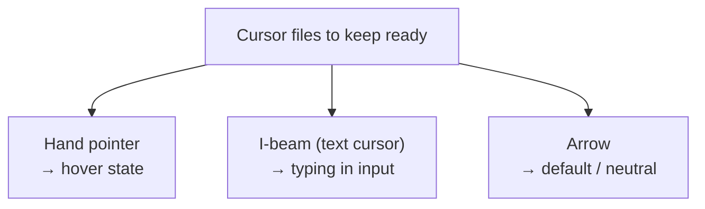
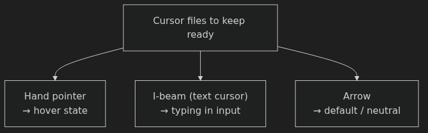
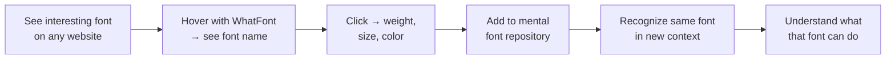
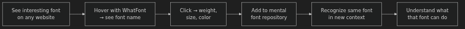

# Setting Up Your Workspace — Anki Cards

Q: Why does the instructor warn against spending too much time on workspace setup?
A: Because tool obsession eats design time. "Spend the vast majority of your time on actually designing rather than trying to make your tools perform 2% better."

Q: Why switch Figma's color picker from RGB to HSB?
A: HSB uses four intuitive numbers (hue, saturation, brightness, opacity) and lets you slide to the color you want. RGB is "not really a great way to pick colors."

Q: In the HSB color picker, where is white always located?
A: Upper-left corner, regardless of the current hue value.

Q: What is Figma's default fill color, and why should you change it?
A: Gray (`C4C4C4`) — the instructor calls it "useless." Change the default to white via Edit → Set Default Properties after drawing a white rectangle.

Q: What is the scope limitation of Figma's "Set Default Properties" setting?
A: It only applies at the file level — you must set it again for each new file.

Q: If your Figma export looks slightly different from the canvas, what is almost certainly the cause?
A: "It's almost certainly because your color space is not set to sRGB." The desktop app requires setting this manually; the web app defaults to sRGB.

Q: What does Cmd+Shift+\ do in Figma?
A: Toggles the left panel, giving you more canvas visibility.

Q: What problem does the Better Font Picker plugin solve?
A: Figma's default font picker shows only font names — no previews. Better Font Picker shows a visual preview of each font so you can see what you're choosing.

Q: What does the Content Reel plugin do, and what is its key productivity advantage?
A: Fills image and text layers with realistic placeholder content (avatars, full names, etc.). Key advantage: it works on multiple layers at once — e.g., fill all 10 avatars in a list in one shot.

Q: What are the two icon plugins mentioned, and how do they differ visually?
A: Feather Icons (bigger, softer, rounder) and Material Icons (smaller, more default-looking). Both work the same way: search a term, double-click to place.

Q: You place a Feather icon inside a frame but its name appears floating above it. What is the fix?
A: The layer hasn't recognized it lives inside the frame. Drag it out, then drag it back in — that fixes it.

Q: What does the Stark plugin check, and what does it output?
A: Checks text contrast ratios against backgrounds. Outputs the ratio (e.g. 21:1 for black on white) and shows whether it passes AA/AAA accessibility levels.

Q: Why keep cursor PNG files easily accessible while working in Figma?
A: So you can drag the right cursor into mockups to show interaction states — hover states on buttons, someone typing into an input, etc. — without interrupting your flow.

Q: What are the three cursor types to have ready, and when is each used?
A: Hand pointer (hover states on buttons/links), I-beam text cursor (showing someone typing in an input), arrow cursor (default/neutral interaction).

Q: Why use aText instead of Mac's native text expansion in Figma?
A: Mac's native text expansion does not work in Figma due to how Figma is programmed. aText ($4.99 one-time) does work in Figma.

Q: What does the `:abc` text expansion snippet produce, and why is it useful for layout?
A: Types the alphabet three times (~78 characters). Since the ideal line length is 50–75 characters per line, you paste it into a text box and resize the column until the text wraps naturally — that gives you your ideal column width.

Q: Why should you avoid over-relying on Lorem Ipsum during design?
A: "The words, the subject matter, and even the sentence length affect the feel of the design." Lorem Ipsum strips that context out. Use it to quickly validate layouts, then swap in real or quasi-realistic copy as soon as possible.

Q: How do you add a custom keyboard shortcut for a Figma menu command on Mac?
A: System Preferences → Keyboard → Shortcuts → App Shortcuts. Enter the exact menu item name (e.g., "Text Upper Case"), choose Figma as the app, and assign the shortcut.

Q: What is the recommended way to batch-install the top Google Fonts, and what extra benefit does the tool provide?
A: Use SkyFonts (free). It batch-installs font families and syncs them across multiple computers.

Q: How do you install a font on Mac after downloading it?
A: Drag the font file into Font Book.

Q: What is an "Inspiration Folder" and why should you build it proactively?
A: A bookmarks folder of well-designed sites (the instructor's is called "Good UI"), built before you need inspiration. "When you actually need the inspiration, it can be very difficult to find something that does the trick."

Q: What does the WhatFont browser extension do, and why does the instructor call it "one of the most important things in this whole video"?
A: Hovering over any web text instantly shows the font name; clicking reveals weight, size, and color. It lets you build a mental font repository by putting a face to a name every time you see an interesting typeface.

Q: Describe the WhatFont learning loop the instructor demonstrates.
A: See an interesting font on a website → hover to identify it → click for details → add to mental repository → recognize the same font in a new context → understand what that font can do.

Q: You're designing a text-heavy layout and need to find the ideal column width. Which workspace tool helps, and how?
A: Use the `:abc` text expansion snippet (the alphabet typed 3×, ~78 chars). Paste it into a text box, then resize the column width until text wraps near 50–75 characters — that's your ideal width.

Q: You're filling a list of 10 user cards with placeholder avatars. Which plugin handles this in one step?
A: Content Reel. Select all 10 image layers, click Avatars — all fill with real face photos simultaneously.

Q: You spot a typeface you love on a website but can't name it. What is your immediate next action?
A: Open WhatFont (hover over the text). The font name appears instantly. Click for weight, size, and color details.

Q: A teammate exports a Figma file and the colors look slightly different from the design. What setting should you check first?
A: Color space — make sure it is set to sRGB in Figma desktop app preferences (requires an app restart). This is almost certainly the cause of color mismatches between Figma and the web.
