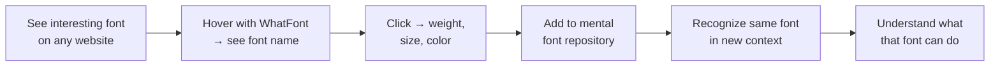

# Setting Up Your Workspace for Rapid UI Design

## Overview

> "What I want you to do is breeze through this video, make some of the changes I recommend here. But by and large, spend the vast majority of your time on actually designing rather than trying to make your tools perform 2% better."

This lesson covers the minimal, high-value setup changes to make on a new design machine. The instructor explicitly warns against tool obsession — designers love to noodle endlessly on workflows. Don't. Spend that time designing.

---

## Figma: Color Settings

### Switch from RGB to HSB

Figma's default color picker uses **RGB**, which the instructor calls "not really a great way to pick colors." The recommendation is to switch to **HSB** (Hue, Saturation, Brightness) immediately.

- Open the color picker, find the slider mode dropdown, select **HSB**
- HSB lets you specify color with four numbers that are intuitive: hue, saturation, brightness, opacity
- A lot of the time you can just *slide* to the color you want rather than typing numbers
- **White is always in the upper-left corner** of the HSB picker, regardless of the current hue value — useful to know

### Set Default Fill to White

Figma's out-of-the-box default fill is gray — `C4C4C4` — which the instructor calls "useless."

- Draw a white rectangle
- Go to **Edit → Set Default Properties**
- From now on, new shapes in *this file* will be white by default

> "Unfortunately in Figma right now, this setting only works at the file level. So I will have to change it again and again if I'm doing different files."

### Color Space: sRGB

If your exported files look slightly different from how they looked in Figma, or they look different on the web:

> "It's almost certainly because your color space is not set to sRGB."

- Figma for web: sRGB is the default
- Figma desktop app: you need to set it manually — it will ask you to restart the app

### Useful Keyboard Shortcut

- **Cmd+Shift+\\** — toggles the left panel, giving you more canvas visibility

---

## Figma Plugins

> "Designers love to talk endlessly about what plugins are the best and kind of fiddle with these and try and optimize endlessly. I would much prefer you spend your time designing."

The instructor covers exactly four plugins — no more.

### Better Font Picker

> "I highly recommend this one."

The default Figma font picker shows only font names in a list — no previews. **Better Font Picker** shows a visual preview of each font, so you can actually see what you're picking.

- Press **T**, drag to create a text box
- Open Better Font Picker
- Browse fonts visually, pick one, done

### Content Reel

Great for quickly filling placeholder image layers and text layers with realistic fake content.

- Select an image or vector shape → click **Avatars** → instantly gets a real face photo
- Select a text layer → click **Full Name** → fills with a realistic name
- Works with **multiple layers at once** — if you have a list of 10 cards, you can fill all their avatars in one shot

### Feather Icons & Material Icons

Both work the same way. Type a search term, double-click the icon, it lands on the artboard.

- **Feather Icons** — bigger, softer, rounder
- **Material Icons** — smaller, more default-looking

> One gotcha: if the icon appears with its name floating above it, the layer hasn't recognized it lives inside the frame. Drag it out, drag it back in — fixed.

### Stark

For checking **text contrast ratios** against backgrounds.

- Select text + background → run Stark → see the contrast ratio (e.g. black on white = 21:1)
- Shows whether it passes at various accessibility levels (AA, AAA)

> "...which is a very intricate topic that we will be getting into much more later in the course."

### Quantum Icons *(instructor's own set)*

Free for Learn UI Design students. Compact, angular icons designed for **data-heavy or interaction-heavy apps**.

- Add as a Figma library: go to assets, find Quantum Icons, turn on
- Search using synonyms — e.g. "hamburger" or "menu" both find the hamburger icon

> "I tried to use a lot of synonyms in the name here."

---

## Cursor Files

Keep cursor PNG files accessible (instructor uses Mac Spotlight, **Cmd+Space**) so you can drag them into Figma instantly.

Three cursors to have:
- **Hand pointer** — for showing hover states on buttons or links
- **Text cursor (I-beam)** — for showing someone typing into an input
- **Arrow cursor** — the default, not tied to any particular interaction

> "This is really good for a lot of designs if you wanna show like for instance that something is a hover state. So maybe I have one version of the button with no hover, but then I wanna show the version of the button when someone hovers it."

All cursor files are linked below the video.

---

## Text Expansion with aText

The instructor uses **aText** ($4.99 one-time, works in Figma — important, because the native Mac text expansion does *not* work in Figma due to how Figma is programmed).

### Key snippets

**`:abc`** → the alphabet typed three times (`abcdefghijklmnopqrstuvwxyz...`)

> "It turns out that the ideal line length is typically between about 50 and 75 characters per line."

The triple alphabet is ~78 characters, so you can paste it into a text box and resize the column width until the text wraps at the right point — that's your ideal column width.

**`:lorem1`** through **`:lorem5`** → 1–5 paragraphs of Lorem Ipsum filler text

### Warning on Lorem Ipsum

> "I actually encourage you not to use Lorem Ipsum text too much when you're really doing a design. As soon as possible, try and use realistic text or even quasi-realistic text for the particular design that you're working on."

The words, subject matter, and even sentence length affect the *feel* of the design. Lorem Ipsum strips that out. Use it quickly to validate layouts, but swap in real copy as soon as you can.

---

## Custom Keyboard Shortcuts (Mac)

Mac's System Preferences → Keyboard → Shortcuts → App Shortcuts.

You can add custom shortcuts for any menu command in any app by entering the **exact name of the menu item**.

The instructor's example: **Text Upper Case** in Figma → mapped to **Cmd+Shift+U**.

```
App: Figma
Menu Title: Text Upper Case
Keyboard Shortcut: ⌘⇧U
```

> "And then whenever I'm in Figma, I can press command, shift, U, and automatically uppercase text."

---

## Fonts

### Google Fonts

Best source for free fonts. The instructor recommends batch-installing the top 50 Google Font families.

- Use **SkyFonts** (free app) to batch install
- SkyFonts syncs fonts across multiple computers

### Good Fonts Table

A dedicated lesson in the Typography unit of Learn UI Design. The instructor's curated list of the best free and cheap fonts, tagged by source:

- **Google Fonts** (blue F) — free
- **Adobe Fonts** — free with any Creative Cloud subscription
- **Third-party open source** — download and install manually

### Installing on Mac

Drag the font file into **Font Book**. That's it.

---

## Inspiration Folder

Create a bookmarks folder — the instructor calls his **"Good UI"** — and populate it with well-designed sites *before* you need inspiration.

> "When you actually need the inspiration, it can be very difficult to find something that kind of does the trick."

Fill it proactively by browsing. More on finding inspiration is covered later in this unit.

---

## WhatFont Browser Extension

> "This is honestly one of the most important things in this whole video."

**WhatFont** lets you hover over any text on any website and immediately see the font name. Click for more details (weight, size, color).

Available for:
- Safari
- Chrome
- Brave (and other Chromium browsers)
- Firefox (version built by Learn UI Design student Zack Michener)

### Why it matters

> "Every time you see a font that you like — or even one that you don't really like but you're curious what it is — hover over it and just put a face to a name."

The instructor has used it daily for years:

> "I don't really think there have been many days that have gone by where I haven't actually used it."

Example: he spotted a great headline font on onXmaps.com, identified it as **Atlas Grotesque Web**, then immediately connected it to another site he knew — **FiveThirtyEight** — which uses the same font for headlines (paired with **Decimal Mono**).



> "As you become a better and better designer, you'll start to recognize all sorts of fonts across the web."

---

## Closing Notes

> "Since so many of these little tools and things go out of date so much quicker than the actual skills of designing — which is what we spend the rest of the course covering — I will keep the text below more up-to-date."

The video content may age; the text below each lesson is maintained. Report mistakes so it stays useful for other students.

> "All right, thanks, and we'll see you in the next lesson."
