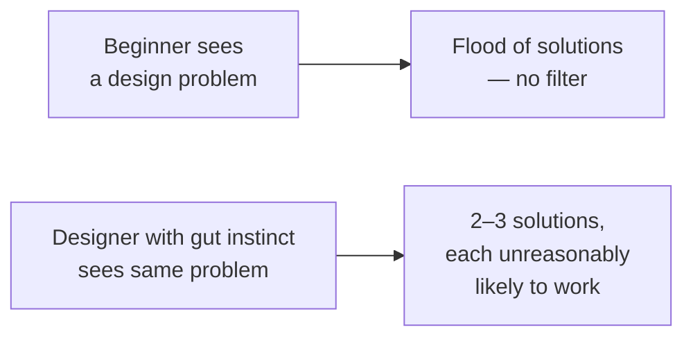
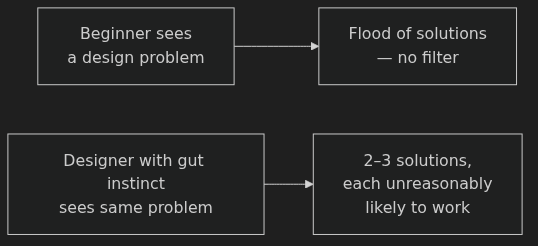
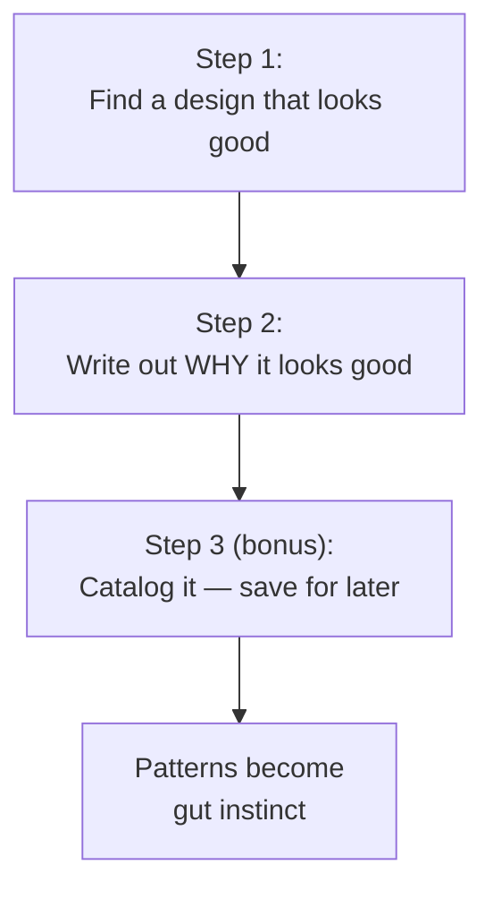
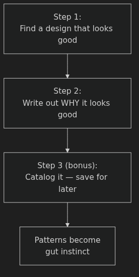
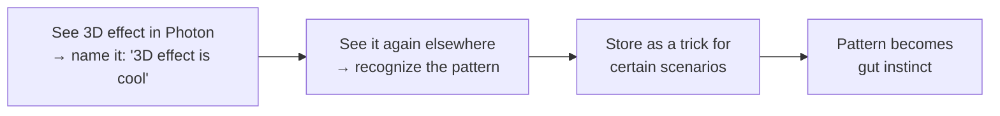
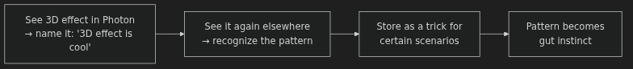

# Building Your Design Gut Instinct — Anki Cards

Q: What are the two flavors of the "no gut instinct" problem Eric describes for beginning designers?
A: 1. "I know what I like, but I can't create it" — you recognize good design but freeze in Figma. 2. "I don't even know what looks good" — you can't tell good from bad at all.

Q: What is a design gut instinct, in Eric's framing?
A: When you see a design problem, only 2–3 solutions come to mind — but each has an unreasonably high chance of working. A beginner floods with possibilities and has no filter to pick the right one.

Q: What was the root failure in Eric's first paid design project?
A: He had plenty of ideas about what to change (colors, fonts, patterns) but no way to know which would actually work. He spent 10–20 hours and still couldn't make it look good — no gut instinct to filter the options.

Q: What is the two-step process for building design gut instinct?
A: Step 1: Find a design that looks good. Step 2: Write out WHY it looks good. (Bonus Step 3: Catalog it for later.)

Q: Why does Eric insist on writing out why a design is good, rather than just looking at it?
A: "When you force your brain to come up with a name for something, or to describe something, you're forcing your brain to have like a little connection point that you can then latch to other designs." Writing creates the anchor for pattern recognition.

Q: Do you need precise design terminology when analyzing a design? Why or why not?
A: No. "The 3D effect is cool" works just as well as "isometric illustrations used as a motif." The goal is creating a labeled connection point in your brain, not impressing anyone with vocabulary.

Q: How does naming a visual element transform it into gut instinct over time?
A: You see a technique, name it ("3D effect is cool"), then recognize it when you see it elsewhere, store it as a trick for certain scenarios — and eventually the pattern fires automatically.

Q: What three things did Eric notice and name when analyzing the Photon app website?
A: 1. Massive white space — "600 pixels between one button and the next text element." 2. Colors feel fresh and fun — a "playful palette" (reds that border on pink, blues that lean aqua/teal). 3. Impactful layout — large text left, big image right, above the fold.

Q: What is a "playful palette" and how is it recognized?
A: One of the five most common color palettes Eric has identified. Characterized by light, cheerful tones — a red that borders on pink, a blue that leans toward aqua or teal. The exact name doesn't matter; what matters is your brain files it as "colors like this feel fun and light."

Q: What is the "ask what would ruin it" variation on design analysis?
A: After identifying what you like, ask: what change would make me NOT like this? Then make that change in Figma and check your prediction. "If you can make the design such that it looks worse, you might have a better idea of why it looks better."

Q: Why is analyzing bad designs as valuable as analyzing good ones?
A: Comparing a bad design to a good one with the same layout skeleton reveals exactly which elements (font quality, color coherence, image quality, visual hierarchy) are doing the heavy lifting — and which are dragging it down.

Q: What was visually wrong with the old GeoCities page Eric showed, despite having the same layout skeleton as the Photon hero?
A: Default system font with no typographic hierarchy; English and French text at identical visual weight; image poorly cut out; random star decorations; red and green buttons introduced from nowhere — no color coherence, no hierarchy.

Q: What was the key color strategy in Parulski's Robo Advisor chart design that Eric's first chart lacked?
A: One clean blue used in three tonal variations — saturated for the button, mid-tone for the trend line, very light desaturated version for the card background. Color coherence through variations on a single hue.

Q: What is "variations on a color" and why does Eric flag it as important?
A: Using one hue across multiple tonal weights (saturated accent, mid-tone detail, near-white background tint) to create color coherence. Eric calls it "one of the most important things you can be able to do" in the color unit.

Q: What is the third (unofficial) step in the gut-instinct process, and why does it matter?
A: Catalog what you like and why. If you find and analyze something good, save it — so you can return to it when you face a similar design problem in the future.

Q: What role does imprecise language play in building gut instinct?
A: "Language is weird and it's imprecise. 'Impactful' doesn't really even mean anything — but like use the words anyways. Make up an expression. It doesn't matter. Using the same language for something builds those patterns." Consistent labeling — even rough labeling — encodes the pattern.

Q: A junior designer stares at a landing page that feels off but has no idea where to start. What does this symptom indicate, and what is the cure?
A: It indicates no gut instinct — the brain floods with possibilities and can't filter. The cure is deliberate analysis practice: regularly find designs you like, write down specifically why, and catalog them. Over time, named patterns compress the solution space.

Q: You're reviewing a hero section with large text on the left and a big image on the right. How would you test whether the image size is actually doing work?
A: Shrink the image way down (as Eric did live in Figma) and check whether it feels less impactful. If the design gets worse, you've confirmed the image size was load-bearing — and you now understand precisely why the original worked.

Q: A designer shows you two chart UIs with the same grid layout. One feels clean, the other feels chaotic. What are the most likely culprits, based on Eric's comparison?
A: Color coherence (single palette with tonal variations vs. mismatched hues), alignment consistency, white space, and font/typographic hierarchy. Identical skeleton, but these four factors determine whether it reads as professional or chaotic.

Q: You analyze a mobile app and write "the colors feel fun and light." Is that analysis good enough? Why?
A: Yes. The goal is creating a labeled connection point your brain can latch to other designs — not using precise terminology. "Fun and light" works; "playful palette with analogous warm hues" is no more useful for building the pattern.
