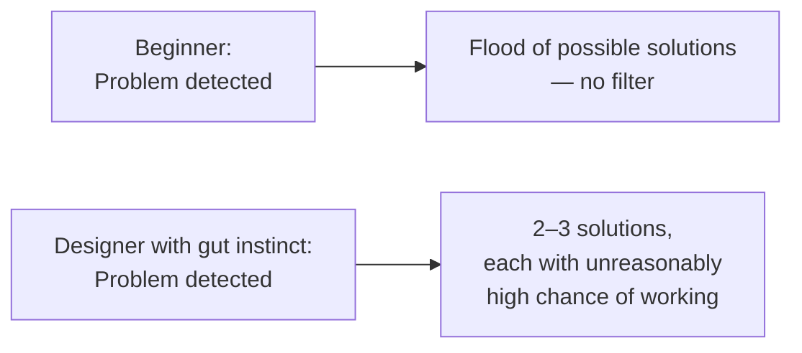
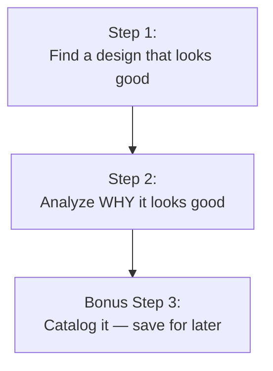
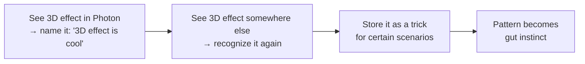

# Building Your Design Gut Instinct

## The Problem: Too Many Ideas, No Filter

Eric opens with something he hears constantly from beginning designers — in two flavors:

1. *"I know what I like, but I can't create it."* — You can recognize good design when you see it, but the moment you open Figma, you're out of ideas.
2. *"I don't even know what looks good."* — You can't tell good design from bad.

> "Whether you fall into one camp or the other, I think it's a similar root problem. It's not having a gut instinct for design."

### What a beginner's brain looks like

When a beginner sees a design that looks off, their brain floods with possible fixes:

- Change the color
- Change the font
- Change the sizing
- Make something bigger or smaller
- Add more space or less space
- Use a better vertical rhythm based on a baseline grid and the golden ratio

> "There's some blog posts that could tell you that — that's not the answer though."

### What gut instinct actually is

> "You have just a couple solutions come into your mind, but any of them could be unreasonably effective."

---

## Eric's First Paid Design (A Cautionary Tale)

Eric shows his actual first professional project — a chart/data UI that he spent 10–20 hours on.

> "I'll be the first to admit. It's really bad."

Things he calls out:
- Button color described as "the color of puke for no good reason at all"
- "muddy toxic sludge sort of color" as the theme
- A crosshatched pattern that adds nothing
- A peach search bar utterly misaligned with everything around it
- Jumps to "full on completely bright rich blue, red, and green — probably default CSS colors"
- Background colors that make no sense (slightly blue vs flat gray)
- No consistent color story anywhere

> "I tried and I probably tried for 10 or 20 hours to get this page looking as good as I could and you know what, I couldn't (laughs)."

The real lesson: he had plenty of ideas about what to change. He just had no way to know which would actually work. No gut instinct.

---

## The Two-Step Process

### Step 1 — Find a design that looks good

Not that complicated. Some notes:

- There will always be designers who disagree — that's fine
- "Find one that overall you kind of have this gut sense that yes, this is a good design"
- Either it was made by a pro, or you just personally like it — either is enough

> "If you really like something, okay, we're going to call it a design that looks good."

**Example used:** Photon app website (linked in course Figma file). Clean, simple, friendly, colorful. Uses isometric 3D illustrations as a visual motif across the page.

### Step 2 — Analyze why the design is good

> "You're gonna hate me for saying this, but what I want you to actually do is write out a list of why you think a particular design is good."

Why writing matters — the mechanism:

> "When you force your brain to come up with a name for something, or to describe something, you're forcing your brain to have like a little connection point that you can then latch to other designs."

**No fancy terminology required:**

| Over-engineered | Good enough |
|---|---|
| "I love the isometric illustrations used as a motif" | "The 3D effect is cool" |
| "Bold grotesque or geometric headline font" | "Clean sans-serif font, looks neat and simple" |

> "I actually didn't even notice that until right now they are. They're all 3D. You could just be like, the 3D effect is cool. That's it. That's all you need to do."

The pattern-building mechanism:

### Eric's actual list from analyzing the Photon site

1. **White space** — "There's so much white space in the design. It just overall feels very, very clean." Between one button and the next text element: 600 pixels of white space. Between a divider line and content: 200 pixels.

   > "Someone broke open a CSS file and wrote, yup. I want 200 pixels of white space here."

2. **Colors feel fresh and fun** — Light, cheerful tones. In the color unit this gets named a **"playful palette"** — one of the five most common palettes Eric has identified. Characterized by: a red that borders on pink, a blue that leans toward aqua or teal.

   > "The only reason I bothered to name it is because I've analyzed the color of so many apps."

   You don't need the name "playful palette" — "fun colors," "light colors," whatever. The point is your brain registers *there's something about colors like this* and files it away.

3. **The layout feels impactful** — Specifically above the fold: large text on the left, big image on the right.

   > "There's something about having this large image on one side and then some text on another side that just feels kind of boom in your face."

---

## Variation: Ask What Would Ruin It

When analyzing something you like, also ask: **what would cause me to NOT like this?**

Eric demonstrates live in Figma — he takes the Photon hero layout and shrinks the image way down.

> "You know what, I was right. This does not look as good. It does not look as impactful."

Why this works: if you can make the design worse, you understand more precisely why it was better.

> "If you can make the design such that it looks worse, you might have a better idea of why it looks better."

---

## Variation: Analyze Bad Designs Too

Don't only look at great designs — look at things you know are awful.

**Example: old GeoCities page** compared to the Photon layout.

Same ingredients (text left, big image right), but it fails because:
- Default system font — no typographic hierarchy
- English and French translations carry identical visual weight — eye doesn't know where to go
- Image was just pasted in, poorly cut out from its background
- Random stars decoration — purpose unknown
- Red and green buttons introduced from nowhere ("like a Christmas tree theme for no reason whatsoever")

> "It could be impactful, but it doesn't quite hit the mark."

The analysis reveals: same layout skeleton, but font quality, image quality, color coherence, and visual hierarchy all drag it down.

---

## Comparing Bad and Good Side-by-Side

Eric places his first chart design next to **Robo Advisor Web App by Michael Parulski** (top Dribbble result for "chart").

| Eric's bad chart | Parulski's good chart |
|---|---|
| Pukey, incoherent colors | Clean blue, used in three tonal variations |
| Poor alignment | Smart, consistent alignment |
| Sidebar jammed against content, no margin | Two-column grid, consistent card elements |
| No white space | Clean and crisp throughout |

On color strategy:

> "He just uses this very nice blue, and look how tastefully it appears in this button. And it appears in this little trend line here. And it appears even just slightly in this background — it's like a very, very light desaturated version of the blue, but you can tell it's the same color."

> "We're going to talk about this in the color unit — variations on a color is like one of the most important things you can be able to do here."

---

## The (Unofficial) Third Step: Catalog It

> "There's actually technically a third step to this two-step process, which is to catalog it. If you find something that you like and you've analyzed why you like it, you should probably also keep it for later."

Eric says this will be covered more later in the unit — don't stress about it now.

---

## Language Is the Key Mechanism

> "So yes, I get it. Language is weird and it's imprecise. 'Impactful' doesn't really even mean anything — but like use the words anyways. Make up an expression. It doesn't matter. Using the same language for something builds those patterns."

The more you force yourself to label what you see, the more your brain encodes it as a recognizable pattern. Patterns become instinct. Instinct becomes the filter that narrows a hundred possible solutions down to two or three that are likely to work.

---

## Homework

Go out and find great designs. Write down why they're great. Post your analysis in the course community — read others', get feedback.

> "I know you've probably gotten a little spoiled — there hasn't been so much homework yet — and it ends now."

> "Just kind of start this lifelong process — or career-long process — of analyzing why designs work, what you like about them, and then trying to bring some of those own tips, tricks, strategies into your own designs."

**Starting points Eric recommends:** top design inspiration sites linked below the video. Or just start with sites you already love — follow your heart.
