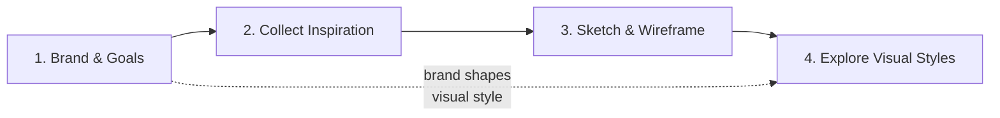
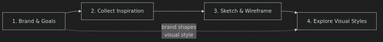
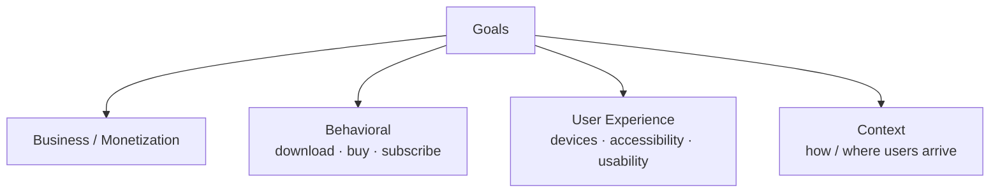
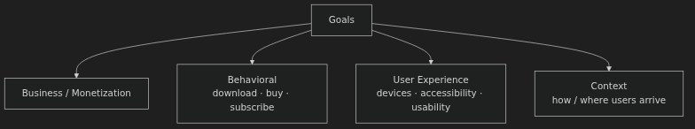
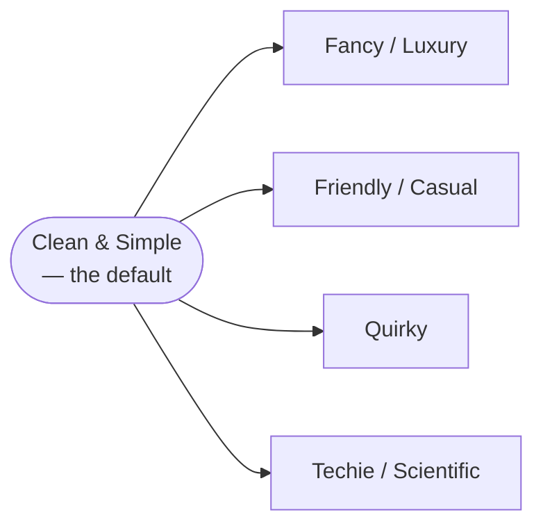
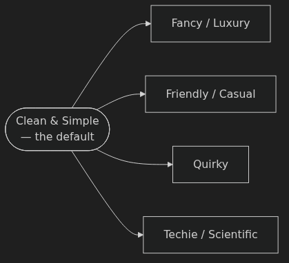

# Starting a New UI Design Project — Anki Cards

Q: What are the four steps for starting a new UI design project, and in what order do they happen?
A: 1. Determine brand & goals → 2. Collect inspiration → 3. Sketch & wireframe → 4. Explore visual styles (style tiles). Brand from step 1 directly shapes the visual style explored in step 4.

Q: Which step is "the most important" for UI designers and must be completed before touching visual design?
A: Step 1 — Determine brand and goals. Both must be nailed down before any visual work begins.

Q: What is a "style tile" in the UI design process?
A: The formal deliverable for step 4 — little snippets of UI (text, buttons, UI controls, repeating elements) explored in different visual directions. Not a full mockup, just directional samples.

Q: What is the definition of "goals" in the context of starting a UI project?
A: Goals answer: "What does success look like here?" They span four types: business/monetization, behavioral (what you want users to do), user experience (devices, accessibility, usability), and context (where/how users arrive).

Q: What are the four types of goals to consider when starting a project?
A: 1. Business/monetization goals — what the project needs to earn or achieve commercially. 2. Behavioral goals — actions you want users to take (download, buy, subscribe). 3. UX goals — devices, accessibility, usability. 4. Context goals — where users come from and what they already know when they arrive.

Q: Why did Genius Notes need a context goal about guide pages?
A: Most users land via Google directly on a guide page, not the homepage or about page. So: "Guide page must convey all necessary information to new users" — you can't rely on the homepage to set context.

Q: Why does the instructor say you should list goals explicitly rather than keeping them in your head?
A: "If you don't know your goals, you're really only gonna be hitting them on accident." Explicit goals also make design reviews far more effective — you present designs against the goals you agreed on.

Q: What is the "single best way to structure a design review" according to the instructor?
A: "Presenting your design based on how it meets the goals you laid out in the beginning." It gets you better, more focused feedback than presenting visuals alone.

Q: What is the instructor's definition of "brand" in UI design?
A: Brand = what you want your users to perceive you as. Operationally: just a list of adjectives. "When I say brand, that might sound like something that's kinda handwavy or a little artsy and mysterious. I really don't mean for it to be."

Q: What technique does the instructor use to extract brand adjectives from a client?
A: Ask "What sites do you look up to? What are they doing right that you also want to do?" — then pull adjectives from the client's descriptions of those sites. Also ask what the negative would be ("if users thought X about you, would that be a failure?") and take the opposite.

Q: How do you generate brand adjectives from negatives?
A: Identify things the client does NOT want to be (e.g. preachy, spammy, sloppy) and take their opposites (humble, considered, precise). "If you take the opposite of them, they can start to kind of generate more adjectives of what you're going for."

Q: What were the four final brand values for the Genius Notes / Guidery project, and how long did it take to arrive at them?
A: Trustworthy, Geeky, Humble, Balanced — arrived at in under two hours of conversation with the client.

Q: What is a "defensible opposite" for a brand value, and why does it matter?
A: A defensible opposite is an alternative brand direction that is itself a legitimate, reasonable choice — not a straw man. "The very best brand values have defensible opposites. For instance, scrappy is a great brand value because the opposite of scrappy is like authoritative and official and trustworthy — and that's a perfectly reasonable thing."

Q: Give two examples of defensible opposites from the Genius Notes brand values.
A: Humble ↔ omnipotent (an all-knowing authoritative voice — real and used by some sites, just wrong for them). Balanced ↔ loyal (loyal sounds positive but means the site plays favorites — real but wrong for a recommendations site).

Q: What does specifying brand values do to the perceived "subjectiveness" of UI design?
A: "A lot of the seeming subjectiveness of UI design fades away when you specify what you want your users to feel, and then you design to those ideas."

Q: What is the "80/20 rule" the instructor applies to brand adjectives?
A: "Master the 20% of possible brand adjectives that you will see 80% of the time." Most real client projects cluster around five common brand archetypes — learn those well and you can handle the majority of briefs.

Q: What are the five most common brand archetypes, and which one is the most common client request?
A: 1. Clean & simple (most common — "just something clean, simple, neat, and modern"). 2. Fancy/luxury/formal. 3. Friendly/casual. 4. Quirky. 5. Techie/scientific/futuristic.

Q: What typography, color, and imagery characterize the "clean and simple" brand?
A: Typography: sans-serif (especially grotesque). Color: bright primary hues or mono-hue schemes. Imagery: illustrations or photos.

Q: What typography, color, and imagery characterize the "fancy / luxury / formal" brand?
A: Typography: serif fonts. Color: grayscale palette with gold accents. Imagery: extremely high quality photography.

Q: What typography, color, and imagery characterize the "techie / scientific / futuristic" brand?
A: Typography: squared-off sans-serifs, monospaced, uppercase. Color: cooler palette, stark contrast. Imagery: black and white, blueprint-like.

Q: Why does the instructor recommend learning "clean and simple" first before the other four brand archetypes?
A: "Clean and simple is the center" — most projects start there. The other four are deliberate moves away from it. Mastering it first gives you a foundation; then injecting a secondary brand ("fancy," "techie," etc.) is how you "spice up" designs once clean-and-simple feels boring.

Q: A client says "we want something clean, simple, and modern." Which brand archetype is this, and what font category should you reach for first?
A: Clean & simple. Reach for a grotesque sans-serif as a starting point for typography.

Q: A client runs a medical supply company. You discover their brand belief is "Pro recognizes pro" — standing by highly trained professionals. Which brand quadrant do they lean toward, and what typography choice follows?
A: Techie/scientific. Choose a squared-off, precise sans-serif like Clear Sans (rather than a rounded sans-serif) to convey precision and professionalism.

Q: In the MedDepot redesign demo, what single copy change illustrated the shift from generic to brand-driven?
A: "20,000 satisfied customers" → "Helping 20,000+ professionals do their best work" — the new line speaks directly to the "pro recognizes pro" brand value.

Q: In the MedDepot redesign, what visual details were changed to express a "techie / precise" brand (list at least four)?
A: Font → Clear Sans (squared-off). Border radius: 4px → 1px (more precise, less soft). Colors → cooler slate greens and grays ("literally the colors of medical professionals"). Authentic photography instead of generic stock. Headline sizing up, line spacing tightened.

Q: Why does Comic Sans on a medical journal site make the design feel "like a wireframe"?
A: "Comic Sans is not a font that inspires trust." The wrong typography undercuts credibility so severely that even a complete layout reads as unfinished or unserious.

Q: For the Genius Notes "geeky" brand value, what font category did the instructor choose and why?
A: Monospaced fonts — they evoke coding and terminal input. Specifically, Input Mono was chosen for its "squared-off letterforms" that make it "feel particularly geeky."

Q: How did the instructor use the "geeky" monospaced font choice to discover additional non-monospaced options?
A: He searched the Good Fonts Table for "squared" — the same visual quality (squared-off letterforms) that made monospaced fonts feel geeky — and found Clear Sans and DIN 2014 as non-monospaced alternatives with the same character.

Q: What structure does the instructor use when presenting a style tile to a client, and how does he close the presentation?
A: Opens with the project mission, lists the brand values, ties each design decision to a specific brand value, shows typography and UI elements in context. Closes with: "Here's what I designed. Here's how it meets our goals. How are we succeeding? How are we failing? How do we move forward?" — no alternative concepts presented.

Q: The Genius Notes brand value of "humble" eventually caused a problem. What was it, and how was it resolved?
A: The name "Genius Notes" conflicted with the humility brand value — calling yourself a genius is not humble. By the end of the project the site was renamed Guidery.

Q: You're asked to redesign an app that's already "technically decent" — well-aligned, neat, proper white space — but feels boring. What is the instructor's recommended next move?
A: Identify which brand archetype the product needs to inject more of (fancy, techie, friendly, or quirky), then shift typography, color, and border radius toward that archetype. "One of the biggest things you can do to spice up your designs… is to start trying to figure out what brand you need to inject a little bit more of."
