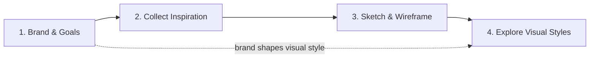
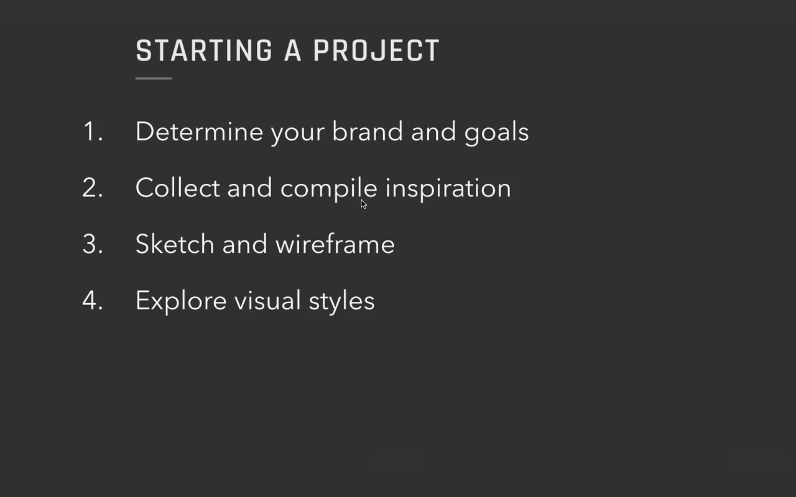
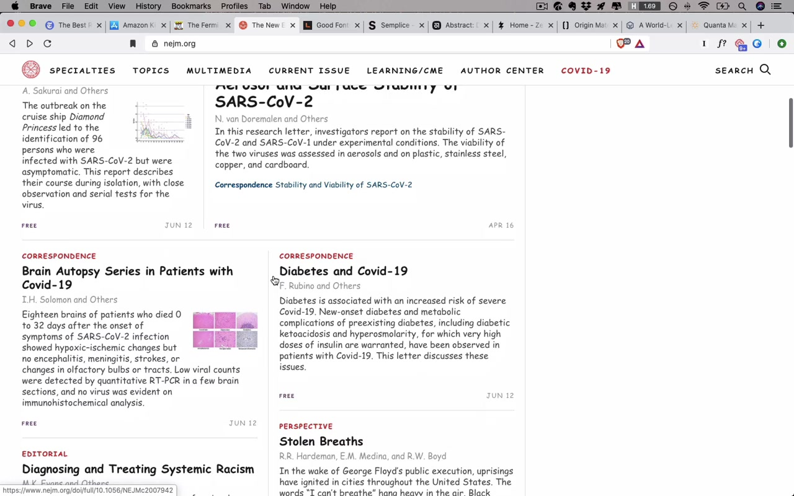
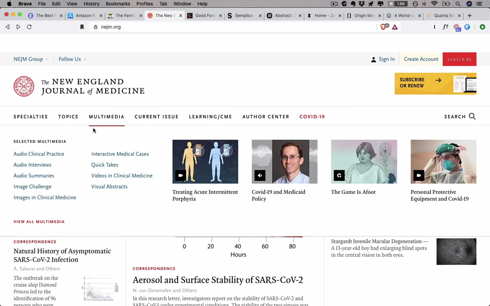
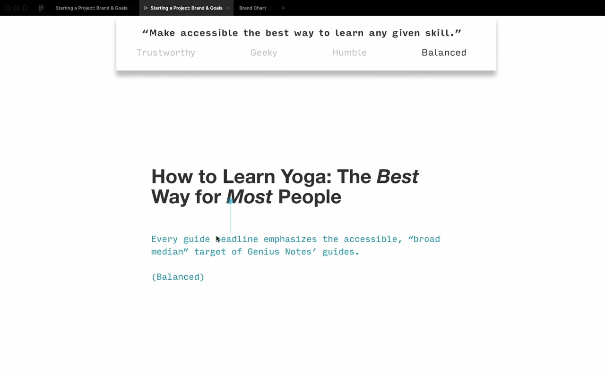
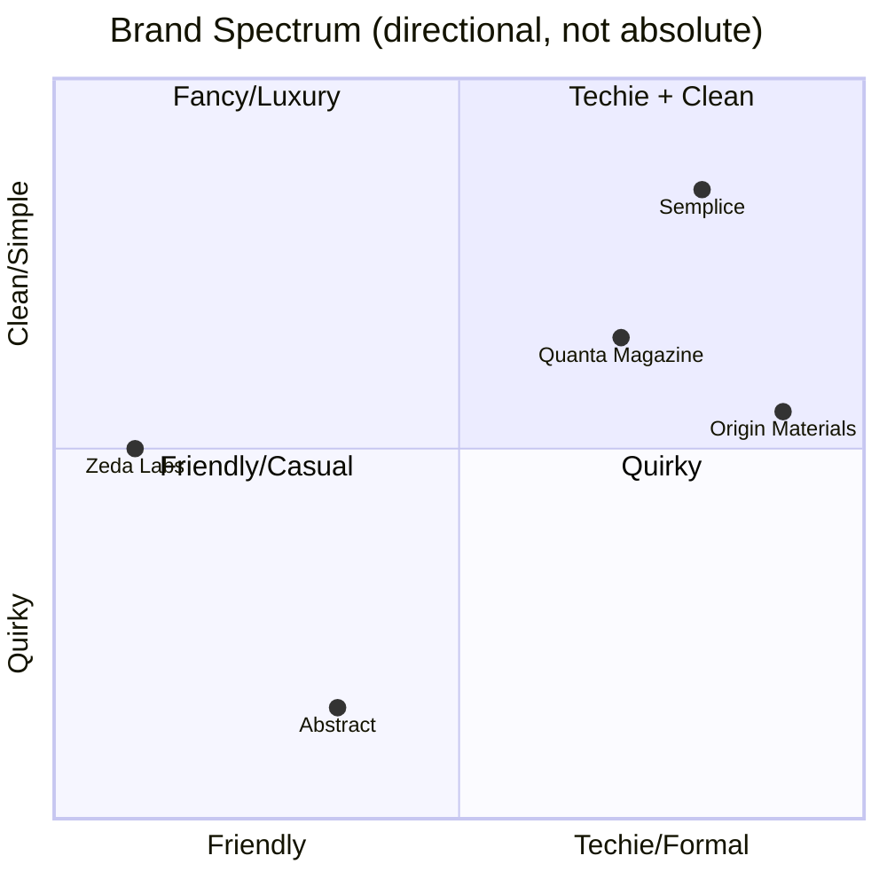
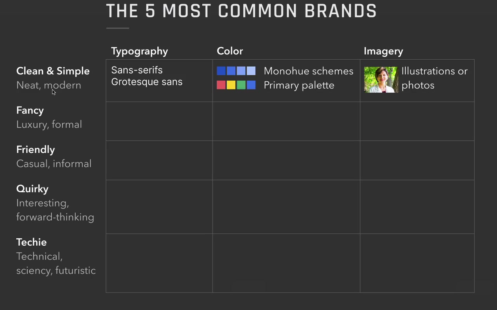
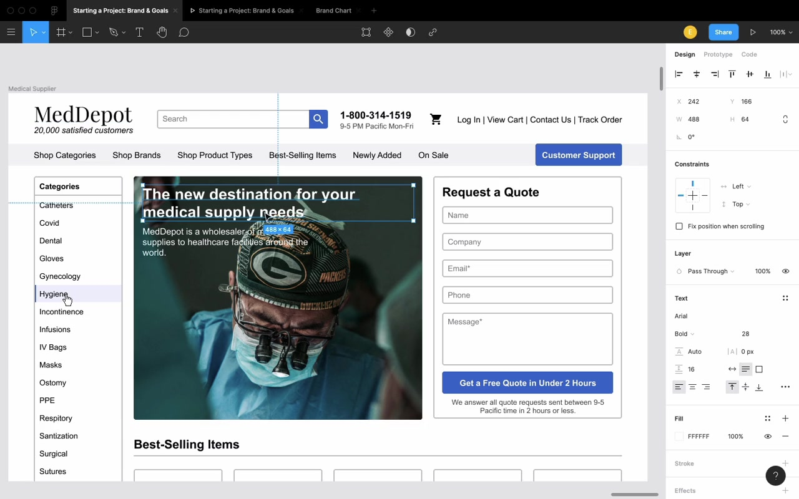
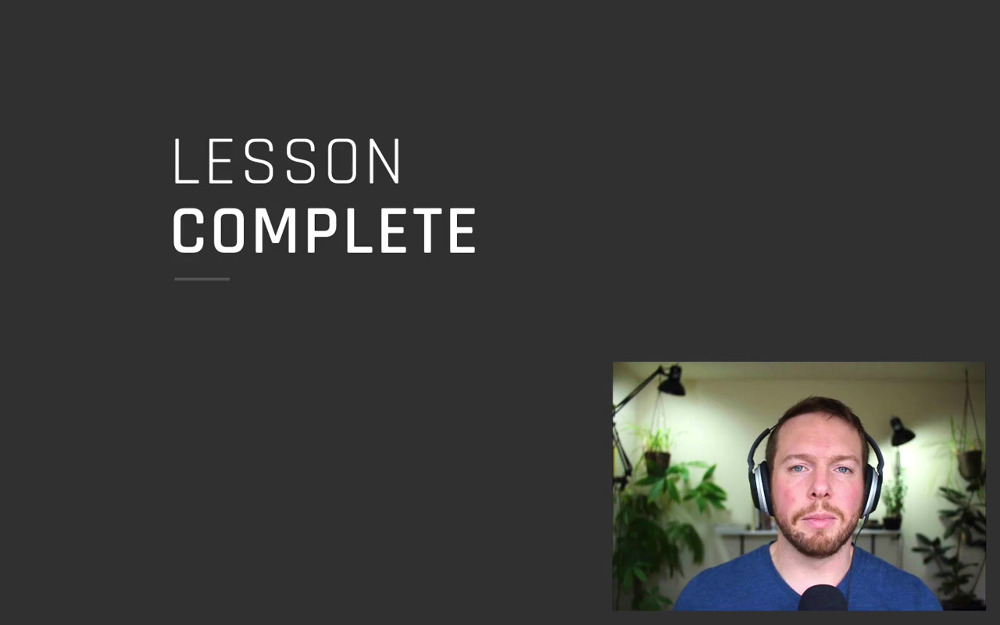

# Starting a New UI Design Project

## The Four-Step Process

This process scales — dial it up for a multi-year enterprise project, dial it back for a single-page homework assignment. The four steps are the same either way.

### Step 1 — Determine brand and goals
The most important step for UI designers. Both **brand** and **goals** need to be nailed down before touching any visual design.

### Step 2 — Collect and compile inspiration
Scales with the size of the project. An experienced solo designer might skip this formally; beginners and larger teams should be very intentional about what's influencing the direction and why. (A whole separate video covers this.)

### Step 3 — Sketch and wireframe
A simple blog barely needs wireframing. A complex interactive product might involve user research, lo-fi iterations, and usability testing before visual design. For this course, Eric assumes the sketch exists — if you want the UX process, see his companion course *Learn UX Design*.

### Step 4 — Explore visual styles
Little snippets of UI — text, buttons, UI controls, repeating elements — explored in different directions. The formal deliverable name for this is **style tiles**.

---

## Step 1 in Depth: Brand and Goals

### Case study: Genius Notes (real client project)

Eric's client Danny came with an idea: a site that recommends the best way to learn any skill — the resources that everyone who's really good at a thing ends up respecting anyway. Monetized through affiliate links, but Danny stressed the affiliate deals wouldn't bias recommendations. The whole concept hinged on trust.

---

### Goals

Goals answer: **what does success look like here?**

Three types of goals to think about:

**Business / monetization goals**
For Genius Notes: recommendations need to be front and center AND trusted. Eric notes the tension:

> "If the site doesn't earn your trust, it doesn't matter how front and center the recommendations are. No one's gonna buy them anyways."

**Behavioral goals**
Things you want users to do — download, subscribe, purchase, donate, use a new feature. (Eric has a full list on the starting-a-project cheat sheet, linked below the video.)

For Genius Notes: recommendations front and center, people buying them.

**User experience goals**
Devices, accessibility, usability. For Genius Notes: responsive website — works across mobile, tablet, desktop.

**Context goals**
What's the user's context when they arrive?

For Genius Notes: most users land via Google on a guide page, not the homepage or about page.

> "Everything essential about the site does need to be conveyed via the guide pages rather than say like the Homepage or the About page."
>
> Goal written: "Guide page must convey all necessary information to new users."

**Why bother listing goals explicitly:**

> "If you don't know your goals, you're really only gonna be hitting them on accident."

With a client or employer, it also makes design reviews dramatically more effective:

> "Presenting your design based on how it meets the goals you laid out in the beginning is the single best way to structure a design review. And it will get you way better feedback if you do that."

For tiny projects (homework, 100-day UI challenges) — just jot down a couple notes on brand. Don't overthink the goal framework.

---

### Brand

**Brand = what you want your users to perceive you as.** Just a list of adjectives.

> "When I say brand, that might sound like something that's kinda handwavy or a little artsy and mysterious. I really don't mean for it to be."

**How to extract brand from a client conversation:**

Eric asked Danny: *What sites do you look up to? What are they doing right that you also want to do?*

Danny's answers:
- **The Wirecutter** — "ridiculously thorough," 17,000-word articles, tests dozens of products, "writes a small novel of a report." Generates brand words: *earns your trust*, *slightly obsessive*, *balanced*.
- **Amazon Kindle logo** — the boy on the hill reading under a starry sky. *Sense of wonder*, *beauty of learning*.
- **Wait But Why** — embraces its own geekiness, deeply researched but casual and long-form.

**Getting to "what you are NOT":**

Ask: if users thought X about you, would that be a failure?

Negatives Eric and Danny generated:
- Not preaching or boasting → **humble**
- Not spammy → **considered**
- Not sloppy → **precise**
- Not inhumane

> "If you take the opposite of them, they can start to kind of generate more adjectives of what you're going for."

**Final brand values Danny prioritized:**

- **Trustworthy**
- **Geeky**
- **Humble**
- **Balanced**

> "And it really only took us not even two hours to get to this point, but already this is really exciting to me and my designer senses like already coming up with ideas of how I'm gonna try and convey this trustworthiness or this geekiness or the humility using little pieces of interface or fonts or colors or whatever it is."

---

**The secret of brand values:**

> "A lot of the seeming subjectiveness of UI design fades away when you specify what you want your users to feel, and then you design to those ideas."

**On "defensible opposites":**

Brand values need an opposite that is itself a legitimate choice — not a straw man.

> "The very best brand values have defensible opposites. For instance, scrappy is a great brand value because the opposite of scrappy is like authoritative and official and trustworthy — and that's a perfectly reasonable thing that a site or a brand might aspire to."

Examples from Genius Notes:
- Humble ↔ omnipotent (a site written in a very wise, all-knowing voice — real but to be avoided)
- Balanced ↔ loyal (loyal sounds positive but means the site plays favorites — also real, also wrong for them)
- Trustworthy ↔ casual (different value set, not bad, just not theirs)
- Geeky ↔ bored (not very defensible but if the design ever starts sounding bored, you know you've drifted)

---

## Step 4 in Depth: Translating Brand into Visual Style

### Typography as a starting point

For a text-heavy site, typography is an excellent first lever.

**Demo: Comic Sans on The New England Journal of Medicine**

Eric shows NEJM with all fonts replaced by Comic Sans.

> "As you scroll through this, it's like really difficult even to take it seriously. I even find it tough to view it as a completed design. It looks a little bit kinda just like a wireframe — and in large part that's because Comic Sans is not a font that inspires trust."

Then he removes the Comic Sans override:

> "All of a sudden things look a lot different. It just looks a lot more considered and professional and trustworthy — and the feel of it totally changes just with the typography alone."

**How Eric picks fonts for Genius Notes:**

For *trustworthy*: Serif fonts. "Serif fonts just tend to look a little more detailed, considered, official, classy, old, wizened, whatever."

Candidates pulled from the Good Fonts Table (course resource, typography unit): FreightText Pro, Freight Display, Merriweather, Meta Serif, Milo Pro, PT Serif, Tisa Pro.

For *geeky*: Monospaced fonts — they evoke coding, terminal input.

Candidates: Fira Mono, Inconsolata, Input Mono. Eric's pick: **Input Mono** — especially because of its squared-off letterforms.

> "I love that the letters here are so squared off, right. That just makes it feel particularly geeky."

From that, he searches the Good Fonts Table for "squared" to find non-monospaced fonts with the same quality: **Clear Sans**, **DIN 2014**.

**The Genius Notes font pairing chosen:**
- Headline: **Freight** (trustworthy — "finely crafted letters reflect the careful recommendations in each Genius Notes guide")
- Byline: **Plex** (geeky — "techy, squared off terminal inspired font")

**Style tile approach for client presentation:**

Eric's presentation structure:
1. Mission at the top: *"Make accessible the best way to learn any given skill"*
2. Four brand values listed
3. Each slide highlights which brand value the design choice relates to
4. Includes: headline style, byline, author bio, author photo, body text — all shown in context
5. Presentation ends with: "Here's what I designed. Here's how it meets our goals. How are we succeeding? How are we failing? How do we move forward?"

> "It doesn't end with me presenting 10 other concepts or anything else like that."

> "In this project ended up going extremely smoothly in large part because I just kept the design so focused on what the goals were."

*(Side note: Danny eventually realized "Genius Notes" conflicted with the humility brand value — by end of project the site was renamed **Guidery**.)*

---

## The 80/20 Rule on Brand Adjectives

> "There is an 80/20 rule at play here — master the 20% of possible brand adjectives that you will see 80% of the time."

### The Five Most Common Brands

1. **Clean and simple** — by far the most common client request. "Hey, we just want something clean, simple, neat, and modern."
   - Typography: sans-serif, especially grotesque
   - Color: bright primary hues ("like the four-pack of crayons you get at a restaurant when your toddler wants to color on the menu") or mono-hue schemes
   - Imagery: illustrations or photos

2. **Fancy / luxury / formal** — easy to recognize when you see it
   - Typography: serif fonts
   - Color: grayscale palette, gold accents
   - Imagery: extremely high quality photography

3. **Friendly** — casual, approachable, feels nice
   - Typography: sans-serif (softer, more rounded)
   - Color: secondary palettes (covered in color unit)
   - Imagery: cute illustrations common; photos at a relaxed tone
   - Example: Zeda Labs says "shut up and take my money" on a product site — works for them

4. **Quirky** — least common client brief but popular with designers exploring their own work
   - Typography: quirky or unusual fonts, muted palette
   - Color: more orangish-red than pinkish-red
   - Imagery: illustrations that lean into the offbeat aesthetic

5. **Techie / scientific / futuristic**
   - Typography: squared-off sans-serifs, monospaced, uppercase
   - Color: cooler palette, stark contrast
   - Imagery: black and white, blueprint-like

> "This might be one of the most egregious simplifications in the entire course, but bear with me."

**How the quadrant works in practice:**

Guidery ended up between "clean and simple" and "fancy + techie" — landing near Quanta Magazine and Foundation Medicine.

> "When I looked at Quanta Magazine while working on Guidery, I thought: I think I can use orange as an accent color."

Don't copy sites in the same quadrant — use them as a direction for mixing and matching.

> "The idea is not to just totally ape off of one of these particular sites that happens to be nearby, but to use this whole quadrant as kind of inspiration. I'm mixing and matching elements from wherever I might see them."

**Clean and simple is the center.** It's where most projects start. The other four brands are offshoots you move toward deliberately.

> "Once you've mastered clean and simple, you might think things are just a little bit boring. And this chart actually presents an answer for that. One of the biggest things you can do to spice up your designs — once you've already achieved clean and simple and can do that well — is to start trying to figure out what brand you need to inject a little bit more of."

---

## Live Demo: MedDepot Redesign

Eric shows a fictional medical wholesale supply company ("MedDepot") to illustrate brand-driven redesign.

**Before:** Technically decent. Well-aligned, neat, on a grid, decent white space. But boring. Generic stock photo of a man who "doesn't even look real."

Brand discovery question: *"What do you believe that all your competitors would disagree with?"*

Fictional answer from MedDepot: **"Pro recognizes pro."** If you're a doctor — one of the hardest-working, most trained people out there — MedDepot is the company that wants to stand by you. (Diagnosis: leans techie.)

**Changes made:**
- Stock photo → real, authentic imagery of doctors working ("looking into someone's chest cavity, wearing Packers gear as he does it" — genuinely not a stock photo)
- Copy: "20,000 satisfied customers" → "Helping 20,000+ professionals do their best work"
- Font: standard rounded → **Clear Sans** (squared-off, precise, techie)
- Headline sizing up, line spacing tightened
- Colors: shifted from generic blue to cooler slate greens and grays — "literally the colors of medical professionals"
- Border radius: 4px → 1px on all UI shapes (more squared off, precise)
- Dark scrim over hero image for readability

**After:**

> "There's so much more attitude. It just looks like this is a real thing. It's a lot more compelling."
>
> "And that's the power of knowing your goals, specifying your brand, and designing to that."

---

## Closing

> "If you don't specify what your goals are, you will only be managing to hit them on accident."

> "Whenever you start a new project, go ahead, figure out — just jot down a couple adjectives for what your brand is, or if there's a specific goal that you wanna hit, write those down too. But design to those things. Not only will it make your design better — and that should be reason enough alone to do it — but it will also make your clients and your employers and the people you work with love you more and trust you more, because you're on the same page as them. You're trying to bring your design to not just be some pretty picture that they can hang on their fridge, but to be something that solves the problems that you all have."

> "It's never too late to do a goal-focused or a brand-focused redesign."

Cheers!
