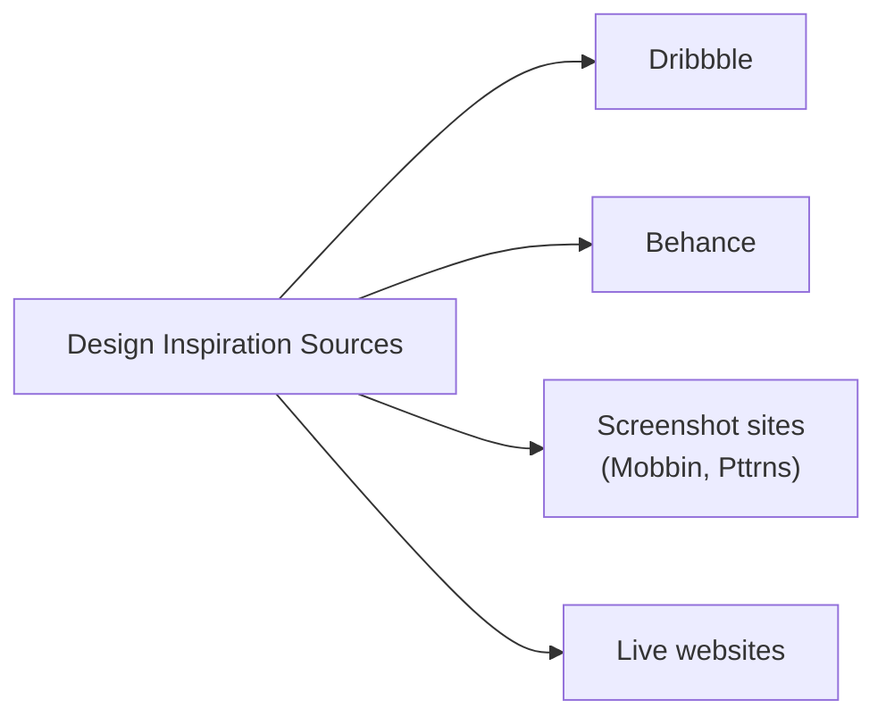
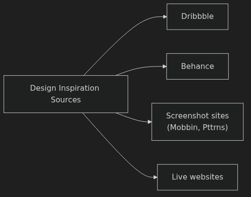
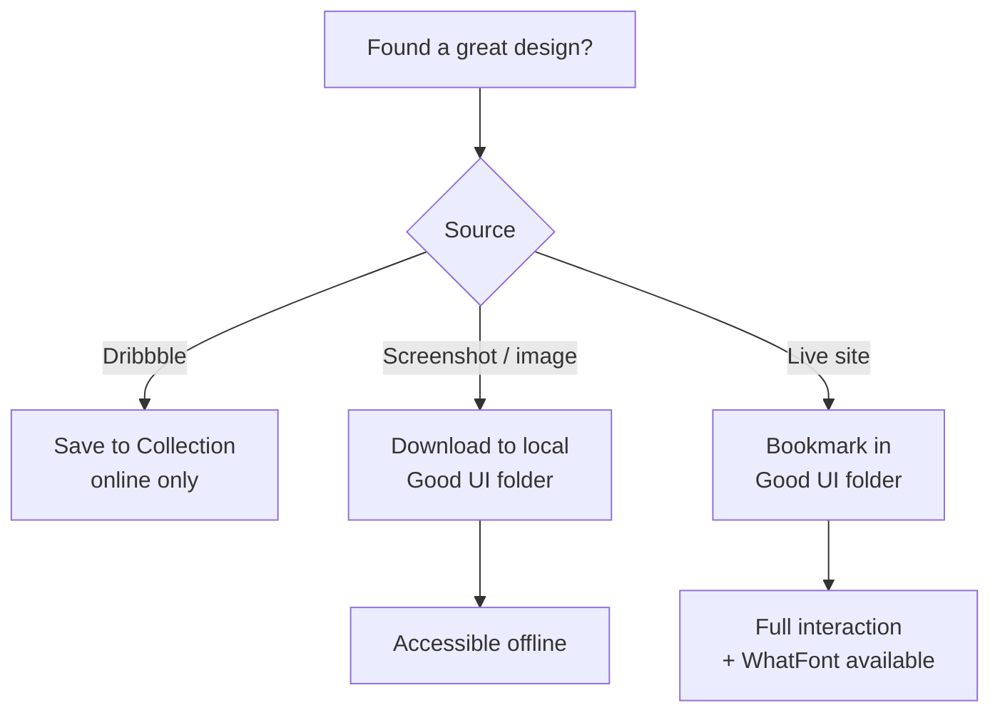
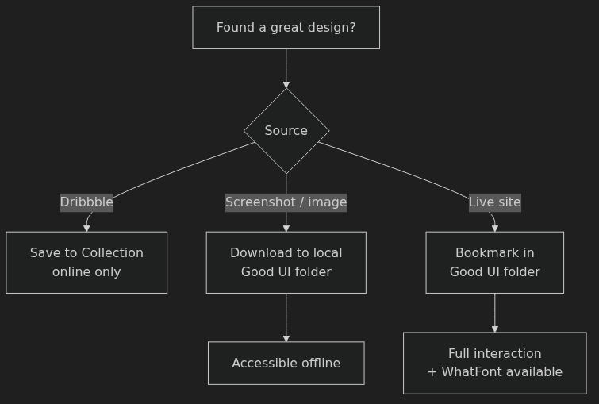
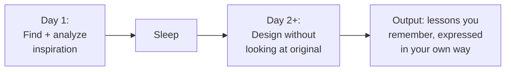
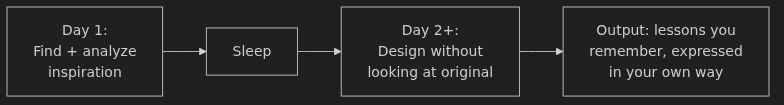

# Finding and Using Design Inspiration — Anki Cards

Q: Why does the instructor call design inspiration "shockingly important" for beginners?
A: Because studying great designs is how you absorb the "unwritten rules" of the craft — things like which colors never appear in great work, how layouts actually feel, and what separates professional from amateur work.

Q: What was the measurable outcome of the instructor studying design inspiration systematically?
A: He redesigned a page that originally took 10+ hours in just 29 minutes — roughly 20× faster — and the result looked dramatically better.

Q: What is the core habit the instructor recommends around design inspiration?
A: Never click past a good-looking site without cataloging it, so your future self has a reference when stuck on a design problem.

Q: What are the four main sources of design inspiration covered in this lesson?
A: Dribbble, Behance, screenshot sites (Mobbin.Design, Pttrns.com), and live websites encountered during normal browsing.

Q: What makes Dribbble's quality bar higher than most other design-sharing sites?
A: It is invitation-only, which filters out most bad work and keeps the content level high.

Q: What is Dribbble's color search feature, and why is it useful?
A: You enter a hex code or pick a color and see what top designers are doing with that exact color — useful for discovering color pairings. For example, searching a blue-indigo surfaces a lot of yellow, signaling yellow as a strong secondary color choice.

Q: What are Dribbble Collections, and what is their main limitation?
A: Named buckets where you save shots by theme (e.g. "gradients," "brutalist," "code editor") — but they require internet access; there's no offline access.

Q: Why does the instructor use Behance less than Dribbble?
A: Behance is less focused on digital UI work — it mixes illustrations, branding, and graphic design — so it produces less relevant inspiration for product designers.

Q: What distinguishes screenshot sites like Mobbin.Design from Dribbble?
A: Screenshot sites catalog real, shipped apps people can actually download — not concepts or portfolio pieces — so you see what design looks like in production.

Q: What advantages does a live website have over a static screenshot for inspiration?
A: You can see animations and interactions, observe responsive behavior by resizing the browser, and use tools like WhatFont to identify typefaces.

Q: What does the WhatFont browser extension do, and why should you install it?
A: Hover over any text on any site to instantly see the font name. Essential for learning what typefaces top designers actually use.

Q: What are the three ways the instructor stores cataloged inspiration?
A: (1) Dribbble Collections (online, organized by theme), (2) a local "Good UI" folder of downloaded images (offline access), (3) a browser bookmarks "Good UI" folder of live sites.

Q: What is copywork, and where does the practice come from?
A: Recreating a design you admire pixel-for-pixel in Figma. Writers and painters have done it for centuries — Michelangelo reportedly recommended it as one of the first exercises for beginning painters.

Q: Why does recreating a design teach more than just studying it visually?
A: "You can look at this and not really notice what are all the little techniques and tactics that went into this design. But when you recreate it pixel-for-pixel, you have to notice all those things."

Q: What are the steps for doing copywork on a live website?
A: (1) Find a design that impresses you and you feel you couldn't match. (2) Screenshot it and paste into Figma. (3) Create a new frame next to it. (4) Eyeball and recreate — don't just trace. (5) Use the original as a check, not a crutch.

Q: Why does the instructor prefer eyeballing during copywork rather than tracing exactly?
A: "I'm gonna learn more that way, trying to get it about right." Approximating forces you to make decisions and understand the design; tracing is passive.

Q: What is the real goal of copywork — and why does "pixel-perfect" matter less than it sounds?
A: "Really the idea is, you're here to learn lessons from the original design." Pixel-perfect is a useful constraint to force close attention, but extracting teachable techniques is the actual payoff.

Q: What lesson did the instructor learn from the Epicurrence Conference site that he'd never considered before?
A: That text can be sized so large (360pt) that it becomes a visual element rather than readable text — a technique he had never thought to try before studying that design.

Q: What technique creates the "awesome hodgepodge of colors" background on the OpenAI homepage the instructor replicated?
A: Large randomly positioned rectangles with radial gradients in different colors (yellow, purple, blue) at varying opacities — the site generates them dynamically so each refresh looks different.

Q: What is a mood board, and how does it differ from your general inspiration catalog?
A: A mood board is inspiration collected specifically for one project — not general inspiration, but designs applicable to the project at hand: similar products, adjacent industries, and things representing the brand vibe you're going for.

Q: What makes it acceptable to include non-UI references in a mood board?
A: A mood board is about capturing emotional tone and brand direction. Even a music site or photographs of lights can contain layout ideas, information hierarchies, or emotional cues relevant to an unrelated product.

Q: How did the Amazon Echo team use a mood board in a non-traditional way?
A: They assembled photographs of different types of lights (party lights, majestic lights, warm lights, mechanical lights) to figure out the emotional tone of the Echo's ring light — none of these were UI.

Q: Why does the instructor hesitate to include direct competitors in a mood board?
A: "Design is a really great way to distinguish yourself from your competitors. So you don't wanna soak them up too much as inspiration necessarily."

Q: What is the primary use of a mood board during a project?
A: To gut-check your work throughout: "Am I on track? Am I drawing inspiration from the things I want and hitting the brand I want to hit?"

Q: What are the two strategies for avoiding plagiarism when working from inspiration?
A: (1) Draw from multiple sources — recombining font from one site, palette from another, and imagery motif from a third is recombination, not copying. (2) Sleep on it — analyze inspiration on Day 1, then design without looking at it the next day so what emerges is lessons you remember in your own expression.

Q: You're designing a mobile onboarding flow and want to see how real, shipped apps handle it. Which inspiration source is most directly useful, and why?
A: Screenshot sites like Mobbin.Design — they catalog real app screens filtered by UI patterns like onboarding, so you see production-quality examples rather than concepts.

Q: You're starting a copywork exercise on a site with a distinctive background effect. You can open DevTools to get exact values. Should you?
A: It's not against the rules — "It doesn't really matter. It's just about how are you learning the most?" Eyeballing first trains your eye more; DevTools is a valid check once you've tried approximating.

Q: A client gives you a new project and you need to gather inspiration. What's the difference between what goes in your general "Good UI" folder and what goes in a mood board for this project?
A: Your "Good UI" folder is a general long-term catalog of anything you find great. A mood board is project-specific — only things relevant to this client's problem, industry, brand, or adjacent fields that carry applicable ideas.

Q: You do copywork and notice a font you can't identify with WhatFont (it may be a paid/custom font). What's the recommended approach?
A: Find a visually similar free alternative using a resource like Typewolf's Guide to Free Fonts. Don't overthink it — the goal is learning layout and technique, not exact font matching.
