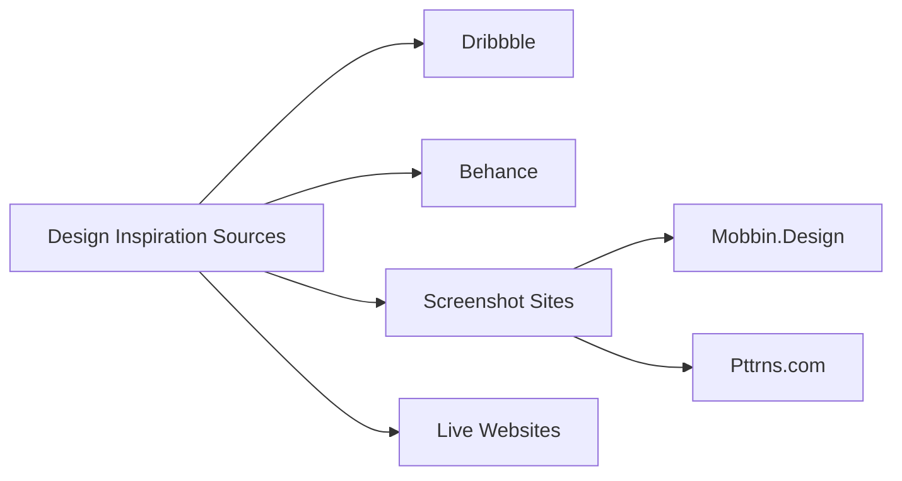
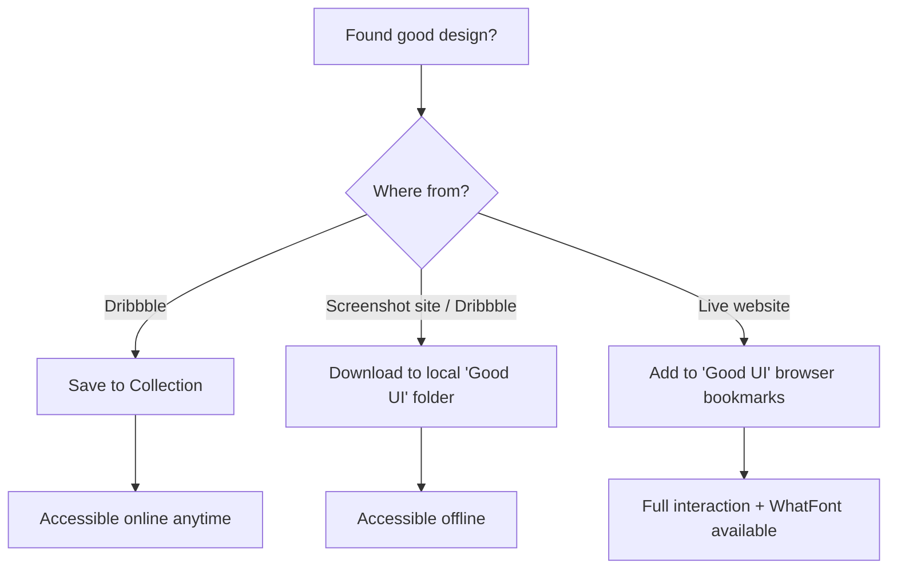
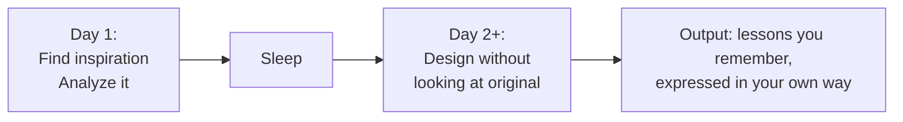

# Finding and Using Design Inspiration

> "Design inspiration for a beginner might actually come as a little bit of a surprise. It is a shockingly important part of improving your design craft."

Design inspiration refers to any nice designs you encounter on the web, or on sites like Dribbble or Behance where designers post their work. The end goal is that you **never click past a good-looking site without cataloging it** — so your future self can refer to it when stuck on a design problem.

The video is divided into two parts: where to find good design inspiration, and what to do with it once you find it.

---

## Why Inspiration Matters: A Personal Story

The instructor shows his very first professional design — someone paid him to make it, and it took over 10 hours.

> "And this design is just awful."

Problems with it: a "gross, pukey, yellow" color, a muddy brownish header, mismatching bright saturated red/green/blue that don't fit the vibe. He didn't understand color — didn't know gray was important, didn't know brown headers are basically never used in great designs.

> "The more design insp I looked at, the more I realized, ah, okay, this is sort of how things are done. These are sort of the unwritten rules. And those unwritten rules I've written in this course."

He later redesigned the same page. It took **29 minutes** — 20x faster — and looked dramatically better. That's the power of studying inspiration systematically.

---

## Where to Find Design Inspiration

### 1. Dribbble (dribbble.com)

> "Don't ask me the reason; I don't understand it." *(three b's)*

Designers post finished work or works in progress. You follow designers and studios and get a constant stream of new ideas.

- **Invitation-only** — keeps the quality bar high; not a lot of downright bad stuff
- **Color search** — one of the instructor's favorite features: enter a hex code or pick a color from a palette, then see what the best designers are doing with that specific color
  - Useful for discovering color pairings: searching blue-indigo surfaces a lot of yellow → good signal for secondary color choices
- **Collections** — save any shot to a named collection with one click; the instructor has collections like "gradients," "brutalist," "code editor," "blue-purple"
  - Drawback: online only; requires internet access

> "This is absolutely a fantastic feature that Dribbble has, and I highly recommend that you start putting together collections."

### 2. Behance

Similar concept but less focused on digital work — mixes illustrations, graphic design, branding, etc. The instructor uses it less, views it as secondary to Dribbble.

> "I don't use it as much as Dribbble, to be honest. And one of the biggest reasons is it's just not as focused on digital work."

### 3. Screenshot Sites

These catalog screenshots from real apps people can actually download and use — not concepts.

- **Mobbin.Design** — real app screenshots (Gmail, Masterclass, Evernote, Zendesk…); filter by UI patterns like walk-throughs, onboarding, etc.
- **Pttrns.com** (no vowels — *"Again, the names, sheesh"*) — iPhone and Apple Watch apps; may not be as frequently updated

> "The names, sheesh. We've got some weird names in this design world."

Especially useful when designing mobile apps and you want real, shipped examples. You can also download and use the apps yourself to get a feel for the interaction.

The best screenshot sites change over time — the instructor has a list in the course resources.

### 4. Live Websites (Your Normal Browsing)

Anything cool you stumble across counts. Live sites have advantages that static screenshots lack:

- **Animations and interactions** — smooth menu transitions, hover effects, page transitions are visible only on a live site
- **Responsive behavior** — shrink the browser to see how layouts adapt at different widths
- **Font identification** — install the **WhatFont** browser extension; hover over any text to instantly see the font name
  - Example: Stripe Climate site uses *Sohne-var* (a variable font)

> "If you have WhatFont installed, and you should, you can just hover over any font on the site and see what font they're using."

---

## Storing and Cataloging Inspiration

- **Dribbble collections** — organized by type/theme; online only
- **Local "Good UI" folder** — downloaded images for offline access; the instructor has 182 items (Dribbble shots, website screenshots, even book covers and animations)
- **Browser bookmarks "Good UI" folder** — bookmarked live sites; used throughout the course and in real design work

> "The whole idea is, if I'm ever working and I don't have Internet access, and I just need to see some random ideas and kinda get those creative juices flowing, here's 182 things that I have liked in the past and might wanna look at now."

---

## What To Do With Inspiration

### Copywork

> "One of the most important exercises you can do as a beginning designer is called copywork."

**Copywork** means taking a site or design you like — one where you feel you *couldn't* design at that quality — and recreating it pixel-for-pixel in Figma.

> "It's a little bit of a newer idea for UI designers. But just as, I think it was Michelangelo recommended it as one of the first exercises that a beginning painter does, this is definitely one of the first things I recommend a beginning designer does."

Writers and painters have done this for centuries. The reason it works:

> "You can look at this and not really notice what are all the little techniques and tactics that went into this design. But when you recreate it pixel-for-pixel, you have to notice all those things."

**How to do it:**

1. Find a design that impresses you and you feel you couldn't match
2. Take a screenshot (Mac: Shift+Ctrl+Cmd+4) and paste into Figma
3. Create a new frame next to it
4. Eyeball and recreate — don't just trace; you learn more by approximating
5. Reference the original to check, not as a crutch

> "I kinda wanna eyeball things at first just because I'm gonna learn more that way, trying to get it about right."

**Live walkthrough — OpenAI.com:**

The instructor demonstrates in real time on the OpenAI homepage (the one with the dynamic colored background).

- **The background effect**: big, randomly positioned rectangles with radial gradients (yellow, purple, blue) at 0–100% opacity → creates the "awesome hodgepodge of colors"
  - Each page refresh shows different colors because the site generates them dynamically
- **Font**: Colfax (paid, hundreds of dollars) → use **Roboto** or **Cooper Hewitt** as free alternatives; he uses Typewolf's Guide to Free Fonts (~$40 resource) to find free equivalents
- **Navigation items**: uppercase text, letter-spaced; use Shift+A for auto layout, Cmd+Shift+U to uppercase all at once in Figma
- **Buttons**: dark rectangle at 10% opacity, 4px border radius

> "I found this today and I was like, wow, that looks cool. I actually want to try and do that."

For font matching when WhatFont won't help (custom or image-based fonts): look for similar free fonts, use your best judgment, don't overthink it.

Can you peek at the browser's Dev Console for exact values like border-radius?

> "It's not like it's against the rules to go look at this sort of stuff... It's like, is that cheating or is it not cheating? It doesn't really matter. It's just about how are you learning the most?"

**The real goal isn't pixel-perfect recreation — it's extracting lessons:**

> "Technically, I say, yeah, recreate this pixel-for-pixel. But really the idea is, you're here to learn lessons from the original design."

Example lessons from the Epicurrence Conference site (Dann Petty): giant text used as a visual element (size 360pt for "HI"), watercolor marks as a repeating design motif.

> "Just before I'd seen this design, I had never considered that you would have text be size 360, right? But at some point, it gets large enough where it's basically a visual element."

And once you learn a technique, you start seeing it everywhere — and can apply it in your own work.

> "I have been designing for years and I had never actually known how to recreate this effect until I just opened this up today and did it. So it's very possible, even at higher skill levels, to learn tons of stuff from copywork."

---

### Mood Boards

A **mood board** is a collection of inspiration for *one specific project* — not general inspiration, but things applicable to the project at hand.

What to include:
- Sites doing similar things, solving similar problems
- Adjacent industries that handle something relevant well (even if not the same type of product)
- Things that represent the brand or vibe you're going for

Example: the instructor built a mood board for Philo (a TV site) that included movie sites and a music site.

> "Like, these are just albums, right? That's not the same thing as TV shows... But there's interesting ideas here. I like how it's laid out. I like the simplicity of the information. The sidebars might be something that I could borrow. I don't know where this blurred-out background came from, but there's an idea that maybe I could use for something related to TV."

Mood boards can also be **abstract** — not UI at all. Example: designers working on the Amazon Echo's ring light had a mood board of photographs of different types of lights (party lights, majestic lights, warm lights, mechanical/powerful lights) to figure out the emotional tone of the product.

> "None of these are UI, right? These are a little bit more abstract, but they kind of represent the feel of what lights could be like."

You reference the mood board throughout the project to gut-check: *"Am I on track? Am I drawing inspiration from the things I want and hitting the brand I want to hit?"*

On competitors in mood boards:

> "I sort of hesitate. Design is a really great way to distinguish yourself from your competitors. So you don't wanna soak them up too much as inspiration necessarily."

---

## Avoiding Plagiarism

The video is largely about copying — so the instructor addresses the elephant in the room.

**Strategy 1: Draw from multiple sources**

Font from one site + color palette from another + imagery motif from a third = recombination, not plagiarism.

**Strategy 2: Sleep on it**

> "What's kind of coming out is the lessons that you remember from there, but you're still sort of doing things in your own way."

More sources + more time between analysis and design = lower risk of inadvertently plagiarizing.

---

## Homework

> "For homework today, I'm kinda throwing you in the deep end."

- Do **copywork** on a real site you admire
- Create a **mood board** for a project
- Read the Smashing Magazine article: *"Copy If You Can: Improving Your UI Design Skills With Copywork"* (written by the instructor)
- Post results in the Student Community

> "These are really cool assignments, and students have historically liked them quite a bit. So take a look, do it. I hope you learn tons."
