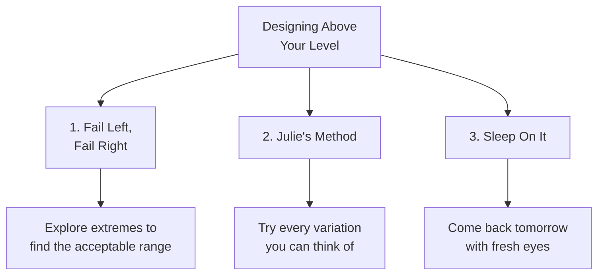
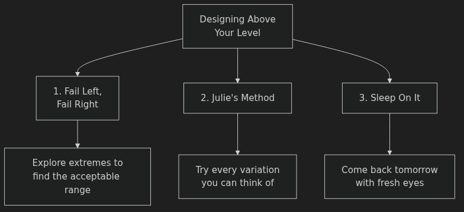
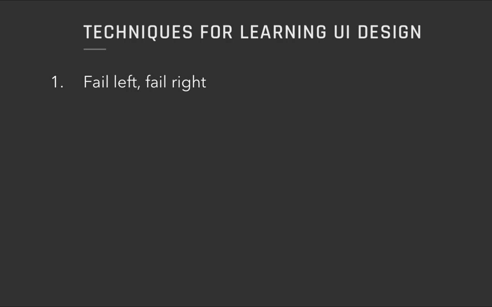
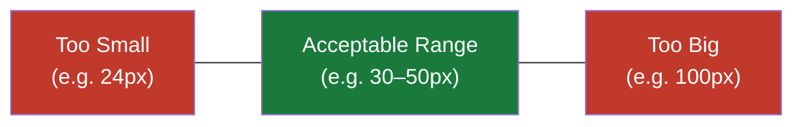
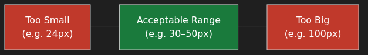
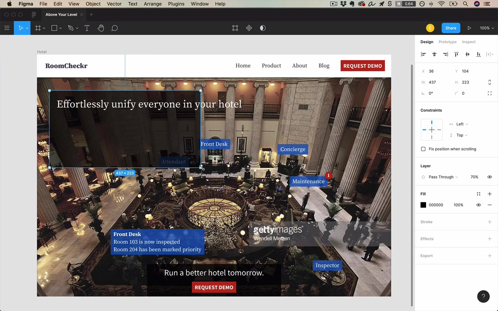
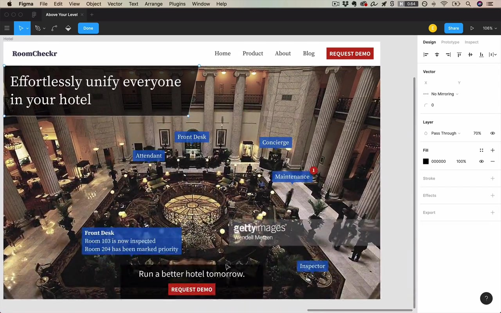
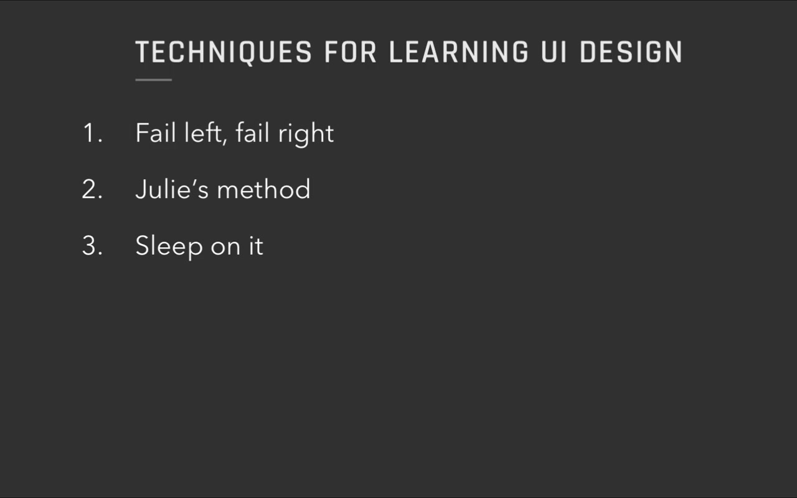
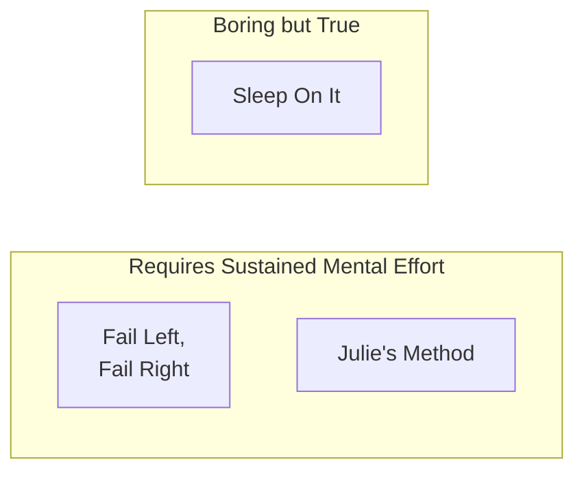
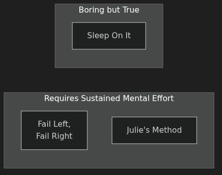

# 3 Methods for Designing Above Your Level — Anki Cards

Q: What does the instructor mean by "designing above your level"?
A: Making the most of your design/learning time so you progress as rapidly as possible — achieving a much higher level than someone spending the same number of hours without these habits.

Q: What are the three methods for designing above your level?
A: 1. Fail Left, Fail Right — explore the extremes to find the acceptable range. 2. Julie's Method — try every variation you can think of. 3. Sleep On It — come back the next day with fresh eyes.

Q: What is the core insight behind "Fail Left, Fail Right" from the unicycle story?
A: If you always fail the same way, your body only learns how to fail in one direction. By alternating between two different failures (forward and backward), you unconsciously learn the acceptable range of stable values between them.

Q: What was the friend's unicycle advice that became a maxim for rapid skill development?
A: "Hey, you know what? You should try to alternate between falling off forwards and falling off backwards."

Q: What is the naive approach to design that the instructor explicitly warns against?
A: Picking a value (e.g. 32px for a font) because it "sounds like a good text size," applying it, and calling it done — without exploring whether that value is actually in the right range.

Q: When you take a guess at a design value, what should you do next according to Fail Left, Fail Right?
A: Explore the range of values that are too much in either direction — go smaller until it's clearly too small, and bigger until it's clearly too big — to establish the acceptable range and surface new ideas.

Q: In the font-size example, what does exploring extremes (e.g. 50px, 100px) accomplish beyond confirming "too big"?
A: It reveals new design ideas you never would have tried if you stopped at the first guess — the extremes generate creative possibilities, not just data points.

Q: What is the key double benefit of the Fail Left, Fail Right method?
A: It gives you a range to experiment within (instead of a single value), and it surfaces design ideas that only become visible once you push to the extremes.

Q: Who is Julie's Method named after, and what was her key observation?
A: Julie Zhuo, VP of Design at Facebook. Her observation: "If you have literally tried every possible variation, you will have come across the best solution."

Q: What trap do designers commonly fall into that Julie's Method is designed to fix?
A: Imagining what a design idea might look like in their head, but not actually implementing it — because "that would be a lot of work." The result: never seeing if the idea was actually good.

Q: What is the practical rule of Julie's Method when you think of a design variation?
A: Duplicate your frame/artboard and design the variation immediately — don't evaluate it in your head. "You can't really evaluate it in your head. You have to see it in front of you."

Q: Why do great designers produce far more iterations than you'd expect?
A: The final product hides all the earlier iterations — you only see the polished result. But the path to that result involved churning through many variations to find what worked best.

Q: What does the instructor say is the tempting but ineffective alternative to active iteration?
A: Looking at a half-done design, taking a sip of coffee, and waiting for it to "speak to you on how to fix it." — "It's not gonna say anything — you have to get in there and do it yourself."

Q: Why is Julie's Method described as genuinely hard?
A: "It takes sustained mental effort to generate variation after variation and then constantly be tweaking." It's far easier to stare passively at a design than to keep producing new versions.

Q: What is the core mechanism behind "Sleep On It"?
A: After extended focused design work, your brain loses the ability to evaluate your own work clearly. Sleeping resets your perception — you return the next day with instant, clear opinions about what's working and what isn't.

Q: Fill in the blank: "I guarantee you go get some sleep, come out the next morning, open it up — and you're gonna instantly ___."
A: "have an opinion on it. You're gonna know what to change, or you're gonna know exactly how much you like it, or what's working and what's not working."

Q: What is the instructor's estimate of how long a person can do focused UI/UX design before hitting the cognitive wall?
A: Five or six hours of focused UI/UX design before the brain is done for the day.

Q: Does "Sleep On It" apply only to UI design?
A: No — the same principle applies to any creative editing: writing, music. Make it one day, edit it the next.

Q: How does the instructor reframe "Sleep On It" for designers who feel they're in a rush?
A: "This might seem like bad news if you're in a rush, but ultimately it's going to make you more efficient." Stopping when you've hit the creative wall and returning refreshed is a better use of time than grinding unproductively.

Q: You're designing a button and you picked 14px padding because it "felt right." What does Fail Left, Fail Right tell you to do next?
A: Try padding that's clearly too small (e.g. 4px) and clearly too large (e.g. 40px). This establishes the acceptable range and may reveal layout ideas or proportional relationships you wouldn't have noticed by sticking with your first guess.

Q: You've been designing for two hours and feel stuck — you can't tell if the layout is good or what to change. Which method applies, and what should you do?
A: Sleep On It. Stop working, go do something else (email, coffee), and come back the next day. You'll have clear opinions immediately after the reset.

Q: You think of an idea — "what if the headline were much larger?" — but implementing it would mean rearranging several elements. What does Julie's Method say to do?
A: Duplicate the frame and implement it anyway. You cannot evaluate the idea in your head — you have to see it in front of you to know whether it works.

Q: After a 45-minute iteration session, you have five different versions of a design. You sleep on it and return the next day. What outcome does the instructor predict?
A: You'll likely find favorite elements from different iterations and be able to combine them into a result far better than what you'd have produced under pressure in a single sitting.

Q: Which two of the three methods require sustained mental effort, and which is described as "a little bit boring but true"?
A: Fail Left, Fail Right and Julie's Method both require sustained mental effort. Sleep On It is the one described as "a little bit boring, but it's true."

