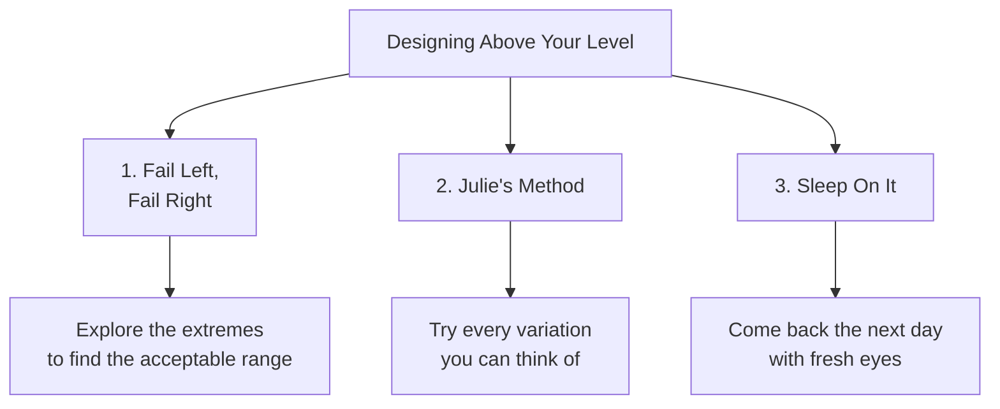
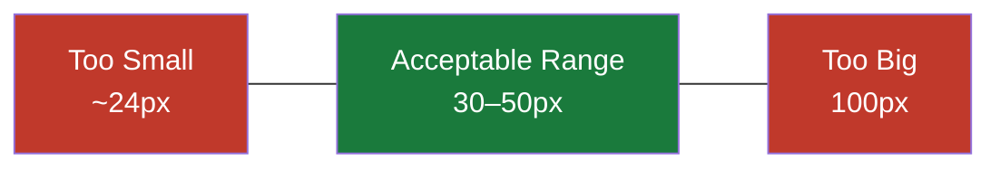

# 3 Methods for Designing Above Your Level

> "All I mean by designing above your level is making the most of the time in which you're designing or learning about design so that you can make progress as rapidly as possible and quickly achieve a much higher level than someone who's spending say the same number of hours working as you."

These are the three things the instructor has learned that probably helped him learn the fastest over his career. A warning upfront: two of the three are not easy — they require sustained mental effort. But if you can get into these habits, you will learn quicker and progress more efficiently.

---

## Method 1: Fail Left, Fail Right

### The Unicycle Story

> "College was definitely a time of questionable decisions, unicycling was one of these decisions — and yet it was a ton of fun."

The Unicycle Group met every Thursday at midnight. One Thursday at 12:30 (technically Friday morning), the instructor was stuck in his unicycling progression: he'd pedal for one, one-and-a-half, maybe two cycles, then fall — always the same way, going forward while the unicycle shot backwards.

A friend watching him offered advice he calls probably the best maxim for rapid skill development he's ever heard:

> "Hey, you know what? You should try to alternate between falling off forwards and falling off backwards."

That was it. That was all she said.

The logic: if you always fall off the same direction, **your body is just learning how to fail in one way**. But if you force yourself to alternate between two different failures, you can't help but start to pick up — at an unconscious level — the acceptable range of values between failure in one direction and failure in the other. Your body just sort of learns where it can be stable.

He did it 20 times — falling forward, then backward — and probably made more progress in 10 minutes than in hours of unicycling before that.

### Applied to Design

The naive approach: you need a headline on a landing page. You pick 32px because it "sounds like a good text size," make the background dark, make the text white — and call it done.

> "This is exactly how I don't want you to design."

What you should do instead: **any time you take a guess at a value, explore the range of values that are too much in either direction.**

Example workflow with font size:
- 32px → maybe decent
- 24px → a bit small, but still a valid header
- 50px → getting big, but forces you to rethink the layout — and reveals new ideas
- 100px → definitely too big, almost no way to make it work

By going to the extremes (50px, 100px), you establish a **range of acceptable values** — say, 30–50px. Now you have something to experiment within. You've also stumbled into design ideas you never would have tried if you just stopped at 32.

> "I don't just have one value to go on. I have something to experiment with."

The key insight: exploring the extremes doesn't just help you pick a value — it **generates new design ideas** that only become visible once you try them.

---

## Method 2: Julie's Method

Named after **Julie Zhuo**, VP of Design at Facebook.

> "I stole this idea from her and I named it after her without her permission."

Her observation:

> "If you have literally tried every possible variation, you will have come across the best solution."

This doesn't mean generating millions of variants. It means: **try everything that you think might make sense**. Duplicate your frame/artboard, see how it looks, keep going — so you can compare iterations side by side.

### The trap designers fall into

> "I think as designers we sort of can get into this rut where we imagine what might be a good idea but we don't actually implement it. Cause that would be a lot of work."

Instead: when you think of an idea and want to see how it looks, **just duplicate your frame and design it**. Make it happen. Because:

> "You can't really evaluate it in your head. You have to see it in front of you."

### What great designers actually do

> "Great designers creating great designs — they're doing far more iterations than you might expect, cause the final product, you don't see all the other iterations. You only see the finished thing and you know it's good."

What to resist:

> "We wanna resist the urge to sort of rest on our laurels that we came up with a design, and instead keep churning out every little variation that we can think of and see what looks even better than that."

This is genuinely hard:

> "It takes sustained mental effort to generate variation after variation and then constantly be tweaking. It's far easier to look at something that's like half done, take a sip of your coffee, just kind of wait for it to speak to you on how to fix it. But it's not gonna say anything — you have to get in there and do it yourself."

---

## Method 3: Sleep On It

> "And I'll admit this is a little bit boring, but it's true — you need to sleep on it."

> "The thing with UI design is it's never a one-day job."

After two hours of cranking on a design, your brain gets fried. You can't tell if your designs are good, you lose the ability to see what to change, you run out of ideas.

> "I guarantee you go get some sleep, come out the next morning, open it up — and you're gonna instantly have an opinion on it. You're gonna know what to change, or you're gonna know exactly how much you like it, or what's working and what's not working."

> "There is something magical about sleep in helping you identify what part of your creative endeavors are working and what's not."

This applies beyond UI design — same thing is true with editing writing, editing songs: make it one day, edit it the next.

### Practical framing

> "This might seem like bad news if you're in a rush, but ultimately it's going to make you more efficient."

When you know you've hit the wall creatively for the day: stop, go do something else (check email, get coffee), come back tomorrow recharged.

> "You're definitely gonna be making the best use of your time doing that and you're not gonna feel like you're banging your head up against a wall."

The instructor's own limit: five or six hours of focused UI/UX design before the brain is done for the day.

---

## Homework

Take a given design file and iterate hard for **45 minutes**:
- Try **fail left, fail right**: make values too big, too small, too spaced out, not spaced out enough — feel the acceptable range
- Apply **Julie's Method**: every idea you have, duplicate the frame and try it — don't just sit staring at one artboard imagining
- Then **set it aside** and come back the next day

> "I'm not gonna judge you based on how these designs look — I just want you to get into the flow of rapidly iterating, trying out different concepts when you think of them, not just sitting still and staring at one art board for 10 minutes."

> "Just try it. Fail left, fail right."

After sleeping on it, you might find favorite elements from different iterations and combine them into one result that's far better than what you would have done with half the stress.
