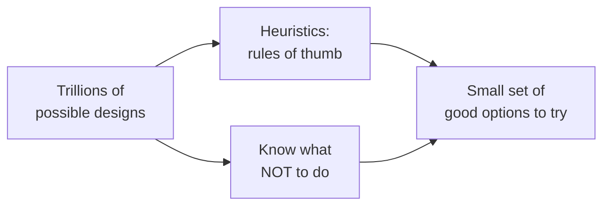
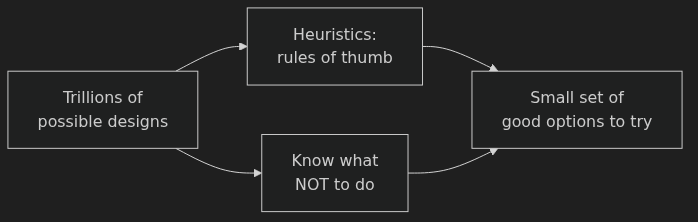
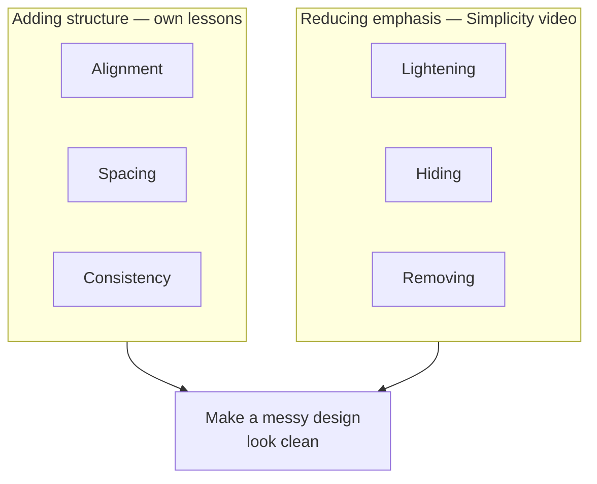
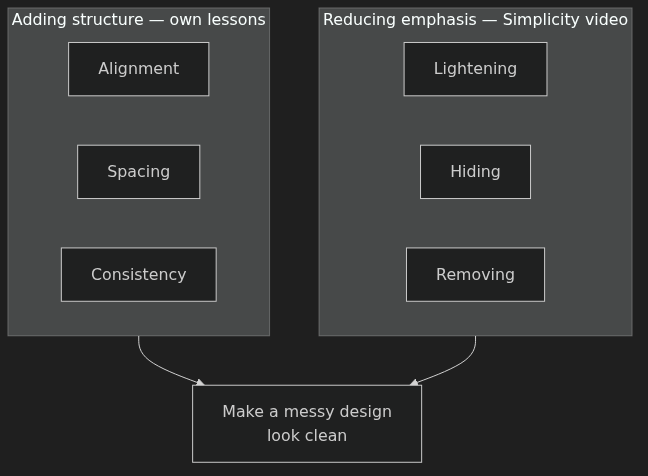
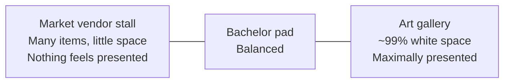
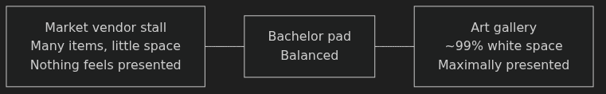
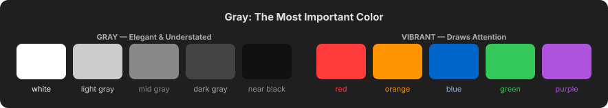

# Introduction: Analyzing Aesthetics — Anki Cards

Q: What is a heuristic, and why are heuristics valuable in UI design?
A: A rule of thumb — a go-to idea that doesn't apply 100% of the time but points you in the right direction. They take a space of trillions of possible design choices and quickly narrow it down to a manageable few to try.

Q: Why does the instructor reject "design is subjective"?
A: A design has to serve a purpose, so it can be judged against that purpose. "When someone says design is subjective, what that tells me is they haven't actually analyzed it enough."

Q: How does the instructor distinguish "subjective" from the real nature of design?
A: Design is **open-ended**, not subjective. Even with just two text elements there are roughly a quarter million combinations — that freedom feels subjective, but each option can still be evaluated against the design's goal.

Q: What are the two main strategies for navigating the trillion-option design space?
A: 1) Heuristics/rules of thumb — point you toward good options. 2) Knowing what NOT to do — eliminates huge swaths of bad options automatically (e.g. "header should never be smaller than body text").

Q: What are the six core tools of the Fundamentals unit?
A: Alignment, spacing, consistency (each gets its own lesson) + lightening, hiding, removing (combined in the Simplicity video). Together they let you make a messy design look clean.

Q: Why is "making a messy design look clean" a fundamental and common task?
A: Many real-world starting points are messy: a sketch with a friend, a client's working-but-ugly app, a UX wireframe. The six tools give you a system to handle all of them.

Q: What deeper meaning does alignment carry beyond visual neatness?
A: "Alignment is sort of this signal that a human being has put care into it." In nature, beauty comes from grandness and texture; in human-made things, it often comes from alignment.

Q: What is the rule for breaking the fundamentals (alignment, spacing, etc.)?
A: "Even when you break the rules, you will know why you broke them, and you will have first become a master of following them."

Q: Why did the instructor reject the traditional "fundamentals" curricula (gestalt, balance, etc.)?
A: He could read for hours about them but they didn't help him make his bad designs better. This unit focuses on things that helped in **every** design — alignment, spacing, consistency.

Q: What does generous spacing communicate to a viewer, according to the instructor?
A: "When we're presented only with a small number of things displayed with a lot of space around them, we intuitively grasp that we're meant to see those." It signals that something is presented, thought-about, and elegant.

Q: Describe the white-space spectrum from vendor stall to art gallery — what does each extreme communicate?
A: Vendor stall: many items, little spacing → nothing feels presented. Art gallery: ~99% white space, few focal points → maximally presented and elegant. UI should draw lessons from the gallery side.

Q: What is the core idea of consistency in design?
A: "If things look similar they belong together in a group." Consistent elements (same frame, same chair style, same button shape) reduce visual clutter — they register as one unit instead of many.

Q: How does consistency interact with visual clutter?
A: "If you want to remove visual clutter, take a bunch of elements, make them look as consistent as possible, and then align them up in a row." Consistent elements add to count but barely add to perceived clutter.

Q: Why is gray "the most important color" according to the instructor?
A: It doesn't unduly draw attention — feels understated, minimalist, and elegant. "Gray is the most elegant color." Beginning designers underutilize it.

Q: What does "gray" mean specifically in this course?
A: Any grayscale value — white, black, or anything in between. "Unless I otherwise specify, I'm always gonna be talking about inclusive of white and black."

Q: What is the correct order of operations between UX and aesthetics?
A: UX first — figure out a usable, constraint-satisfying layout — then apply alignment, consistency, and white space to make it look as good as possible **given those constraints**.

Q: How does brand relate to the six fundamental tools?
A: Brand ties together all design elements. The fundamentals (alignment, spacing, consistency) apply universally, but the specific colors and warmth chosen reflect the brand's personality (e.g. elegant/modern vs. warm/cozy).

Q: A client gives you a working app that just isn't pretty. Which tools from the Fundamentals unit do you reach for first?
A: Start with alignment, spacing, and consistency — the three structure-adding tools. Then apply lightening, hiding, or removing to reduce emphasis on lesser elements. Together these make the messy design look clean.

Q: You notice a room has one chair that's slightly rotated off the 90° grid. Which principle does this violate, and why does it matter?
A: Alignment. Furniture at right angles (parallel to each other and to the walls) signals that a human being put care into the arrangement. A single off-angle element breaks that signal.

Q: In the Placeist app, how does the designer use strategic inconsistency?
A: Most header icons are same-size circles in the same color. The app icon is roughly the same size but has no circle and a different color — so the deliberate inconsistency is what makes the eye notice it as special.

Q: You're reviewing a mobile app that uses rounded images, rounded cards, a rounded rent button, and rounded nav bar ends. What principle is at work?
A: Consistency — specifically a recurring **round/circle motif**. Repeating a shape across many elements ties them together and reduces perceived clutter.

Q: If 100 great designers solve the same design challenge, where will their solutions converge even if colors and fonts differ?
A: In the use of alignment, spacing, and consistency. "You would be very surprised at the similarities between those solutions… even in things like the way they use alignment, the way they use spacing."

Q: What restraint in color does the Placeist app demonstrate, and what rule does it illustrate?
A: Almost entirely grayscale except photography, with only two non-gray elements — both in the same orange hue. Rule: default to grayscale; when you add a pop of color, keep it to one hue.

