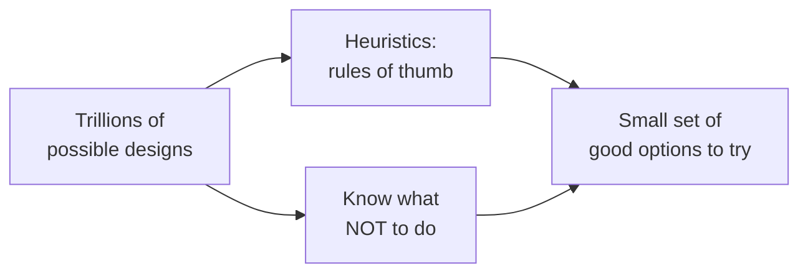
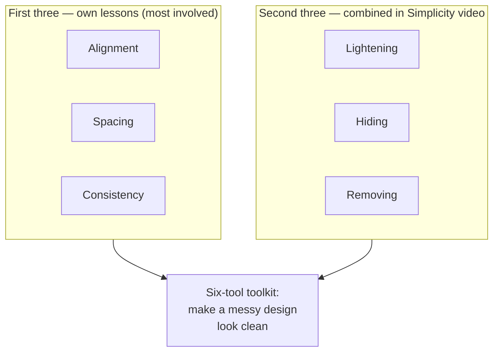
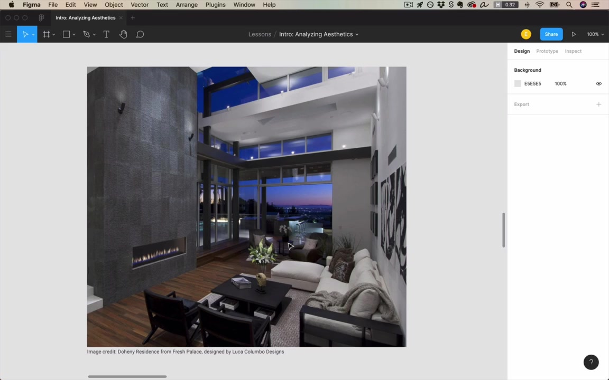
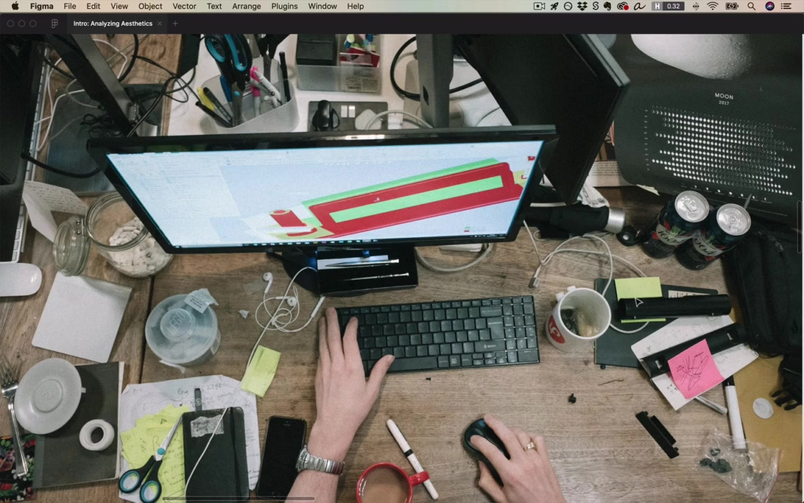
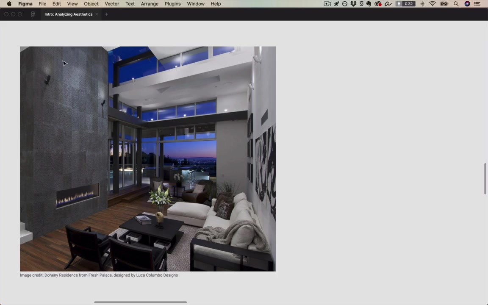
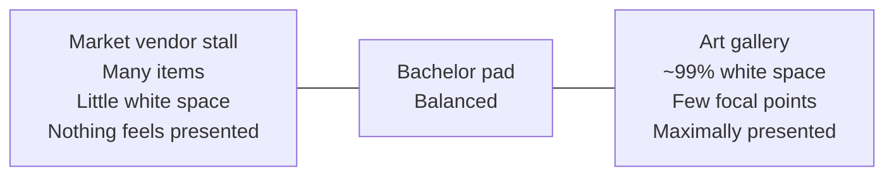
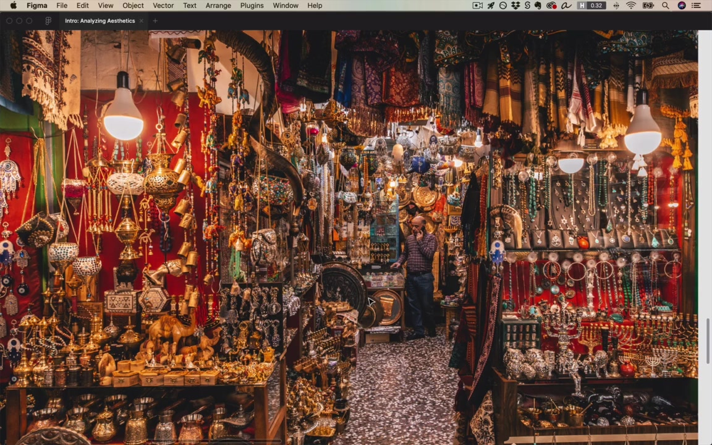
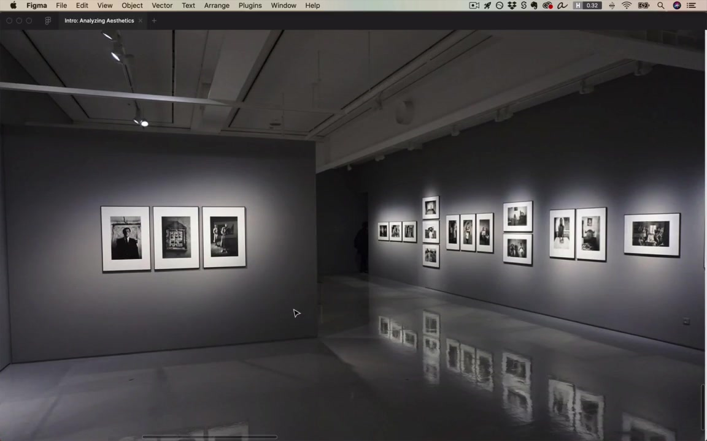
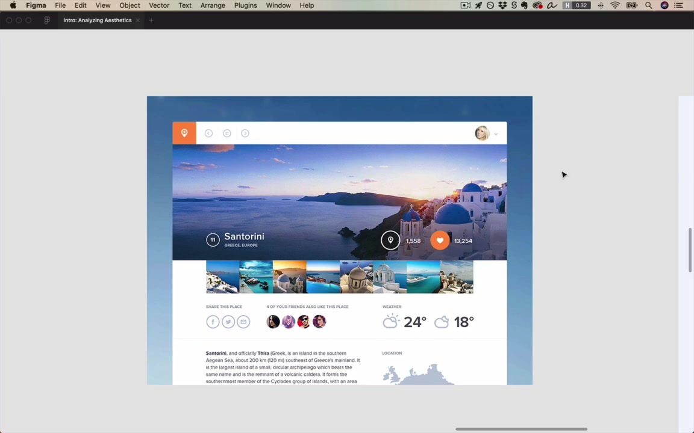
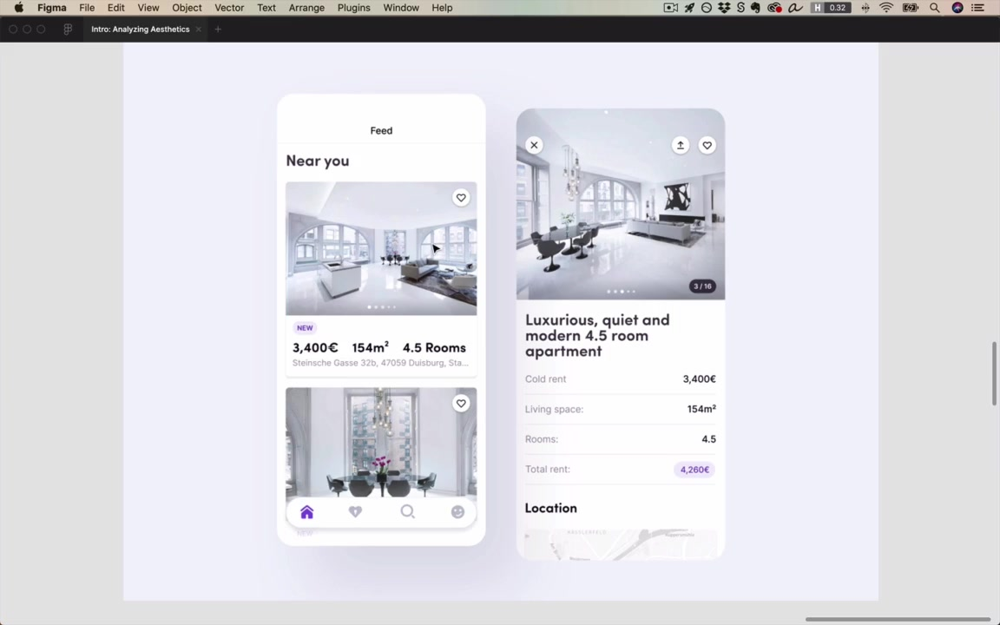

# Introduction: Analyzing Aesthetics

Welcome to the **Fundamentals** unit of Learn UI Design. This intro lesson sets up what the unit will cover and why it's different from other "fundamentals of design" curricula.

> "Many lessons that go into detail about what they consider the fundamentals of design are just awfully useless, and they cover things like gestalt or balance, or ideas like this that to me are just not practical."

- Even as a beginning designer, the instructor could read for hours about gestalt or balance, but those things **didn't help him make his bad designs better**.
- This unit focuses on fundamentals that helped in **every** design, regardless of context, platform, or brand.
- Things like **alignment, spacing, consistency** come up again and again.

> "Even when you break the kind of, quote, unquote, 'rules' that we're talking about in this unit, you will know why you broke them, and you will have first become a master of following them."

Throughout most of this unit, the instructor teaches **heuristics** — rules of thumb. A heuristic is a go-to idea that maybe doesn't apply 100% of the time, but it's sure gonna point you in the right direction.

## [1:33] Design is open-ended – but not magic

> "There's nothing magical to it. It is a skill, but it's a skill that you can get better at."

The way to get better at aesthetics is through **analysis** — analyzing good designs and why they work, and bad designs and why they don't.

> "To me, when someone says design is subjective, what that tells me is they haven't actually analyzed it enough."

- A design has to **serve a purpose** — it has a goal in mind.
- It's not art. Art you hang on a wall (or on your fridge). Design has to serve some purpose.
- Example: a portfolio. You want people to hire you. Its design can be judged: Does it get people to hire me? Does it give a sense of who I am? Does it set me apart from other designers?

> "I would say design is open-ended, and that is one of the big things that people mean when they say it's subjective, or it's magical, or it's difficult, or mysterious, or whatever."

Even in the simplest case there is a **staggering number of choices**.

### Worked example: two pieces of text

A "portfolio" of just a headline and a short piece of text. Just choosing how to style the headline:

- Font choice → hundreds of options
- Font size → "failing left and failing right" gives an enormous range
- Uppercase vs. not → doubles the choices
- Font weight (100, 300, 500, 700) — even italics for headlines isn't out of the question

> "So just in styling one piece of text, there's something like a quarter million options that I am choosing from just to get here."

Multiply by the second piece of text, then add positioning decisions (line length, top margin, space between them, line spacing) — **you are picking out one way out of like trillions.**

The only way to deal with a decision space that large:

- **Rules of thumb / heuristics** — point you in the right direction.
- **Knowing what not to do** — automatically eliminates huge swaths. Example: *"your header should not be smaller than your body text"* — that alone removes tons of options.

Together, these let you spend your time exploring **good** options rather than getting bogged down in the myriad of bad possibilities.

## [7:38] The fundamentals system: 6 techniques of simplicity

This unit is **organized as an overarching system** — videos build on each other — and ultimately give you **six core tools** you'll use on basically every design.

> "And I say, basically, I actually think it is every design that you ever do, but I'll just hedge my bets here, and I'll say it's basically in every single design."

This is unusual — in the color unit or typography unit, some ideas only apply to certain styles (quirky/artistic palettes, techie/sci-fi fonts, etc.). In this unit, the ideas apply **basically everywhere**.

- **Alignment, spacing, consistency** — the most involved topics; each has its own lesson, each with sub-heuristics underneath.
- **Lightening, hiding, removing** — combined into the Simplicity video; three key strategies for **removing emphasis** from elements on the page. Simpler topics but worth calling out as individual strategies.

### Why "making a messy design look clean" is fundamental

This task might seem niche, but many things fall under the category of "messy design":

- A **sketch** of a screen you did with a friend — knows the elements, but doesn't look great
- A **client's existing app** that works but isn't pretty, and you've been hired to clean up
- A **wireframe** from a UX designer — intentionally low-fidelity

In all cases: the fundamental problem of making messy look simple — that's what the system in this unit is for.

## [8:22] The fundamentals outside of digital design

To show how fundamental these ideas are, the instructor steps outside screen design for a few minutes.

> "Say for a second that you're out with friends, and maybe someone you meet invites you back to their place, and you go back with a bunch of folks, and you're all hanging out in their stylish bachelor pad or whatever…"

> "Before I was a designer, I would have said no way. You know, there's some magic behind how they lay things out that I'm just not privy to. I don't understand it. It's above me."

But pay attention to a few critical foundational ideas — alignment, white space, consistency — and you can **reverse engineer** why a room looks elegant.

### Alignment

> "Maybe it's even the most important idea that beginning designers miss."

- The rug is aligned with the walls.
- The furniture is at **right angles** — the table isn't twisted relative to the couch.
- The paintings are meticulously horizontal/vertical.
- The more elements aligned (to each other, or just suggesting parallel lines), the more the room feels crisp, clean, neat.

#### Test the rule by breaking it

A messy desk with no alignment — antithesis of well-aligned, and sure enough, doesn't look as nice.

> "This is not exactly a value judgment here, right? This person who's working at this desk, they're putting all their attention into the work on the screen, and not the surroundings."

#### Alignment as a signal of human care

> "Alignment is sort of this signal that a human being has put care into it, and I do mean this quite literally."

> "If you look at nature, nature is beautiful, but it's never beautiful because of alignment. It's beautiful because of its grandness, and because of its texture… But if you look at human-created things, oftentimes they are beautiful because of alignment."

UI example: a dashboard — card edges aligning, text within cards aligning vertically and horizontally, sidebar icons centered with center lines aligned, text left-aligned. Even when the sidebar isn't aligned with the headline, *within* the sidebar everything is neat.

> "Alignment is really the default, and if you want to make something look carefully crafted, then alignment matters. You are going to be thinking an enormous amount about it."

### White space / spacing

> "I say white space, spacing. I use those terms interchangeably. The thing is white space doesn't have to be white."

In the bachelor pad:

- The **fireplace** is the sole element on a much larger wall. The space around it isn't blank — it's textured, with mild lines of alignment in the texture. The space makes the fireplace look like a **focal point** — makes it look **presented**.
- The **small side table** — not packed. Holds a single book ("Paris"), some flowers, and one other thing. Those three things look presented, elegant.

> "When we look at something designed by humans, and we're presented only with a small number of things that are displayed with a lot of space around them… we intuitively grasp that we're meant to see those. All of the unnecessary stuff, all of the lesser stuff is hidden from our view, and we're just shown exactly what we need, and just that."

> "Generous spacing will make something feel simple, elegant, and presented."

#### Spectrum: clutter vs. white space

Vendor stall counterexample: lots of items, no spacing → no single item feels presented. There's a reason the vendor lays it out this way, but if your goal is to make each item feel carefully presented, this doesn't do it.

Gallery: opposite extreme — 99% white space, very few focal points → feels maximally presented and elegant.

> "This is not a value judgment per se. I'd actually much rather talk to the proprietor of this shop than whoever curated these photos."

But for UI, the goal is to make things look **presented, thoughtfully considered**, and to avoid feeling cluttered or busy. 99% of the time, draw lessons from the gallery side.

### Consistency

> "Consistency is sort of the idea that if things look similar they belong together in a group."

In the room:
- A 3×3 grid of photos/paintings — all the same frame → clearly belong together. Would feel weird as 3 here, 3 there, 3 somewhere else.
- **Two identical chairs** side by side — no requirement to own two of the same chair, but having two consistent chairs is **easier on the eyes**. It adds to the elements in the room but only minimally adds to visual clutter.

> "If you want to remove visual clutter, take a bunch of elements, make them look as consistent as possible, and then align them up in a row."

Consistency very often **pairs with spacing** — putting similar things near each other.

### Brief detours: color, UX, brand

These come up later in the course but are worth noticing now.

#### Color

Almost everything in the elegant bachelor pad room — except the wood floor and a plant — is **gray**.

> "When I say gray in this course, I always, unless I otherwise specify, I'm always gonna be talking about inclusive of white and black. But if it's a white, a black, or a gray, it's gray, it's grayscale."

> "Gray is the most important color. It's really underutilized by beginning designers, and the reason it's great is because it doesn't unduly draw your attention. It feels understated and sort of minimalist."

> "Gray is the most elegant color."

Thought experiment: if you took everything grayscale in the room and made it red, the room would not feel as elegant, classy, or simple.

#### UX

> "UX and UI are both very related. They're really two sides of the same coin."

- UX = solving the user's problem and creating a highly usable solution.
- UX places **constraints** on what aesthetic solutions are even possible.
- Example: in the bachelor pad, the couch/chairs/table are pushed against the back wall. If they were closer to the fireplace, walking from the stairs to the next room would force you around the furniture (10 ft, turn, turn again). The current layout is **more usable**.

Order of operations: figure out a usable layout first, *then* add alignment, consistency, and white space to make it look as good as possible **given the constraints**.

#### Brand

> "One thing that ties together all the elements of a UI design is the brand."

The bachelor pad's brand: **elegant, modern, luxurious, clean, simple** — same kinds of adjectives you'd use for a website.

A second interior — still highly designed, but **warmer, cozier**, less pretentious or urban. Still applies the fundamentals (rug aligned, TV aligned to wall, textured white space with horizontal lines of alignment) but uses **warm color variations**: rug, wood, brown Barcelona chairs, golden-brown art on the wall.

> "And actually this is one of the key ideas from the color unit is that one of the easiest ways to add color is to have variations of the same color."

Same general principle applies in a mobile app or website, just with different colors.

## [22:18] The fundamentals applied to UI design

> "But enough about interior design. Let's actually switch over, and look at websites here."

### Placeist (travel app concept by Jan Losert)

The same principles that made the interior designs work show up here too.

**Consistency:**
- Three header icons are circles, same size, same color, same layout.
- A fourth header element (an app icon) is roughly the same size/placement, so it almost blends in — and the **strategic inconsistencies** (color, no circle around it) are what make us notice it.
- Two action buttons (heart + map): before the heart was clicked, both would have been white outlined hearts in the same style. Same circle wrapper, same little count number below → they read as a pair.
- Three sharing-method buttons, four friend avatars, daytime/nighttime temperatures — almost nothing on the page is unique; most things repeat in a consistent way.

**Alignment:**
- Strong left-edge alignment down the page; right side too.
- Implied horizontal alignment across three labels styled consistently.
- Below, a location label consistent with the others, left-aligned with the label above.

**White space:**
- Generous ~40–50px between widgets — not empty, but breathing room throughout.

**Color:**
- Almost entirely grayscale, except imagery.
- Beautiful photographs draw the eye → adds to the designed feel.
- Only two non-gray exceptions: the active "hearted" indicator and the logo — and both are **orange** (same hue).

> "So defaulting to grayscale and beautiful imagery with just a little pop of color in about that same hue."

### A mobile real estate app

Different app, same principles.

- **Alignment** — vertically aligned to the sides; horizontally aligned label/value pairs in rows. *"It's tough to find a single element that is not aligned with something else."*
- **White space** — generous spacing for a data-heavy mobile app; nothing crowded.
- **Consistency** — all buttons look the same: little circles hovering over images, multiple instances throughout. Nav icons below aren't encircled, but the bar they sit in is rounded at the sides — and that **circle/round motif** repeats: rounded images, rounded cards, rounded border around the rent button, the pagination dots.
- **Color** — mostly grayscale, a little purple. *"Hue at 263, hue at 260, it's basically the same."*

> "So when I say I wanna teach you the practical fundamentals of UI design, I'm serious. These things are everywhere."

## Closing

> "All right, so have I convinced you yet? Making something look nice is not random. There's a very specific way that you can do it using alignment, using spacing, and consistency."

> "This is not to say, by the way, that design is not open-ended. Design still is open-ended. If you gave 100 great designers a design challenge, you would generate 100 solutions, but you would be very surprised at the similarities between those solutions — maybe not in the things like the colors and the fonts they use… but even in things like the way they use alignment, the way they use spacing."

> "You will see these all over the place and you will be using them more than almost any other single idea from this course. So with that being said, let's get started with them."
