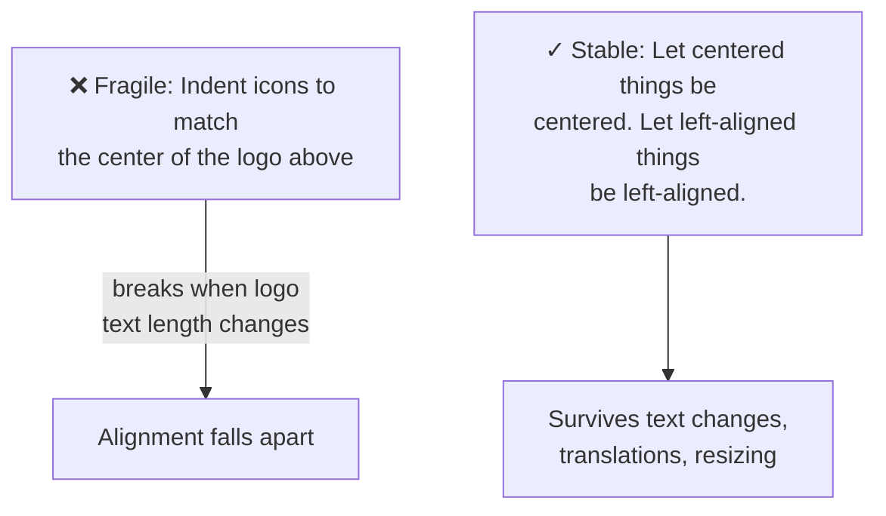
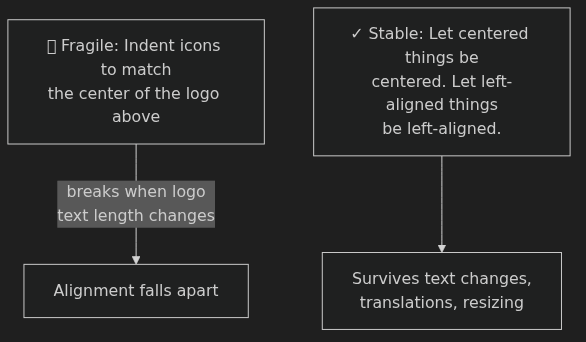
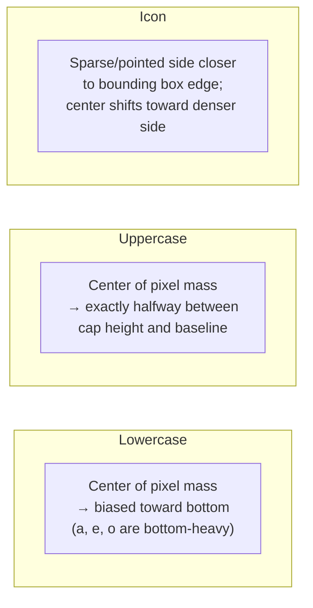
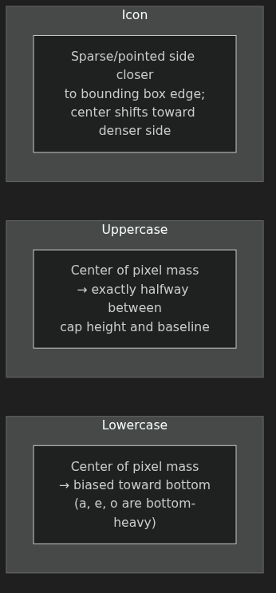
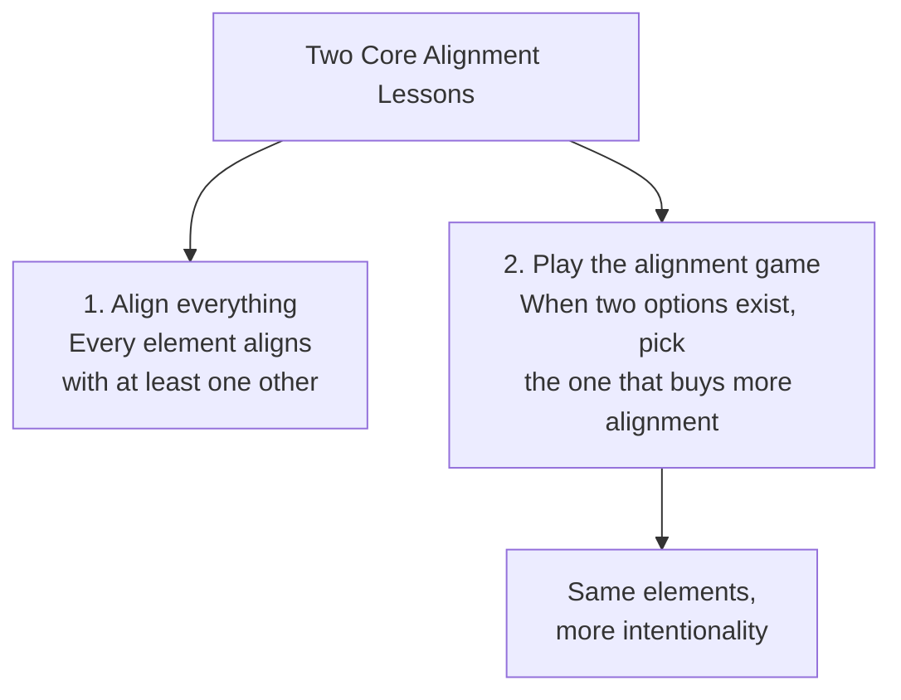
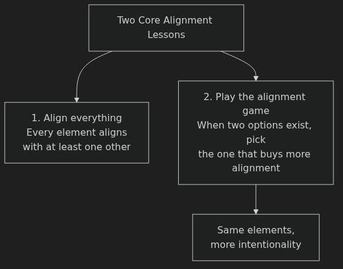

# Alignment — Anki Cards

Q: Why is alignment described as the "most underrated topic" in UI design?
A: There's plenty written about color and typography, but very little about alignment specifically (except through grids). Yet it's one of the most important factors for making an app look clean, neat, and simple.

Q: What is the "bounding box problem" with text centering?
A: Fonts don't sit vertically centered within their own bounding box — the computed center of a text frame is not the visual center of the letters. Auto-centering tools center the bounding box, not the visible letterforms.

Q: How do you fix text that's mathematically centered but looks visually off?
A: Adjust the margin manually by eye — e.g., 12 px on top, 11 px below. Unequal numbers are fine; visual balance is the goal, not numerical equality.

Q: When two text items of different sizes sit side by side, how should you align them?
A: Align them at the baseline — the invisible line the bottom of letters sits on. Works even when the two pieces of text are different sizes.

Q: What alignment scheme is fragile and should be avoided?
A: Aligning left-aligned icons to match the position of a centered logo above. It breaks whenever the logo text changes (e.g., translated to another language). Design alignment schemes that don't rely on the specific width of other elements.

Q: Why do circular elements need to extend slightly past the alignment line to look correct next to rectangles?
A: A rectangle sits fully on the alignment line along its flat edge; a circle only touches the line at one infinitesimal point — making it look smaller. Extending the circle just past the line on both sides compensates for the perceived shrinkage.

Q: The same optical correction for circles also appears in typography. How?
A: In any professionally designed font, flat letterforms (H, E) sit exactly on the baseline, while rounded letterforms (O, C) extend just below it — for the same perceptual reason.

Q: What does "center of pixel mass" mean?
A: Imagine all the filled-in pixels of a shape had physical weight. The center of pixel mass is where that weight would balance — and it's often different from the bounding-box center. Use it to align icons and mixed text that tools can't auto-center reliably.

Q: Where is the center of pixel mass for lowercase text, and why?
A: Biased toward the bottom — most of the ink is in the lower half of the cap-height range (letters like a, e, o have their bodies clustered in the lower half).

Q: Where is the center of pixel mass for uppercase text?
A: Exactly halfway between cap height and baseline — uppercase letters are evenly distributed vertically, making centering simpler and more reliable.

Q: How do you use center of pixel mass to align a custom icon next to text?
A: Place the icon so there's roughly equal "ink" above and below the text's own center of pixel mass. For an asymmetric icon, the pointed/sparse side should be closer to the bounding box boundary (less mass there), shifting the true center toward the denser side.

Q: What are "the two most important alignment lines" on a desktop layout?
A: The left and right content margin lines — the two vertical lines bounding the content on each side. Every element (search bar, title, table, buttons) should snap to these edges.

Q: What does it mean to "buy more alignment" with the same elements?
A: Look for sizing and positioning choices that create additional implicit alignment lines — e.g., sizing a number so its cap height aligns with the x-height of a nearby title. No extra elements added, but the design feels more intentional.

Q: What is x-height in typography?
A: The height of lowercase letters like x, a, e — the line most lowercase letter bodies reach up to (not counting ascenders like in h, b, d).

Q: How can you maintain attention on a button while shrinking it to align better?
A: Use other attention signals — making it the only button with an icon, or the only blue button on the page. If those signals are already doing the work, you can reduce size to gain alignment.

Q: When is intentionally breaking alignment a valid strategy?
A: When you want to attract maximum attention to an element. A floating action button (FAB) deliberately breaks alignment with the rest of the page so it stands out — if it were aligned with the table, it might look like part of it.

Q: What is hanging punctuation, and what are its modern design equivalents?
A: The centuries-old typographic tradition of placing characters (like opening quotes or parentheses) slightly outside the main alignment edge so the text body has a strong visual alignment line. Modern equivalents: bullet points hanging into the margin, icons hanging to the left of body text.

Q: Why is a column header placed above the text of a cell rather than above the entire cell (including thumbnail)?
A: This follows the hanging punctuation principle — placing the header above the text preserves the strong textual alignment edge. The thumbnail "hangs" off to the left, just like hanging punctuation hangs into the margin.

Q: When aligning content to a padded table, should you align to the outer edge or the inner edge?
A: Whichever reads as the stronger visual line. If the outer border is crisp (hard white background + shadow), align to the outer edge. If the border is subtle or semi-transparent, align to the inner edge (where the data actually starts), as that reads stronger.

Q: Why does large text appear to have more left indent than smaller text on the same alignment edge?
A: Larger type has proportionally larger sidebearing — the blank space embedded in the font around each character. As letterforms grow, the surrounding space grows too, so the visible stroke starts further from the alignment edge.

Q: What are the standard outer margins for mobile layouts (Android and iOS)?
A: 16 px on both the left and right sides.

Q: How do you calculate the width of bottom navigation tabs on mobile?
A: Divide the full screen width by the number of tabs. For 5 tabs on a 375 px frame: 375 ÷ 5 = 75 px each. Set each container to exactly that width, distribute horizontally with zero spacing, then center icon and label within each tab.

Q: What's the optical illusion with vertical centering in large spaces, and how do you correct for it?
A: Mathematically centered content often looks slightly too low. Bias the element slightly upward — even 1 px toward the top makes it feel properly centered.

Q: What are the two core lessons from this alignment lesson?
A: 1. Align everything — every element should align with at least one other element. 2. Play the alignment game — when choosing between two options, pick whichever buys more feel of alignment with the same elements.

Q: You're designing a sidebar where icons are 24 px tall. How do you ensure icons and their text labels align row-for-row?
A: Add icon size + spacing: 24 px icon + 20 px gap = 44 px row height. Set the text's line height to the same value. Icons and labels share the same vertical rhythm.

Q: You're grouping a "Filter" and "Sort" button in a mobile layout. Neither individually aligns with anything. Is this acceptable?
A: Yes — if the buttons are flush with each other, they function as a group. The group as a whole shares an alignment anchor; individual buttons within the group don't need to align independently.

Q: You're centering a logo in a sidebar and the tool says it's centered, but it looks slightly too high. What's happening and what do you do?
A: Bounding box problem — the tool centered the text frame, not the visible letterforms. Adjust manually by eye until it looks visually balanced, even if the pixel values are unequal.

Q: A hover-state dropdown button extends past the page's right margin. What's a cleaner solution than fighting the alignment?
A: Make the button permanently visible rather than hover-only. This eliminates the alignment conundrum entirely and also improves discoverability.
