# Alignment

## Why Alignment Matters

> "Alignment is one of the most important topics in user interface design. And that's why we are starting with it in this fundamentals unit."

> "Alignment is also — if I had to say — probably the most underrated topic in UI design. There are plenty of things written about color and typography, but very little written about alignment, except through grids, which we'll cover later as sort of a special case."

Alignment is critical for making any app appear **clean, neat, and simple**. Even if your brand is more expressive, you'll still spend a significant amount of time thinking about how to align elements to achieve the maximum feeling of cleanness and neatness.

---

## The Sample App: Desktop Version

The lesson works through a real-world **data table application** (called "Alignment Co.") — the kind of data-heavy app you'd routinely encounter working for clients or a day job. Elements are pasted on scattershot to start; the lesson progressively aligns them and explains edge cases along the way.

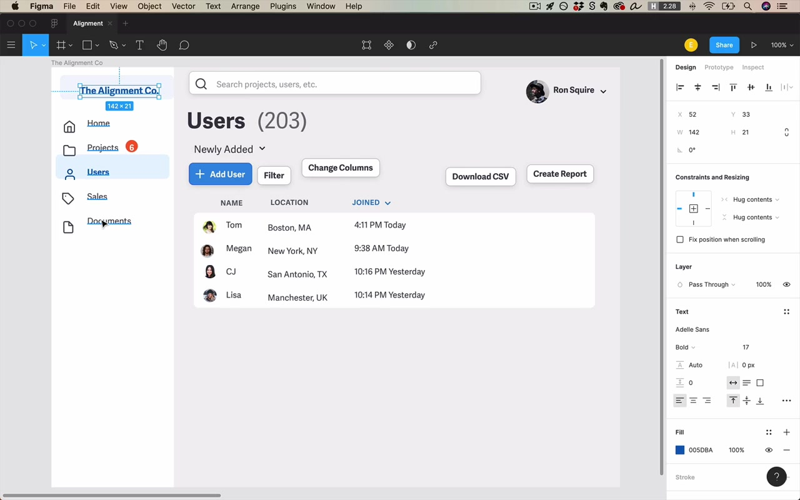

---

## Sidebar Alignment

### Centering within a container

The sidebar logo box is centered horizontally using Figma's **Option+H** (horizontal center) and **Option+V** (vertical center) within its container. Even spacing of **8 pixels on every side** is set first.

### The bounding box problem with text

> "This program is naively centering by the bounding box of the text. And yet, if you look, the text is not really centered inside of its own bounding box."

Many fonts — including Adelle Sans — don't sit vertically centered within their own bounding box. The computed center of a text frame is not the visual center of the letters. When you auto-center text using a tool shortcut, the result may look slightly too high or too low.

**Fix:** Adjust the margin manually by eye. In the lesson, the ideal result was **12 pixels on top, 11 pixels below** — not perfectly equal, but visually balanced.

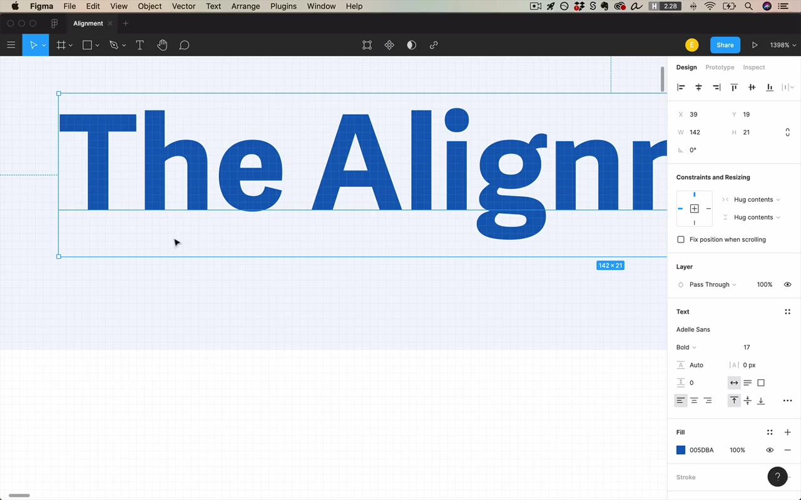

> "If we wanted to really be careful about things, we might specify that actually this should be a little bit lower."

If you just need to ship it, CSS centering will behave the same way, so ignoring it is acceptable. But if you're being precise, you need to nudge it manually.

### Side nav icons and text

- Left-align all icons using **Control+Command+Left** with a consistent margin (e.g., 16 px)
- Use **distribute vertical spacing** to ensure even gaps between items
- Determine row height by adding icon size (24 px) + spacing (20 px) = **44 px per row** — the same as the text's line height, so icons and labels align row-for-row

### Baseline alignment for mixed text sizes

When two pieces of text sit side by side (e.g., "Projects" and the count "6"), **align them at the baseline**. This works even when the two text items are different sizes.

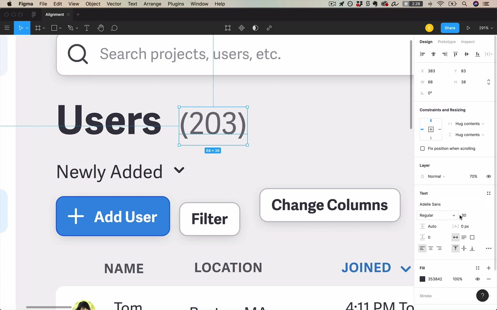

> "Figma, as it's currently implemented, has text shrink from the top, not the baseline. So I need to reposition it, but it's overall not a big deal."

### Warning: don't align centered content with left-aligned content

> "Beware because one common impulse among beginning designers is to try and align content that is centered with content that is say left-aligned."

Specifically, don't indent icons to align with a centered logo above. This creates a fragile alignment that breaks whenever the logo text changes.

**Principle:** Design alignment schemes that don't rely on the specific widths of other elements. If you translated all text to another language, you shouldn't have to change any alignment values. Let centered things be centered; let left-aligned things be left-aligned.

---

## Main Body — Search Bar and Header Area

### Matching element heights for alignment

The search bar height was adjusted from 42 px to 44 px to match an adjacent sidebar element — enabling perfect alignment between the two.

### Circle vs. rectangle edge alignment

When aligning a **circular element** (e.g., a profile photo) with a **rectangular element**, there's a fundamental optical mismatch:

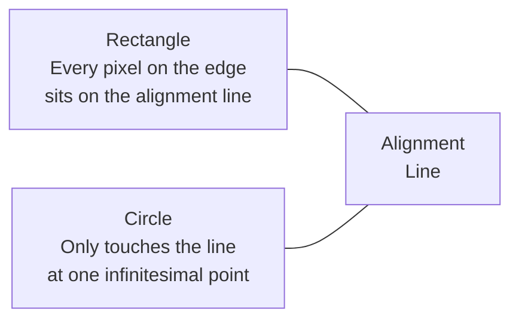

The circle can look slightly smaller than intended. The accepted practice in design is to **make the circle slightly larger** so it extends just past the alignment line on both sides — compensating for the perceived shrinkage.

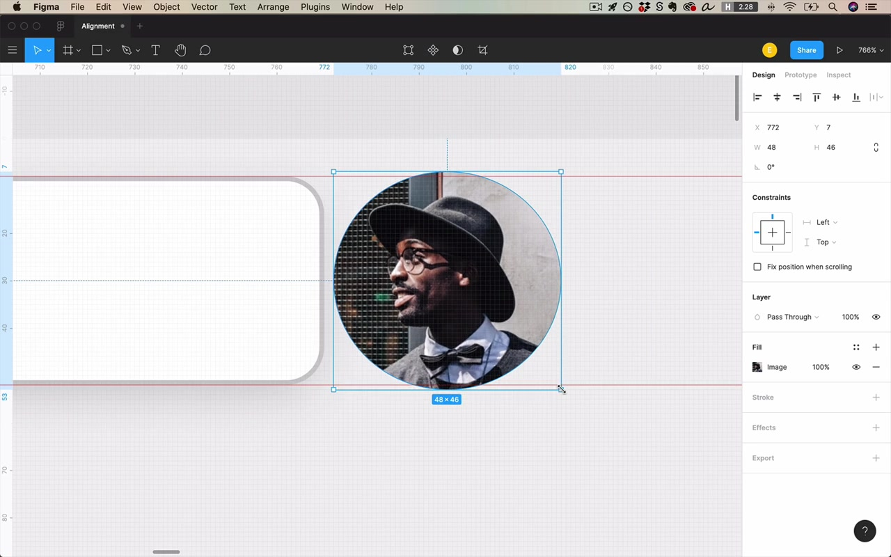

> "It's an accepted practice in design to make the circle a little bit bigger so that it actually goes past the line of alignment on both sides."

This same phenomenon appears in typography: in any professionally designed font, **flat letterforms** (like H, E) sit exactly on the baseline, while **rounded letterforms** (like O, C) extend just below it — same reason.

### Center of pixel mass

When aligning a **custom-drawn icon** with text — where the bounding box isn't a reliable guide — use the strategy the instructor calls **center of pixel mass**.

> "You wanna use a strategy that I call center of pixel mass."

Concept: imagine all the filled-in pixels of a shape had physical weight. Where would the center of mass be?

- For lowercase text: the center of pixel mass is biased **toward the bottom**, because most of the ink is in the lower half of the cap-height range (e.g., letters like a, e, o are bottom-heavy)
- For an icon with elements jutting upward, the center of pixel mass is biased **toward the top**
- For uppercase text: the center of pixel mass is **truly halfway** between the cap height and the baseline — uppercase centering is simpler

**In practice:** place the icon where there appears to be roughly equal "ink" above and below the text's own center of pixel mass.

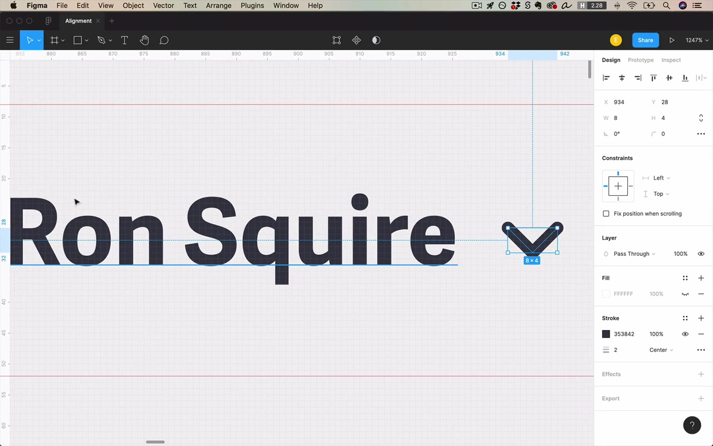

> "Those who know physics know that I'm butchering this a little bit."

### Left and right content margins

> "These two vertical lines that bound the content of the page on the left and the right hand side might be two of the most important lines of alignment that we're gonna do on this project."

For this desktop app, a **40 px margin** was chosen on both left and right sides. Every content element — the search bar, page title, table, buttons — should snap to these edges.

Also important: decide from the start how the layout responds to different screen sizes. Does the margin grow? Does the content? Does the content stay centered? (Full treatment in the responsive design lesson.)

### Hover states and the alignment conundrum

> "This is an interesting issue that responsive design strikes only when we're doing digital design. This is not something that people designing posters or flyers have to worry about."

A user profile button that triggers a dropdown creates a layout problem: if the hover state extends past the icon, it breaks the page's right alignment line. If the hover state sits exactly at the right margin, the non-hovered state looks awkward.

**Solution considered:** Make the button permanently visible (not just on hover), which eliminates the problem entirely and also improves discoverability.

---

## Title Area and Typography Fine Points

### "Buying" more alignment

> "One thing I want you to get the sense of as you go through your own projects is trying to buy yourself more feel of alignment using the same elements."

Example: aligning the **cap height** of a large number ("203") with the **x-height** of a nearby title word ("Users"). This wasn't required, but choosing this sizing relationship creates an additional implicit alignment line — making the design feel more intentional with no extra elements.

**X-height** is the height of lowercase letters like x, a, e — the line most lowercase letter bodies reach up to. Aligning something's cap height to this level creates a subtle but real visual harmony.

### Big "Add Users" button — alignment vs. emphasis trade-off

The "Add Users" button was initially oversized (to draw attention). But it already had two other attention signals: it was the **only button with an icon** and the **only blue button** on the page.

> "If I can make up for needing to attract attention using color and an icon, that actually allows me to buy myself a little bit more alignment by shrinking this down to size with the other elements right here. And in my opinion, that is clearly the way to go."

### Breaking alignment intentionally — the floating action button

> "Breaking alignment to attract attention is totally a valid strategy."

A **floating action button (FAB)** — Google's circular button for primary actions — deliberately breaks alignment with the rest of the page. If it were aligned with the table, it might look like part of the table.

> "By Google's own admission, you really should break alignment with the rest of the page so that it attracts the most attention."

FABs are typically anchored to the bottom of the screen, positioned so they don't align with any other element.

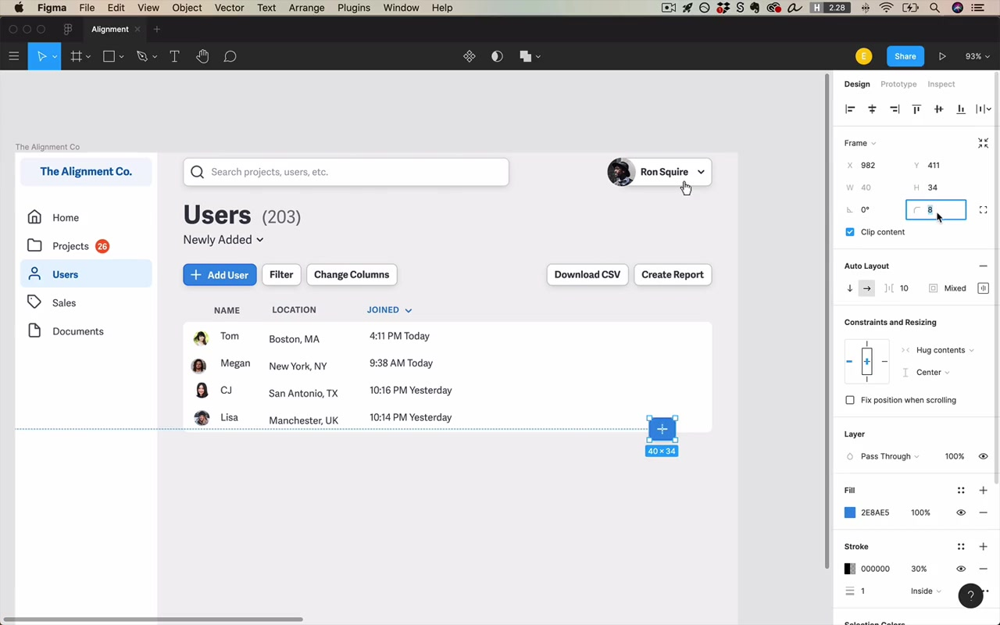

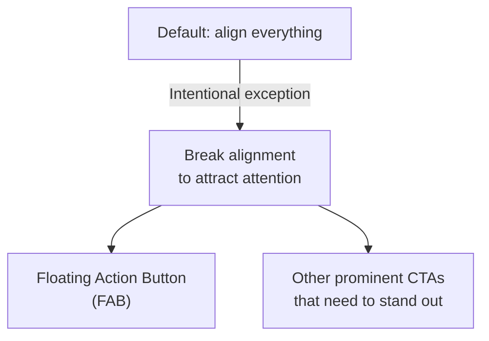

---

## Table Alignment

### Column header alignment — hanging elements

The "Name" column header is placed above the **text** of the name column, not above the thumbnail image — even though the image is part of the same cell.

This follows the centuries-old typographic tradition of **hanging punctuation**: placing a character slightly outside the main alignment edge so the strong textual alignment line is preserved.

> "Hanging punctuation is the centuries-old typographical tradition of taking punctuation characters like openings of quotes and parentheses, and hanging them into the left margin so that your text has as strong a sense of alignment as possible."

Modern equivalents:
- Bullet points hanging into the margin
- Icons hanging off to the left (e.g., Charity Water's icon layout, where icons hang left of the body text rather than sitting above it)

> "So they didn't align this icon with the text below it, but instead have the icon hanging off into the left margin."

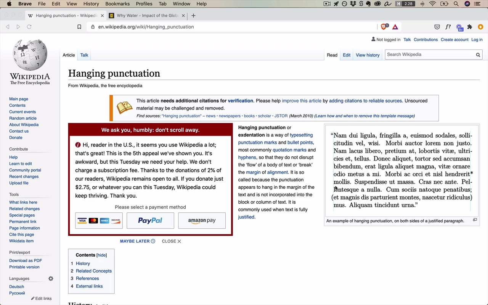

### Centering uppercase text with an icon

For uppercase-only text, the center of pixel mass is exactly halfway between cap height and baseline — a reliable centering anchor. When aligning a non-square icon next to it, apply the same center-of-pixel-mass thinking: the **pointed side** of an asymmetric icon should be closer to the bounding box boundary (because the pointed side has less visual mass, so the true center of mass lies closer to the denser side).

### Padded elements: aligning to the outer or inner edge?

When an element like a table has internal padding (space between the outer border and the first column of data), you have a choice:

- Align to the **outer edge** of the table
- Align to the **inner edge** (where the data actually starts)

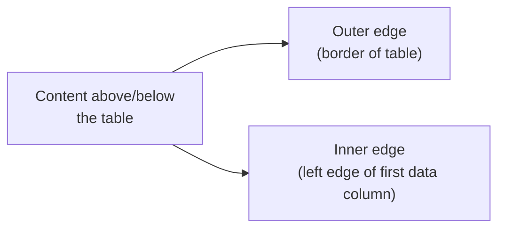

The inner edge often **appears stronger** as a line of alignment — it's where the images and text actually sit, and the eye is drawn there.

**Best strategy:** If the outer border of the padded element is visually crisp (hard white background + shadow), align to the outer edge. If the border is subtle or semi-transparent, align to the inner edge (the first column of data), as that will read as the stronger line.

> "The best strategy here is to align to the outside if that's what feels like the strongest line of alignment."

Adding a **shadow and hard white background** to the table makes the outer edge much crisper and more alignable.

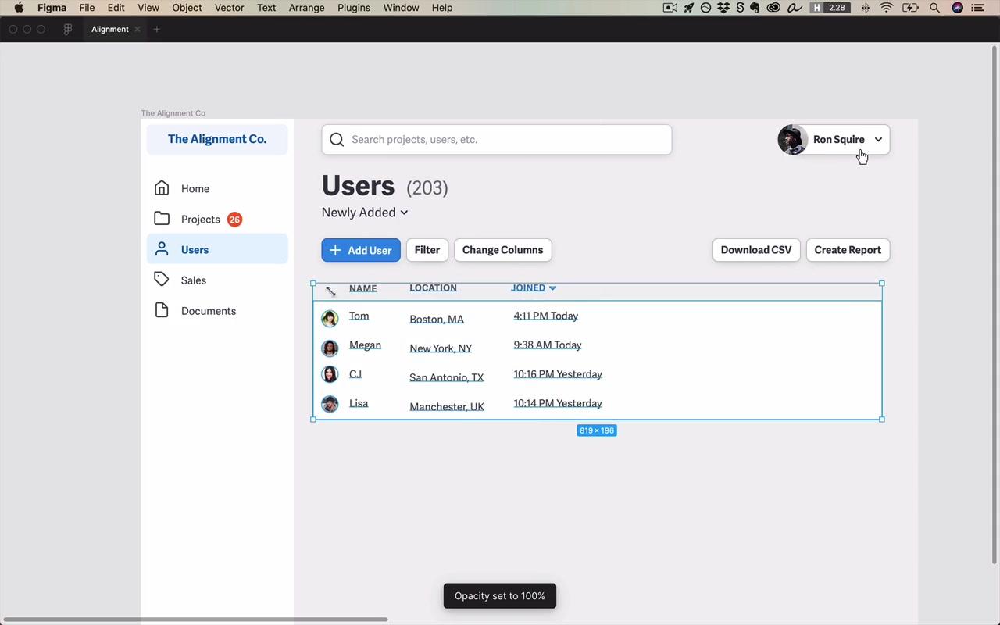

### Large text and sidebearing space

When a large headline sits above smaller body text and both are left-aligned:

> "As the letter forms grow, the space around the letter forms grows as well."

There will appear to be more left indent before the larger text's visible letterform — because larger type has proportionally larger sidebearing (the blank space embedded in the font around each character).

You can offset this by nudging the large headline slightly to the left of the common alignment edge, so the first visible stroke of the letter aligns with the smaller text. This is a fine typographic detail — not done universally, but occasionally used on polished designs.

---

## Mobile Version

### Standard margins

Both Android and iOS guidelines specify **16 px outer margins** on all sides. Place ruler guides at exactly 16 px from the left and 16 px from the right edge (for a 375 px frame, that means the right ruler at 359 px). Align as much content as possible to these guides.

> "What I like to do is always put on a ruler at 16 pixels from the left edge and 16 pixels from the right edge."

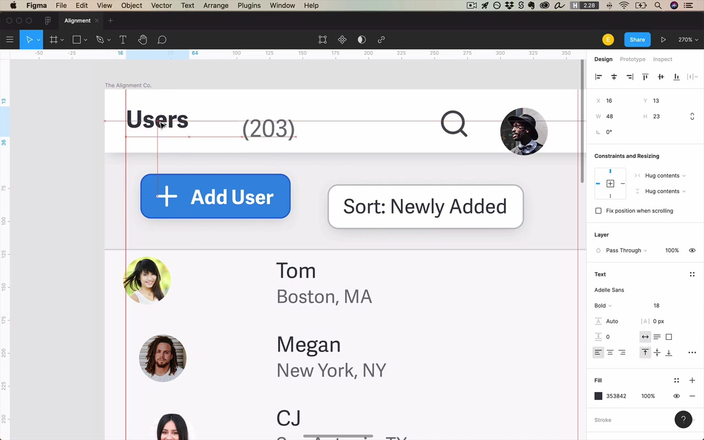

### Grouping buttons for alignment

Grouped buttons can share a single alignment anchor:

> "For the sake of thinking about things being aligned left, these two buttons function as one group, and that's no problem."

One button in a group might not align with anything on the rest of the page — but if it's flush with the button next to it, and that button is aligned, the group as a whole reads as aligned.

### Bottom navigation tabs

Standard mobile bottom navigation: divide the full screen width evenly by the number of tabs. For 5 tabs on a 375 px frame: **375 ÷ 5 = 75 px each**. Set each tab container to exactly 75 px wide, distribute horizontally with zero spacing, then center-align icon and label within each tab.

### Vertical centering — bias slightly high

> "A lot of times when you have the choice of centering something in a larger space, you should default or bias towards having it just be a little bit higher than lower."

When there's a large vertical space and you're centering content (common on mobile onboarding or splash screens), perfectly mathematical centering will often look slightly too low to most people. The fix: bias the element slightly upward.

> "I don't know what weird optical illusion this is. But a lot of times when you have the choice of centering something in a larger space, you should default or bias towards having it just be a little bit higher than lower."

> "A lot of times if I have to make a choice between being like just a pixel high or a pixel low, I will almost always default in direction of going one pixel up from what might otherwise be perfectly centered."

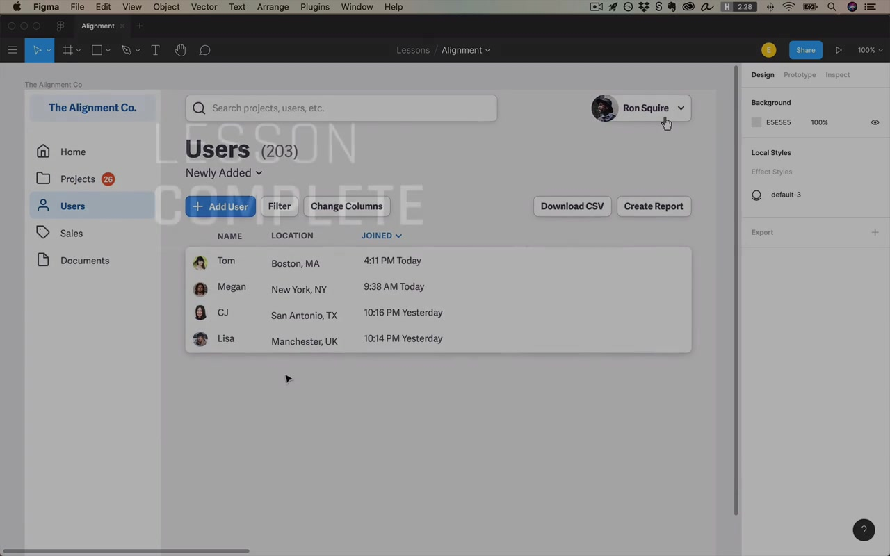

---

## Summary: Two Core Lessons

> "If I had to drive home the two most important lessons from this video, I would say: first of all, just align everything."

1. **Align everything.** Every element on the page should be aligned with another element. Centering something within its parent container counts. It doesn't have to be hard — most alignment decisions are clear. Nothing should be floating in space.

2. **Play the alignment game.** When you have two ways to style something, look for which version buys you just a little more feel of alignment — even with the same elements.

> "Oftentimes, little details like that are the things that can bring a design from good to great."
