# Spacing — Anki Cards

Q: What makes white space unique among all design elements?
A: It's the only thing you can add that doesn't clutter — "It's the only thing that can communicate without cluttering." Every other element, even a 1px divider, adds visual noise.

Q: What are the four laws of spacing?
A: 1) Use white space to separate without cluttering; 2) Use white space to highlight focal points; 3) External spacing > internal spacing; 4) Double your white space.

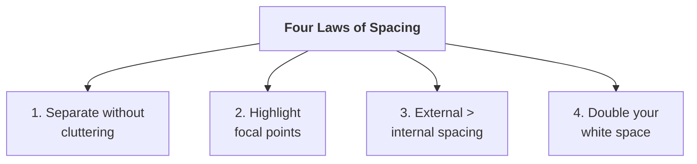
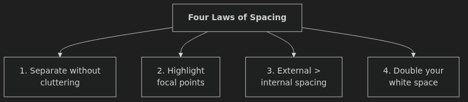
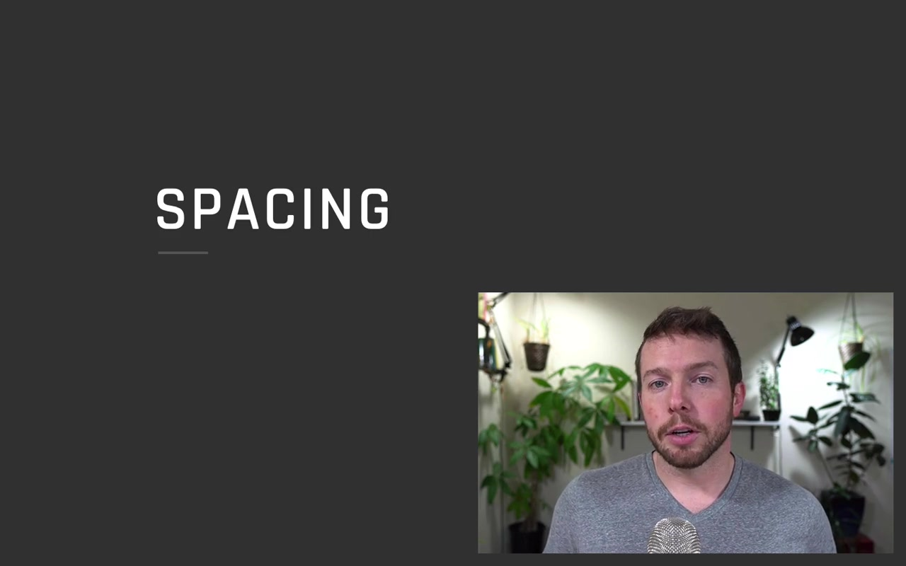

Q: How does white space as a separator compare to borders, background changes, and shadow?
A: It achieves the same visual grouping — but adds zero elements to the screen. "Can I use spacing instead of a line? Can I use white space instead of a background color change?"
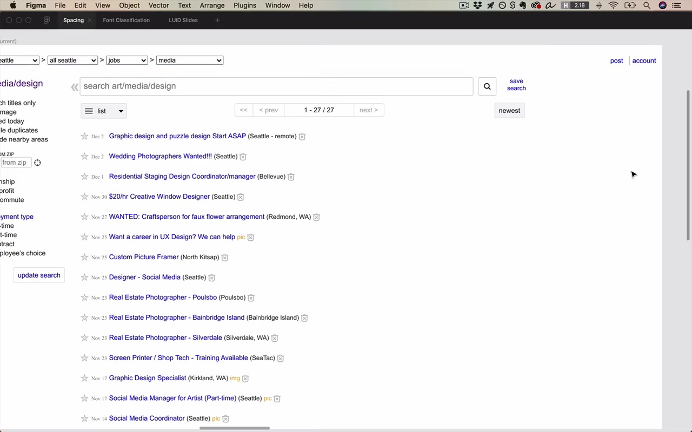

Q: How do you create a focal point using only white space?
A: Give the element generous space on all sides. In a clean, uncluttered design, surrounding space pulls the eye without needing color or size.
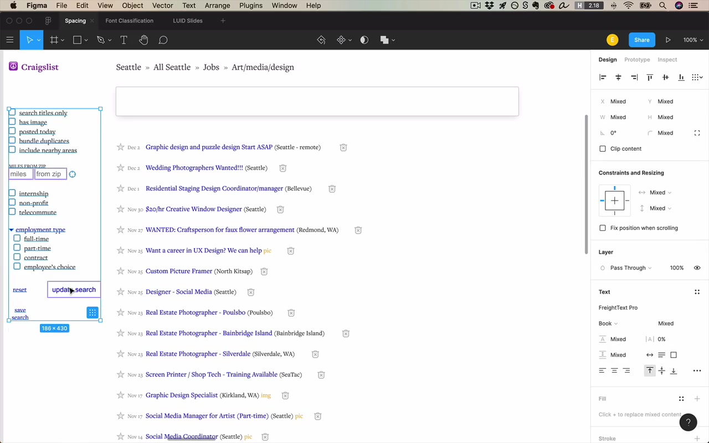

Q: State Law 3 precisely, including the recursive implication.
A: Space around a group (external) is always greater than space between elements inside it (internal). This holds at every level of the hierarchy — "you can go kind of up and down the ladder of groupings and always find internal < external."

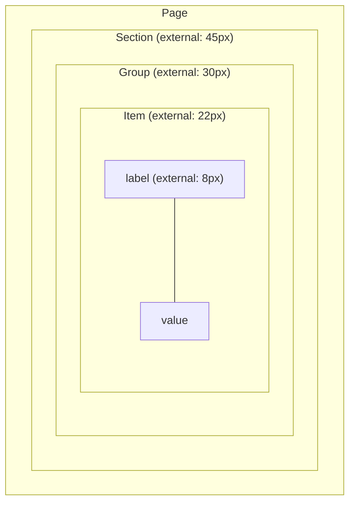
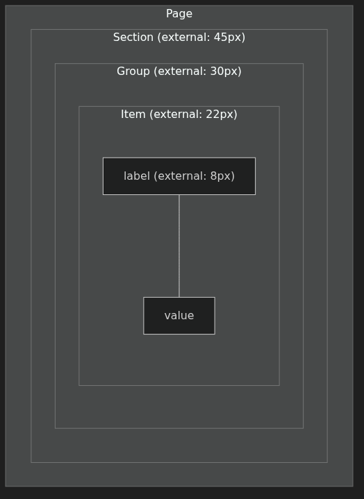

Q: Fill in: "In really good designs, you're just going to be able to go ___ and ___ the ladder of groupings and always find that your internal spacing is less than your external spacing."
A: "Up and down." The rule applies recursively — from a checkbox+label pair all the way up to major page sections.

Q: Why do beginners consistently use too little white space?
A: "Double your white space" — professional designs have far more space than feels reasonable. Use the fail-left / fail-right method: find definitely too little, find definitely too much, then pick between them, leaning toward more.

Q: What is the designer's mindset shift for thinking about white space?
A: "Start from a blank piece of paper, and then you're adding in elements one at a time" — every element you add is taking away white space strategically. Not: add space in "reasonable" amounts after placing elements.

Q: What problem do side margins solve in text layout, and what line length should you target?
A: Without margins, line length is unbounded — text stretches to any screen width. Target roughly 50–75 characters per line (two to three alphabets).

Q: What are the three benefits of adding side margins to body text?
A: 1) Easier to read (optimal line length); 2) Breathing room; 3) Feels non-default — signals care was taken.
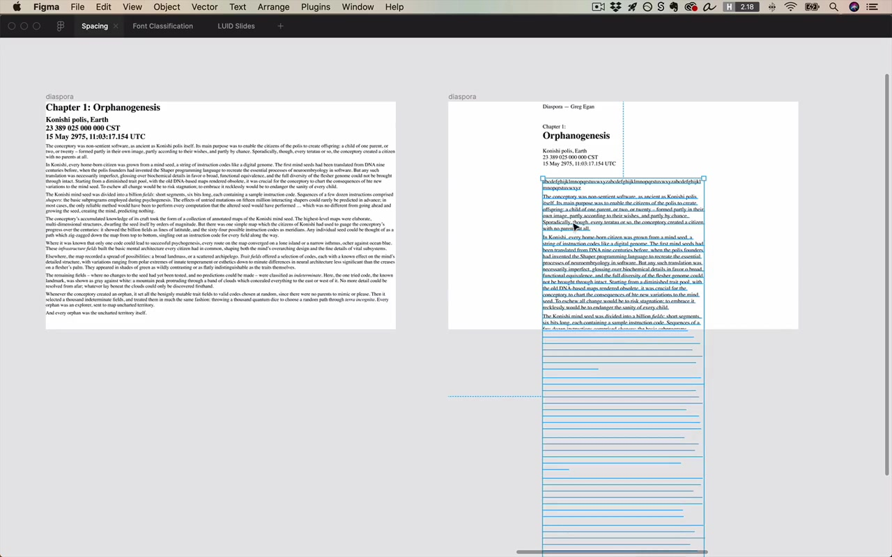

Q: What does the right line height depend on — and why isn't "140%" a universal answer?
A: Both the font AND the line length. Short titles (few chars per line) can be tight — easy to track. Long body text needs more line height because the eye travels farther. The rule is a guideline, not a law.

Q: How does paragraph spacing relate to Law 3?
A: Line height (internal spacing within a paragraph) should be less than paragraph spacing (external spacing between paragraphs) — so the break reads as more emphatic than a line wrap.

Q: What is the default rule for letter spacing (tracking)?
A: Leave it alone. Adding letter spacing to sentence-case text is "a very common beginner mistake" — it looks too loose and obnoxious as your gut instinct matures.

Q: When is it acceptable to add letter spacing?
A: For UPPERCASE labels — you're using the font outside its intended case, so positive tracking is acceptable and can look crisp (e.g., "CHAPTER ONE", "SEARCH RESULTS").

Q: When might you remove letter spacing?
A: For very large grotesque display headlines — to make them feel tight and neat.

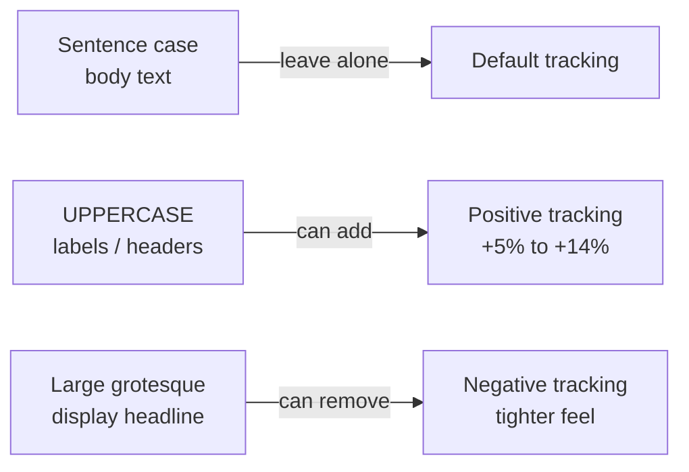
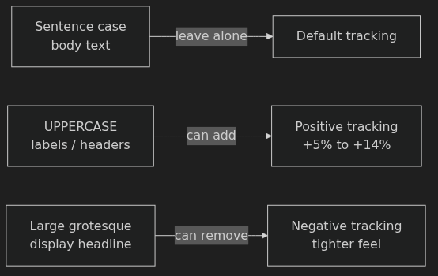

Q: What is the SLUB pattern, and when do you use it?
A: Smaller, Lighter, Uppercase, Bold — a label style for section headers like "SEARCH RESULTS (21)". "A lot of really good designers use [it] way more frequently than you might imagine."

Q: White space alone didn't fully make the Craigslist search bar stand out — what completed it?
A: Combining white space with a very light background color change (96% brightness on the page, white on the search bar). "It's when you use them in combination with white space that they become so powerful."

Q: What should you do when a client says "I have too much data to use white space"?
A: You can still include more than expected — dense data pages can have generous padding. And when you're forced to reduce spacing, the other fundamentals (alignment, consistency) become MORE important to compensate.

Q: How do mobile spacing principles differ from desktop?
A: Same four laws apply. But Law 4 (double your white space) is often impossible due to limited room — Law 3 (internal < external) dominates instead. Standard side margins: 16px on both iOS and Android.

Q: You're redesigning a nav where every element is wrapped in a border. What's the first thing you'd try?
A: Replace the borders with white space — use spacing to communicate the same groupings with no added visual elements. Test whether "spacing instead of a line" achieves the same separation.

Q: You're spacing a form with checkboxes. How do Laws 3 constrain the checkbox–label gap?
A: The checkbox–label gap (internal to the pair) must be less than the gap between checkbox rows (external). If the internal gap exceeds the row gap, the label looks like it belongs to the row below — hierarchy breaks.

Q: Your instinct says 40px above a landing page headline feels right. What does Law 4 tell you?
A: Test something much larger — professional landing pages routinely use 100–200px above headlines. What feels "reasonable" to a developer is about half what a designer would use.

Q: You've tightened spacing throughout a mobile design to fit more content. What becomes critically important as a result?
A: Alignment and consistency — when you can't rely on generous spacing to create order, the other fundamentals must do more of the work.

Q: In the Craigslist redesign, name at least three types of separators that were replaced or reduced using white space.
A: Header background color change, dropdown borders (replaced with plain text + guillemets), and bottom-of-header divider line — all replaced with spacing and margins.
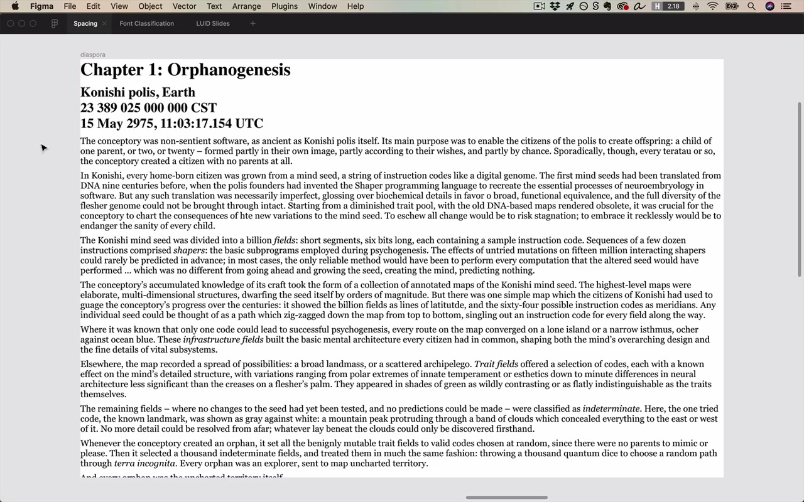
