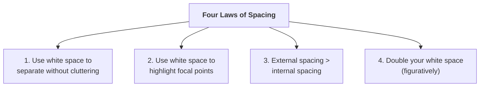
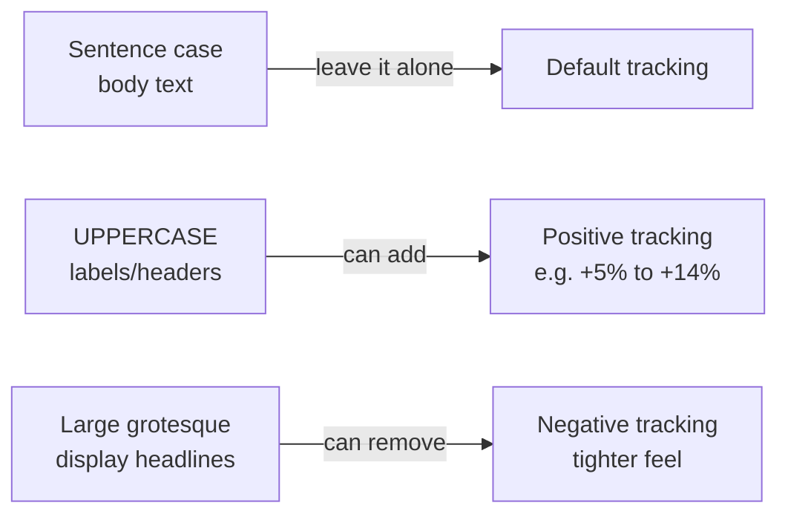

# Spacing

**Unit:** 02 – Fundamentals of UI Design
**Lesson:** 03 – Spacing

---

Spacing is one of the most fundamental and important skills you can develop as a designer. It applies to every project — web apps, mobile apps, any brand, any platform. You will be using white space in basically everything you ever design.

The overarching theme the instructor wants you to walk away with:

> "White space is a really special element, if you can call it an element. Because it's the only thing that you will ever add to your design that doesn't clutter it in some way."

Every other thing you add — even the smallest, lightest one-pixel divider line — adds some visual distractingness. White space does not. And yet you can communicate with it: you can use it to show what things are related, to show what things are important.

> "It's the only thing that can communicate without cluttering."

---

## [1:48] The four laws of spacing

These are introduced up front so you have a mental model before the examples.

### Use whitespace to separate without cluttering

Borders, background color changes, shadows, and cards are all separators. White space is also a separator — but unlike those others, it adds nothing visual to the screen. Anytime you're trying to make a design look neater and cleaner:

> "Can I use spacing instead of a line? Can I use white space instead of a background color change?"

### Use whitespace to highlight focal points

You can draw attention by making something big or colorful, but a subtler option is to give it a lot of space around it. Especially in clean, uncluttered designs, generous spacing around a key element is one of the go-to ways to create a focal point.

### External spacing > internal spacing

Whenever you have a group of logically related elements, the spacing *around* that group should be greater than the spacing *between* elements inside it. This rule applies recursively — you can traverse the hierarchy of groups and always find the pattern holding.

> "In really good designs, you're just going to be able to go kind of up and down the ladder of groupings and always find that your internal spacing is less than your external spacing."

### Double your whitespace

> "I only mean this figuratively, but double your white space."

Beginning designers — including the instructor himself — consistently use less white space than professional designs call for. Many great designs, if you actually measure them, have far more space than you'd ever have guessed. The "fail left, fail right" method applies here: find what looks like definitely too little, find what looks like definitely too much, and pick somewhere in between — knowing you should lean toward more.

---

**Aside — "white" space vs. spacing:**

> "I use the terms white space and spacing interchangeably. It doesn't have to be white. This could be a dark UI with white text, and I would still call the empty pixels — dark, black, or whatever it is — spacing or white space. It's just a matter of semantics."

---

## [3:34] Craigslist app example

Craigslist gets a bad rap among visual designers because it's so unstyled. The instructor does a visual touch-up exercise, primarily using white space principles (plus some alignment from the previous lesson). Important caveat:

> "I want to be clear, this is very much a demo. Craigslist has made the design choices that it has for very specific reasons... Even their logo is the letters C and L in plain Arial [to load quickly]."

So we're throwing out their business constraints for the sake of this educational exercise — using custom fonts, adjusting spacing freely, etc.

---

## [4:42] Separators in the current header

The original Craigslist header uses multiple separator mechanisms:

- **Background color change** — the header is brightness 93 (light gray), the body is brightness 100 (white). This communicates "header = one logical group, content = another."
- **Borders** — the dropdown controls have a dark gray border around them, saying the inside is one logical group (the dropdown) and the outside is the rest of the page.
- **Divider lines** — e.g., the bottom of the header, the search bar border.

The point: all three of those techniques do the same thing that *white space alone* could do — but they add visual elements to the screen. The exercise is to see how many can be replaced with spacing.

**Removing the header background:** Deleting the gray header background and instead using spacing (moving elements down, adding symmetric top/bottom margins) creates the same separation:

> "And sure enough, that looks cleaner."

**Removing borders from the breadcrumbs:** Removing the borders from the dropdown breadcrumbs and replacing with plain text (with a guillemets `»` separator instead of a caret), slightly darker font color at 60% opacity for the separator, and Freight Text as the font. This cleans up the nav considerably.

**Internal vs. external — breadcrumbs example:**

The breadcrumbs are one group. The spacing *between* each breadcrumb element: 8px. The spacing between the breadcrumbs group and the next element below: 23px. Law 3 in action.

> "I'll mention this a whole bunch in this video. It's super important, and if you don't find yourself doing it automatically you should definitely be saying to yourself: internal spacing is less than external spacing."

---

## [13:19] Making the search bar a focal point using whitespace

After removing clutter (sidebar collapse button, greyed-out pagination, sort controls, view toggle), the search bar now has generous space around it on all four sides (~18px on three sides). Result:

> "I want you to observe just how much the space around this search bar kind of draws attention to it."

The search bar and the results list are the two most important elements on a Craigslist job search page — anyone who arrives is either going to skim the list or type a keyword. Making the search bar naturally visible via spacing is the correct design decision.

Search bar internals: the icon and hint text are one sub-group. The spacing *between* the icon and text (internal) is *less* than the 18px spacing between the group and the search bar border (external). Law 3 again.

> "This is just one example of internal spacing being less than external spacing."

**Combining separators:** White space is preferred, but that doesn't mean it's the only tool:

> "Just because white space is kind of this preferred, almost exceptional means of separating elements does not mean it's the only one that you can use... it's when you use them in combination with white space that they become so powerful."

For the search bar: the border alone (without white space) doesn't make it stand out enough. Adding a very light background color change (96% brightness on the page, white for the search bar) makes it pop dramatically more.

---

## [18:24] Using alignment in the results columns

The original results list jams date, title, location, and icons all on one line with only 5px between elements. The redesign:

1. Separates date, title, and location into distinct columns with 32px between them
2. Makes locations scannable
3. Uses hover-only reveal for star/trash controls (cleans desktop view; note: would need a solution for mobile accessibility)
4. Adds a "SEARCH RESULTS (21)" label above the list using the **SLUB pattern** — *S*maller, *L*ighter, *U*ppercase, *B*old.

> "It's something that a lot of really good designers use way more frequently than you might imagine."

---

## [23:53] Internal spacing vs. external spacing in the sidebar

The filters sidebar demonstrates Law 3 recursively across multiple levels of grouping:

- Spacing between a checkbox and its own label: ~8px (internal to the checkbox+label group)
- Spacing between checkbox rows: ~25px line height (internal to the filter group)
- Spacing between related filter sub-groups (e.g., "Internship / Non-profit / Remote"): paragraph spacing via Shift+Enter in Figma
- Spacing between the "FILTER" label and its group: 10px
- Spacing between the filter section and the search bar section above: 30px
- Spacing between the filters and the "Miles from Zip" section: greater than any of the above

**Key rule:** When adding space between a checkbox and its label, be careful not to add *so much* that it exceeds the space between that checkbox group and the next group. The label–group relationship is the external boundary.

In really good designs, you can traverse up and down the ladder of groupings and always find internal < external at every level.

> "And all of a sudden I am looking at a much better version of this same app when we zoom out and look at the before and after. It's just a total world of difference here."

---

## [33:37] Text example (Diaspora by Greg Egan)

The instructor uses an excerpt from Greg Egan's sci-fi novel *Diaspora* — an unstyled HTML page — to show how far pure white space can take you before adding any fonts.

He describes the developer mindset he had to unlearn:

> "When I created my first web projects, I would think: okay, I'm going to add in some margins here... 20 pixels? 20 sounds pretty reasonable. 30 pixels on top, 30 pixels on the side... That mindset is not useful for design."

The designer's mindset instead:

> "For design, I think it's much better to almost feel like you're starting from a blank piece of paper, and then you're adding in elements one at a time... I start to think about every element that I add being taking away white space strategically rather than white space being something that's added one line of code at a time in quote-unquote reasonable amounts."

> "Listen, every bit of white space that we add, along with all these other elements — they need to solve problems. Because design is not art. Design is solving a problem, very often a business problem."

---

## [35:26] Side margin spacing

Adding left and right margins solves a specific problem:

> "The problem is these line lengths will just go to infinity. They're completely unbounded. If you had a monitor that was 10,000 pixels wide, you would have text that would go all 10,000 of those pixels."

The solution: constrain the text box to roughly 50–75 characters per line (two to three alphabets). At 18px, 530px width works. Group the content, center it horizontally (option+H in Figma), ungroup.

Benefits of adding side margins:
1. Easier to read (good line length)
2. The margins add breathing room
3. It just feels non-default — like care was taken

> "We went from a totally default webpage that makes you think you're seeing some technical website that's been up since 1995 to seeing something that a little more care was put into — not much, but just a tiny bit."

---

## [40:50] Headers, sub-headers, and text

Space above the chapter heading solves the "this is a focal point" problem (Law 2). Using fail-left / fail-right:

- Too little: 10px looks like no CSS was written at all
- Too much: starting halfway down the page would look like a missing image
- Landing around 88px works for this design

The heading group shows Law 3 at every level of hierarchy:

- Internal spacing between the label ("CHAPTER ONE:") and chapter name: 0px — they're the smallest group
- Internal spacing between chapter name and setting metadata: 22px — still within the heading group
- Spacing from heading group to body text: 38px — external to the heading group
- Spacing between the book nav and the heading: 45px — even more external

> "I have gotten to the point where I'm naturally going to start thinking what kind of belongs near one thing or the other."

**Fonts chosen for the sci-fi theme:**
- **Carbon** (monospace) for metadata/nav — sci-fi feeling; numbers line up; crisper uppercase
- **Abolition** for the chapter title — geometric, angular, uppercase-only
- **Noticia Text** (Google Fonts) for body — a serif that's readable for long-form but with slightly squared-off letter forms that complement the geometric display fonts

> "Font sizes and the actual real data that they apply to is like one of those chicken and egg problems in design where you should never fully finally commit to one before you've seen the other. Even then they'll continue to inform each other. And the work of design just never ends."

---

## [50:50] Line spacing

**Problem it solves:** Your eyes need to track from the end of one line to the beginning of the next.

- Test: just read a paragraph and see if tracking feels easy
- Common rule you'll see: 140% line height — but this is a guideline, not a law
- The right line height depends on *both* the font *and* the line length:
  - For a short title (few characters per line): line height can be much tighter — no problem tracking a 3-word title
  - For body text: you need more line height because long lines require more eye travel

> "You want to get the characters per line, the font size, and the line height all lined up perfectly."

**Fail left:** Letter forms hitting each other.
**Fail right:** So much space you could put whole other lines in between.

---

## [54:14] Paragraph spacing

**Problem it solves:** Shows that this break is more emphatic than a line break — that you're starting a new paragraph, not just continuing.

It's just another instance of Law 3: the line height (internal spacing within a paragraph) should be less than the paragraph spacing (external spacing between paragraphs).

- Fail left: zero paragraph spacing — you can't even tell where paragraphs begin
- Fail right: so much space it looks like a double line break (pressing Enter twice on a typewriter)
- Target: a value between zero and the full line height — so it looks distinctly designed

**On baseline grids:** Many designers use them; the instructor doesn't discourage it, but says:

> "I think it is better to have a paragraph space that is in between zero and the full value of the line height, just so it does appear like its own type of space... a bad design still looks bad when you apply a great baseline grid and a good design can still look great even if it's totally off the grid."

---

## [56:45] Letter spacing

**Default rule:** Leave it alone. If the font is well-designed and you're using it as intended, there's no problem to solve.

> "It's a very common beginner mistake to add letter spacing to sentence-case text. And I think as you grow and sort of your gut instinct of design develops, when you see this sort of thing, it will become obnoxious to you. It appears too loose and too spaced out."

**The one exception — uppercase:**

> "When you're using uppercase, in some sense you're not using the font as it was designed. You're kind of doing the special edge case of what you can do with a font. And so then it's actually much more acceptable to add in some letter spacing."

Adding letter spacing to uppercase labels (e.g., "CHAPTER ONE", "SEARCH RESULTS") can look very crisp. ~14% is "quite a bit" but makes the point. For uppercase-only fonts like Abolition, you don't necessarily *need* to add it — it's already designed for uppercase.

**The other exception — display/grotesque headlines:** Sometimes for very large headline text in certain grotesque fonts, you might *remove* a little letter spacing to make it feel neat and tight.

---

## [59:20] Quartzy example

Landing pages are where you add white space like crazy.

> "I've got something like 180 pixels of space right here [above the headline]. When I was a developer at least, I would have thought that seems very excessive."

But the goal isn't to make the numbers seem reasonable — it's to make the visual result pleasing. Another real-world example from Quartzy: a header that's ~110px tall, where the nav text is ~10px tall and the space *below* the nav text is ~54px. The nav is 90% white space.

> "It was something that when I noticed that this is what professional designers did, I was like, wow. I am not using spacing the correct way."

**Dense data pages:** When someone objects "what if I have a lot of information to show?":

> "You can still often have a lot more white space than you'd otherwise expect."

Quartzy's order requests table — data-heavy, but still has 50px above action buttons, 25px vertical / 35px horizontal padding around elements. It feels "generously laid out."

However, tradeoffs exist. If a client says "I need to see four items on load, not two," you'd rework column layouts and spacing. But:

> "Just because you need to display a lot of data does not mean you shouldn't be including white space or trying to include as much spacing as possible."

If you're forced to reduce spacing, the other fundamentals become *more* important — alignment becomes critical, consistency matters more.

**Mobile apps:**

> "Desktop apps and mobile apps have the same principles in these regards. But if anything, working on a desktop app affords you more natural room to put in white space, and on the mobile app, you're just not even going to have the choice sometimes."

Standard mobile margins: Android and iOS both typically use 16px side margins. When you have a lot to display, use the full width between those margins. On mobile you'll follow Law 3 (internal < external) more and double-your-white-space less, simply because there isn't the room.

---

> "Just remember those four laws of spacing and take a look at the homework below. It's about all there is to it. Hope you enjoyed and we'll see you in the next lesson."

---

## Quick Reference: The Four Laws

| # | Law | Core Idea |
|---|-----|-----------|
| 1 | Separate without cluttering | White space separates groups just like borders and background changes do — but without adding visual noise |
| 2 | Highlight focal points | Generous space around an element draws the eye to it |
| 3 | External > internal | Space around a group is always greater than space within it — at every level of hierarchy |
| 4 | Double your white space | You almost certainly need more than feels "reasonable" — fail left, fail right to find the right amount |
