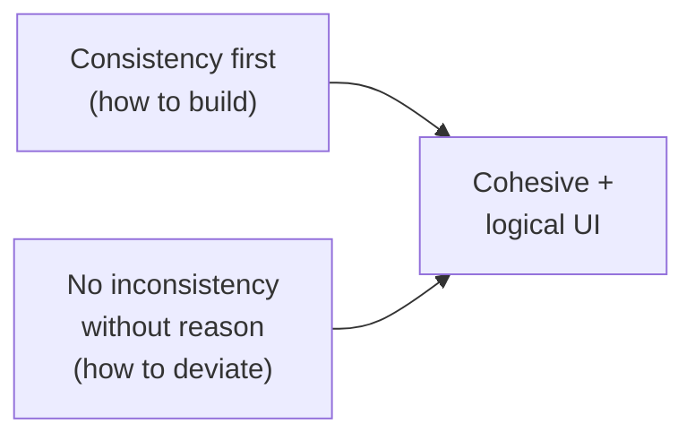
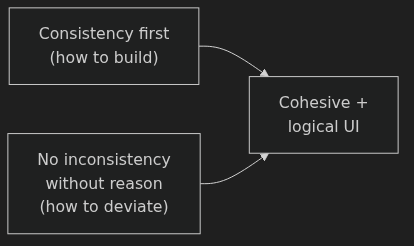
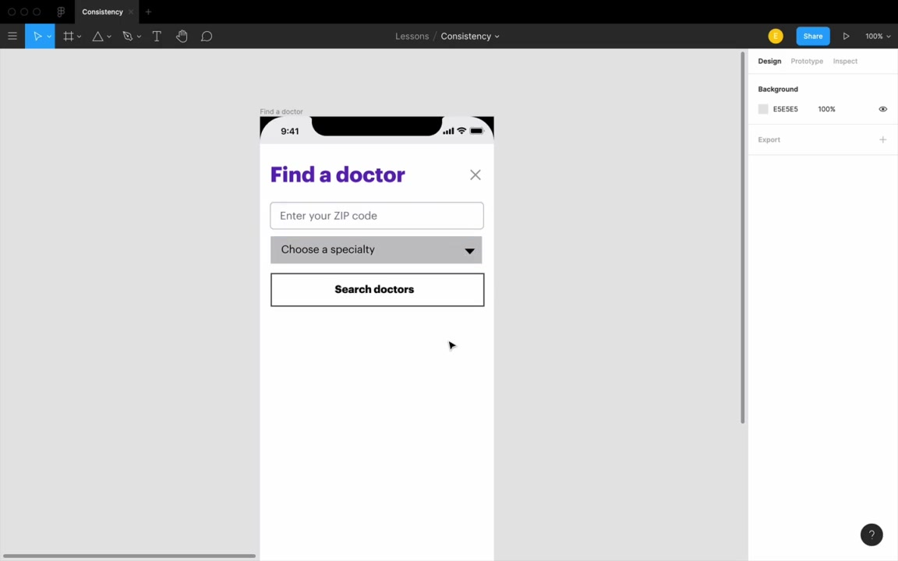
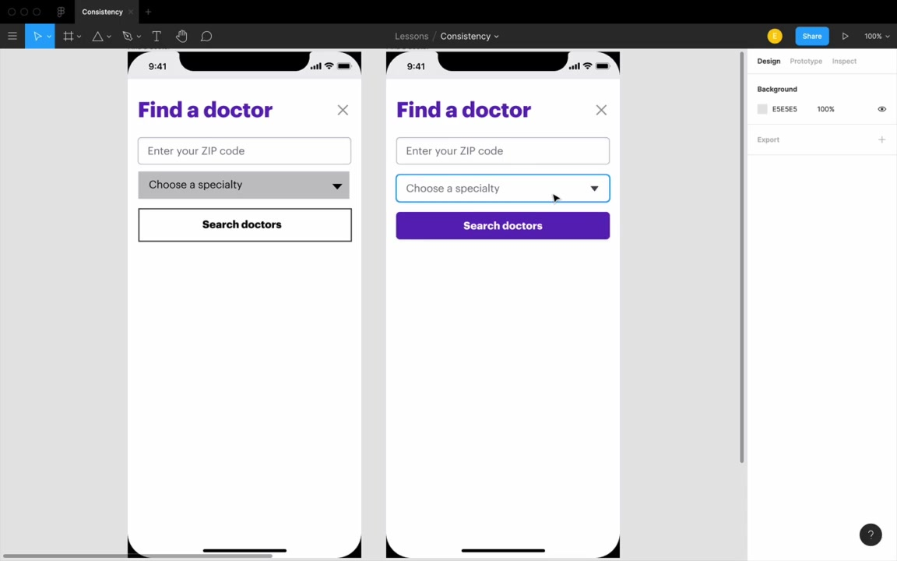
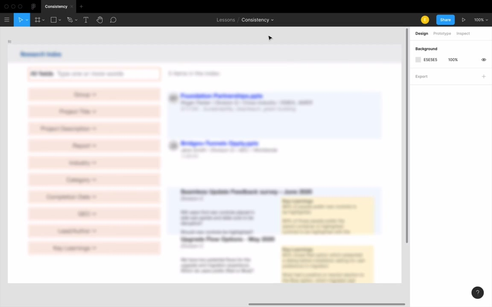
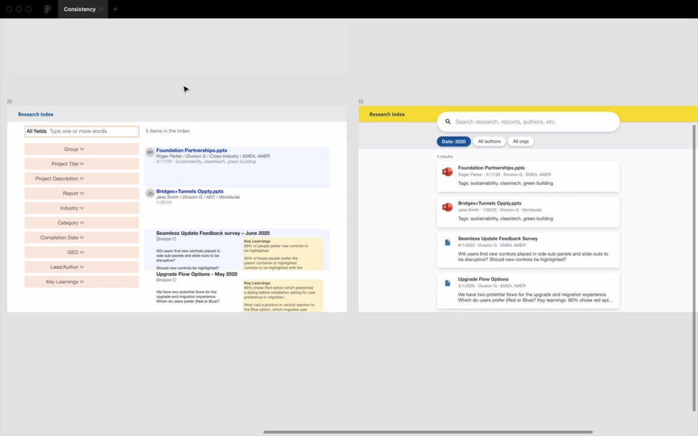
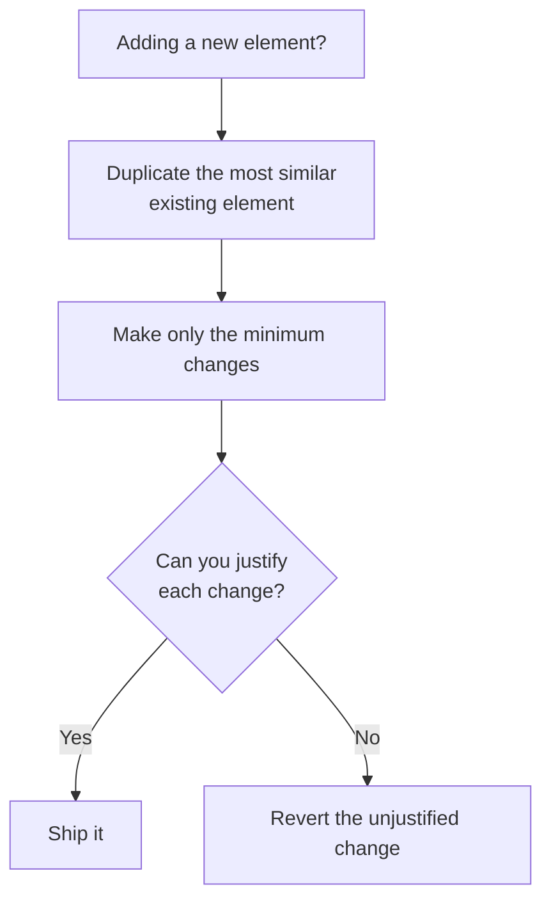
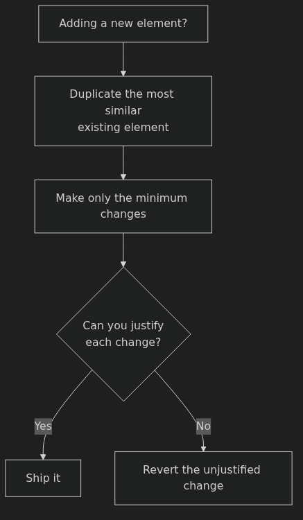

# Consistency — Anki Cards

Q: What are the two core strategies taught in the Consistency lesson?
A: 1. **Consistency first** — always duplicate an existing element before designing a new one. 2. **No inconsistency without reason** — every visual departure needs a justifiable rationale.

Q: What does "consistency first" mean in practice?
A: Whenever you add a new element — form control, text, anything — **duplicate the most similar existing element** and style from there. Never press R for a new rectangle and start from scratch.

Q: Why does the instructor say building each control from scratch looks bad, even with perfect alignment and equal spacing?
A: Because the controls are visually inconsistent with each other — different shadows, heights, visual weight. Alignment fixes position; it doesn't fix inconsistent styling.

Q: What 3 steps turn a text input into a dropdown, consistency-first?
A: 1. Duplicate the text input. 2. Switch inner shadow → exterior shadow (dropdowns pop out; text boxes recess). 3. Add a down-arrow icon using the same fill color as the placeholder text.

Q: What 4 steps turn a dropdown into a button, consistency-first?
A: 1. Duplicate the dropdown (exterior shadow already matches — one less change). 2. Remove the arrow. 3. Center and bold the text. 4. Add a background color.

Q: Why does consistency make a design more **logical**, not just more cohesive?
A: "Users are just going to assume, that if they see a visual difference, that's also reflected in some logical difference that the designer is trying to convey." Every unjustified inconsistency makes users pause (even a fraction of a second) trying to interpret what it means.

Q: How do you apply consistency first when adding secondary/disclaimer text?
A: Duplicate the nearest existing text element, then make only 3 changes: make it smaller (e.g., 16→14px), lower its opacity (e.g., 70%), and center it if it's footer-style.

Q: What is the "smaller + lighter" text pattern?
A: A secondary text style created by duplicating normal text, reducing its size, and lowering its opacity. It's one of the most common text design patterns and works because it visually signals "less important."

Q: What are the 5 justified inconsistencies in the "Find a Doctor" mobile form, and why is each justified?
A: (1) Dropdown exterior shadow — convention: dropdowns pop out. (2) Down-arrow icon — signals it's interactive/expandable. (3) Button colored background — primary action needs attention. (4) Button text bold+centered — convention for fixed-width buttons. (5) Button slightly taller — main CTA deserves slightly more visual weight.

Q: Is "other apps do it this way" a valid reason to deviate from strict consistency?
A: Yes. "Users spend much more time using other people's apps than they do using your apps." Following conventions lets users apply existing mental models to your interface.

Q: Removing the down-arrow from a dropdown is "thinking outside the box." True or false?
A: False. "That's not out of the box thinking. That's just me making this interface a little bit more confusing." Convention exists to help users — breaking it without cause hurts usability.

Q: Where should personal style live in UI design, according to this lesson?
A: In **typography, color, and imagery** — not in breaking functional form conventions like button alignment or dropdown affordances.

Q: What is the squint test, and how do you simulate it in a design tool?
A: Squinting your eyes (or applying a blur overlay layer — e.g., 10px background blur) to see your design's structure without reading any text. It reveals what pops out at the highest level.

Q: What question does the squint test answer?
A: "What is this site? Tell me what one does here." — Is this reading, browsing, data entry? Are the repeating elements visually grouped and recognizable at a glance?

Q: What is the link between consistency and the squint test?
A: Consistent styling makes repeating patterns legible even when blurred — a list reads as a list, filters read as filters. Poor consistency causes structural confusion at the squint-test level.

Q: What consistency error did zebra-striping create in Lars's research index?
A: The alternating blue/white row backgrounds made one list of results look like **two separate lists** under the squint test — odd rows and even rows read as distinct groups.

Q: In the research index redesign, what three zones should be readable even under a blur/squint?
A: **Search bar → filters → results.** That's the page's core information architecture, and it should communicate instantly before a user reads a single word.

Q: In the research index, there are two result types: PowerPoint downloads and web links. How should they be styled?
A: Same three-line layout (consistency) — the only difference is the icon (PowerPoint icon vs. file icon). The icon is the **justified inconsistency** that communicates the type.

Q: Why can't you evaluate a single list item's style in isolation?
A: "You can never just evaluate one list item alone. You always have to duplicate it, get it going a couple times." Only repeated items reveal whether the style actually works as a list.

Q: What was the squint-test verdict on Lars's original research index vs. the redesign?
A: Original: his wife said "it's a government site." Redesign: "Oh, it's a search bar and some results." The redesign's consistent styling makes its purpose instantly legible.

Q: Walk through the decision flow for adding any new element to a design.
A: Duplicate the most similar existing element → make only the minimum changes needed → ask "can I justify each change?" → if yes, keep it; if no, revert it.

Q: A designer adds a filter row to a search page by starting from a new rectangle. What's the consistency-first mistake, and how should it be fixed?
A: Mistake: starting fresh instead of duplicating. Fix: duplicate the search bar card (already has the right shadow and border radius), then strip it down to just the filter label — shadow and styling will already match.

Q: You notice one item in a repeating list has an extra 4px of padding compared to the others. Do you need a rationale to keep it, or is it fine because it's subtle?
A: You need a rationale. Subtlety doesn't matter — "the more inconsistencies you have in your design for no reason... the more users are going to pause." If you can't justify it, revert it.
