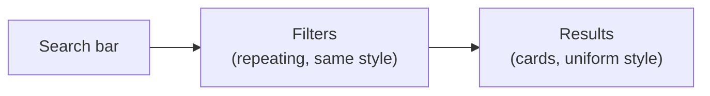
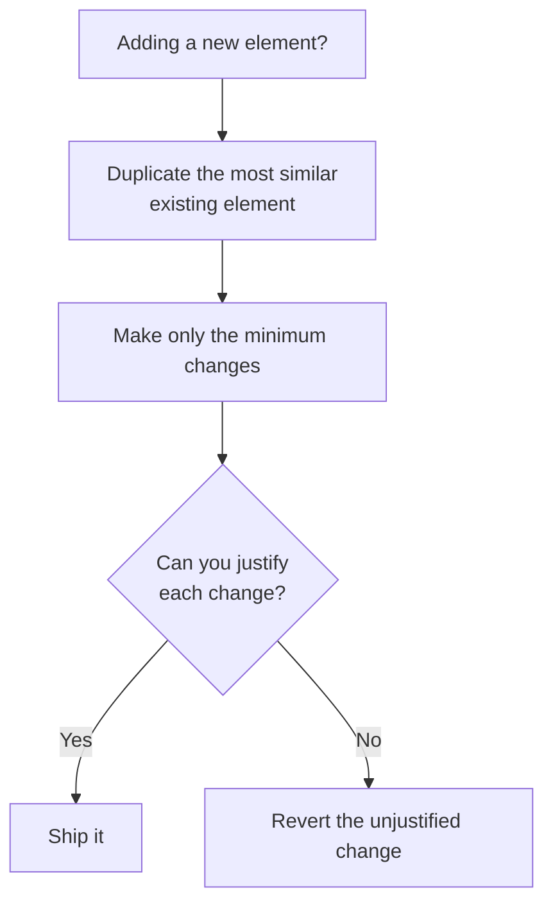

# Consistency

**Unit:** 02 — Fundamentals of UI Design
**Lesson:** 04 — Consistency

---

> "It sounds fairly abstract, how practical is this gonna be?"

The instructor preemptively addresses this. Previous fundamentals — alignment and spacing — are easy to verify: you can count pixels. Consistency feels fuzzier. The goal of this lesson is to make consistency feel concrete: two strategies, illustrated across two real examples.

## [1:00] Mobile example - Find a Doctor

The first example is a mobile "Find a Doctor" form with three controls: a text input, a dropdown, and a button.

### [1:05] Consistency first

**The rule:** Whenever you add a new element — a form control, text, anything — always start by duplicating an existing element and then style from there. Never press `R` for a new rectangle and design from scratch.

> "The temptation is just to press R for rectangle, and T for text, and start typing in something."

**The anti-pattern:** The instructor demos building three controls from scratch. Even with perfect alignment and identical spacing, the result looks bad — they're visually inconsistent with each other. Different shadows, different heights, different visual weight — none feel like they belong together.

> "This example is fairly obvious. But this sort of thing can just creep up on you, if you're not very conscious about designing consistency first."

**The right approach: duplicate and minimally modify**

Building a dropdown from a text input:
1. Duplicate the text input
2. Switch the inner shadow to an exterior shadow (dropdowns pop out; text boxes recess in — covered in the lighting/shadows lesson)
3. Add the dropdown arrow, styled using the same fill color as the placeholder text

Building a button from the dropdown:
1. Duplicate the dropdown (buttons also pop out, so the shadow is already right — one less thing to change)
2. Remove the arrow
3. Center and bold the text (convention for fixed-width buttons)
4. Add a background color

> "By designing those same three controls consistency first — where we just duplicate something that we already have, and then make the bare minimum of changes — you can see these three controls just look so much more like they belong together."

Why it also makes the design more **logical**: When users see a visual difference, they unconsciously assume it signals a meaningful difference. Every unjustified inconsistency makes users pause — even for a fraction of a second — trying to interpret what the designer was communicating.

> "Users are just going to assume, that if they see a visual difference, that's also reflected in some logical difference that the designer is trying to convey."

**Consistency first applies to text too.** If you need secondary/disclaimer text, duplicate the nearest text element you already have, then make only the changes needed:
- Smaller size (e.g., 16 → 14px)
- Lower opacity (e.g., 70%)
- Center it if it's footer-style

> "We designed it consistency first. We started with the normal text we had, and then the only three changes we made — two of 'em, the lower size and the lower opacity, are unique to it being secondary text, and then the centering was unique to it being kind of a footer text."

This "smaller + lighter" combination is one of the most common text design patterns — more in the typography unit.

### [5:00] For every inconsistency, a rationale

Every departure from the baseline should be explainable. When asked why you made a change, you should have an answer.

| Inconsistency | Rationale |
|:---|:---|
| Dropdown: exterior shadow (not interior) | Convention — dropdowns pop out, text boxes recess in |
| Dropdown: down-arrow icon | Signals that tapping reveals a list of options |
| Button: colored background | Draws attention; it's the primary action on the page |
| Button: bold, centered text | Convention for fixed-width buttons |
| Button: slightly taller (49px vs 44px) | Main CTA — slightly more visual weight is justified |

> "Even for someone who did notice it, it is justifiable. I'd say, 'Oh, yes, this is the main button on the page. We do want this to be a little bit bigger.'"

**Convention as a valid rationale:** Following established UI conventions is a legitimate — even recommended — reason to deviate from strict consistency.

> "Users spend much more time using other people's apps than they do using your apps. So to the degree that your apps rely on the same mental models... users can piggyback on their understanding of other apps to understand yours."

Removing a dropdown arrow isn't personal style — it's making the interface more confusing. On left-aligning button text:

> "If I get this submitted as a homework assignment, I'm just gonna tell you to center that text."

His broader point: personal style comes through **typography, color, and imagery** — not through breaking form conventions. Master the fundamentals first.

## [11:35] Desktop example - Research Index

The second example is a desktop design submitted by course student Lars — a research index: a database of UX research reports and study results from a company's UX team. The main flow: type in the search bar → filter → browse results.

### [11:42] Squint test

Before touching anything, the instructor blurs the original design (10px background blur overlay) and applies the **squint test**:

> "When you squint your eyes, or when you put on a blur layer, and you look at your design — what pops out?"

The point isn't to read specific content — it's to understand what the design communicates at a structural level:
- Is this a reading experience? Browsing? Data entry?
- Where are the repeating elements? What do they suggest?

> "What is this site? Tell me what one does here. What kind of information is on this page?"

**Why squint test relates to consistency:** Important structure should be legible even when blurred. Consistent styling makes repeated patterns readable — a list, a filter row, a card grid. Poor consistency causes structural confusion.

**The original design's problem:** With the blur applied, the results looked like *two separate lists*, not one. The culprit: zebra-striping — alternating blue/white row backgrounds — made odd and even rows read as two distinct groups rather than items in a single list.

> "I thought it was very reasonable that there were two lists here, not just one. This is actually one list of results."

He asked his wife what the original looked like under the squint test. She said: "a government site."

### [14:54] Redesign process

The goal: at squint-test level, a user should immediately read — search, filter, results.

**Search bar:**
- Rounded border radius (convention — search bars almost always have it)
- White background on a slightly gray page (contrast without a border)
- Drop shadow to pop it off the background
- Large Material Design search icon
- Hint text in a blue-tinted gray (pulls from the logo's blue hue — more in the color unit)

> "I think people would be able to tell, ah, yes, it's a search bar."

**Layout zones:** Yellow brand header → light gray sub-header (with a thin border line separating it from the yellow) → white content area. The header gets a small drop shadow for depth.

**Filters (consistency first in action):**
- Duplicated from the search bar card style so shadows and border radius already match
- Auto-layout for consistent 8px gaps between items
- Active filter state: colored text — an intentional, *justified* inconsistency that signals the active state
- Shadow intensity reduced vs. the search bar, so filters don't compete with it for visual elevation

> "This is exactly what their filters look like" (pointing to Airbnb). If you've used it before, this isn't gonna take you by surprise.

**Result cards:**
- White cards on the gray background
- Uniform card style for all results — but two *types* exist:
  - PowerPoint file downloads → PowerPoint icon
  - Web links → generic document/file icon
- Both use the same three-line text layout (bold title → normal body text → smaller, lighter secondary metadata)
- Designed consistency first: all three text rows started as the same copied style, then minimally modified

> "You can never just evaluate one list item alone. You always have to duplicate it, get it going a couple times. And then you'll have a much better idea of if that style is working out for you."

**The before/after squint test:**

Applying the blur overlay to both versions — the redesign reads clearly as "search bar, filters, list of results." His wife confirmed: "Oh, it's a search bar and some results."

> "I also asked my wife, I said, 'What is this site?' And she said, 'Oh, it's a search bar and some results.' And I said, 'What's this one?' And she said, 'Oh, it's a government site.' So, (chuckles) there you go."

---

## Takeaways

> "If you take two things away from this lesson, remember, number one, consistency first. Item number two, only make inconsistencies with reason, have a rationale for everything you change."

The rationale doesn't have to be complex. Often it's just: "this is convention" — and that's a fully valid answer. As you watch more of the course, these rationales become second nature.

> "All right, take a look at the homework below, and we'll see you in the next video."
