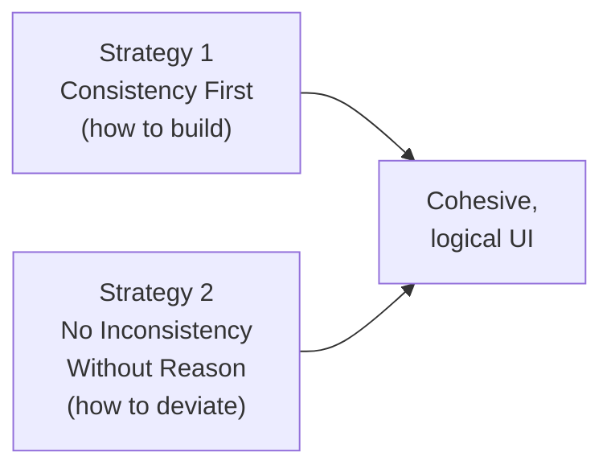
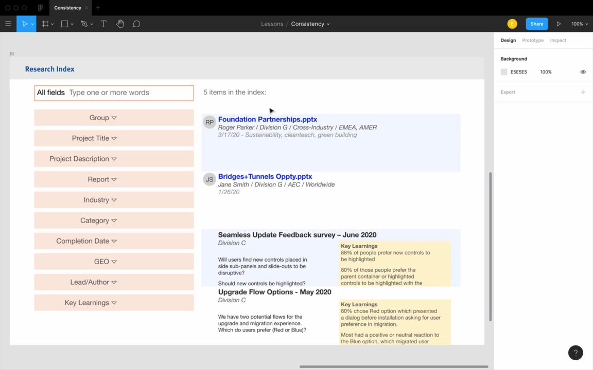
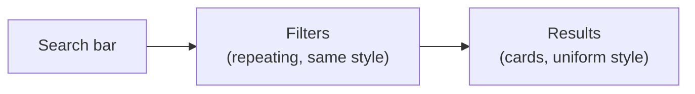

# Consistency

**Unit:** 02 — Fundamentals of UI Design
**Lesson:** 04 — Consistency

---

## Introduction: Is This Practical?

> "It sounds fairly abstract, how practical is this gonna be?"

That's the question the instructor preemptively addresses. Previous fundamentals like alignment and spacing are easy to verify — you can count pixels. Consistency feels fuzzier.

The goal of this lesson is to make consistency feel like a concrete, usable tool — applicable across platforms and brand types.

Two strategies are covered. The rest of the lesson is examples.

---

## Strategy 1: Consistency First

**The rule:** Whenever you add a new element to a page — a form control, text, anything — always start by duplicating an existing element, then style from there. Never press `R` for a new rectangle and start from scratch.

> "The temptation is just to press R for rectangle, and T for text, and start typing in something."

### The Anti-Pattern: Building From Scratch

The instructor demos what happens when three form controls (a text input, a dropdown, and a button) are each built from scratch:

- Even with perfect alignment and identical spacing, the result **looks bad** because the controls are visually inconsistent with each other.
- Different border styles, different heights, different visual weight — none of them feel like they belong together.

> "This example is fairly obvious. But this sort of thing can just creep up on you, if you're not very conscious about designing consistency first."

### The Right Approach: Duplicate and Minimally Modify

**Building a dropdown from a text input:**

1. Duplicate the text input
2. Switch the inner shadow to an exterior shadow (dropdowns pop out; text boxes recess in — more on this in the lighting/shadows lesson)
3. Add the dropdown arrow, styled with the same fill color as the placeholder text
4. Result: the dropdown and text input look nearly identical except for the shadow and arrow — which is exactly right

**Building a button from the dropdown:**

1. Duplicate the dropdown (buttons also pop out, so the shadow is already correct — one less thing to change)
2. Remove the arrow
3. Center and bold the text (convention for fixed-width buttons)
4. Add a background color

> "By designing those same three controls consistency first — where we just duplicate something that we already have, and then make the bare minimum of changes — you can see these three controls just look so much more like they belong together."

### Why Consistency Makes Designs More Logical

Consistency isn't just aesthetic. It's logical. When users see a visual difference, they assume it signals a meaningful difference.

> "Every time a user sees an inconsistency — let's say it's an inconsistency of spacing, or something like that — they're gonna ask themselves, 'Why does this inconsistency exist?'"

This happens unconsciously. The more random inconsistencies in a design, the more users pause (for fractions of a second) trying to interpret what the designer was trying to communicate.

> "Users are just going to assume, that if they see a visual difference, that's also reflected in some logical difference that the designer is trying to convey."

---

## Strategy 2: No Inconsistency Without Reason

Every departure from the baseline should be explainable. When asked why you made a change, you should have an answer.

Examples from the mobile form demo:

| Inconsistency | Rationale |
|---|---|
| Dropdown has exterior shadow; text input has interior shadow | Convention — dropdowns pop out, text boxes recess in |
| Dropdown has a down-arrow icon | Signals to the user that tapping reveals options |
| Button has a colored background | Draws attention; it's the primary action on the page |
| Button text is bold and centered | Convention for fixed-width buttons |
| Button is slightly taller (49px vs 44px) | It's the main CTA — slightly more visual weight is justified |

> "Even for someone who did notice it, it is justifiable. I'd say, 'Oh, yes, this is the main button on the page. We do want this to be a little bit bigger.'"

### Note on Convention as a Valid Rationale

Following established UI conventions is a legitimate — even recommended — reason to deviate from strict consistency.

> "One thing that I am saying, is that because other apps do it this way, is actually a fairly good justification for making an inconsistency in your design."

The instructor acknowledges this can be controversial among designers who prioritize "thinking outside the box." His counter:

> "Users spend much more time using other people's apps than they do using your apps. So to the degree that your apps rely on the same mental models... users can piggyback on their understanding of other apps to understand yours."

**Removing the dropdown arrow isn't personal style — it's making the interface more confusing.**

On left-aligning button text:

> "If I get this submitted as a homework assignment, I'm just gonna tell you to center that text."

His broader point: master the fundamentals first. Personal style comes through **typography, color, and imagery** — not through breaking form conventions.

---

## Consistency First in Practice: Secondary Text

The workflow extends beyond form controls to any element. If you need secondary/disclaimer text:

1. **Don't** press `T` and start fresh
2. Duplicate the nearest text you already have
3. Make only the changes needed:
   - Smaller size (e.g., 16 → 14px)
   - Lower opacity (e.g., 70%)
   - Center if it's footer-style text

> "We designed it consistency first. We started with the normal text we had, and then the only three changes we made — two of 'em, the lower size and the lower opacity, are unique to it being secondary text, and then the centering was unique to it being kind of a footer text."

This "smaller + lighter" pattern is one of the most common text design patterns — covered more in the typography unit.

---

## Example 2: Desktop Research Index (Lars's Submission)

The second example is a more complex desktop design — a research index (database of UX research reports) submitted by a course student named Lars.

### The Squint Test

Before diving into fixes, the instructor introduces the **squint test**:

> "When you squint your eyes, or when you put on a blur layer, and you look at your design — what pops out?"

Technique: add a blur overlay layer (e.g., 10px background blur) in your design tool to simulate squinting. The purpose is to understand what a user reads at a high level, before they read any actual text:

- Is this a reading experience? Browsing? Data entry?
- Where are the repeating elements? What do they suggest?

> "What is this site? Tell me what one does here. What kind of information is on this page?"

### Why Squint Test Relates to Consistency

Important consistency is **readable at the squint-test level**. If your design is consistently styled, a viewer can identify repeated patterns (a list, a grid of cards, a set of filters) even when blurred. Poor consistency causes visual confusion about structure.

**The original design's problem:** With the blur applied, the results list looked like *two separate lists* rather than one, because zebra-striping (alternating blue/white row backgrounds) created enough inconsistency between adjacent rows to suggest two distinct groups.

> "I thought it was very reasonable that there were two lists here, not just one. This is actually one list of results."

### The Redesign: Applying Consistency Principles

The instructor's goal for the redesign:

At the squint test level, a user should immediately read: search, filter, results.

**Search bar:**
- Rounded border radius (convention for search bars)
- White background on a slightly gray page (contrast without a border)
- Drop shadow to pop it off the background
- Large Material Design search icon
- Hint text in a blue-tinted gray (pulls from the logo's blue hue)

> "I think people would be able to tell, ah, yes, it's a search bar."

**Sub-header layout:** Yellow header (brand color) → light gray sub-header → white content area. A thin border at the bottom of the sub-header separates the zones. A small drop shadow on the header gives it depth.

**Filters (consistency first in action):**
- Duplicated from the search bar card style (matching shadow, border radius)
- Auto-layout for consistent spacing (8px gaps)
- Active filter state: colored text + bold (a *justified* inconsistency — it signals which filters are active)
- Reduced shadow intensity vs. the search bar, so filters don't compete for elevation with it

**Result cards:**
- White cards on the gray background
- Same card style (shadow, border radius) for all results
- Two card *types* exist — PowerPoint file downloads vs. web links — but both use the same three-line text layout
- The only difference is the icon: a PowerPoint icon for downloads, a file/document icon for web links
- Text hierarchy: **bold title → normal body text → smaller, lighter secondary metadata**
- Designed consistency first: all three text rows started as the same copied style, then minimally modified

> "You can never just evaluate one list item alone. You always have to duplicate it, get it going a couple times. And then you'll have a much better idea of if that style is working out for you."

### The Before/After Squint Test

Applying the blur overlay to both versions:

- **After:** clearly reads as "search bar, filters, list of results"
- **Before:** his wife said it looked like "a government site"

> "I also asked my wife, I said, 'What is this site?' And she said, 'Oh, it's a search bar and some results.' And I said, 'What's this one?' And she said, 'Oh, it's a government site.' So, (chuckles) there you go."

---

## Summary: Two Rules

> "If you take two things away from this lesson, remember, number one, consistency first. Item number two, only make inconsistencies with reason, have a rationale for everything you change."

The rationale for a change doesn't have to be complex. Often it's just: "this is convention" — and that's a fully valid answer. As you watch more of the course, these rationales become second nature.

> "All right, take a look at the homework below, and we'll see you in the next video."
