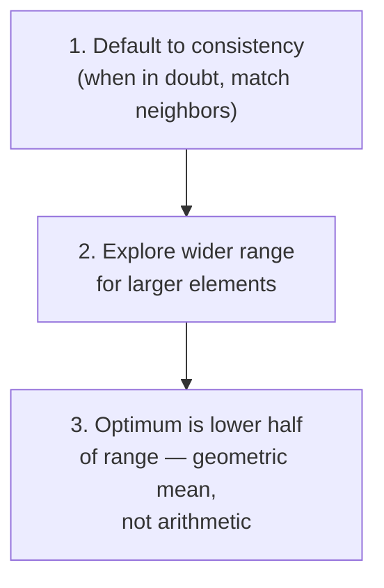
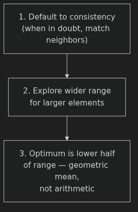
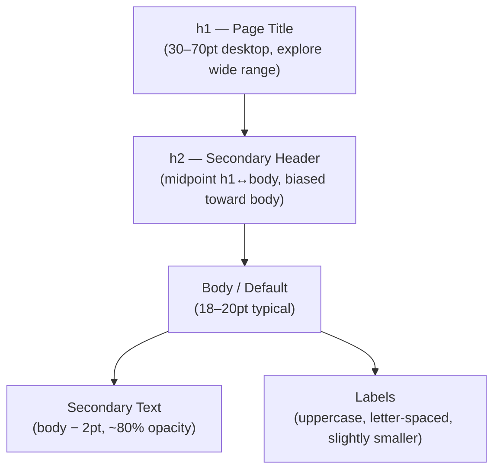
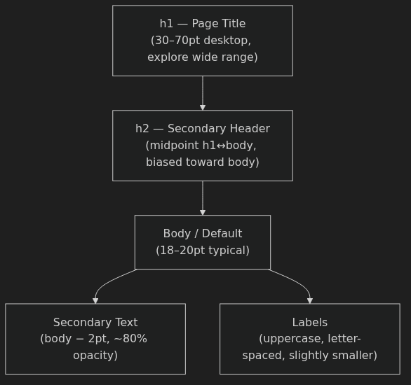

# Sizing — Anki Cards

Q: What well-known UX principle justifies "go look at professionally designed apps before setting any unusual size"?
A: Jakob's Law — users spend most of their time on other sites, so their expectations are shaped by what those sites do. If no professional site does what you're about to do, you're probably wrong.

Q: What are the three heuristics for sizing UI elements?
A: 1. Default to consistency. 2. Explore a wider range for larger elements. 3. The optimum is in the lower half of the range (geometric mean, not arithmetic).

Q: Heuristic 1 says "default to consistency." What are the two biggest offenders of inconsistency?
A: 1. Icons sized inconsistently relative to nearby text. 2. Inconsistent font sizes across the UI — the most common violation.

Q: Why do larger elements deserve a wider range of size exploration than small ones?
A: The same absolute pixel change (+10px) is enormous at small scale (10→20px squares are 4× the area) but negligible at large scale (100→110px). The visual impact scales with the element's size.

Q: When you've found a size that's "definitely too small" and one that's "definitely too big," why shouldn't you just pick the arithmetic midpoint?
A: The visually "middle" value sits closer to the smaller end — you're looking for the geometric mean, not the arithmetic mean. "You're gonna more often find the best option by going a little bit smaller than kind of that halfway point."

Q: What is the core rule for sizing icons relative to nearby text?
A: Match the pen weight — the icon should feel like it was drawn with the same pen as the text. "This text is written with a 'pen of a certain thickness', and we kind of want the icon to be not too far from that."

Q: What are the default size and stroke weight recommendations for most UI icons?
A: Fit in a 24×24 px box. Use a 2px stroke weight. If 2px feels too heavy next to text, reduce the icon's opacity to ~80%.

Q: What does an oversized hamburger icon (e.g. 40px wide) signal about the designer?
A: It's a beginner tell — "very large icons, and very large hamburger buttons — are just kind of oddly common for beginner designers to do." 20px feels about right at typical nav text sizes.

Q: You want an icon to occupy more visual space, but simply scaling it up makes the stroke weight look chunky. What's the solution?
A: Enclose the icon in a circle (or colored background shape) and keep the icon itself at normal size. "That's typically gonna be a much better way to sort of make an icon take up a bit more space."

Q: For a horizontally-oriented logo, what's a reasonable upper size limit, and how should you judge if it's too big?
A: Max ~200px wide. Compare it to page headers — the page title should be much bigger than the logo. A text-equivalent size of ~30pt feels "plenty big." Beginners more commonly make logos too big, not too small.

Q: What range of heights should you target for a desktop navigation header, and what's the heuristic for getting there?
A: 50–80px is a good starting range. Find "definitely too small" (e.g. 30px) and "definitely too big" (e.g. 150px), then apply Heuristic 3 — don't go to the midpoint (90px); go lower. A sub-nav can be ~40px to signal secondary importance.

Q: What's the accepted height range for desktop buttons and form inputs?
A: 30–50px. 36px sits comfortably in the middle and works well in constrained header areas. Marketing CTAs can go up to 55–60px. Very small tag-style buttons (~22px) are possible with strong color but are hard to click.

Q: What are the minimum tap target sizes for mobile, and why does a small icon still satisfy this?
A: iOS: 44×44 px minimum. Android: 48×48 dp minimum. A small icon (e.g. 19–20px wide) satisfies the requirement as long as it owns enough empty tap region around it — visual size and tap area are separate.

Q: What are the "Big Five" font styles that most apps need?
A: Body/Default, h1 (page title), h2 (secondary header), Secondary Text, and Labels. Most apps can get away with just these five.

Q: What two contexts affect the ideal body text size, and how do they push it in different directions?
A: Interaction-heavy pages (lots of UI widgets, labels) → smaller body, e.g. ~14pt. Text-heavy pages (long-form articles) → larger body, e.g. 18pt+. If both exist in the same product, you may need two sizes or a compromise.

Q: How should you pick an h1 size, and what mistake does picking it in isolation cause?
A: Apply Heuristic 2 — explore a wide range (30–70pt on desktop), then pick from the lower half. Don't pick in isolation — test against the real titles that will appear. A very long title can look ridiculous at a size that seemed fine with a short one.

Q: How do you derive the h2 size from h1 and body?
A: Take the arithmetic midpoint between h1 and body, then bias toward the smaller (body) side per Heuristic 3. Example: body ~20pt, h1 ~40pt → midpoint 30pt → h2 at ~25pt. "Your job is just to corral attention effectively."

Q: What is the formula for secondary text (details, annotations, captions) in a UI?
A: Body size minus ~2pt (e.g. 19→17pt), plus opacity reduced to ~80%. "It's very, very standard and I mean this in a good way. I mean, you just know what you should be doing 'cause everyone should basically be doing the same thing here."

Q: When using uppercase labels (for inputs, menus, section titles), what adjustments should you make beyond just uppercasing?
A: Slightly smaller size (uppercase reads larger visually), add letter spacing, optionally reduce weight (demi-bold rather than bold), optionally ~80% opacity. Use more naturally on sans-serif than serif.

Q: What is the useful insight behind type scales, and why does the instructor call them "ridiculous"?
A: Useful insight: geometric ratios naturally place the visual "middle" closer to the smaller value — matching Heuristic 3. Ridiculous because: "You really should feel no compulsion to obey one of these things exactly." What matters is visually clear hierarchy, not mathematical compliance.

Q: How much should you scale down an h1 when adapting a desktop layout to mobile (375px frame)?
A: Typically 6–8pt less. Example: desktop 42pt h1 → mobile 34pt. Mobile h1 range is roughly 25–45pt, with the upper end only for short titles.

Q: What is the critical lower bound for body text on mobile, and what happens if you go below it?
A: Never go below 16pt on mobile. iOS will auto-zoom on form field focus if text is smaller than 16pt — a broken UX experience. Platform defaults: iOS SF Pro at 17pt, Android Roboto at 16pt.

Q: What is "art direction" in the context of adapting an image from desktop to mobile?
A: More than just resizing — adjusting crop, orientation, or composition so that the visual intent carries over to the different form factor.

Q: Your design has body text at 18pt and an h1 at 48pt. What should your h2 be?
A: Arithmetic midpoint = (18 + 48) / 2 = 33pt. Bias toward the smaller side (Heuristic 3) → h2 at ~26–28pt. The goal isn't math compliance — it's a visually legible hierarchy.

Q: Your icon sits next to 16pt text and looks too thick and heavy. What are your two options?
A: 1. Use an icon with a thinner stroke weight to better match the pen weight of the text. 2. Keep the 2px stroke but reduce the icon's opacity to ~80%.

Q: When should you enclose an icon in a circle instead of just scaling it up?
A: When you need the icon to occupy more visual space but want to avoid doubling its stroke weight. Simply scaling up makes it look chunky and mismatched to nearby text. The enclosing shape holds the space while the icon stays at its natural size.
