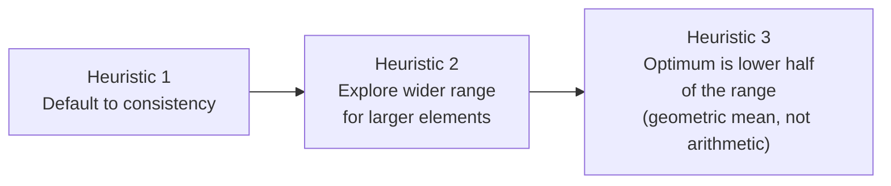
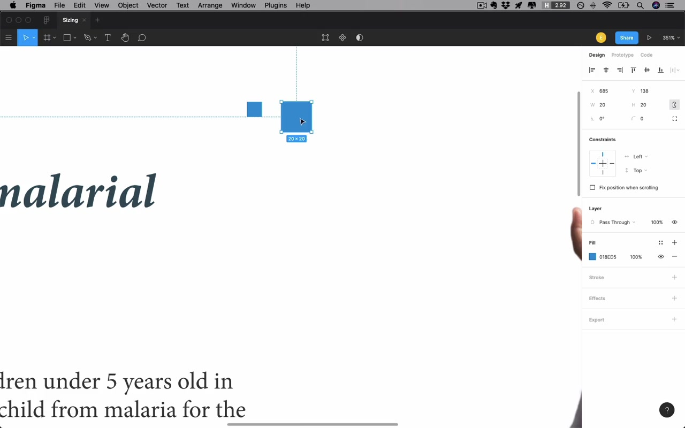
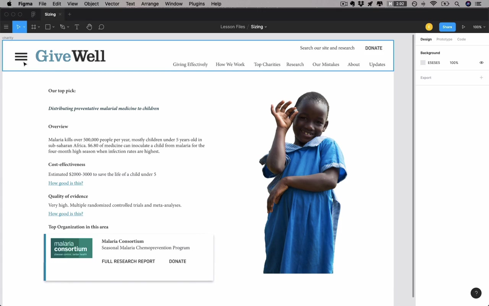
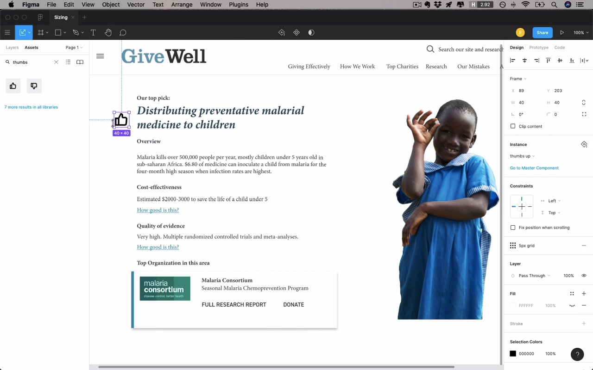
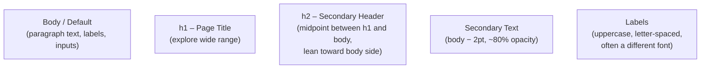
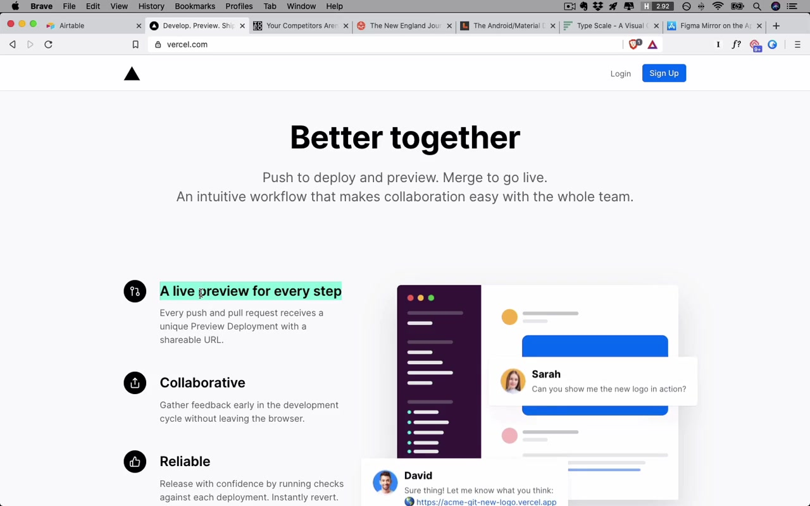
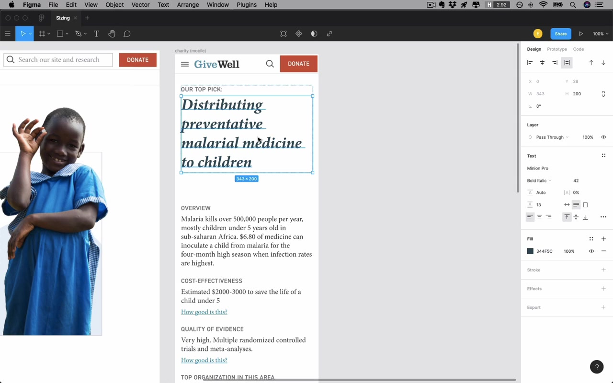

# Sizing

**Unit:** 02 – Fundamentals of UI Design
**Lesson:** 05 – Sizing

---

## Overview

Sizing UI elements sounds boring but it's one of the most common beginner mistakes. Most things in a UI have a natural size they "desire to be at." The lesson walks through two examples — desktop and mobile — using a GiveWell.org charity page mockup, and covers three concrete heuristics.

> "Anytime you get the temptation to just size something that you're not really sure how big it should be — some button, say, oh, it's an important button, I'm gonna make it 80 pixels tall — stop. Before you make it 80 pixels tall, go and look at a bunch of well designed, professionally designed apps and see what they're doing. And if no one else is doing anything like what you wanna do, you're probably not making the right sizing decision."

This is a corollary to **Jakob's Law of User Experience**: users spend most of their time on other sites, so their expectations are shaped by what those sites do.

---

## The Three Sizing Heuristics

### Heuristic 1: Default to Consistency

In the absence of any compelling reason to do otherwise — go consistent. The biggest offenders of inconsistency:

- **Icons sized inconsistently relative to nearby text** — make icons and text look like they were drawn with the same pen
- **Inconsistent font sizes** across the UI (the most common violation)

### Heuristic 2: Explore a Wider Range for Larger Elements

Bigger elements have more leeway and you should test more options. Squaring 10 vs. 20 feels dramatically different (4× area), while 100 vs. 110 feels marginally different — the same +10px means something very different at different scales.

### Heuristic 3: The Optimum Is in the Lower Half of the Range (Geometric Mean)

Once you've identified what's definitely too small and definitely too big, don't just split the difference:

> "You're gonna more often find the best option by going a little bit smaller than kind of that halfway point."

If you're a developer: you're looking for the **geometric mean**, not the arithmetic mean. Practically: the visually "middle" value between a lower and upper bound will feel closer to the lower bound.

---

## Icons

### The Core Rule: Match the Pen Weight of Your Text

> "This text is written with a 'pen of a certain thickness', and we kind of want the icon to be not too far from that."

- Most UI icons should fit in a **24×24 px box**
- A 1px stroke can feel wispy — **2px stroke is a fantastic default** for icon stroke weight
- If 2px feels too heavy next to the text, reduce the icon's **opacity to ~80%**

### Oversized Icons Are a Beginner Tell

> "Very large icons, and very large hamburger buttons — are just kind of oddly common for beginner designers to do."

A 40px-wide hamburger button is too big. 20px feels about right at typical nav text sizes.

### Scaling Icons Up Without Distorting Them

The problem with simply scaling a stroke-based icon up: stroke weight doubles, so the icon looks chunky and no longer matches nearby text. **Solution: enclose the icon in a circle** (or colored background shape) and keep the icon itself at normal size.

> "That's typically gonna be a much better way to sort of make an icon take up a bit more space."

Vercel's landing page demonstrates this: icons encapsulated in small circles so they can visually hold their own next to sub-headers.

---

## Logo Sizing

- More common for beginners to make a logo **too big** rather than too small
- For a horizontally-oriented logo: **max ~200px wide** is a reasonable upper limit before it becomes bulky
- Another frame: how does the logo compare to the page headers? The page title should be much bigger than the logo
- Text-equivalent size of ~30pt feels "plenty big"

**Exception:** highly detailed logos tempt you to make them too large — and overly detailed logos are themselves a mistake (see the instructor's blog post on logo mistakes).

---

## Headers / Navigation Bars

A header that's too tall is a common beginner mistake. Approach the sizing with a fill-left / fill-right strategy:

1. Find what's **definitely too small** (e.g. 30px — no breathing room for logo)
2. Find what's **definitely too big** (e.g. 150px — logo floats in dead space)
3. Apply Heuristic 3: don't go to the midpoint (90px); go lower

Result: **50–80px is a good starting range** for desktop nav headers. A primary nav at 50px, secondary (sub) nav at 40px is a sensible split — slightly smaller because it's of secondary importance.

---

## Form Controls (Buttons and Inputs)

- Desktop: **30–50px height** is the accepted range for buttons and inputs
- 36px is squarely in the middle and works well for a constrained header area
- Big calls-to-action on marketing pages: up to 55–60px is not crazy, but text would be bigger too
- Airtable uses 22px tag-style buttons — possible with bright color to compensate, but generally not recommended since they get tough to click

### Mobile: Tap Target Size

> "Anything that I need to tap, anything at all — buttons, text, input, controls, switches — on iPhone, it should own a space of 44 pixels by 44 pixels absolute minimum."

- **iOS tap target minimum: 44×44 px**
- **Android tap target minimum: 48×48 dp**
- A small icon (e.g. 19–20px wide) can still satisfy this if it owns a large enough tap region around it
- Mobile buttons may end up **bigger than desktop buttons** — and that's totally fine

---

## Font Sizes

> "Font sizes, if you can size them well — this is just one of the most important things that you can do in terms of a single change that will make your design look better."

### The Big Five Font Styles

Most apps can get away with just these five styles.

### Body / Default Size

- 16pt is the browser default and a reasonable starting point
- In practice, **18–20pt** is typical — 16pt can feel small depending on the typeface
- **Two contexts** that affect body size:
  - **Interaction-heavy pages** (lots of UI widgets, labels): smaller body size (e.g. Airtable uses ~14pt)
  - **Text-heavy pages** (long-form articles): larger body size (e.g. IDEO blog at 18pt)
- If both types of pages exist in the same product, you may need two different sizes or find a compromise

> "For pages that have a ton going on, I sometimes call them highly interactive pages."

### h1 – Page Title

- Apply Heuristic 2: explore a wide range
- Desktop: **30–70pt** is the realistic range (Vercel uses 64pt, Airtable has basically no real h1)
- Use the upper-bound/lower-bound approach, then pick from the lower half
- In this example: 42pt worked well
- **Don't pick h1 in isolation** — test it against all the real titles that will appear on the page; a title that gets very long can look ridiculous at 42pt

### h2 – Secondary Header

- Must be clearly bigger than body but clearly smaller than h1
- Arithmetic midpoint between h1 and body; then bias toward the smaller (body) side per Heuristic 3
- Example: body at ~20pt, h1 at ~40pt → midpoint is 30, so h2 at **~25pt**

> "Your job is just to corral attention effectively."

If you squint at a well-designed page, you should be able to immediately understand the structural hierarchy — page title, sub-headers, body — without reading a single word.

### Type Scales (and Why They're Overrated)

Type scales (e.g. Major Third = ×1.25 per level) generate sizes by multiplying a base by a constant. Naming conventions (minor second, major third, golden ratio) are:

> "an act of unforgiveable pretension … named after musical intervals except for the golden ratio which who even knows with this stuff?"

The underlying insight is useful: each size in a scale is in a geometric ratio, which naturally places the "middle" closer to the smaller value — matching Heuristic 3. But:

> "I think type scales are ridiculous. You really should feel no compulsion to obey one of these things exactly. Instead, you should understand why this is generally a good idea but then you should adjust type sizes as you need."

What matters is that your hierarchy is visually clear, not that you followed a mathematical system.

### Secondary Text Size

One of the most predictable, consistent patterns in UI design:

- Take body text size and **subtract ~2pt** (e.g. 19 → 17)
- Also **reduce opacity to ~80%**
- Used for: details, annotations, captions, small supplementary labels — "anything that feels like you're piping in from the side"

> "It's very, very standard and I mean this in a good way. I mean, you just know what you should be doing 'cause everyone should basically be doing the same thing here."

### Labels (Uppercase Style)

Labels — especially for inputs, menus, or content categories — often benefit from:

- **Uppercase treatment** (use sparingly with serif fonts; more natural on sans-serif)
- **Slightly smaller size** than body (since uppercase reads larger visually)
- **Letter spacing** added when uppercase
- **Reduced weight** if needed (demi-bold rather than bold)
- Optionally ~80% opacity to feel secondary

The uppercase label is an extremely reliable go-to for small UI navigation items, tab bars, section titles.

---

## Mobile Sizing Specifics

### Frame Size

Start with a narrower frame (375px = iPhone 11) rather than wider — it's the tighter constraint. If it works at 375, it'll work at 425.

Use 16px side margins (the standard for both iOS and Android).

### Font Size on Mobile

- **h1**: typically 25–45pt, but only on the larger end for short titles. Example: desktop 42pt → mobile **34pt**
- **Body text**: 19pt works; the critical rule is **never go below 16pt on mobile** — iOS will auto-zoom on form field focus if text is smaller than 16pt
- Labels at 16pt work fine on mobile
- Secondary text can stay the same

Platform defaults for context:
- iOS: SF Pro Text at **17pt**
- Android: Roboto at **16pt**

### Line Spacing on Mobile

Line spacing does not need to be as high for very short lines. The purpose of line spacing is to help your eye jump to the next line — short lines don't need as much help, so tighten it up.

### Art Direction for Images

When adapting an image to mobile, you may need more than just resizing — this is called **art direction**: adjusting crop, orientation, or composition so that the visual intent carries over to the different form factor.

---

## Closing Thoughts

> "If you only take one thing away from this lesson, let it be anytime you wanna make some 80 pixel button or 120 pixel header, just go and look at what other sites are doing first. Just the very best sites, the most professionally designed sites that you'd like to imitate, and see if you can figure out the logic behind why they're doing what they're doing. Because in the end, we're largely not trying to reinvent the wheel here. There's certain sizes that make sense for certain elements."

---

## Summary: Three Heuristics

| # | Heuristic | Key Takeaway |
|---|-----------|-------------|
| 1 | Default to consistency | Size everything relative to neighboring elements; the worst offender is inconsistent font sizes |
| 2 | Explore a wider range for larger elements | Big elements have more size leeway; test more values |
| 3 | Optimum is in the lower half of the range | Don't split the difference arithmetically — the geometric mean feels like a "lower" number |
