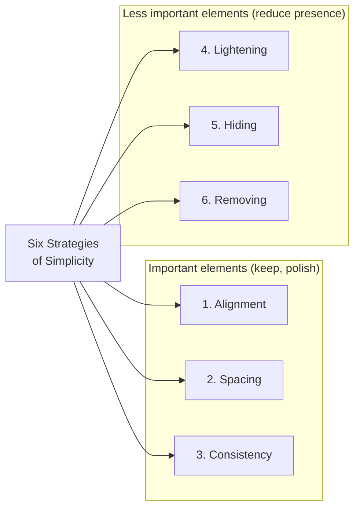
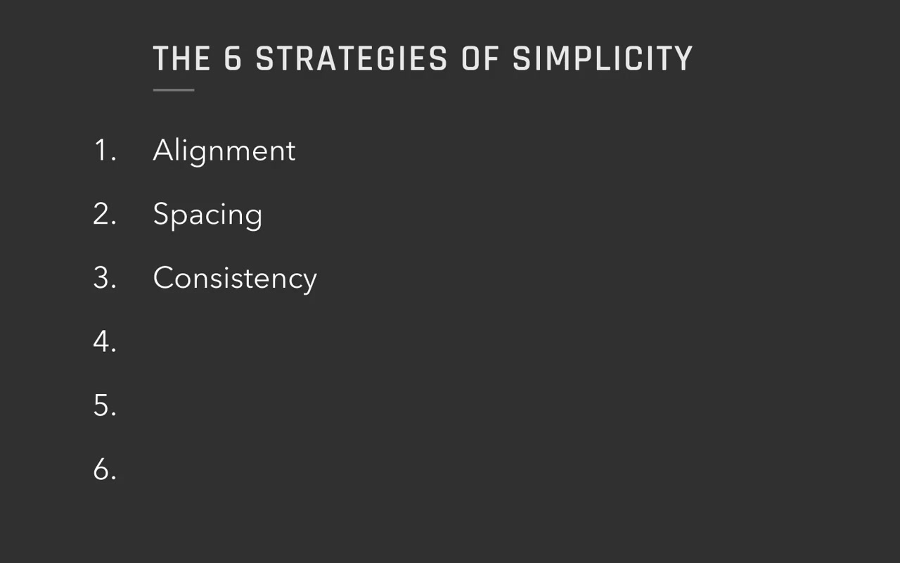
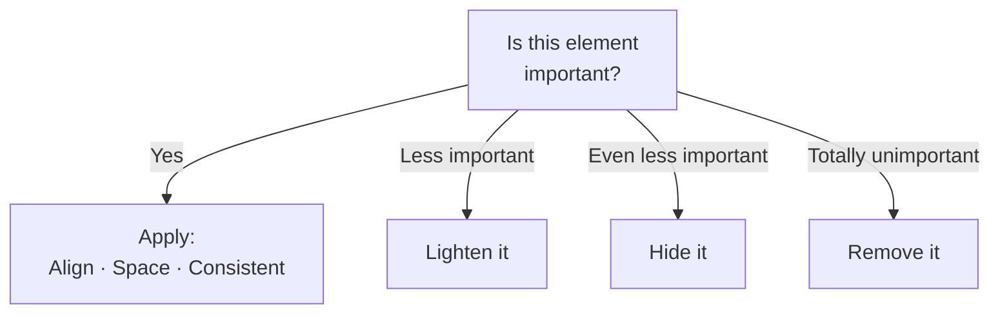
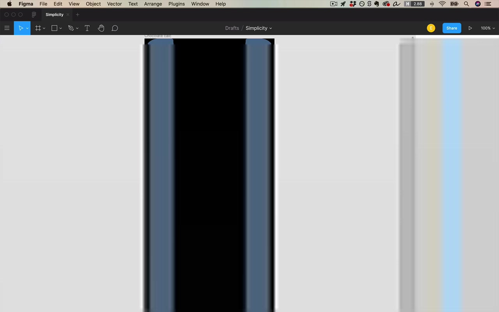
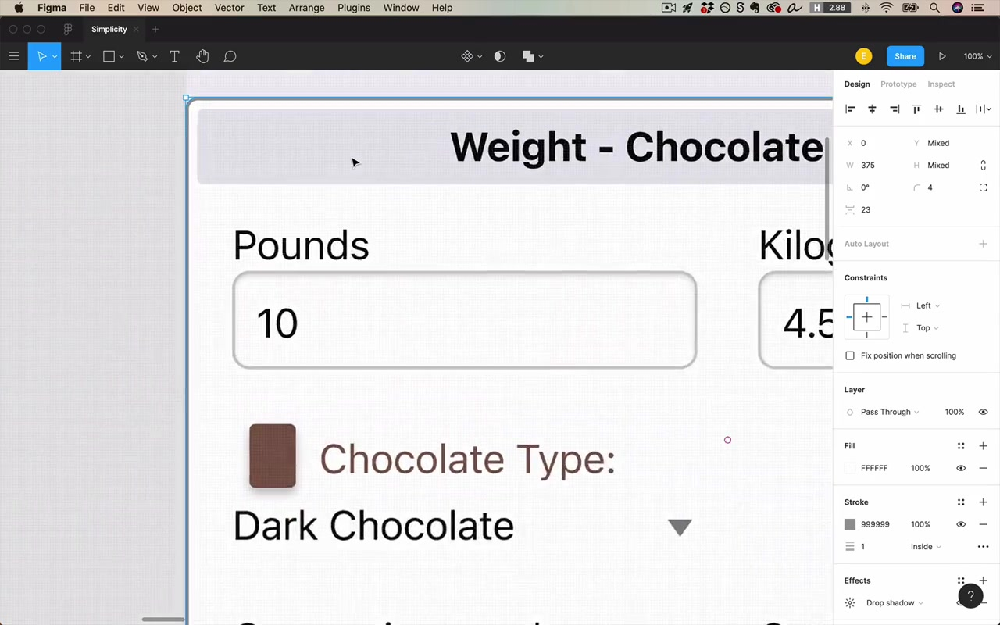
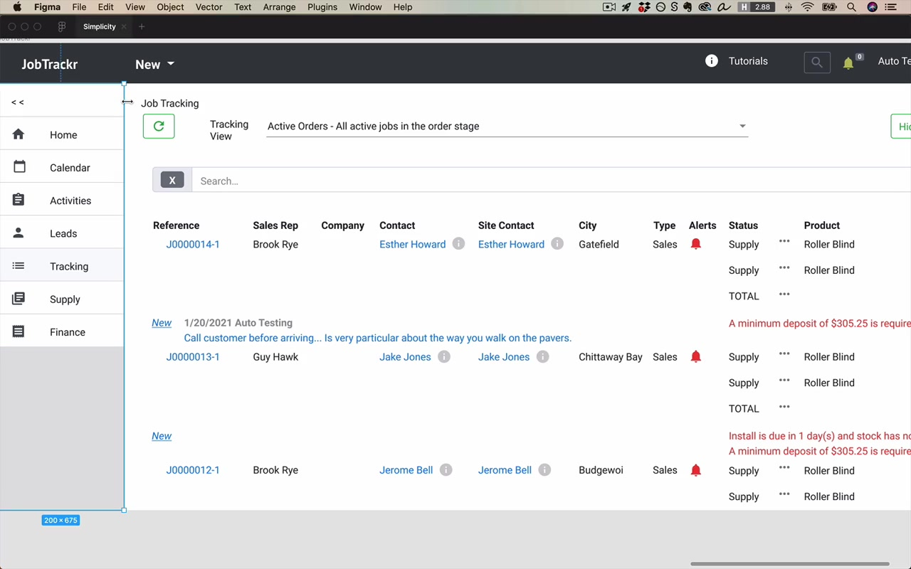
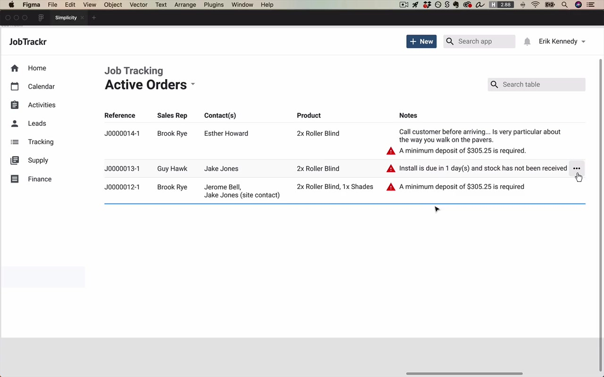

# Simplicity

**Unit:** 02 — Fundamentals of UI Design
**Lesson:** 06 — Simplicity

---

## Overview

This lesson covers six strategies for making designs look clean, simple, neat, and modern.

> "Those adjectives, by the way, are the most common adjectives that clients use to describe what they want you to design for them."

Being able to make something look neat, clean, simple, and modern is an **extremely valuable skill**. And once you've mastered that, achieving other brand looks — luxurious, friendly, techie, futuristic — all build on top of the lessons in this video. Not around them, on top of them.

> "It's almost difficult to overstate how important this six-pronged approach for making simple designs is."

The instructor wants you to be saying these strategies to yourself as you approach any design that comes across your desk. Whether it's a sketch from a UX designer, a client's half-finished design, or an MVP prototype that needs a spiff up — this framework gives you the power to make measurable progress.

---

## The Six Strategies of Simplicity

The first three have already been covered in prior lessons:

1. **Alignment** ← covered
2. **Spacing** ← covered
3. **Consistency** ← covered

The new ones are:

4. **Lightening** — reducing visual emphasis on an element
5. **Hiding** — making an element not visible by default
6. **Removing** — getting rid of something entirely

The mental model: the first three strategies apply to elements that are important enough that you definitely want them visible. The second three are for less important elements.

---

## Strategy 4: Lightening

**Lightening** means removing emphasis from an element — making it draw less attention. It doesn't have to be literally lighter in color; it just means reducing its visual pop.

Ways to lighten:
- **Reduce size** — a large element can be shrunk to match its actual importance
- **Reduce contrast** — lower opacity (e.g. 50–70%) against its background
- **Replace an oversized element with a smaller, standard icon**

### Example: Veterinarian Calculator App (Mobile)

A mobile calculator where vets enter a dog's weight, chocolate amount, and type to get treatment guidance.

**Problem:** The question mark icon in the header was size 30 — nearly twice as large as the size-17 title. It was huge and oversized for its importance.

**Fix:** Replace the oversized text question mark with a proper Material Design Help icon, shrink it to match the header, and apply ~50–70% opacity so it doesn't compete with the title.

> "I've lightened it in the sense that I've made it smaller... I can literally do it by making it less contrasting against its background using like an opacity 50%, 70%, something like that."

### Meta Content: A Prime Lightening Target

**Meta content** (or **meta elements**) refers to structural/organizational content that is not actual data — it shows how data is organized, not the data itself.

Examples of meta content:
- Borders and strokes around cells/rows
- Background color changes used as dividers
- Shadows
- Bullet points
- Characters used to separate sections

> "A lot of times content like this... I call meta content, and meta content or meta elements are often the first things that you go to lighten."

In the desktop job tracker example, the table had heavy borders and alternating row backgrounds. The first move was to strip all of that out and then add back exactly as much visual weight as was actually needed — no more.

### Repeating Elements: Another Lightening Target

Anything that repeats on every row of a table needs to be lightened because repetition multiplies visual weight. Something that looks fine on a single row becomes overwhelming when it appears 20 times. You can have a repeating element be quite faint and it will still catch the eye through repetition alone.

> "Something may look good if you just design a single row, but then when you duplicate that row a bunch, that element now attracts your attention way too much. So a lot of times, you just have to lighten repeating elements."

---

## Strategy 5: Hiding

**Hiding** means taking an element and making it not visible by default. The content is still in the app; it's just moved to a menu, hover state, different screen, pop-up, etc.

> "The more you can do that, the simpler of an appearance your screen will have."

### Example: Bottom Bar (Mobile App)

The vet app had a bottom bar with three actions: Reset Inputs, Print, and Scan. These looked like major navigation destinations but were actually just occasional actions. They were moved into a hamburger/three-dot menu icon in the header.

> "I don't think I'm very often gonna want to print or scan this information. So I would say these actions actually better belong in a menu."

### Example: Toolbar Buttons (Desktop App)

In the job tracker, several header buttons were candidates for hiding:
- **Hide Details** button — if you do your job well, all columns should be manageable by default, so this can be removed
- **Refresh Data** button — either auto-refresh on updates, or show a toast/prompt when new data is available instead of requiring user-initiated refresh
- **Tutorials link** — unless heavily promoted, move it to the user dropdown (alongside Log Out, Settings, etc.)

> "Rather than make the user actively refresh, either we should just do it whenever there's a data update, do it automatically, or if that's too expensive, perhaps just prompt the user with some sort of message that might appear at the bottom of the screen."

---

## Strategy 6: Removing

**Removing** means getting rid of an element entirely from the app — not hiding it, not lightening it, just gone.

### Examples:
- The decorative chocolate emoji in the vet app header — added nothing to the title, removed entirely
- The "Minimize Sidebar" button in the job tracker — the sidebar already didn't attract too much attention, so this button was unnecessary clutter

> "The removal strategy works really well for anything that everyone agrees we just don't need, but it also can work well if you can say, convince your client that we don't need something in this version of the software."

The right way to frame it to a client:

> "Hey boss, let's actually wait for users to complain about this being missing before we decide if we want to put it back in or not."

> "It's the easiest decision in the world to add something in that your users want. It's much harder to remove something when you're not necessarily sure."

Removing doesn't only mean removing forever — it can mean:
- Removing from this version (add later if users ask)
- Removing on mobile but keeping on desktop
- Removing from the default view but keeping accessible elsewhere

---

## The Squint Test (Companion Tool)

The squint test is the key tool used alongside these six strategies. Squint your eyes (or add a blur overlay) and ask: what high-level structure is immediately apparent?

When rebuilding the vet app, the goal was that even a squinting viewer could tell: "there are inputs on top, and results below." Two separate card sections communicated this structure clearly.

In the job tracker, the squint test revealed that the page title wasn't reading as the dominant title — one of the filter controls looked bigger than the page heading. That directed the fix: bold and enlarge the right text.

---

## Applied Walkthrough 1: Vet Chocolate Calculator (Mobile)

**Starting point:** A rough mobile UI with mismatched inputs, oversized icons, a decorative bottom nav, and cluttered layout.

### Step-by-step simplification:

1. **Lightening:** Replaced the giant question mark with a proper small Help icon at reduced opacity
2. **Hiding:** Moved Reset/Print/Scan from a prominent bottom bar into a three-dot menu icon
3. **Removing:** Deleted the decorative chocolate image from the header
4. **Consistency (inputs):** Redesigned the dual-textbox rows (lbs + kg on the same row) into single textbox + unit dropdown, matching standard app patterns
5. **Card structure:** Split the one big card into two cards — "Inputs" and "Results" — each with a left-aligned section title outside the card
6. **Borders removed, then added back selectively:** Removed all card borders and shadows first, then added horizontal dividers between rows when spacing alone wasn't enough to convey grouping
7. **Consistency in results section:** Added a label to the previously unlabeled "Total Methylxanthines" row so both results rows followed the same label + value format

> "Really the name of the game here is remove it now and then add in later as necessary. But default to removing stuff now. Go as simple as possible and then add in whatever is necessary."

---

## Applied Walkthrough 2: Job Tracker (Desktop)

**Starting point:** A desktop admin app with a data table, sidebar, and header — loaded with borders, competing colors, oversized UI chrome, and too many action buttons.

### Lightening the table:

- Removed all table cell borders and alternating row backgrounds
- Converted the header row from a filled background to just a very faint bottom border (using Shift+X to swap stroke/fill)
- Gave all text and icons a unified color (variations of one hue — a concept covered in the color unit)

### Hiding:

- Moved the Tutorials link into the user account dropdown
- Planned to show row-level action buttons on hover only (not visible by default)

### Removing:

- Deleted the "Hide Details" button
- Deleted the "Refresh Data" button (replaced with auto-refresh logic)
- Deleted the "Minimize Sidebar" button

### Header cleanup:

- Shrunk the search bar to a natural maximum width (no need to span full screen)
- Unified search bar and "New" button to consistent height (32px)
- Left-aligned the "Active Orders" view title as the dominant page heading; lightened "Job Tracking" to a secondary label
- 20px consistent spacing around all header elements

### Sidebar:

- Kept all icons aligned and consistent
- Set spacing so internal icon-to-label gap was less than row-to-row gap (internal < external spacing rule)
- Used 20px vertical spacing between rows, 16px horizontal gap between icon and label

### Table columns — deciding what to keep:

The guiding question for tables is:

> "In a table, the stuff that we want to keep is anything that helps the user decide what row they're gonna dig into... Anything that helps them decide that action is what we keep."

Going through columns:
- **Reference #** — kept, important for identification; switched to left-aligned (not digit-for-digit comparable, so right-align adds nothing)
- **Links in rows** — removed blue link styling from all inline links; prefer clicking the row itself to get to details
- **Sales Rep** — kept
- **Company** — removed (no actual data present)
- **Contact + Site Contact** — these were the same person in most cases. Instead of hiding one, created a **custom data display**: single "Contact(s)" column that shows one name if they match, or stacks both names if different. Saved an entire column.
- **City** — removed
- **Type** — removed
- **Sub-rows per order** — most orders are 1–2 items; created a summarized product display inline rather than expanding rows

> "This is a great strategy for kind of hiding excess data — think: can I do a custom data display to make the display as compact as possible in the most common cases?"

### Alerts / Notes column:

Multiple alert types (minimum deposit, call-before-arriving, stock not received) were consolidated into a single **Notes** column with:
- Text notes in the standard color
- Warning icon (Material Design) in a warning color for true alerts

> "It's a very common beginner mistake to overuse color, especially in things like text. So we're gonna avoid it when we can."

> "No one has to read an icon. You just glance at it once and you're good."

Final result: alerts are the most attention-drawing element in the table, which is appropriate given their urgency.

---

## The Antoine de Saint-Exupéry Quote

At the point of working on the complex data table, the instructor invokes a famous design principle:

> "Perfection is reached not when there's nothing left to add but when there's nothing left to take away."

> "It also really applies to UI design."

This is how to approach client conversations about dense tables: push hard on what can be removed, not what can be added.

---

## Key Principle: Simplicity is Hard

The instructor closes with an important corrective for dealing with client expectations:

> "Simple is not quick."

> "It takes work to consider exactly what is necessary and exactly what is not so necessary and cut all the unnecessary stuff or hide it or whatever. Those are hard decisions."

> "Don't lower your rates because someone says they want a simple design."

The reason designs look bland in the fundamentals lessons — no exciting brand, just clean and neutral — is intentional. Brand excitement (color, typography, imagery) comes later. First, nail the skill of making something simple.

> "Making something simple is hard enough and it's a skill worth mastering on its own."
