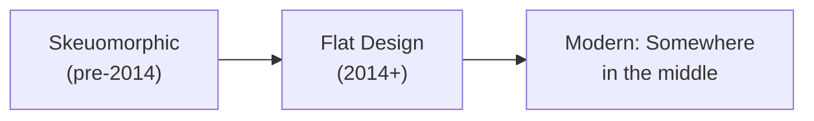
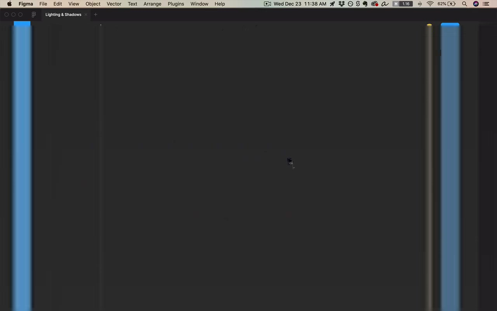
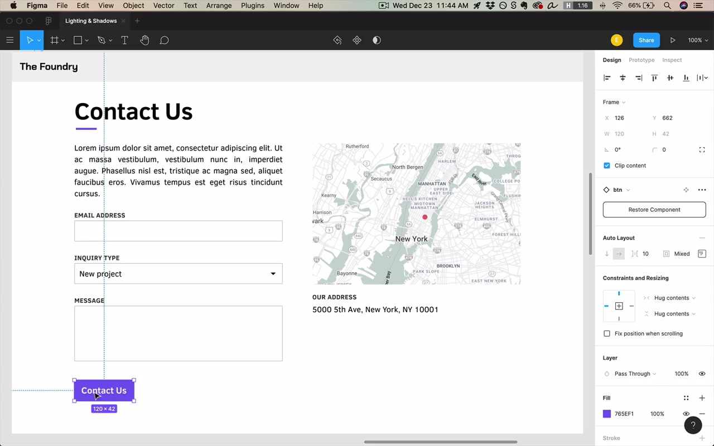
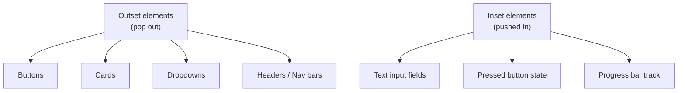
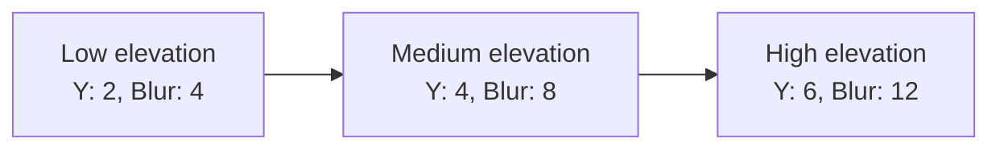
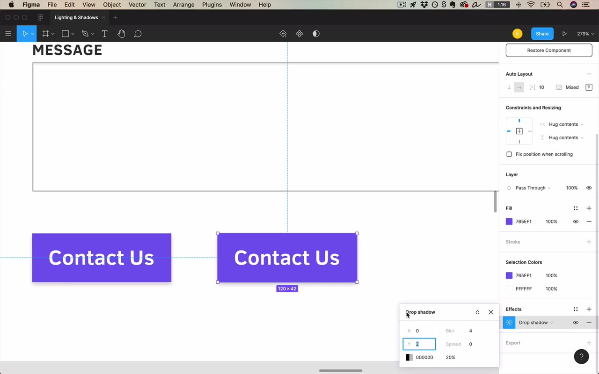
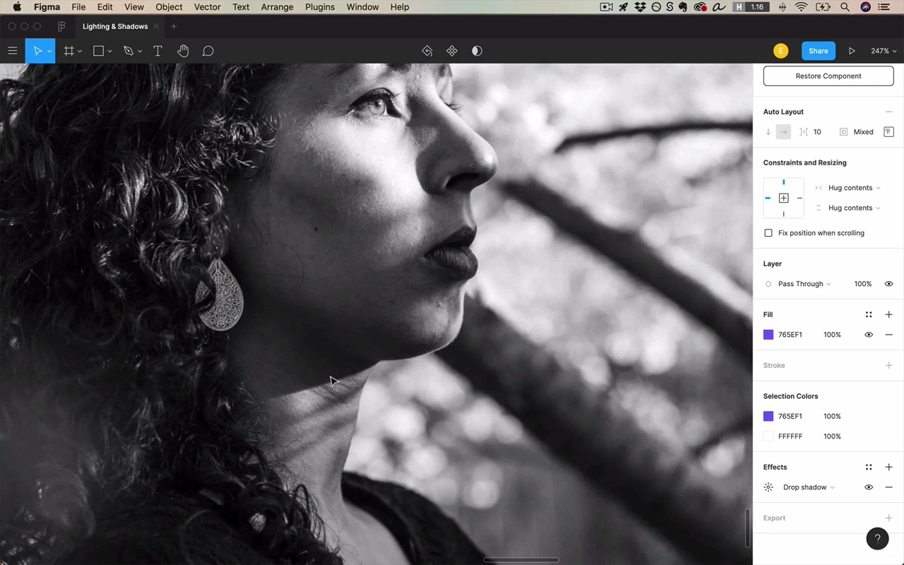
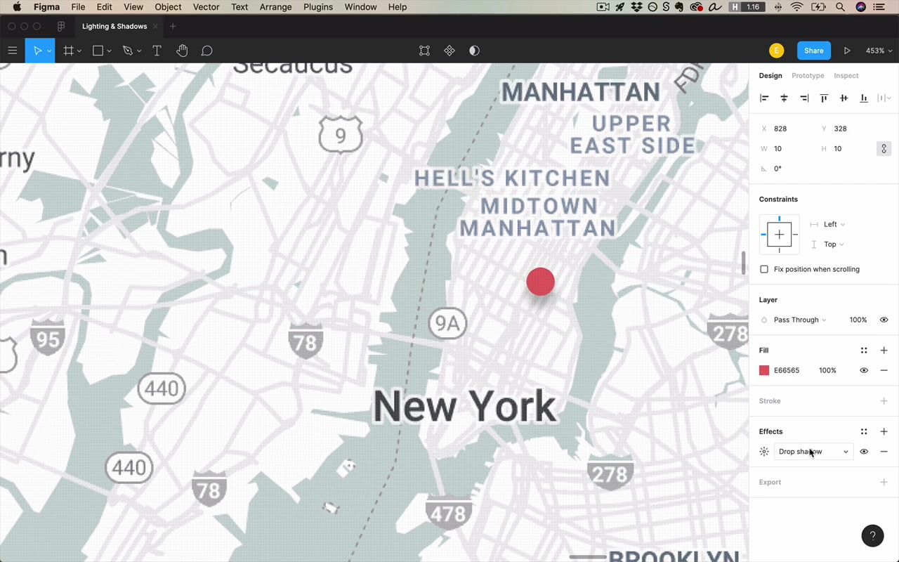
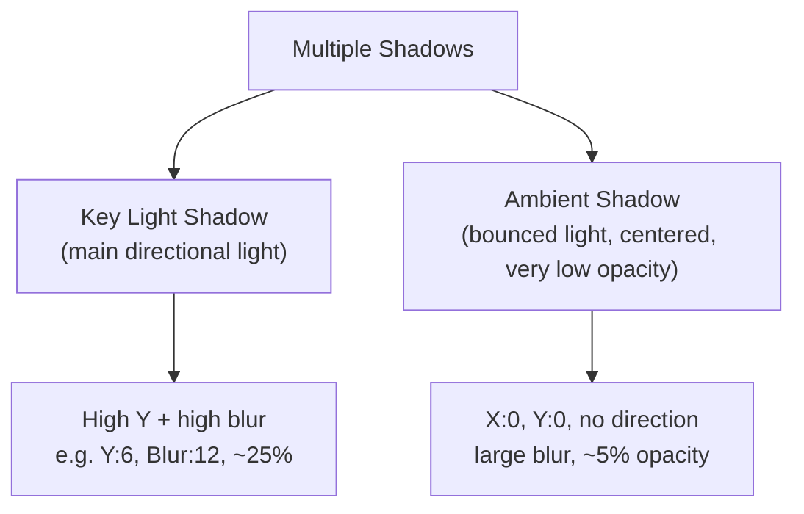

# Lighting and Shadows

## The Core Principle: Light Comes from the Sky

> "Light comes from the sky — that is probably the source of one of my earliest breakthroughs in UI that just kind of made everything click."

This one idea underpins every shadow and lighting decision in UI. Whether it's the sun outdoors or a ceiling light indoors, light almost always comes from above. The classic horror movie trick — shining a flashlight up at your face — works precisely because it violates this expectation.

Even though interfaces are flat colored pixels on a screen, we still want to **imitate real-world lighting effects**. Every shadow and highlight ultimately traces back to this single principle.

## Skeuomorphism vs. Flat Design

The instructor uses old iOS (pre-2014) as a reference — a highly **skeuomorphic** design (imitating real-world shadows, textures, and lighting).

> "Since about 2014, this has really dropped off in popularity and we really quickly went into an era where everything became flat."

Most designs today use principles from skeuomorphic design while keeping things flat and clean. **Both extremes are valid**, though heavy skeuomorphism can look dated depending on execution.

The instructor points out that in a skeuomorphic iOS button, every single effect — the gloss, the highlight, the shadow, the divot lines — comes from the principle of light from above. Even the divot between controls creates a *dark line on top* (top face is in shadow) paired with a *lighter line below* (bottom face catches direct sunlight).

## Breaking Down the Drop Shadow Properties

Examined in Figma's drop shadow effect panel (click the settings toggle icon after adding "Drop shadow").

### Color

Shadow color should almost always be **black**.

> "If you're painting watercolors, go wild — but in the world of user interface design, 99.9% of those shadows are gonna be black. And let's not overthink it."

A black shadow can only appear distinctly colored if the background is itself highly saturated. Exception: colored shadows on colored backgrounds (covered more in the color unit).

### Opacity

Represents the **strength of the light source**.

- `0%` = no shadow
- `100%` = pure black (almost never want this)
- **Sweet spot for light backgrounds: 20–25%**
- Light/large shadows: can go as low as 5–10%
- Particularly dark shadows: 35–40% (usually when the background itself is darker)

> "I would say 80% of the time, you're just gonna want a shadow that starts at about around 20%."

Consistency of opacity values isn't critical — it matters less for shadows than for other aspects of design.

### X and Y (Position)

- **X**: horizontal offset. Since light comes from above (not the side), this is almost always `0`. Moving it would imply a sunset/sunrise angle.
- **Y**: vertical offset. Light from above casts shadows *below* objects — so Y is almost always a **small positive number**.

> "I don't think I've ever designed something that had lighting coming from below and therefore needed a negative Y value."

Typical Y values: **1–4 pixels** for standard shadows. Larger Y values are for elevation effects (see below).

### Blur

Controls how **focused the light source** is, and also implies the **distance** between the object and the surface it casts a shadow on (these are physically the same thing via light refraction).

- `0` blur = hard-edged shadow (looks like another rectangle was placed below the element)
- Large blur (e.g. `40px`) = very soft, diffuse shadow

Blur value tends to be **equal to or slightly larger than the Y value** for natural-looking results. If you have a large Y + large blur, compensate by reducing opacity.

### Spread

An **unrealistic property** — it artificially grows or shrinks the size of the shadow's source object.

- **Positive spread**: shadow extends beyond where it normally would (element appears even larger)
- **Negative spread**: shadow is "sucked in" — as if the element is so close to the camera it's obscuring its own shadow. Creates a softer, more contained effect.

> "It's as if this element is popped out of the screen so much it's obscuring us from seeing its own shadow."

Default for most shadows: **spread = 0**. Negative spread becomes useful for soft shadows on larger elements (see the soft shadow recipe below).

## A Standard Default Shadow

The instructor's personal go-to starting point:

| Property | Value |
|----------|-------|
| X | 0 |
| Y | 1–2 px |
| Blur | 2–4 px (slightly larger than Y) |
| Spread | 0 |
| Opacity | 20% |

Then tweak from there. This is "about as small as it gets while still being noticeable."

## Practical Application: Outset vs. Inset

The instructor coins a useful pair of terms for this course:

- **Outset** = element pops out of the screen → drop shadow below
- **Inset** = element is pushed into the screen → inner shadow

> "I realized that is inventing a new usage of the English word outset... It's a new definition, that's not what it means. But just bear with me, inset and outset are opposites for the purposes of this course."

### Headers

Headers are always **outset** — the shadow goes below, into the page. A subtle rule: things that are more popped out of the screen catch slightly more sunlight and should appear slightly lighter/brighter than the recessed background.

> "I shouldn't actually have a light gray header in the first place, because if light comes from the sky, the things that are more popped out of the screen are gonna be just slightly more available to catch the sun's rays."

The practical implication: a header should be **white** (or lighter than the background), while the main content area is the slightly grayer color.

### Light Header on White: A Pitfall

When a light gray element casts a shadow onto a white background, the shadow can be hard to distinguish — the eye can't easily tell where the object ends and the shadow begins. Solutions:
1. Remove the shadow entirely (always valid — shadows are optional)
2. Make the header white and the page background slightly gray

### Text Inputs / Form Fields

Text inputs, if not flat, are usually **inset** (inner shadow). This communicates "I'm typable, click in and start typing." However:
- Big search inputs are sometimes outset
- Flat inputs are the most common pattern today
- Text inputs have **more leeway** than buttons

### Dropdown Menus

Usually **outset** if not flat (same as buttons).

## Simulating Elevation

To make an element appear **raised higher** off the screen, both Y and blur need to increase together (not just Y alone).

The rule: **multiply both values** (by 2, or by 1.5) to step up elevation levels. Just increasing Y without increasing blur looks wrong — in reality, a farther shadow has softer edges because light diffracts around the object.

The instructor demonstrates this with a real-world photo: shadows from objects *close* to the surface (chin on neck) have crisp, hard edges; shadows from objects *far* away (tree branches on a neck) are soft and fuzzy. Sunset shadows: feet and legs = crisp, head shadow = fuzzier, building shadow = fuzziest of all.

### Hover State with Elevation

A hover effect can be simulated by transitioning from a lower-elevation shadow to a higher-elevation shadow:
- **Default**: Y:2 Blur:4
- **Hovered**: Y:4 Blur:8

The effect: the button appears to *rise up to meet you* as you hover. Material Design uses this pattern, and even adds more elevation on mousedown.

Alternative clicked state: use a slightly darker background color + an **inner shadow** to imply the button was pressed *into* the screen.

## Soft Shadows with Negative Spread

A soft shadow recipe for larger elements:

- Y = some positive value
- Spread = **equal and opposite** to Y (negative)
- Blur = **4× Y value**
- Bump up opacity since spread reduces visibility

Effect: the shadow fades out around the corners, giving a sense of something floating gently above the surface. Works best on large, card-like elements.

> "The thing that's kind of beautiful about having a negative spread is it sucks the shadow in... the shadow starts to disappear around the corners."

## Using Spread to Simulate Light (Not Shadow)

Spread + a colored shadow can create a **glow/light effect** rather than a shadow:

- Set shadow color = element's own color (or your brand color)
- X = 0, Y = 0 (centered)
- Blur = 0
- Spread = positive value (grows outward)
- Opacity = ~50%

This creates a glowing ring around the element. You can even animate the spread value for a pulsing beacon effect.

> "I found it can be very cool to reduce the blur to zero... and if I start to give it a positive spread — this could be a beacon that sort of shoots out some light and disappears."

**Bonus use: focus state.** When a form input is focused, apply a centered shadow using the theme color, zero blur, and a small positive spread. This draws the eye to the focused field for keyboard navigation users.

## Bottom-Only Shadow Trick

To create a shadow that appears **only on the bottom** (not the sides):

1. Set a positive Y value
2. Set blur ≈ 4px
3. Set spread to **negative** — enough to counteract the blur spreading outward on the sides
4. The negative spread sucks in the sides, but since the shadow is offset downward by Y, it remains visible on the bottom

Result: shadow on bottom only, invisible on top and sides. Useful for images (e.g. a book cover grid) to hint at depth below each item.

## Blurred Layer Shadows

An alternative to Figma's drop shadow property: draw a **separate black oval/ellipse** below an element, then apply a **layer blur** effect to it.

Benefits:
- More control over the shadow shape
- Can make the shadow appear completely detached from the element (implying extreme elevation)
- The shadow is visible as a standalone disc, not forced to hug the element's edges

## Multiple Shadows (Key Light + Ambient)

From cinema: the **key light** is the main light source (sun/lamp from above). **Ambient light** is the diffuse light that bounces off everything in the scene.

The ambient shadow layer helps prevent an element from blending into a light background at its top edge — where the key light shadow is weakest.

To apply:
1. Add a standard elevated shadow (key light shadow)
2. Add a second shadow with X:0, Y:0, large blur, very low opacity (~5%)

## Non-Shadow Lighting: Bevels and Glints

Moving beyond drop shadows into surface lighting effects:

### Bevel Effect

A bevel implies that the edge of an element is not a hard 90-degree angle but has a slight taper. This is commonly represented with a **gradient stroke**:

- Linear gradient stroke
- Top color: near-white (catching direct sunlight)
- Bottom color: near-black or dark (facing away from light)
- Blend mode: **Soft Light** (preferred over Overlay or just changing opacity)
- Reduce overall opacity (~60%) to taste

Note: in CSS, specifying a blend mode for just a border on an object without a blend mode is not straightforward — you'd need to sample the actual color values and hand them to the developer.

### Indented / Debossed Effect

An **emboss** pops something out; a **deboss** pushes something in.

To deboss an element (make it appear pressed into the button surface):
- Add a fill with a **linear gradient**: black at top fading to transparent at bottom (at 20% or so opacity)
- Optionally add an inner shadow

For a standard protruding button, the gradient is reversed: **white at top fading to transparent at bottom** (top catches more light).

> "This is not an effect I think I've used professionally since like 2013 or so."

## Inset vs. Outset: Industry Patterns

A quick reference of how common controls conventionally handle shadows:

| Control | Convention |
|---------|------------|
| Buttons | Always outset |
| Cards | Always outset |
| Dropdowns | Usually outset |
| Headers/Nav | Always outset |
| Text inputs | Usually inset, or flat |
| Progress bar (track) | Inset |
| Progress bar (fill) | Outset |
| Checkboxes / Radios | Varies — more leeway |
| Disabled controls | **No shadows ever** |

> "I just wanna say that you should never ever ever have any shadows on a control that's disabled... Shadows, they don't always imply clickability, but a lot of the time they do."

### The White Card Mistake

A very common beginner mistake: using a light gray for a card against a white background. This makes the card appear *pushed into* the screen rather than raised out of it — the opposite of the intended effect.

> "Anything that's darker appears pushed in. Well, I'm really shooting myself in the foot then if I'm trying to make this look like a card."

Fix: make the card white, and if you want a color contrast, make the *background* the light gray (not the card).

## Real-World Reference: Three Different Apps

The instructor walks through three examples of shadow philosophies in production apps:

1. **Dribbble**: Very few shadows, almost entirely flat
2. **Harvest** (invoicing): Slightly skeuomorphic — gradient fills on buttons/headers, beveled dropdowns
3. **Duolingo**: Cartoony, bold — uses a hard "shadow" made from a flat darker-colored layer, not a blurred drop shadow

All three are valid and well-executed; they just aim for different brand feels.

## Meta Advice: Look at What Good Designers Do

> "Go and look at examples whenever you need to design a control. If you're wondering how you should apply shadow somewhere, don't just guess at it — go see what there is. Because once you start consciously noticing this stuff, you're gonna pick up on little effects and trends and ways of doing things that you just didn't notice."

## Closing

> "Light comes from the sky, right? Remember that and you'll be [set] — all the rest is more or less just details."

The hardest practical challenge with lighting and shadows isn't knowing the rules, but achieving **visual coherence** across all the different form elements in a design when some are flat, some are shadowed, and individual values vary. That's the homework.
