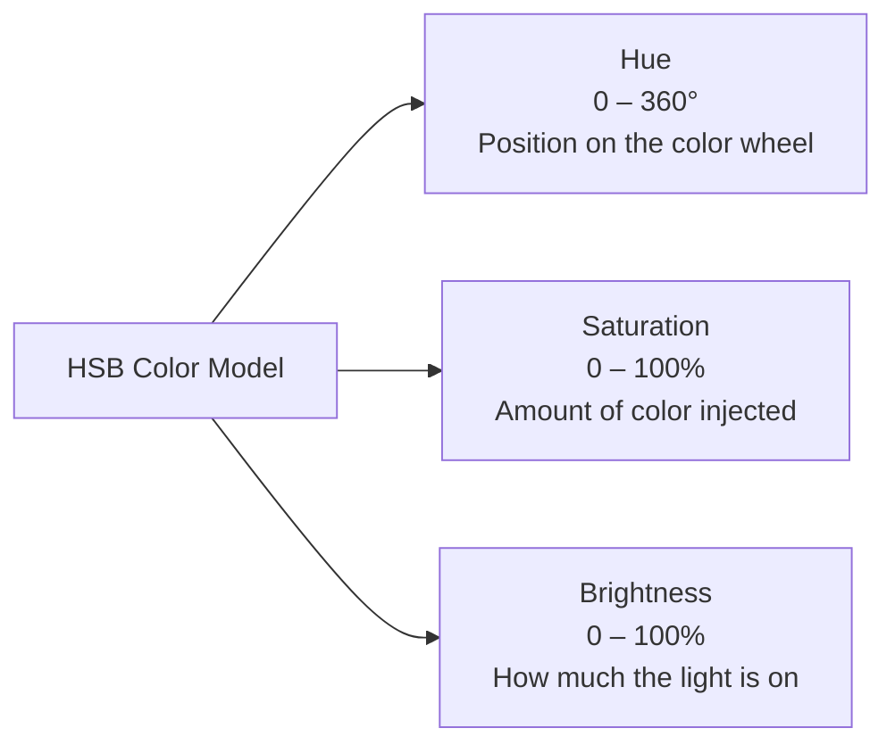
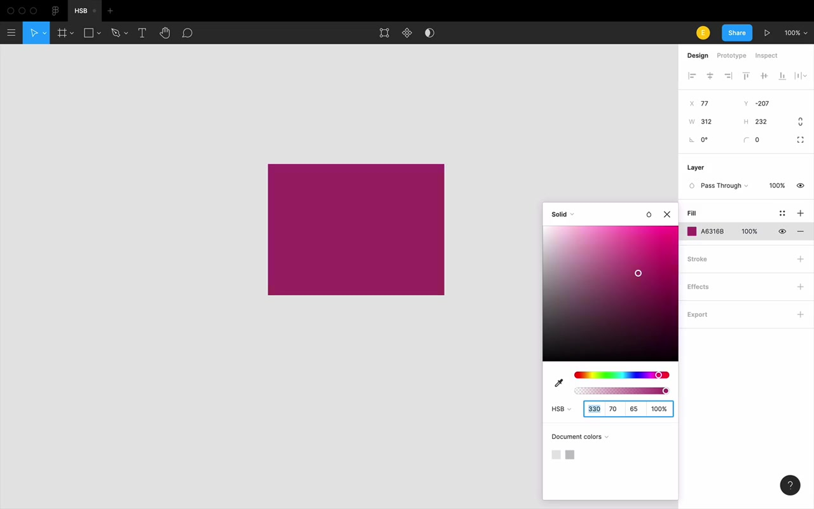
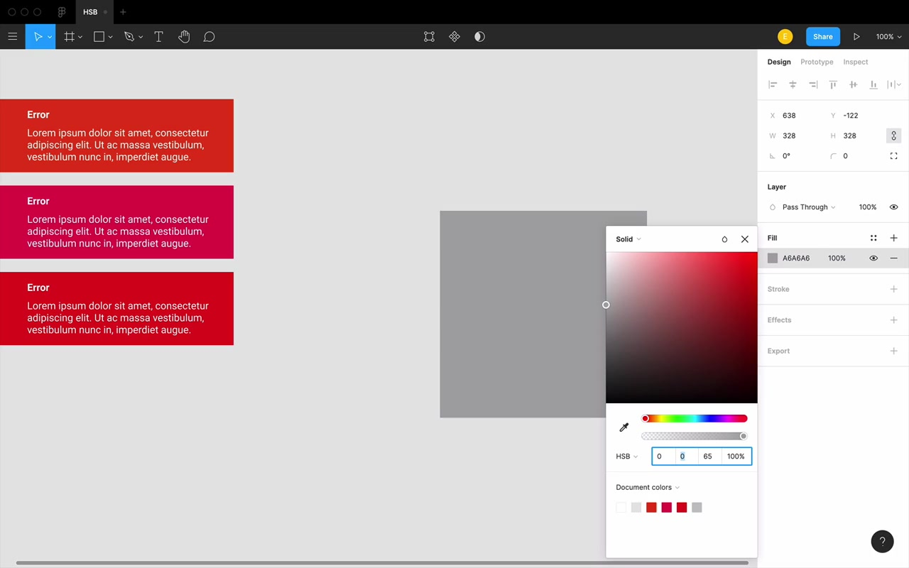
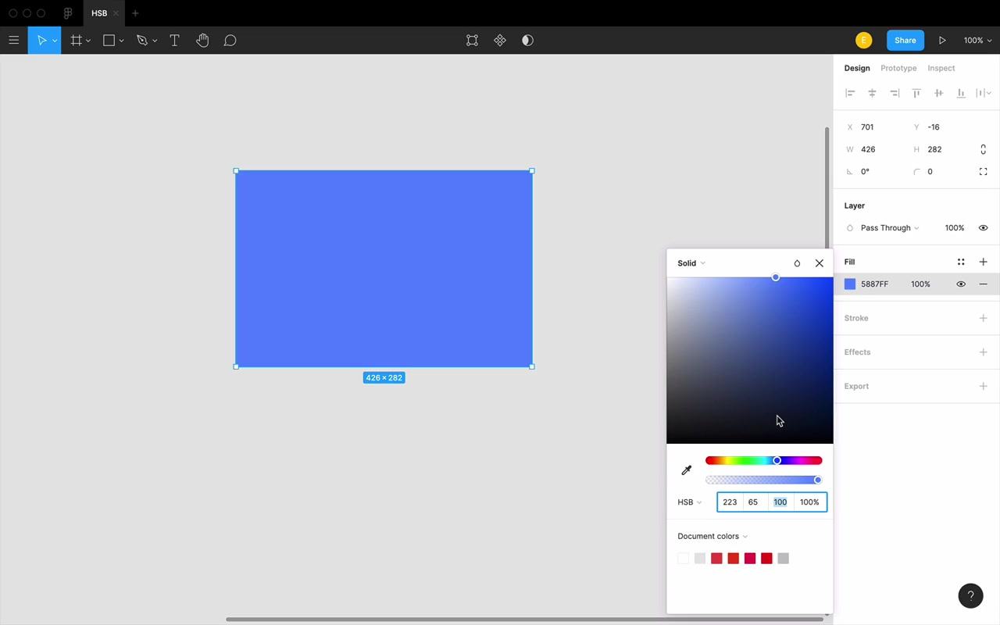
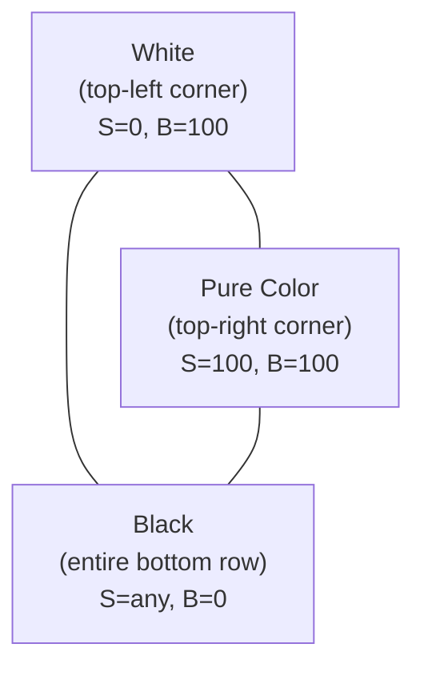
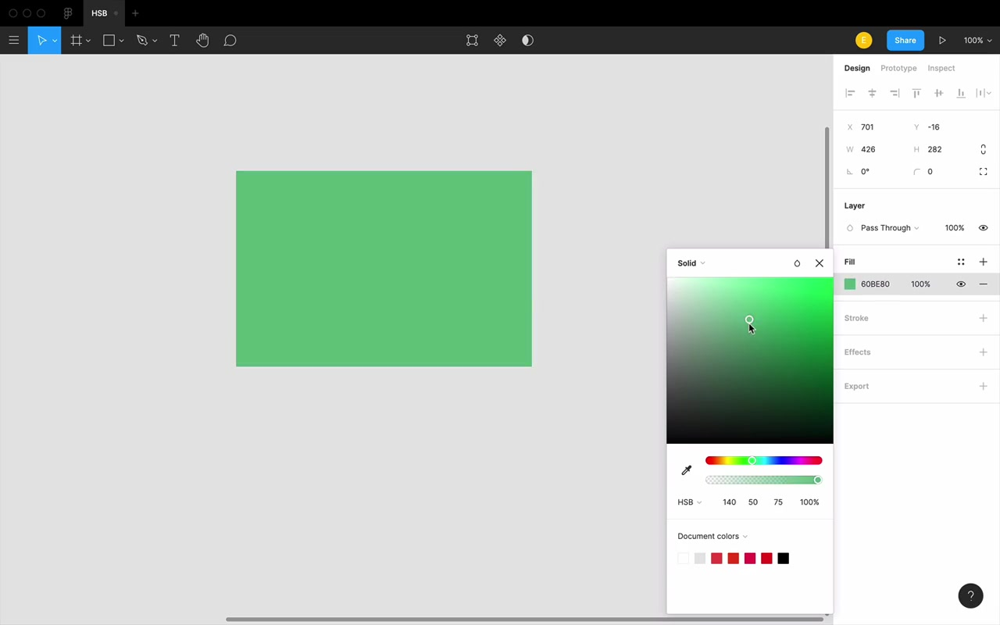
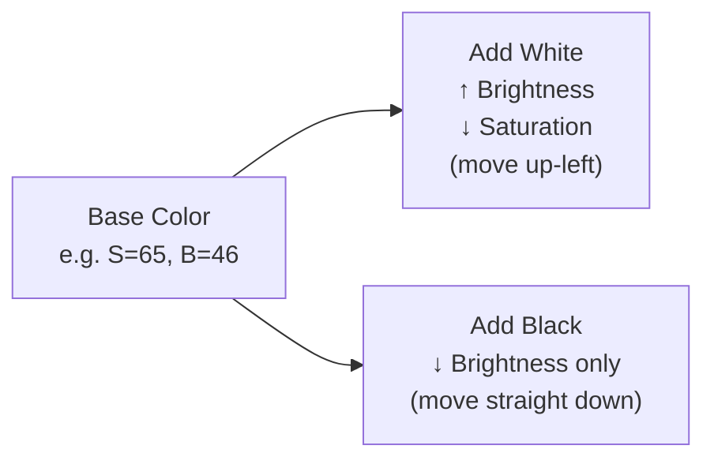
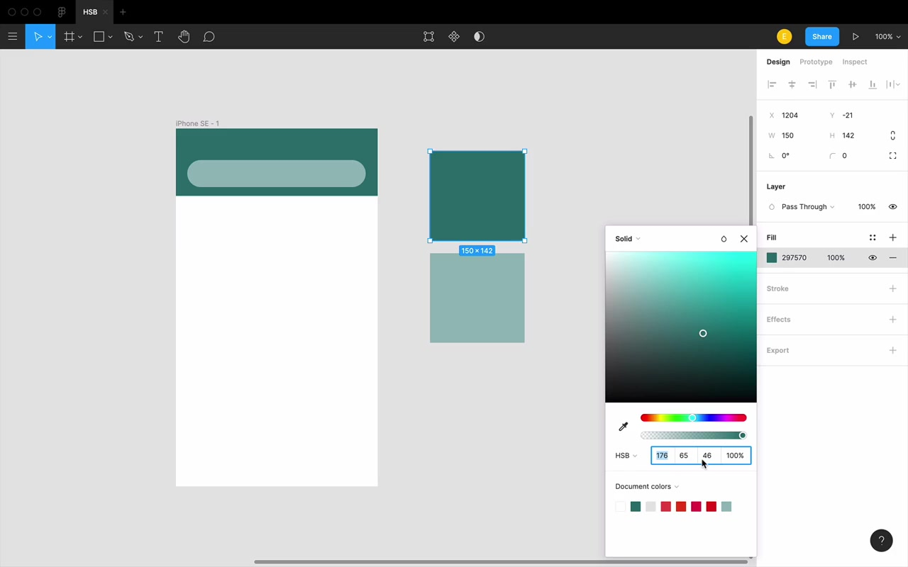
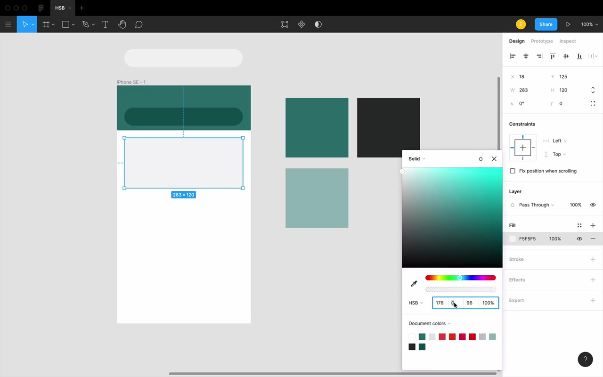

# Introduction to HSB

## What Is HSB and Why Does It Matter?

**HSB** stands for **Hue, Saturation, Brightness** — one of many systems used to name individual colors. RGB and hex are more common, but:

> "HSB in my opinion, is the most practical and the most intuitive."

For that reason, HSB is the foundation of the Learn UI Design color system — the way color will be taught and used throughout this course.

**Setting it up in Figma:** Pick any layer, go where RGB or hex is shown, and slide down to HSB. You now have three numbers (plus opacity as a fourth, simpler value).

---

## The Three Properties

---

### Hue

**Hue** is a number from **0 to 360** — literally the degrees of a circle, where the circle is the color wheel. It represents *which color of the rainbow* you're closest to.

- **0 (and 360)** = pure red — they are exactly the same thing, no difference
- **120** = green (centered)
- **240** = blue (centered)

Red, green, and blue split the wheel into three equal 120° segments.

**Key insight:** Hue is independent of shade. Every version of a color — light, dark, desaturated — shares the same hue value.

**Practical use of hue — bending a color:**

> "This error message, it kinda feels boring. Maybe my app is supposed to be pretty chill and relaxed, and this feels very intense and in your face. I'm just gonna try bending the hue a little bit."

- Shift hue +10–20° toward orange → still reads as red error, but slightly warmer and less aggressive
- Shift hue down toward 340° → starts approaching pink; "I can kinda have a red that has a hint of pink in it"

Hue is really good for coming up with those *slightly different variations* — making something more interesting, making it match your brand just a little bit more.

---

### Saturation

**Saturation** runs from **0% to 100%**:
- **0%** = always gray (and "gray" in this course always includes white and black)
- **100%** = maximum richness — the most color injected into that gray

> "I'm gonna kind of inject color into the gray. That's a good way to think about it."

Going from 100% down: you're removing color until all you have is gray. Going back up: you're injecting color back in.

**Vocabulary to build:** A fully saturated color is **rich**. A low-saturation color is **dull** or **flat**.

> "Another word that you will hear me use a ton in describing saturation is richness."

**Practical use of saturation — toning something down:**

When a color feels like *too much*, searing itself into your eyes, reach for saturation:

> "You know what? This red with 70% saturation actually feels a lot better compared to this blazing red right here."

The key is to blink, step back, and reassess — don't just watch the number slide, because it'll just look like it's fading. Give your eye a moment to re-evaluate.

---

### Brightness

**Brightness** also runs from **0% to 100%**:
- **0%** = black
- **100%** = not white — this is the key surprise

The light bulb analogy:

> "Think of brightness like having a light bulb in a dark room. When that light bulb is off, 0% on, that room is pitch black. As I start to turn that light bulb on a little bit more, it's going to light up the room, but only so much... no matter how much I turn on that light bulb, I can get a brighter and brighter blue, but I'm never gonna get white. There's no blue that's so strong that it just turns into white. That's not how color works."

**Figma color picker mapping:**
- Saturation = left ↔ right on the color square
- Brightness = up ↔ down on the color square

---

## Black and White Are Not Opposites in HSB

> "Black and white are not opposites in this color system."

On the Figma color picker:
- **White** = a single point: top-left corner (S=0, B=100)
- **Black** = the entire bottom row — *any* saturation value at B=0 is black

Getting to white requires **two** conditions: saturation=0 AND brightness=100.
Getting to black requires only one: brightness=0 (saturation is irrelevant).

### Adding White vs. Adding Black

When you mix white into a color (using a 50% opacity white layer over a background), what happens in HSB?

- Saturation **decreases**
- Brightness **increases**

Movement in the color picker: toward the **upper-left**.

When you mix black into a color (50% opacity black layer):

- Saturation **stays the same** (or nearly)
- Brightness **drops** (roughly halved)

Movement in the color picker: **straight down**.

**This matters:** In real-world shadows and lighting, a darker variation of a color isn't made by *adding black* — it's made by *removing white*. Those are different operations in HSB.

> "We always wanna think in terms of adding white and removing white, not adding white or adding black."

If you rely on adding black to darken colors, your dark variations will tend to look **flat**. Instead, make hand-picked variations by moving down and to the right in the color picker — this produces a darker but still-rich result compared to the flat look of black-at-reduced-opacity.

---

## Saturation Works Slower for Dark Colors

This is a subtle but important quirk: the **same numeric saturation value looks very different** depending on brightness.

**Bright card example (B ≈ 96%):** At just **6% saturation**, the color is clearly recognizable as aquamarine. A tiny injection of color goes a long way.

**Dark sidebar example (B ≈ 15%):** At 6% saturation — looks completely flat gray. At 13% — still nothing, still gray. Had to get to about **44% saturation** before you could clearly perceive the color.

> "When you're working with a very bright color, you actually don't have to add in very much saturation at all for it to be kind of apparent. But when you're working with a very dark color, you can add in a shocking amount of saturation and it's not gonna look crazy."

Practical consequence: dark UI elements (like sidebars, navbars) can take **much higher saturation values** before they feel "too colorful" — and you need those higher values to make the color actually show up.

---

## Homework

The assignment is a **color guessing game** — forge a mental connection between HSB numbers and the actual colors they produce.

> "The goal is that you would be able to look at any color and not only have a sense of roughly what the HSB values are, but eventually you will see a color, know how you wanna change it, know which of those properties you need to change, and by roughly what amount. Now it's a long road, but you will get there."

HSB is foundational — everything in the color section of this course builds on it.
