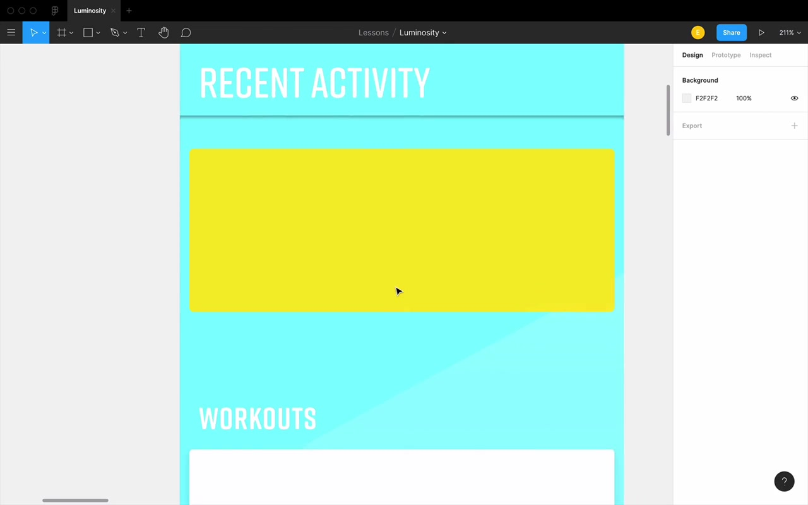
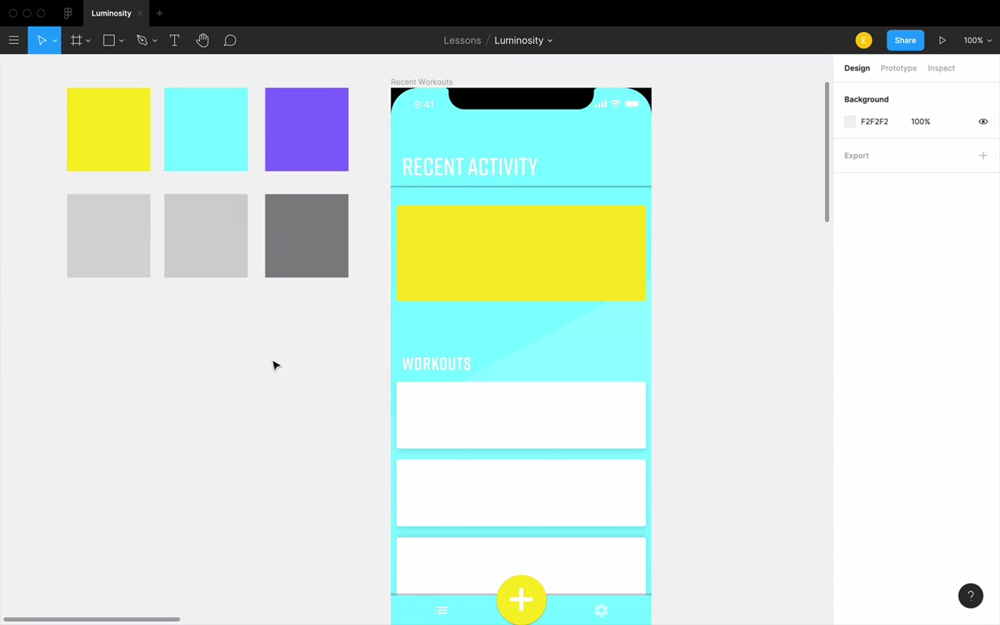
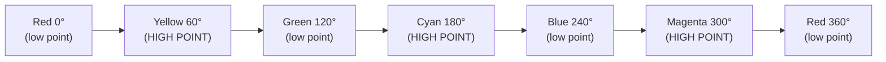
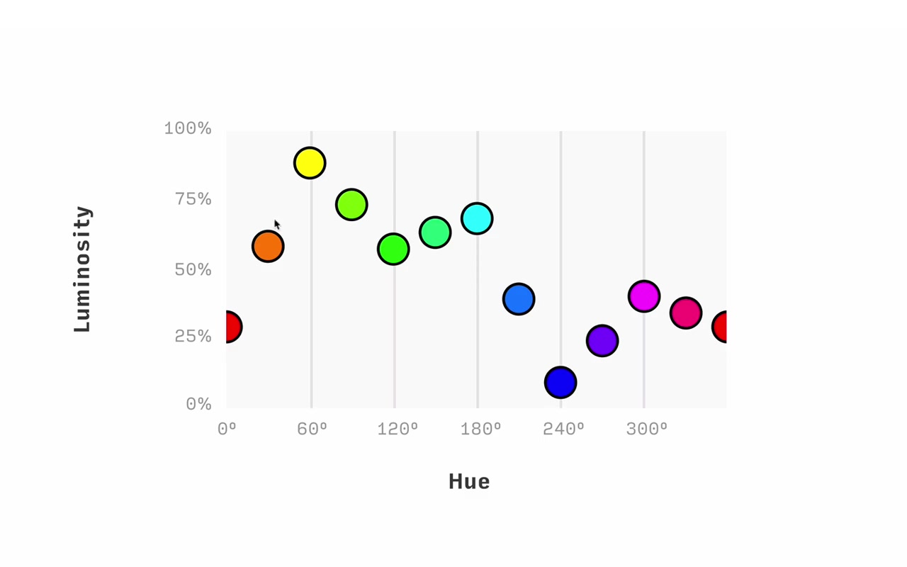
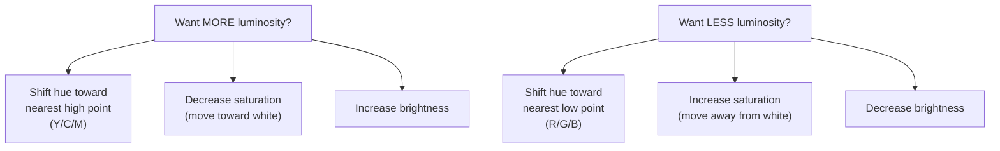
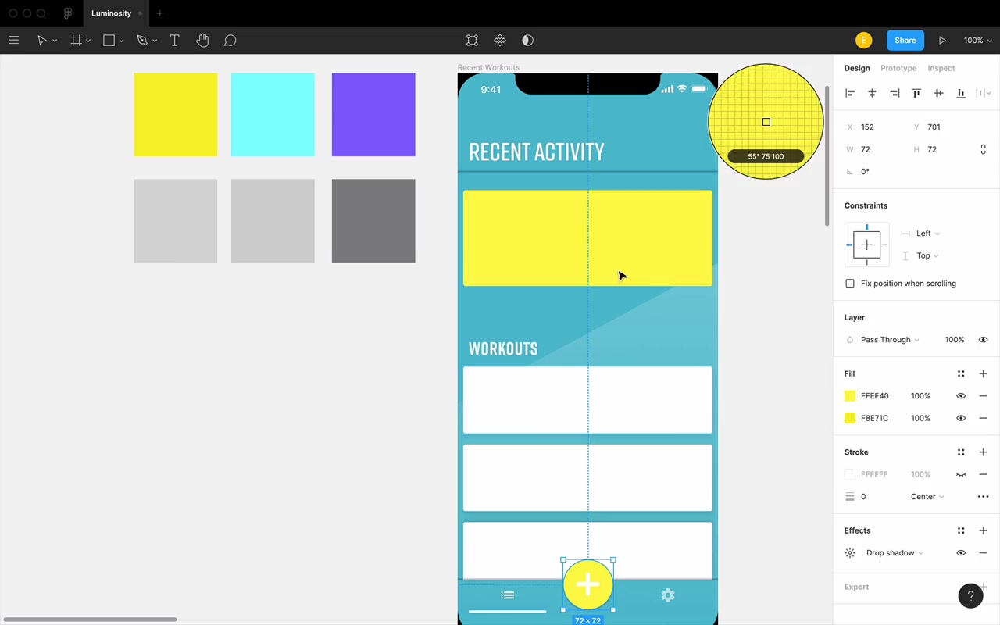
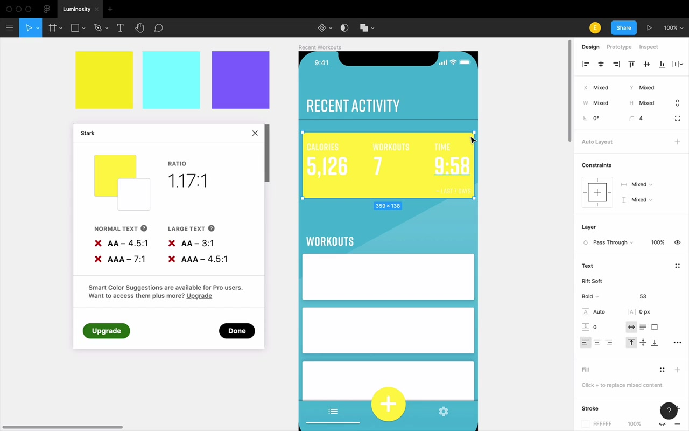
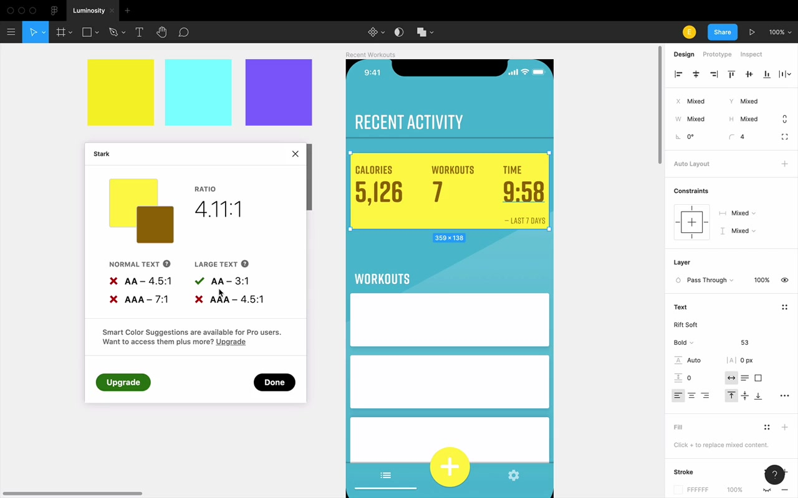
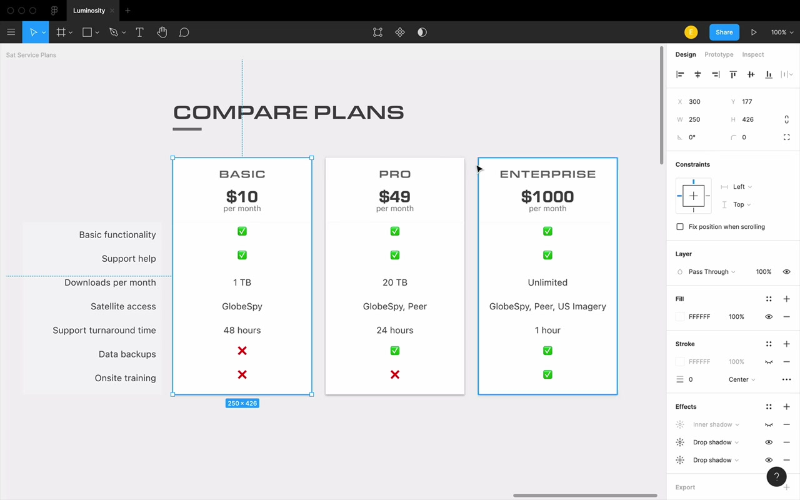

# Luminosity

## Introduction

> "Luminosity is probably one of the most important topics in all of color and UI Design. And yet, to be honest, you basically hear no one talking about it."

Luminosity is a **fourth property of color** — separate from hue, saturation, and brightness, yet related to all three. This lesson covers what it is, how it works, and how to use it to fix very common UI design problems.

---

## The Problem: Brand Colors That Clash

The lesson opens with a Fitness app design scenario: a client hands you two brand colors — **yellow and turquoise** — and says "use these." You apply them, and immediately there's an issue.

> "These colors are both just a lot. They're very bright in your face and they kinda clash and it almost like hurts my eyes a little bit to stare at the screen."

The yellow is at 97% brightness (HSB) and the turquoise at 100% brightness. Instinct says: lower the brightness. But there's a problem:

> "If you bring [yellow] under about 90% brightness in HSB, it just kinda loses that yellow feel."

So reducing brightness to tame yellow destroys the color itself.

The real insight comes when you try something unexpected: leave brightness at 100%, but **shift the hue** of the turquoise into indigo/purple territory. Suddenly the clash disappears — and both colors still have ~100% brightness. So why does one look dramatically darker than the other?

> "There has to be more to the brightness story than just whatever the B value is in the HSB color system. And there is — that something else is called luminosity."

---

## What Is Luminosity?

**Luminosity** refers to the **natural brightness** of a color — how bright it appears to the human eye, independent of HSB brightness.

HSB brightness = "how on is this light bulb?" (goes from black to the most vivid version of a color)

Luminosity = a *separate* brightness scale that accounts for how our eyes perceive the actual lightness of different hues.

### Measuring Luminosity in Figma

The best way to see luminosity in Figma is to apply **Luminosity blend mode** to a color layer. This strips out all hue and saturation, leaving only a gray whose brightness corresponds to that color's natural luminosity.

Example from the lesson:
- Yellow (97% HSB brightness) → luminosity gray brightness: **82**
- Turquoise (100% HSB brightness) → luminosity gray brightness: **82**
- Indigo/Purple (100% HSB brightness) → luminosity gray brightness: **52**

Same HSB brightness, dramatically different luminosity. The indigo looks visually darker because it *is* naturally darker.

> "Just to be totally clear technically, designers kind of misuse the words luminance and luminosity and the definitions are a little bit messy... We're not talking about some official measure of like photons hitting your eye or whatever. We're just sort of saying, okay, this is we're gonna call this a 52 luminosity, and we're gonna call this an 82 luminosity."

---

## How Hue Affects Luminosity

At 100% saturation and 100% brightness, every hue has a different natural luminosity. The pattern across the color wheel:

**Low-luminosity hues:** Red (0°), Green (120°), Blue (240°) — these are the **RGB primaries**

**High-luminosity hues:** Yellow (60°), Cyan (180°), Magenta (300°) — these are the **CMY primaries**

This is not a coincidence — it's tied to how RGB and CMY color systems are constructed (exact reason is outside the scope, but explained in course notes below the video).

### Practical Rule: Shifting Hue to Change Luminosity

For any color (except at a high point or low point), you have two directions:
- Shift hue **toward the nearest high-luminosity hue** → increases natural brightness
- Shift hue **toward the nearest low-luminosity hue** → decreases natural brightness

Example: An orange sits between red (low) and yellow (high). Shifting toward yellow increases luminosity; shifting toward red decreases it.

At a **high point** (e.g. yellow at 60°), both directions decrease luminosity. At a **low point**, both directions increase it.

---

## How Saturation Affects Luminosity

Luminosity and saturation move **in opposite directions**.

- **Increase saturation → decrease luminosity**
- **Decrease saturation → increase luminosity**

The mental anchor:
> "White is the most luminous color. Just as Black has a luminosity of zero, White has a luminosity of 100%. And yet white always has 0% saturation."

So chasing luminosity = chasing white. Moving toward white in the color picker (up and left) = more luminous. Moving toward the bottom-right = less luminous.

---

## How Brightness Affects Luminosity

This one works exactly as expected:
- **Increase brightness → increase luminosity**
- **Decrease brightness → decrease luminosity**

Black has luminosity 0. At 100% brightness, red hits ~30 luminosity. At 100% brightness and 0% saturation (white), luminosity = 100.

---

## Summary Diagram

---

## Practical Application 1: Fixing Clashing Brand Colors

Going back to the Fitness app — turquoise (hue ~185°) is near the cyan high point (180°), so it's naturally very luminous. To decrease its luminosity without destroying the color:

1. **Shift hue away from 180°** — from 185 to ~192. Going much higher loses the turquoise feel, but even 7 degrees makes a difference.
2. **Bring brightness down** — try 90%, 80%, ~80–82% is the sweet spot. Below 70% loses the "tropical beach" feel.
3. **Increase saturation** (counteract the brightness drop) — since lowering brightness slightly decreases luminosity, bump saturation up a little to compensate and keep the color vivid.

> "I kind of obey my own maxim of fail left, fail right. You might have noticed when I was adjusting this turquoise, I went a little bit too high until I feel like, you know what this is actually more of like a blue..."

For the yellow (near high point at 60°, can only go down):
- Shift hue toward red (lower degrees) a couple degrees — careful not to go too far or it turns greenish
- Decrease saturation a little (luminosity was already high, need less saturation)
- Brightness goes back to 100%

The result: the two colors "go much better together" with far less clash.

---

## Practical Application 2: Text Contrast on High-Luminosity Backgrounds

After brightening the yellow, white text on that yellow becomes nearly invisible. Contrast ratio from Stark plugin: **1.17:1**. Required minimum for large text (AA): **3:1**.

Options:
1. **Darken the yellow background** so white text contrasts enough
2. **Darken the text** — not all the way to black (which "ruins the light and airy beach vibe"), but to a dark enough version of the same hue

> "The background is colored, it's almost guaranteed that white is gonna be the neatest looking color for your text on top of that colored background."

The instructor mentions a custom tool (linked below the video) that finds the nearest color variation that meets a 3:1 ratio — either against white, or against itself (same hue family).

For yellow text overlay: shifting slightly toward red (lower hue) to get a gold/amber that is darker, hitting 4.11:1 — above the AA threshold with some wiggle room.

Key insight: knowing luminosity rules helps you predict *which direction to adjust* to gain or lose luminosity while staying close to the original color:

> "I have the option of moving hue, saturation and brightness, I just have to know which direction to move each."

---

## Practical Application 3: Elevation — Making Elements Pop or Recede

Luminosity directly controls whether elements appear to float **in front of** or sink **behind** the page.

### The Core Principle

White cards on a light gray background pop out — not primarily because of drop shadows, but because **white is more luminous than gray**. Even without shadows, you perceive the white cards as being in front.

> "The thing that makes these cards appear to pop out even when there's no shadow, is the fact that white is more luminous than this background color gray."

Conversely, dark cards against a lighter background will appear recessed. Inner shadows + dark card color (darker than the surrounding background) = convincingly recessed.

### Using Luminosity for Elevation with Color

This applies to colored UIs too. Example: pricing page with purple cards. To make the "Pro" card pop out more from the other two:
- Make the front card **more luminous** (higher luminosity color), OR
- Make the back cards **less luminous** (darken by increasing saturation and decreasing brightness)

> "We're just gonna do the same thing that we always do, which is decreased luminosity by increasing saturation and decreasing brightness."

You can check your work with luminosity blend mode — the grays should show a meaningful difference between the foregrounded element and the backgrounded ones.

This principle works across:
- **Grayscale** elements
- **Same-hue** elements
- **Different-hue** elements

The key rule: the **brighter** (more luminous) element will naturally appear **closer** to the viewer.

> "It just looks awkward because this yellow demands to pop out from the screen because it's so bright, and yet this purple overshadowing it just feels kind of weird."

---

## Shadows and High Luminosity — A Gotcha

When a layer has **very high luminosity**, drop shadows can appear fuzzy or hard to distinguish. The shadow is dark, but the layer itself is also so bright that the transition from layer-to-shadow has low contrast — they blur together.

> "There's not a big difference between this and that it's like kind of following the same pattern of getting darker every pixel."

Fix: either make the layer **much lighter** (push luminosity even higher, like white) or make it **darker** so there's a clear luminosity difference between layer and shadow.

---

## Recap: Three Problems Luminosity Solves

1. **Clashing brand colors** — adjust hue/saturation/brightness to equalize or differentiate luminosity between colors that clash
2. **Text contrast** — understand which direction to push a color to ensure readable contrast against backgrounds, meeting accessibility (WCAG AA) guidelines
3. **Elevation** — make elements pop out or recede by controlling their luminosity relative to surrounding elements

---

## Closing

> "Right now, it may feel very awkward and slow to think and consciously remember each of these properties and kinda how to move them to get the right luminosity for whatever you're trying to do. That being said, you will be applying this again and again."

> "At this point, you now know the building blocks of the Learn UI Design color system. Almost all of the rest of it is just applying this in a zillion different ways, okay? So take some heart from that."

The color cheat sheet (linked below the video) is a recommended printable reference for HSB direction rules until the patterns become second nature.
