# Gray: The Most Important Color

## Introduction

> "Hey folks, and welcome to the Learn UI Design lesson on the color gray. So I'd like to start by saying I'm dressed for the occasion."

Gray — including white, black, and every shade in between — is the most important color in all of user interface design. When the instructor says gray throughout this course, he means the entire spectrum: white and black inclusive.

> "That's really the only logical way to view it as far as a UI designer is concerned."

## Why Gray is #1

Gray is the most important color for two key reasons:

1. **It is by far the most common color** used in UI design
2. **It does not call attention to itself** — it is the quiet professional

> "You put some red on the interface and you're calling attention to that red in a special way. Yellow, same thing. Even blue, blue is a little bit more chill but gray is really the backseat. It just kinda, let someone else do the driving and the grabbing the attention, and gray is just there to transmit the information that you need to transmit but not to attract any attention. It does it very subtly. It's the quiet professional, okay?"

## Color as a Pizza Topping

The instructor's key metaphor for this lesson: color is like the **toppings on a pizza**.

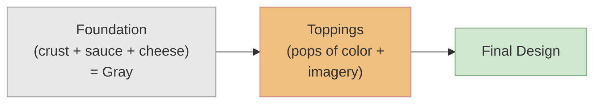

> "And so, the color gray is really like the solid crust and cheese and sauce that goes on the pizza. It's those foundations that we really wanna nail."

> "I would probably still eat the pizza, 'cause it's pizza, but it's not gonna be very good."

Great fundamentals (crust, sauce, cheese) = a pizza by themselves. Ruined basics = good toppings can't save it.

## The Formula: Gray + Imagery + Pops of Color

> "One of the things I wanna convince you of, is that a shocking amount of good UI design is actually really just gray, plus imagery, plus a few pops of color."

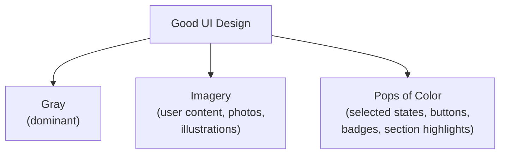

The instructor walks through multiple real-world examples:

- **Reuters app wireframe / final design** — a gray skeleton that looks sharp by itself, then gains imagery and a few color highlights (section headline pops, imagery colors)

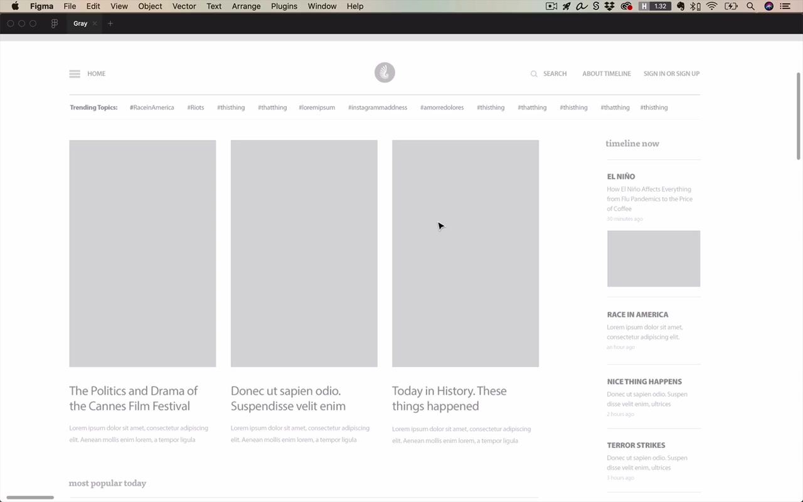
- **Twitter iOS** — gray, gray, gray, that blue brand color, imagery from user content, purple color, and that's basically it. The brand color is clear, but the design works entirely without it

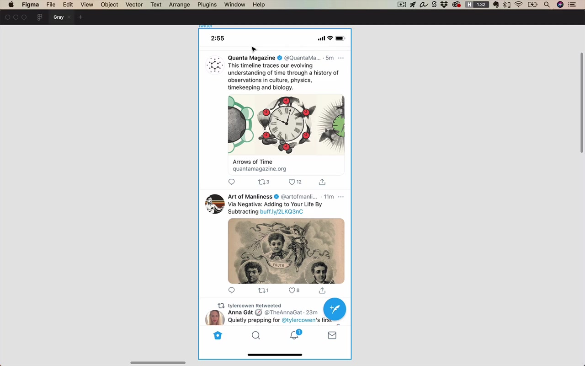
- **Semplice** — formal, serif font brand with a lot of gray. Pops of color plus gray, with little to no imagery on the front page
- **Origin Materials (Brian Powell)** — technical/engineering brand. Dots feel technical, pops of color only in arrows and hover states, everything else is gray. Even the imagery is grayscale on this site
- **Row 7 Seeds** — quirky, artistic, avant-garde brand. Does not feel minimalistic at all. And yet: white text (gray), imagery, more imagery, gray divider lines, gray big lines — broken down it's still gray + imagery + a few pops

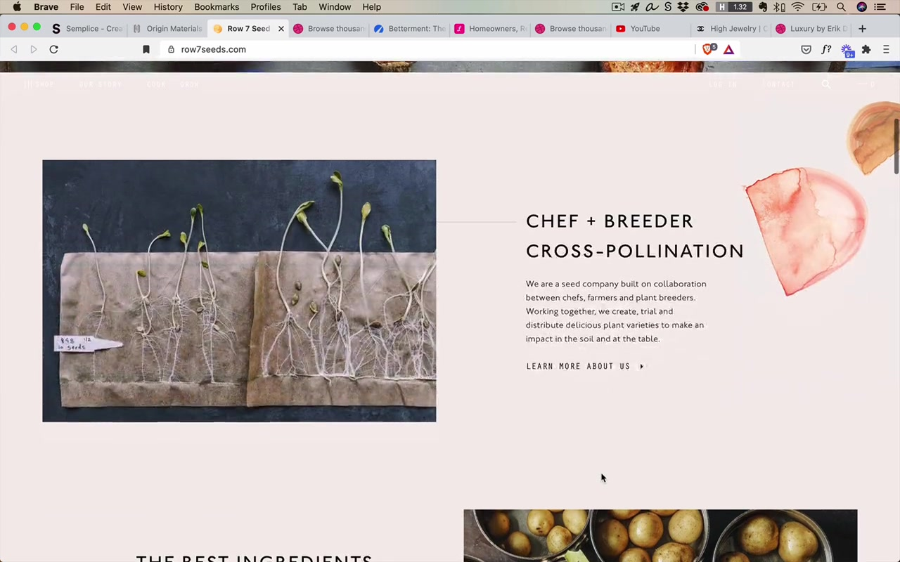

> "Consider this, this site, which again is as busy as anyone would want, is still just a very basic pattern. You can break it down to being gray, plus imagery, plus just a few pops of color."

A note on the definition of gray: low-saturation colors count as gray in this context, even if they technically have a hint of color.

> "And it's probably worth saying that when I refer to gray sometimes I do talk about low saturation colors as being gray, even if they're technically kind of an off gray, so to speak."

## Black and White First

**Black and white first** is the instructor's recommended approach for designers who are not yet fully comfortable with color.

> "I call this black and white first. Why not gray first? I dunno, black and white first is just a little bit catchier."

### The method:
1. Design the entire UI using only grays (no color, no imagery)
2. Make it look perfectly sharp — good alignment, spacing, consistency, typography
3. Once it looks awesome, add imagery and pops of color

> "Until you're very confident with working with color try and design something that looks perfectly sharp, that obeys all that we've already learned about alignment, consistency, spacing except it just doesn't have any color in it yet. And then once it looks awesome, go ahead and add in that color."

### Why this matters:
> "Beginning designers put in too much color, too early and it can really screw with the design."

When working in black and white first, it's almost obvious where color will go:
- Wherever there's imagery
- Selected states (very common place for pops of color)
- Buttons
- Badges/notification indicators

### Wireframes vs. "Dribbble Wireframes"

A traditional **wireframe** is intentionally low fidelity — Comic Sans, overly dark borders, rough — for two reasons:
1. Faster to make
2. Signals to viewers "this is not final, please suggest drastic changes"

A **Dribbble wireframe** is something nicer: it looks like a well-designed, gray-scale layout that could be shipped as a skeleton. Think of Dribbble wireframes as the target quality for your own black and white first designs.

> "You can think of these Dribbble wireframes as being the sort of thing that we want to get to with our own black and white first designs."

## Seven Gray Techniques (In Figma Demo)

The instructor demonstrates on an app design (profiles app) using only default Figma gray, black, and white.

### Technique 1: The Opacity Technique

Reduce the opacity of an element to reduce its visual weight / importance.

**Common use cases:**
- **Non-selected nav items** — selected at 100%, non-selected at 70–80%. Going below 50% of the selected opacity makes elements look disabled
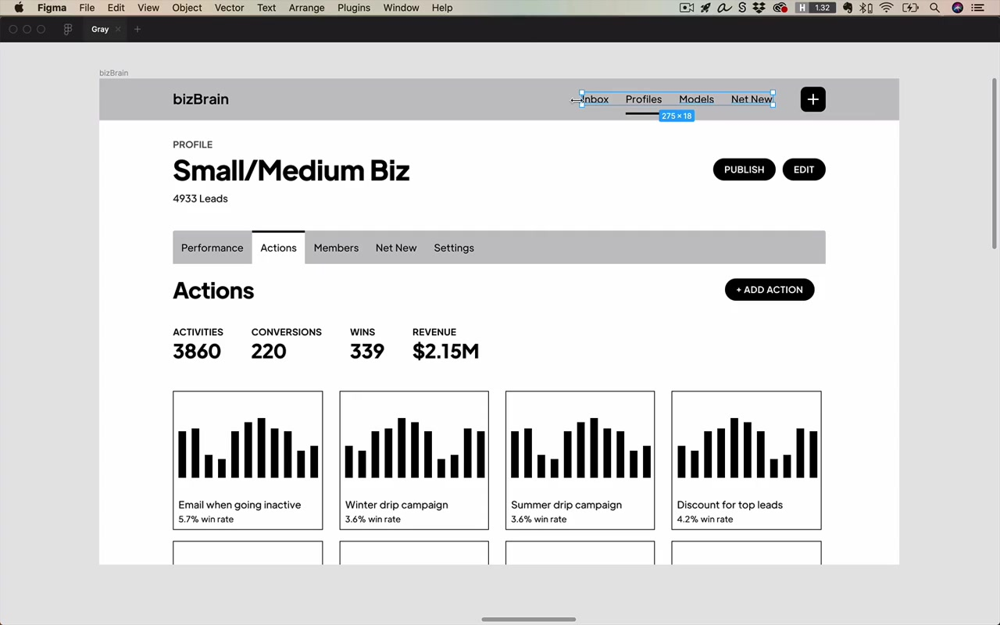

- **Heavy decorative elements** — a thick underline under a selected nav item looks too strong next to thin text; bring it to 60–70% opacity to balance ("drawing with the same pen" concept from the icons unit)
- **SLUB styling** — **S**maller, **L**ighter, **U**ppercase, **B**old. When a label is already bold + uppercase (two attention-grabbing properties), reduce its opacity to 70% to compensate. Lighter here specifically means reduced opacity
- **Meta/structural elements** (borders, divider lines, background color region boundaries) — can go very low, even 10% opacity; they only need to be visible enough to signal structure
- **Repeated elements** — if a bar chart appears on every card, the chart is not the focal point; reduce to 30–40% so it doesn't overpower the primary content
- **Secondary text** — primary/secondary text pairs: bring the secondary text to ~70% opacity

> "Lot of stuff at 70% opacity on this page. But I feel like that's kind of a good go-to range. It's like your first guess and you can fail left, fail right around it but 70% is often a fairly good value to use."

**A note for developers:** When handing off a design with opacity-reduced black text, you can either specify "black at 70% opacity" or just give them the resulting hex (e.g., `#4D4D4D`). Either works, as long as the text only appears on gray/white backgrounds. If text appears on colored backgrounds, hand-adjust the color specifically.

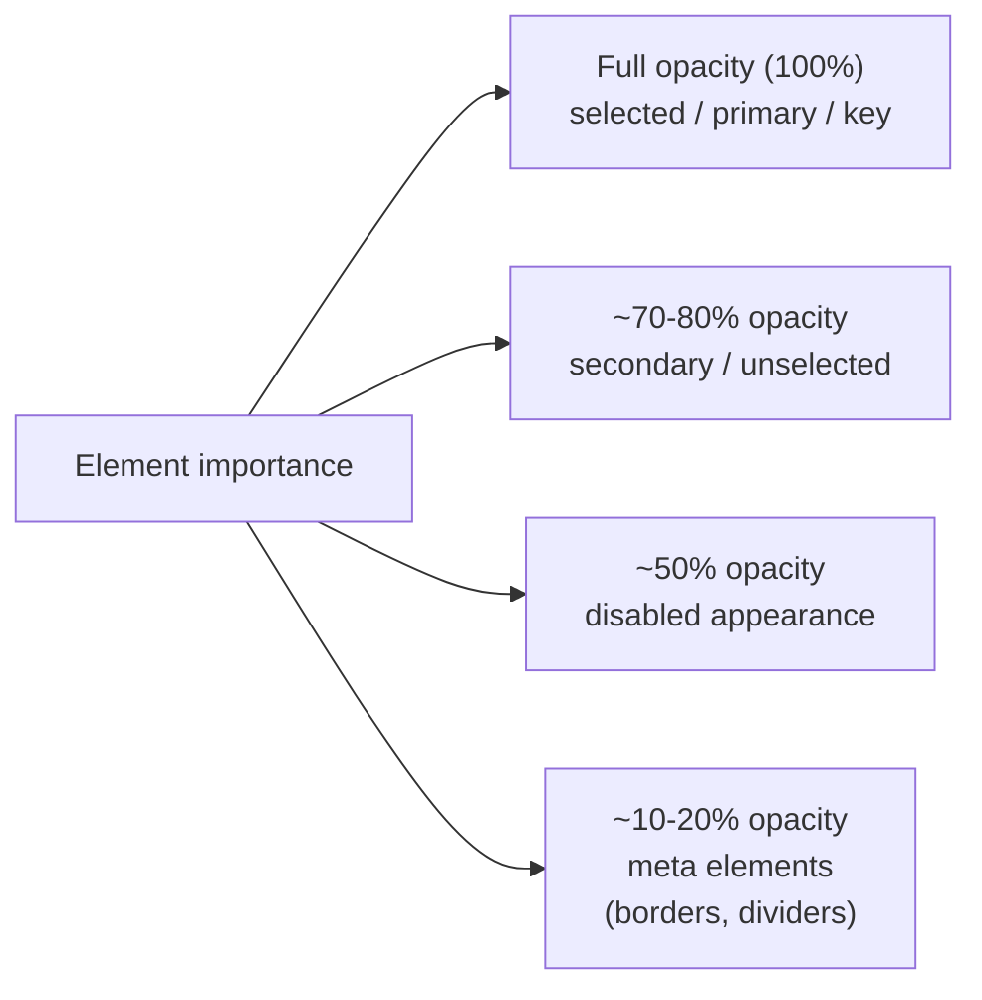

### Technique 2: The Just Barely Colored Technique

In the real world, grays in photographs are almost never pure gray — they're always slightly saturated, and the darker they go, the more saturated they tend to get. Pure black is actually quite rare in nature.

> "In the real world, if you look at a photograph or something you're almost never going to be seeing pure black."

**The technique:** Instead of using flat black, add just a hint of your theme color's hue into all the text/gray elements. The result feels more natural and cohesive.

**Step-by-step process:**
1. Pick your theme color (e.g., a teal at hue 191)
2. Set saturation and brightness to zero (keeps the hue, blacks it out)
3. Bring brightness up to ~25% for dark text
4. Add saturation until it's "just barely colored" — subtle vibes of the hue without being obviously tinted

For backgrounds, repeat with a much higher brightness (~90%) and very low saturation (~3%).

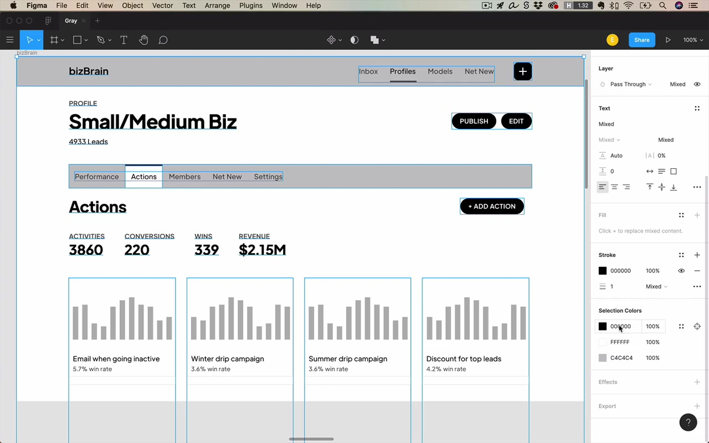

**Twitter is doing this without you noticing:**
> "What Twitter has done here, without us even really noticing, is they've taken their theme color and they've, ever so gently saturated all of the texts on their whole app with the hue of that theme color."

The instructor picks the colors from Twitter's text: hue 201 (theme blue), hue 210 (dark text), hue 205 (secondary text), hue 203 (tertiary text). All in the same blue family, all barely colored.

The payoff: having 10% brightness with some saturation baked in just feels a little easier on the eyes than flat black.

> "It's gonna feel a little bit easier on the eyes than if everything was just that flat black."

### Technique 3: The Elevation Technique

Light backgrounds and raised surfaces use gray to convey **elevation**: surfaces that are higher (closer to the user) are lighter; backgrounds underneath are darker.

> "Gray is a super useful color for conveying elevation."

From the lighting & shadows lesson: a raised card should be lighter than its background. A background of 97% brightness gray with a white card on top looks cleanly elevated. You can even have a background as dark as 97% brightness and visitors might not even know it's not pure white.

> "This was kind of an interesting realization for me as a beginning designer, because I just sort of assumed that even light backgrounds were almost basically just white and yet it's not at all crazy to have let's say a 97% brightness gray background."

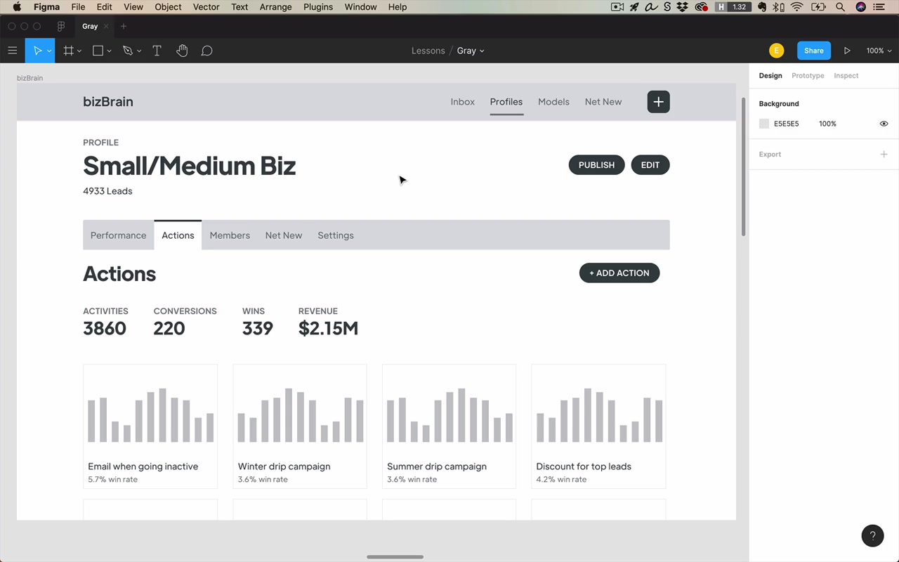

**Elevation stack (light theme):**
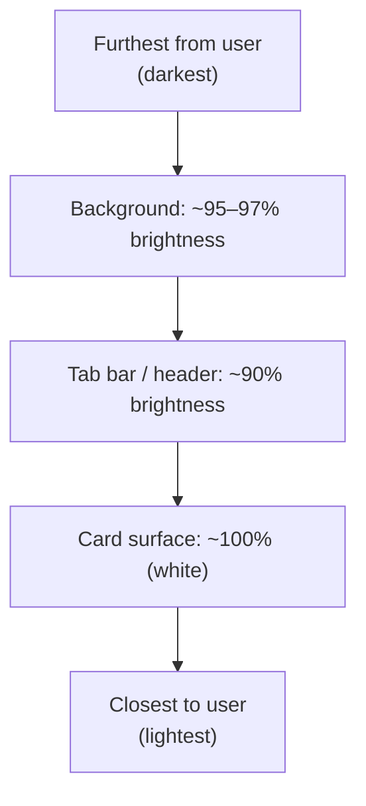

The key rule: be consistent. Higher-elevation = lighter color. The more you enforce this, the better the depth reads.

### Technique 4: The Border Technique (Background Color Changes)

When two background colors are very similar (e.g., 97% gray vs. 95% gray), the eye has to "stress out" to see where one color ends and another begins.

> "It just kind of stresses out your eye to have to peer so intently to see where one color deviates to another color."

**The solution:** Add a very thin, very light border (e.g., 10% opacity dark color) at the boundary. It's a meta element — it doesn't need to attract attention, it just needs to be subtly perceptible.

This is a widely used pattern. Once you know it, you'll start to see it everywhere.

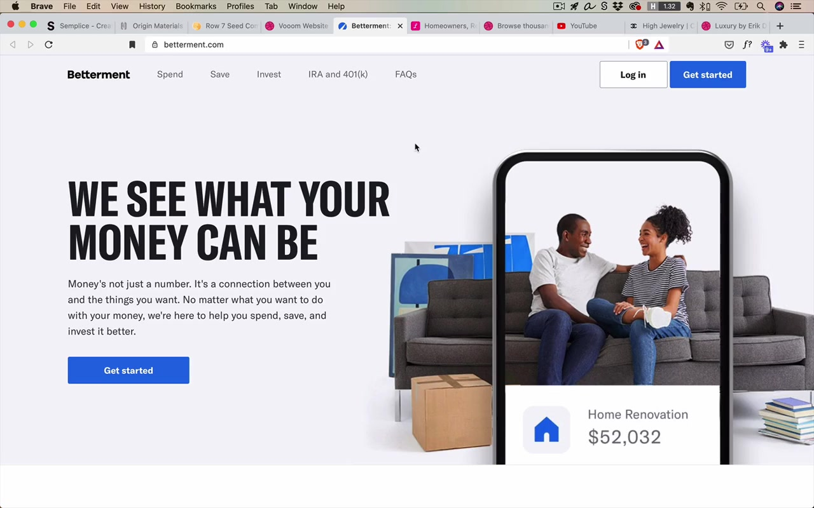

### Technique 5: The Border Technique (Fuzzy Shadows)

The same border approach also fixes shadows that look "fuzzy" — where the transition from shadow to background is so gradual it looks ambiguous.

**Alternative fixes for fuzzy shadows:**
- Reduce the opacity of the shadow itself (lighter shadow = crisper edge)
- Change the background color of the header/card to be clearly lighter than the background (if the header is supposed to float above)

### Technique 6: The Subtle Background Technique

You don't need dramatic color changes between page sections. Very subtle background shifts — from 97% brightness gray to 95%, or from 95% back to white — are completely valid and look elegant.

> "I thought when the background color changed, you couldn't just go from a gray of 97 brightness to a gray of 95 brightness, to a gray of a hundred brightness, back down to 95 and so on. I thought it kind of had to be big and bold and in your face."

**Real-world examples:**
- **Betterment.com** — light gray to white, light gray to blue, blue to dark gray, dark gray to white. Very heavy transitions but also subtle ones, all part of the same vocabulary
- **Lemonade.com** — light gray from the illustration horizon, back to white, light gray again, border technique at transitions, ends with a much darker footer. A perfect example of subtle background changes carrying a whole page

This technique is equally powerful for apps (not just landing pages). The time-tracking app Harvest has a large section that is all 93% brightness gray, separated from bright white with a thin border.

### Technique 7: The Squint Test

The squint test: either physically squint at your design, or in Figma apply a large layer with a background blur effect (~10+ pixels) to simulate it.

> "The squint test just refers to either squinting at your design or putting on a big layer with an effect of type background blur."

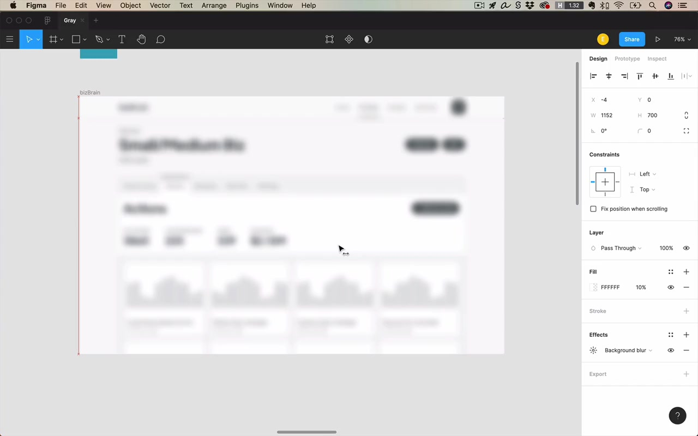

**Purpose:** Verify that your visual hierarchy is working. After a half-second glance (or squint), what information does the user extract?

You want to see:
- The title/headline is the most prominent thing
- Key CTAs (buttons) read as bold and important
- Secondary content (charts, secondary text) reads lighter and supporting
- The structure (tabs, sections) is legible without being distracting

> "A squint test is kind of a final check of saying, all right, if I think I've gotten everything good to go here. Can I be sure that this design is going to corral my users' attention effectively?"

## Final Thoughts on Gray

### Gray is the most subtle color

Gray attracts no undue attention to itself. This is a feature, not a bug. The more gray in a design, the more freedom you have to direct attention using color. Gray is perfect for:
- Background colors
- Divider lines
- Shadows
- Secondary and tertiary text

> "The more gray you have, the more you're allowing yourself freedom to direct attention effectively using color."

### Gray allows the content to shine through

When the entire UI chrome is gray, user-generated content (images, videos, uploads) immediately becomes the visual focus.

Examples:
- **Dribbble** — almost everything on screen is gray. The designers' shot uploads are the only color. Even the "Upload a Shot" CTA button is a deliberate pop of color, corralling users toward the action Dribbble wants
- **YouTube** — color appears only in the video thumbnails and content. The only UI color pop is the red "Home" selected state icon and the YouTube logo

This works for **dark themes** too — a dark theme is another form of gray:

> "A dark theme as well is gonna really let that content shine through and rather than competing with it, with white, which is also a very bright color. We're basically saying nothing on the screen has any real saturation or brightness except for the content."

### Gray is the classiest color

There is an undeniable connection between gray (and black/white) and **luxury brands**.

> "And finally, gray is also the classiest color. There is a undeniable connection between the color gray and creating a luxury brand. And I think this is because gray is understated."

When selling something luxury or expensive, you want all attention going to the imagery — the highly stylized product photography. Gray lets the product be the star.

The instructor looked at luxury brand designs on Dribbble: overwhelmingly black, white, and gray with high-quality imagery and fewer pops of color than even typical consumer apps.

> "It's those understated colors that truly let the content shine through."

## Closing

> "I encourage you really to think about black and white first. Again, I don't say this is something that you need to stick to a hundred percent of the time, but until you feel quite comfortable with color. It's really not a bad idea to try and nail those fundamental elements of the design, before you start adding on too many splashes of color. You will have a lot of time to get better at color. Once you have nailed the foundations involved with gray and all the things that we've talked about up to this point."
