# Responsive UI Design — Anki Cards

Q: What does "responsive design" mean in one sentence?
A: Device-agnostic design — a website looks and works as good as possible whether requested from a tiny phone, a tablet, a laptop, or an extra-large monitor. It <em>responds</em> to the device that requests it.

Q: Why is screen width 90% of responsive design thinking?
A: Horizontal scrolling is considered a much bigger inconvenience than vertical scrolling. Users already expect to scroll down; running off the side feels broken. Height is largely irrelevant because users just scroll down until they reach the bottom.

Q: What type of hover interaction absolutely won't work on mobile and must be avoided in responsive design?
A: Anything where you hover on a parent element and keep hovering to access a child element (a sub-menu that appears on hover). Gmail's web nav is a classic example — great on desktop, impossible on touch.
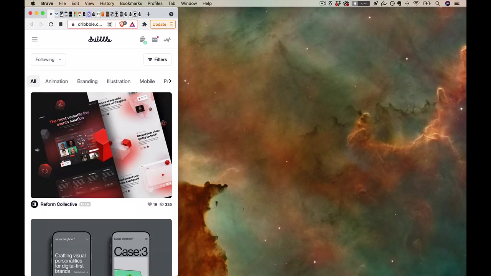

Q: What are the minimum tap target sizes for mobile?
A: <ul><li><strong>iPhone:</strong> 44 × 44 px</li><li><strong>Android:</strong> 48 × 48 px</li></ul>Text links can be difficult; hit this size as often as possible, not 100% of the time.

Q: What three things does a responsive plan cover?
A: <ol><li>Where does space get added or subtracted as the screen grows/shrinks?</li><li>Where do major layout changes (breakpoints) occur?</li><li>What UI states exist only at certain screen sizes (e.g. hamburger menu only on mobile)?</li></ol>

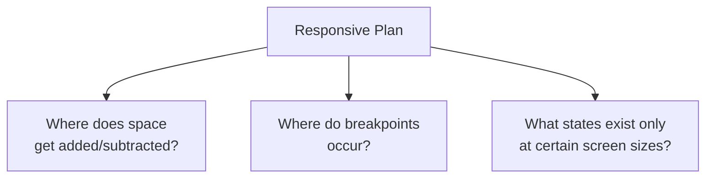
```mermaid
flowchart TD
    P["Responsive Plan"] --> A["Where does space<br/>get added/subtracted?"]
    P --> B["Where do breakpoints<br/>occur?"]
    P --> C["What states exist only<br/>at certain screen sizes?"]
```
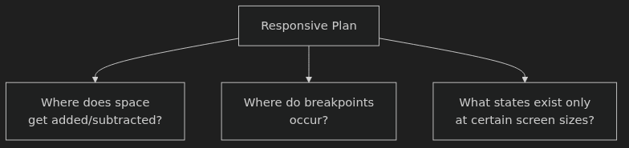

Q: What is a breakpoint?
A: The industry term for a major layout change — the moment where, as a screen grows, things <em>snap</em> to a new layout rather than just expanding. Example: Dribbble snaps from one column of shots to two columns at roughly 620px wide.

Q: What is the "content determines breakpoints" tenet, and why is choosing common device widths wrong?
A: Layouts should only change when the content <em>requires</em> it — not at arbitrary round numbers like 375, 1024, or 568px. If you set a breakpoint at 1024px (iPad width), then at 1023px the layout looks awkward. "So this is something I've been guilty of in the past."

Q: What is the "translate conceptually, not literally" tenet?
A: Don't scale or shrink the desktop design — translate the <em>concept</em> of what it communicates. Ask: what would this idea look like if this screen width was the only one you were designing for?
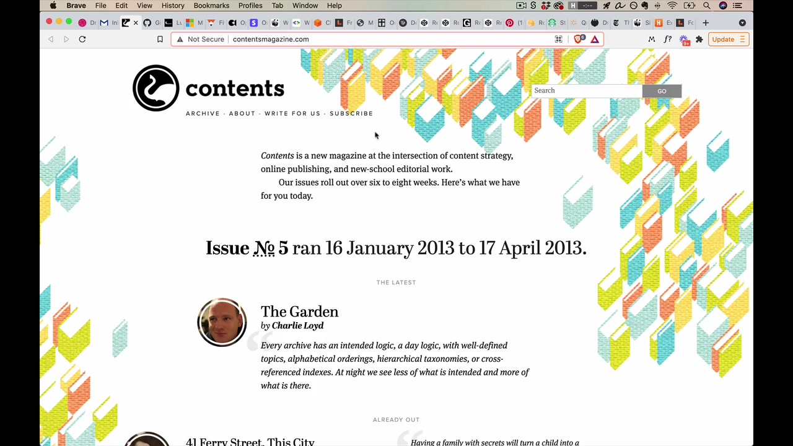
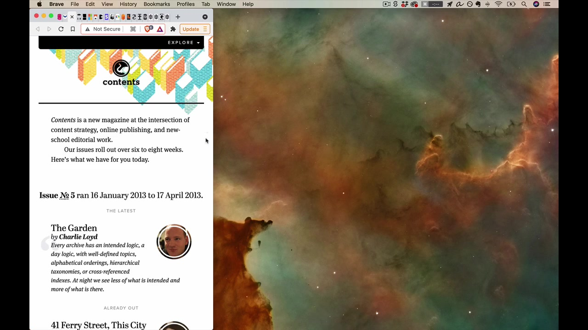

Q: How does Contents Magazine demonstrate the "translate conceptually" tenet?
A: At full width, colorful books are scattered naturally across the header. At mobile width, just a smattering peeking from the top. They didn't scale the same layout down — they re-composed the image concept for each canvas.

Q: What is the mobile-first principle, and why does it force clarity?
A: Design for small screens before large screens. A smaller screen forces you to decide what's truly important — you can't include everything. "When you have a smaller screen size to work with, you're forced to say, look, the content is what's really important here."

Q: The instructor reframes "mobile first" as "hardest first." What does that mean in practice?
A: Design whichever layout is hardest to get right first. For content-heavy, interaction-heavy pages: mobile first (hard to design complex interactions on small screens). For landing/marketing pages where the visual impact is the hard part: desktop first.

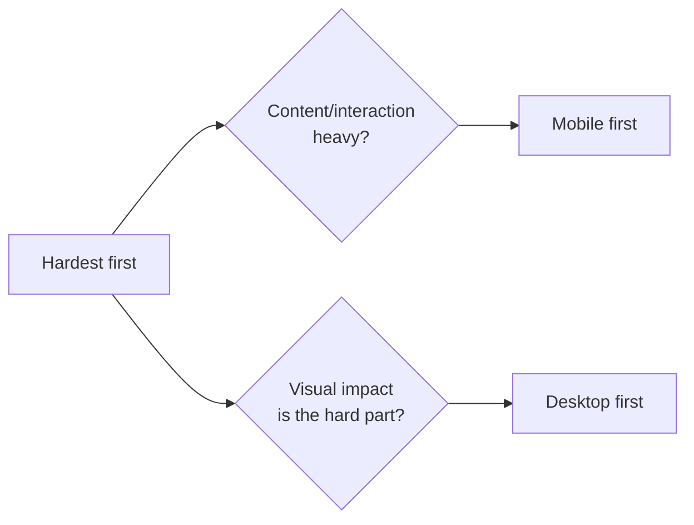
```mermaid
flowchart LR
    A["Hardest first"] --> B{"Content/interaction<br/>heavy?"}
    A --> C{"Visual impact<br/>is the hard part?"}
    B --> D["Mobile first"]
    C --> E["Desktop first"]
```
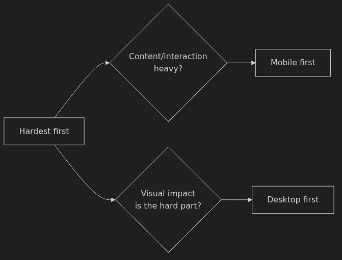

Q: What is the rows-to-columns pattern?
A: The most fundamental responsive layout pattern — items displayed as a row on large screens collapse to a column on narrower screens. Applies to card grids, footer columns, hero sections (text + image side-by-side → stacked).
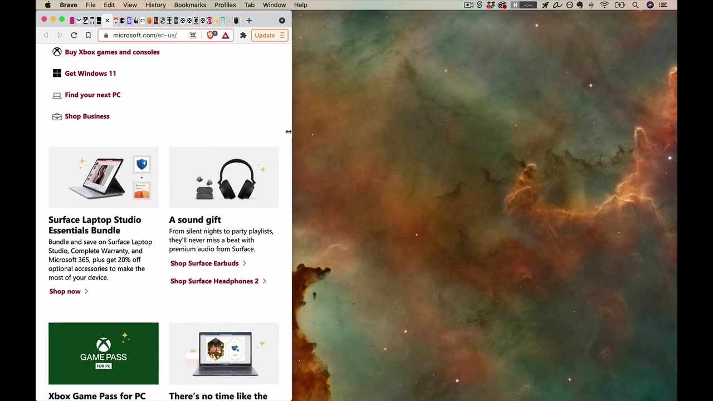

Q: What is the "hide" pattern, and how does it differ from "remove"?
A: <strong>Hide:</strong> content moves behind a click/tap (still accessible, just secondary). <strong>Remove:</strong> content disappears entirely — not accessible at all, just gone.
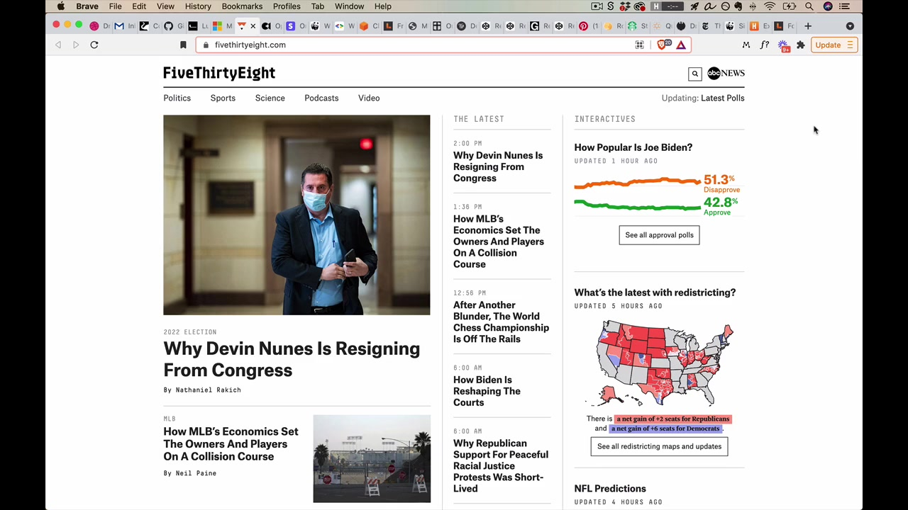
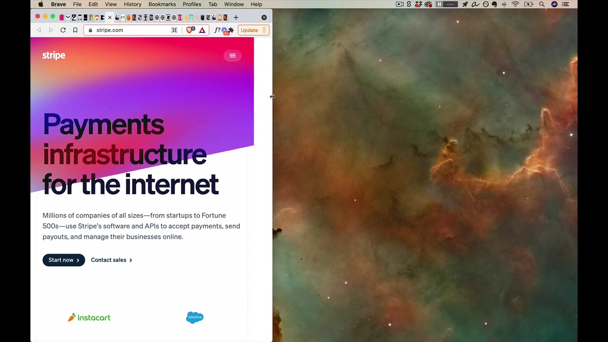

Q: What is the "drop" pattern?
A: Move secondary content lower on the page when the screen is too narrow for multiple columns. The sidebar drops below main content. Often natural — after reading the page, navigation at the bottom makes sense.

Q: What is the "menu hidden behind buttons" navigation pattern, and what are the key design details?
A: The standard hamburger menu — the full nav is hidden behind a button tap and revealed on click. Key details: <ul><li>Hamburger icon should have ~16px padding to reach 44×44px tap target</li><li>Button transforms into an X when the menu is open</li><li>Menu contains top-bar nav items <em>and</em> sidebar items merged together</li><li>Each menu item needs line height + padding ≥ 44px tap target</li><li>Use bigger text than desktop nav — it looks natural and well-spaced</li></ul>
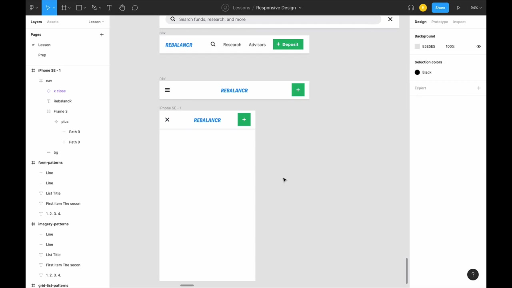

Q: What are the two sidebar patterns for responsive design?
A: <ul><li><strong>Drop the sidebar:</strong> sidebar moves below main content on narrow screens — works naturally because users who've finished reading want "what's next?" and find nav at the bottom</li><li><strong>Hide in top nav:</strong> sidebar items merge into the hamburger menu on mobile — no separate sidebar at small widths; the sidebar reappears once there's room</li></ul>

Q: What are the four alternative navigation patterns beyond the hamburger menu?
A: <ul><li><strong>Off-canvas:</strong> menu slides in from the side, giving spatial physicality</li><li><strong>Prioritized items:</strong> most important items stay visible; least important go into a "More" option</li><li><strong>Footer anchor:</strong> a "Nav" link jumps to a navigation section at the bottom of the page</li><li><strong>Stacked navigation:</strong> nav items snap from one row to two columns at a breakpoint</li></ul>
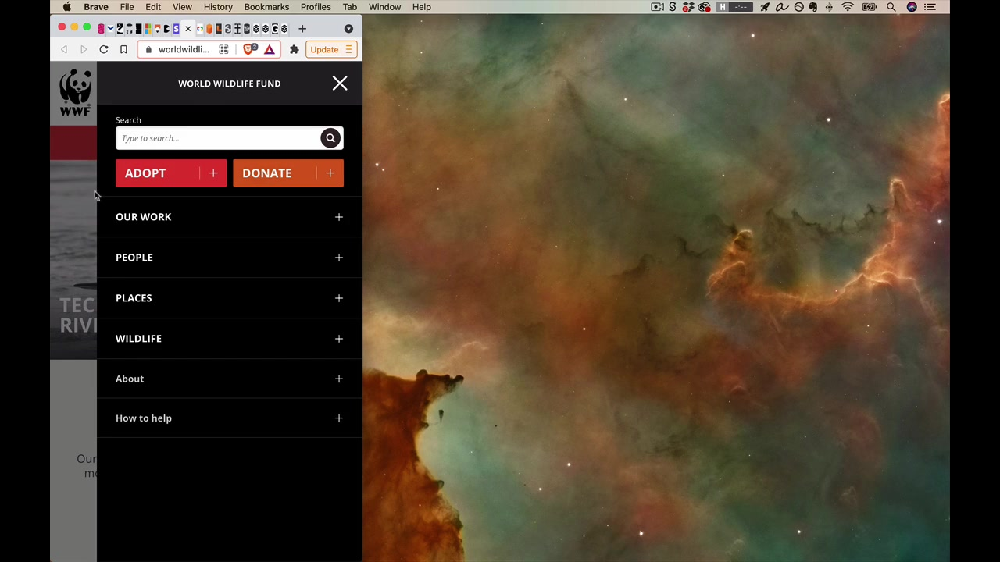

Q: What are the three container patterns for responsive layout?
A: <ul><li><strong>Infinite-width:</strong> element stretches edge-to-edge (backgrounds, hero images, full-bleed headers)</li><li><strong>Max-width:</strong> content has a fixed maximum width and is centered with margins on wider screens</li><li><strong>Snap-width:</strong> max-width itself snaps to smaller values at breakpoints (like Bootstrap containers)</li></ul>

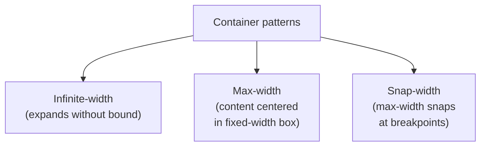
```mermaid
flowchart TD
    A["Container patterns"] --> B["Infinite-width<br/>(expands without bound)"]
    A --> C["Max-width<br/>(content centered<br/>in fixed-width box)"]
    A --> D["Snap-width<br/>(max-width snaps<br/>at breakpoints)"]
```
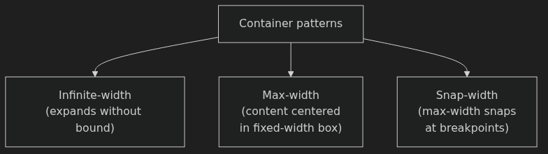
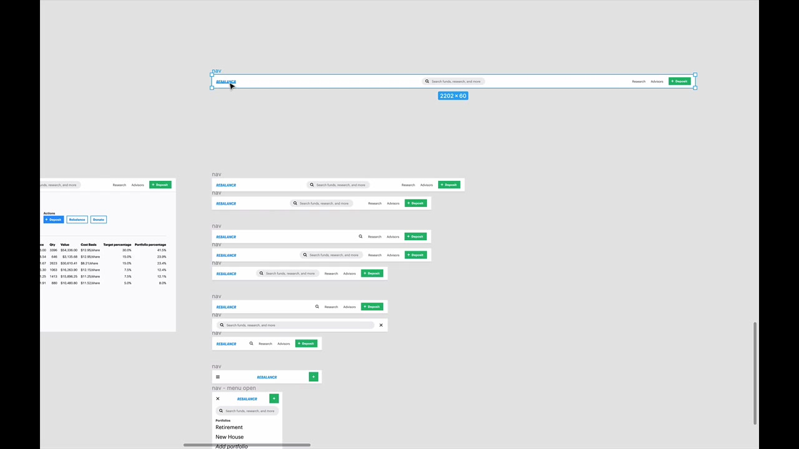

Q: What is the angular size principle for responsive typography?
A: Font sizes should produce the same angular size (angle from eye to text height) regardless of device, because farther devices are held farther away. Desktop fonts are larger than mobile fonts, but the visual size felt by the eye stays roughly constant. Follow the sizing cheat sheet: H1 at 35–50px desktop, 28–40px mobile.

Q: What is the three-alphabets trick, and what does it test?
A: Paste three repetitions of the alphabet (abc...xyz × 3) into a text block. If the line breaks somewhere in the third alphabet, the column width is in the ideal 50–75 character-per-line range. If it breaks earlier, the column is too narrow; if it breaks later, too wide.
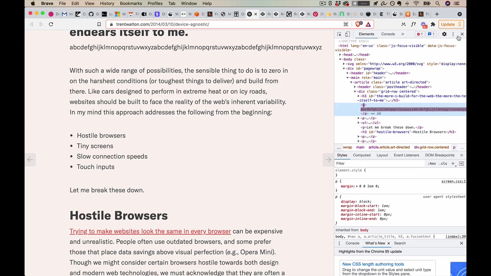

Q: What is the "remove extra words" text pattern for mobile, and give an example?
A: Shorten labels and tab names for narrow screens: remove words, use abbreviations, or drop low-value items entirely. MDCalc example: "Most Popular" → "Popular", "My Specialty" → "Specialty", "Newest" tab removed entirely. Working mobile first often surfaces these improvements — the shorter label reads better everywhere.

Q: What iPhone gotcha must you avoid with text inputs on mobile?
A: If a text input has a font size under 16px on iPhone, the viewport <strong>forces a zoom</strong> into the field — jarring and messes with your design. Always set text input font size to 16pt or bigger on mobile.

Q: What is the row-to-mini-table pattern for responsive tables?
A: Each row of the wide table becomes its own mini two-column table. Column headers ("First Name") become row labels ("First Name: James"). Redundant but readable at any width.
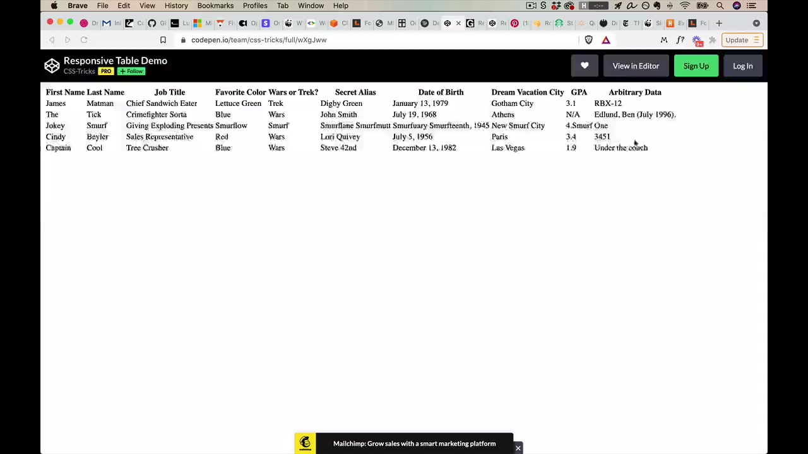

Q: What are the four responsive table patterns?
A: <ol><li><strong>Row-to-mini-table:</strong> each row becomes its own labeled mini-table</li><li><strong>Remove columns:</strong> least important columns disappear (or: make the table horizontally scrollable)</li><li><strong>Flip axis + horizontal scroll:</strong> column headers move to the left side; row scrolls horizontally with fixed labels</li><li><strong>Reformat as a list:</strong> custom design using primary/secondary info hierarchy, like a mobile inbox</li></ol>

Q: How does the "reformat as list" table approach work in the Rebalancr example?
A: Primary left: fund name (large) + ticker symbol below at 70% opacity. Primary right: portfolio %. Secondary right: price. Row height ≥ 44px tap target. Tapping a row opens a popup with remaining data. "There's no one-size-fits-all approach because it comes down to what do users wanna see most."
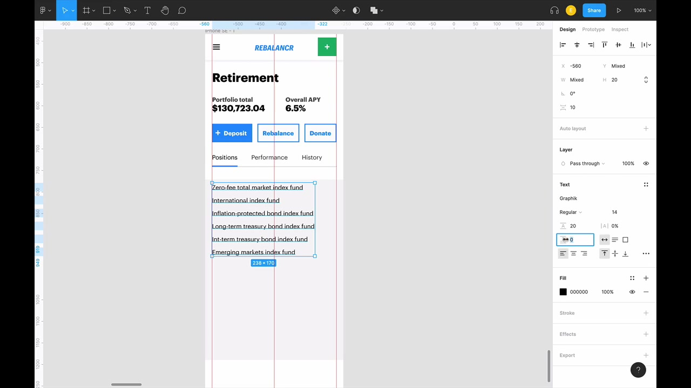

Q: What is the collapsible list items pattern, and when should you use it?
A: Collapse list sections (show only the title by default; users expand on tap) when rows-to-columns would produce enormous vertical content. Starbucks footer example: each sub-nav group starts collapsed on mobile — users can scan the high-level titles and expand only what they want, keeping the footer short enough to browse.

Q: What are the two levers for making responsive grids?
A: <ol><li><strong>Flexible item width:</strong> items stretch/shrink as the container resizes (item count stays fixed)</li><li><strong>Flexible items per row:</strong> the count changes at breakpoints (Pinterest: 5 → 4 → 3 → 2 as screen shrinks)</li></ol>These can be combined for fine-grain control.
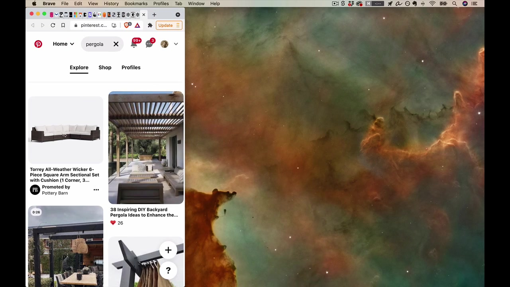

Q: What is "art direction" in responsive images?
A: Loading slightly different image files at different screen sizes — not just scaling one image, but serving images specifically composed for each canvas. Contents Magazine at wide widths: many books scattered fully. On mobile: a small smattering. "Considering the screen as if that screen size is the only screen size you're designing for."

Q: What is the media object pattern, and why might you keep it horizontal on mobile?
A: Image + text laid out side by side. Keeping it horizontal on mobile (small image left, text right) avoids obnoxiously tall images that require excessive scrolling. A full-width image on mobile can be very tall — sometimes the horizontal layout is actually better on small screens.

Q: Where should contextual text be placed relative to images on mobile, and why?
A: Above the image, not below. If a tall image pushes a caption 400px down the page, users lose context. The New York Times always shows headline + text before the image so you always know what you're looking at without scrolling back.
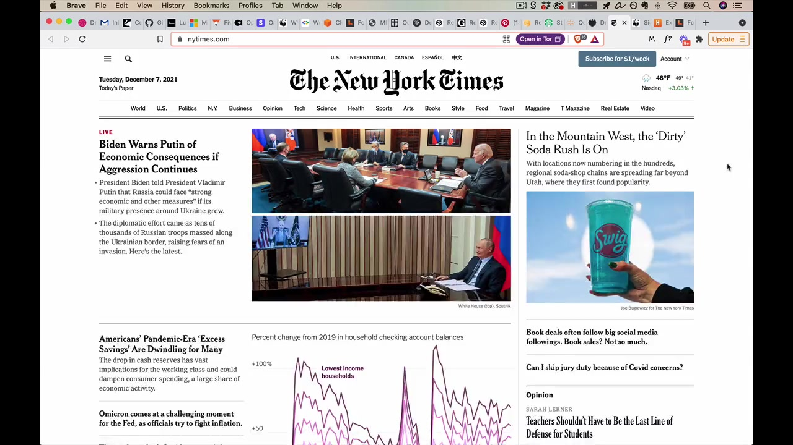

Q: You are designing a multi-column form. What two things should you change for mobile?
A: <ol><li><strong>Side labels → top labels:</strong> labels that sit to the left of fields on desktop go above them on mobile</li><li><strong>Multi-column → single column:</strong> collapse multi-column form layouts to one column (same rows-to-columns principle applied to forms)</li></ol>
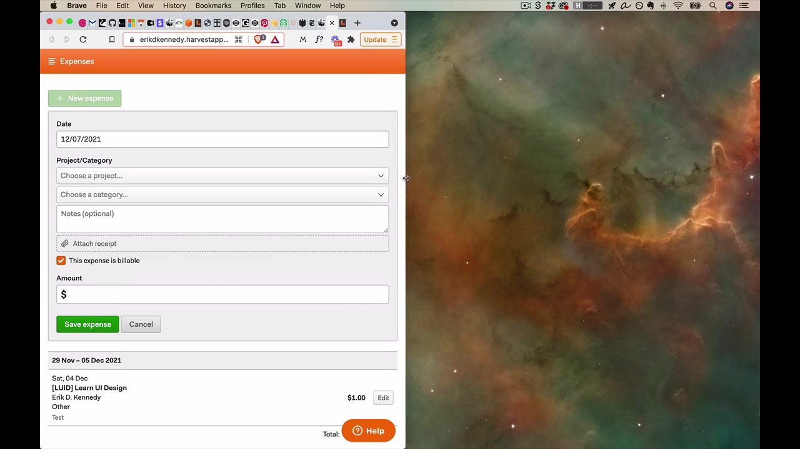

Q: You're designing a page with a lot of content, complex interactions, and many navigation elements. Should you start with mobile or desktop, and why?
A: Mobile first. Complex interactions are harder to design on small screens — solving the hard version first means desktop will naturally expand well. Designing desktop first leaves you with "too much stuff" to cram into mobile later.

Q: A client says "everything is important" during responsive planning. What does mobile-first force them to do?
A: Mobile first requires prioritizing ruthlessly — small screens physically cannot hold everything. "If your first conversations are like, what are the absolute most critical things to show on the smallest version of this website? They don't get to say everything's important."

Q: In Figma, why should you wrap nav items in a frame rather than a group when building responsive nav?
A: Groups have "wonky resize behavior" — they don't resize intelligently. Frames allow you to set constraint behaviors (fixed-left, fixed-right, centered) so each element behaves correctly as the frame width changes.
