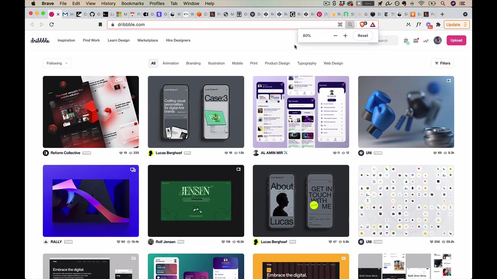
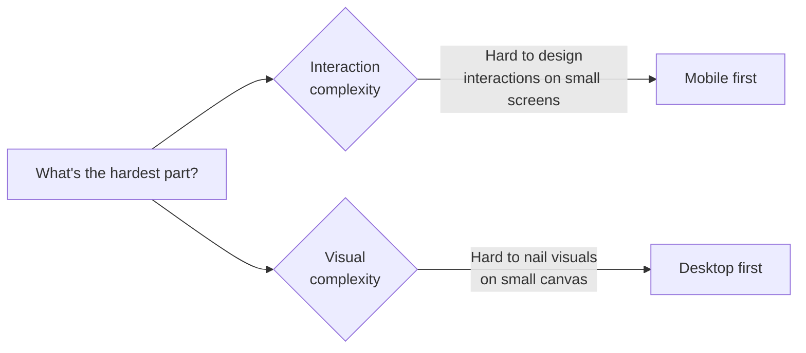
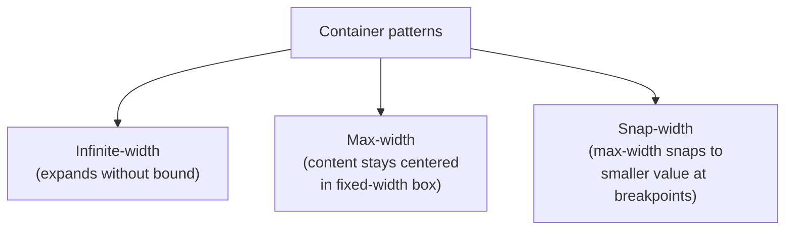

# Responsive UI Design

## [1:25] What changes across devices?

> "Really the point of design is to create beautiful, usable websites that go into the real world and millions of people benefit from them. And one of the key skills in bridging the gap between pretty pictures in Figma and great websites in the real world is responsive design."

**Responsive design** is best thought of as **device-agnostic design** — whether a website is requested from a tiny phone, a medium tablet, a laptop, or an extra-large monitor, it looks and works as good as possible for that device. It *responds* to the device that requests it.

### Screen width

90% of responsive design thinking is about changes in **screen width**. It causes the most issues, requires the most thought, and the most work.

### Screen height (largely irrelevant)

Screen height is largely irrelevant because we're already used to sites having vertical scrolling. Whatever the height of the content, users just know they scroll down until they reach the bottom.

Width is different — if content runs off the side and requires horizontal scrolling, that's considered a much bigger inconvenience.

> "I'll almost never adjust the height simply because it doesn't make that much of a difference."

Exception: if there's a bunch of fixed UI at the top or bottom, you'd want to check that a very short phone can still see everything.

### Hover states

On devices with a mouse cursor, hover states work well. On phones, some browsers will recognize hover states and trigger them on tap. However, one type of hover interaction **won't work on mobile** at all:

> "That's anything where you have to hover on a parent element and then keep hovering on it in order to access something like a child element."

Gmail famously does this — it's a great interaction on desktop but absolutely impossible on a mobile device. Avoid it in responsive design.

### Target sizes

A mouse cursor comes to a one-pixel point, making it easy to click precisely. A finger obscures what it's tapping — you can't even see the contact point.

> "It's for this reason that you've heard me say in the course and I will say it again, that on mobile, tap targets should typically be much bigger."

Guidelines:
- **iPhone:** 44 × 44 pixels minimum
- **Android:** 48 × 48 pixels minimum

You don't need to hit this 100% of the time (text links can be difficult), but the tappable area should be 44 × 44 as often as possible on mobile.

---

## [5:20] Creating a responsive plan

> "All these details of the responsive design work you're doing need to be captured in a responsive plan — and maybe this is an overly constrained way of saying it. I'm not saying you need to have something on paper, although you almost certainly would. At the minimum you need to sit down with your developer and open up Figma and go over exactly what's gonna happen in a number of situations."

A responsive plan covers **three things**:

### Where does space get added/subtracted?

When a screen is 510px wide and your design is 500px, where does that extra 10px go? In Dribbble's case — not into the margins, but into the content (the shots get wider). Every detail of where space is added or taken from needs to be defined.

### Where do major layout changes (breakpoints) occur?

A **breakpoint** is the industry term for a major layout change. As the screen grows, small changes are local (space added to margins or content). At some point — boop — things snap. That's a breakpoint.

Example: Dribbble snaps from one column of shots to two columns at roughly 620px wide. The header also has multiple breakpoints as it transitions from mobile (hamburger menu) to various desktop versions with progressively more spacing.

**What documentation should cover:**
- When there's a small change: where does space get added to or taken from?
- When there's a big change: what does the layout look like just before and just after?

**Technique to check breakpoints in Figma:** At each breakpoint, document the *widest version* of one layout plus the *narrowest version* of the next — make sure the design looks native at every size, not just at the snap point.

> "The goal is just to make sure that every possible size the design looks just like it was completely designed 100% for that size."

**Full range of sizes to consider:**
- Minimum: ~300px (smallest iPhone is 320px)
- Maximum: ~2000–3000px (layouts don't typically change beyond ~1440px)

**Dev tools trick for testing:** Open Chrome dev tools, dock them to the right, and the page can now shrink below 500px. Use the device emulator button for standard phone sizes. Use Command + Minus to zoom out and simulate very large screens.

### What states apply only to certain screen sizes?

Some UI elements — like a hamburger menu — exist only on mobile and have no analog at desktop sizes. Mobile often has states like search, menu, popover that just don't appear at other sizes.

> "You just wanna make sure you're capturing all those."

---

## [12:08] The 3 tenets of good responsive design

### The content determines the breakpoints

> "Things shouldn't really change layout until the content determines that they need to."

In Dribbble's header, the layout doesn't snap until the search bar gets awkwardly close to "Hire Designers" — that's content determining the breakpoint. The wrong approach is defining breakpoints at common device widths like 568, 375, 1024 — if you set a breakpoint at 1024 because iPad is 1024px, at 1023px things look funky.

> "So this is something I've been guilty of in the past... you'll see a lot of sites where they might have a break point at very common device sizes like 568, 375, 1024. And a lot of those, like 1024 is a very common iPad screen size. And so if you see a break point for that, like oftentimes they're just trying to make sure that at that width everything looks really good, but you might go to 1023 and find that things look much funkier. And that is not the right idea."

### Translate conceptually, not literally

Don't scale or shrink the desktop design down — translate *the concept* of what it's communicating.

Example: Contents Magazine has colorful scattered books in their header. At the widest width they're scattered in a natural way. As the screen shrinks, a smaller smattering. On mobile, just a few peeking from the top. They didn't take the same layout and scale it down — they asked what this concept looks like at each width.

> "They've taken the concept and they've translated that. They haven't literally taken say the same design and scaled it."

The header is similarly conceptual: on mobile, what does a header *need* to convey? The logo yes. Navigation gets hidden behind a button click — not because they crammed everything in, but because they translated the *idea* of a header to that context.

### Mobile first (or, generally: hardest first)

**Mobile first** = design for small screens before large screens.

> "Because it forces absolute clarity on what's important. When you have a smaller screen size to work with, you're forced to say, look, the content is what's really important here."

If you design large first and are undisciplined about what you put on screen, making a small version is much more work for both designer and developer — you weren't clear about what was important.

**Mobile first also helps with client work:**
> "If you have a client and your first conversations are like, what are the absolute most critical things to show on the smallest version of this website? They don't get to say everything's important."

**However**, mobile first isn't the end of the story. The instructor reframes it as **hardest first**:

- Mobile first works great when you have a lot of content, elements, and interactions (complicated page)
- For a landing page or marketing page where visuals are the hard part, design desktop first — it's harder to get the stunning effect right on a large canvas, but then you can scale it down

> "So maybe a good way to think about this is design whatever is hardest first."

---

## General responsive patterns

These patterns weren't tied to the topics.md structure but appear throughout the live demo.

### Rows-to-columns

The most fundamental layout pattern. On desktop, items are displayed in a row. When the screen narrows:

> "Take what starts as rows on large screens and make them columns on smaller screens."

Microsoft.com exemplifies this. A row of cards becomes a column. Even the footer's "row of columns" becomes a "column of columns." This works for things that are obviously rows, but also for hero sections — "text + image" as a row snaps to "image stacked over text" as a column.

### Hide

Don't show everything by default on mobile — hide it behind a click (not completely inaccessible, just one click away). FiveThirtyEight collapses its entire nav behind a "Menu" button. The content is still there, just secondary to the main page content.

> "The whole idea of the hide pattern is you don't need to show everything by default, you can hide it behind a click or in this case, a tap."

### Drop

Move secondary content lower on the page rather than removing it. In FiveThirtyEight, the sidebar columns drop to the bottom when the screen is too narrow for three columns. Regent College's sidebar drops below the main content at ~800px — which actually works well because after reading the page, the navigation at the bottom makes natural sense.

### Remove

Content disappears entirely — not hidden behind a click, not dropped to the bottom, just gone. Opal C1 removes the product name, colors, and price from their sticky header on mobile (not totally inaccessible — you see them during the checkout flow). Stripe removes the device images entirely at narrower widths.

> "There could be [a mobile version of them] but in this case they said, you know what? They're not really adding anything until we're kind of at this awkward width."

Note: "hide" and "remove" are also two of the six strategies of simplicity — see the Simplicity lesson for more examples.

---

## Navigation patterns (from Figma live demo)

Working through the Rebalancr app (a fictional portfolio rebalancing tracker):

**Key Figma techniques:**
- Wrap nav items in a frame (Option + Command + G) — not a group. Groups have wonky resize behavior; frames allow intelligent resizing
- Set constraint behavior: logo centered, left items fixed-left, right items fixed-right, background fixed to all edges

**Nav breakpoints for Rebalancr:**
1. **1152px** — full nav, everything visible
2. **1000px** — search bar collapses to icon (hidden behind click), separate expanded search state needed
3. **999px down to ~800px** — same layout but search opens as full-width takeover of the nav bar
4. **Below 500px** — hamburger menu (on the left, as is most typical), logo centered, Deposit button becomes icon-only

For the hamburger menu icon itself, use 16px padding all around to get close to 44 × 44 tap target.

**Mobile menu design:**
- Hamburger button becomes an X when open
- Nav items from the top bar plus sidebar items all go into the menu
- Include search at the top
- Each text item should have line height + spacing ≥ 44px (tap target)
- Bigger text looks natural and well-spaced — don't just shrink the desktop nav text

**Other navigation patterns:**

| Pattern | Description |
|---------|-------------|

| **Off-canvas** | Menu slides in from the side (see WWF website) — gives spatial physicality, user sees the transition instead of a snap |
| **Prioritized items** | Most important nav items stay visible, least important go into "More" as screen shrinks. AWS and the MDCalc course site both do variants of this |
| **Footer anchor** | "Nav" link jumps to the bottom of the page where the nav lives — no separate page, just an HTML anchor |
| **Stacked navigation** | At some width, nav items snap from one row to two columns — looks natural at both widths |

> "The goal with responsive design as always is that at every single width things look as native and intuitive as possible."

**Container patterns:**

- **Infinite-width**: backgrounds, hero images, full-bleed headers — the HTML element stretches edge to edge
- **Max-width**: content has a maximum width and is centered with margins on both sides at wider screens
- **Snap-width**: max-width itself snaps to a smaller value at breakpoints (like Bootstrap's grid containers)

These can be mixed and matched. Fitt's Law note: items at the edge of the screen are actually easier to click even if they seem far away — you can just slam the cursor into the corner.

---

## Text patterns (responsive)

### Angular size principle

Font sizes are ultimately about **angular size** — the angle from your eye to the top vs. bottom of the text should always be roughly the same, regardless of device distance.

> "That means no matter what device you're looking at and how far away it is, the farther away the device is, the bigger the letters are gonna get."

Practical implication: follow the sizing cheat sheet from the Sizing lesson. For H1:
- Desktop: 35–50px
- Mobile: 28–40px

Also account for **realistic content** — if "Retirement Portfolio" is a very common value, does it fit on one line at 32px? User-inputted text length should inform your chosen size.

### 50–75 characters per line

The ideal line length is 50–75 characters — not pixels. Use the **three-alphabets trick** to test: paste three repetitions of the alphabet into a text block. If the line breaks somewhere in the third alphabet, you're in range.

Trent Walton's site exemplifies this — his font size changes 4 times across screen widths so that the line length stays within this range. If the font stayed small, the narrow column would feel lost in a huge sea of background.

### Abbreviations and text removal

You can always remove extra words or add abbreviations for smaller screens. MDCalc example:
- "Most Popular" → "Popular"
- "My Specialty" → "Specialty"
- "Newest" tab disappears entirely on mobile

> "This is like little detail work but it really does help to try and make the experience seem as reasonable as possible even on the smallest screen widths."

---

## Table patterns

> "This is the thing that I most commonly receive questions about in the world of responsive design — how do I do responsive tables?"

### Row-to-mini-table

Each row of the wide table becomes its own mini two-column table. Column headers ("First Name") become row labels ("First Name: James"). Redundant but works well on narrow screens.

### Remove columns

Remove the least important columns. They're gone — not accessible. Option: make the table horizontally scrollable instead.

### Flip the axis + horizontal scrolling

Works for tables that are much wider than they are tall (many columns, few rows). Rotate 90°: column headers move from the top to the left side. Horizontal scrolling is enabled, but the labels remain fixed so you always know what you're reading.

> "It actually makes for a much more decent experience. This is one that you're gonna want to think about doing especially if you have a very long table — the taller the table is on desktop, the more horizontal scrolling is gonna be involved."

### Reformat as a list (used in Rebalancr)

The most custom approach — no one-size-fits-all algorithm. Think of mobile email inboxes: primary info on the left, secondary info on the right-hand side, primary/secondary text hierarchy.

For the Rebalancr portfolio table:
- Primary left: Fund name (big text), ticker symbol below it at 70% opacity (secondary text pattern from Typography unit)
- Primary right: Current portfolio percentage
- Secondary right: Current price (shorter value = less likely to collide)
- Row height: line height + spacing ≥ 44px tap target; with two lines of text, 50px rows work well
- Tapping a row opens a popup/detail view with the remaining data

> "And this is why there's no like one size fits all approach for reformatting a table as a list — 'cause it comes down to like do users wanna see the current price of whatever index fund this is? Or do they wanna see the quantity that they have in their own portfolio?"

List styling details: slightly darker background color, darker border at top and bottom (~15% opacity black), lighter separator lines between rows (~10% opacity black).

---

## Grid and list patterns

### Flexible grid items per row

Two levers for responsive grids:
1. **Flexible item width** — items stretch/shrink as the grid container resizes
2. **Flexible items per row** — the count changes (Pinterest: 5 → 4 → 3 → 2 as screen shrinks)

These can be combined for fine-grain control. Row 7 Seeds uses flexible item width while keeping a fixed count per row until a breakpoint.

### Collapsible list items

When rows-to-columns would produce enormous vertical content, collapse list sections. Starbucks footer: each sub-list starts collapsed — just the section title is shown. Users who want those links can expand them.

---

## Photography and imagery patterns

### Media object

Image + text laid out horizontally. On narrow screens, this can stay horizontal (image small on left, text right) rather than stacking vertically — because a full-width image on mobile can be obnoxiously tall.

> "A lot of times you may actually want the image to be smaller when you're on a smaller screen size so that it doesn't require so much obnoxious scrolling."

If the image + text is side-by-side on mobile but stacked on desktop — that's intentional. Flexibility to flip between horizontal and vertical gives many layout options across screen widths.

### Art direction

Using **slightly different image files** at different screen sizes — not scaling one image, but loading images specifically composed for each context.

Contents Magazine: at wide widths, books scattered across the full header; at medium widths, fewer books scattered differently; on mobile, just a small smattering. Each version is composed for its canvas.

Made in Germany design magazine: on mobile, just the issue number. "Dmig, Design Made in Germany" only appears when there's room.

> "They're sort of using this idea of considering the screen as if that screen size is the only screen size you're designing for it and saying, what would the solution look like here?"

### Labels above images

Put contextual text **above** images on mobile, not below. If a tall image pushes the caption 400px down the page, you've lost context. The New York Times always shows headline + text before the image so you always know what you're looking at without scrolling back up.

---

## Form patterns

### Side labels → top labels

Wide screens can place form labels on the left side of each field (lets the form own horizontal space). At smaller widths, labels naturally go above their fields.

### Multi-column → single column

Same as the rows-to-columns pattern applied to forms. Harvest collapses a 3-column form to a single column on mobile. They also show a banner suggesting the native mobile app.

> "That's a very cool little responsive design detail."

### Sub-element resizing

**Buttons:** Should be ≥ 44 × 44 tap target on mobile.

**Text boxes (important iPhone gotcha):** If a text input has font size < 16px on iPhone, it triggers a **forced zoom** — the viewport zooms in on the field. Jarring, messes with your design.

> "And here, if I look right here, I am guilty as charged 'cause I forgot to do that of course."

Always set text input font size to **16pt or bigger** on mobile designs.

---

> "All right, folks. And that wraps it up for Responsive Design. So I know that was an absolute doozy of a video. I apologize for the length but this truly is an important skill in transferring pretty pictures in Figma into the real world of actually shipping a designed website to millions of people."
