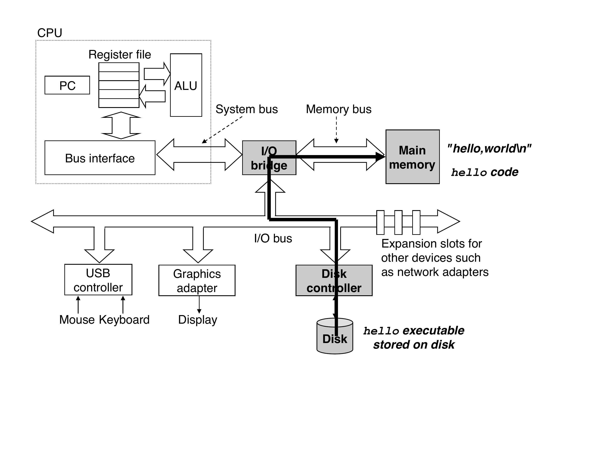
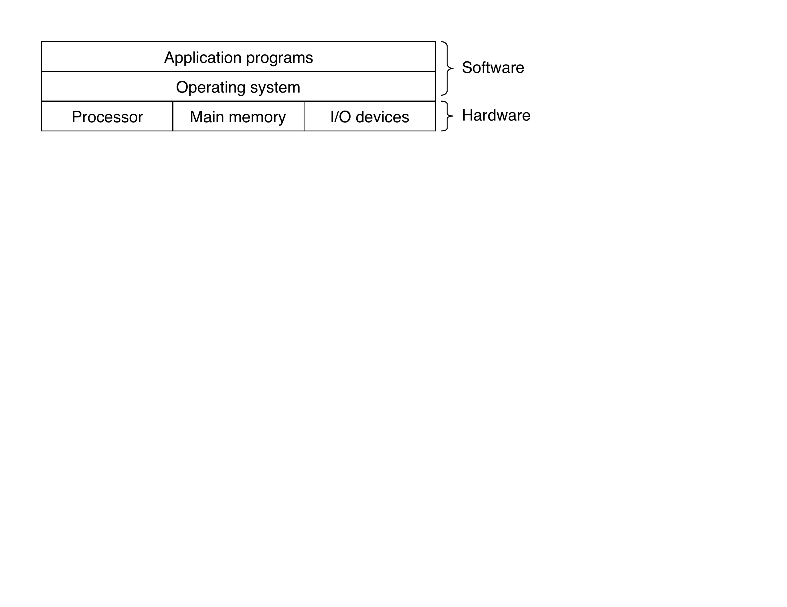
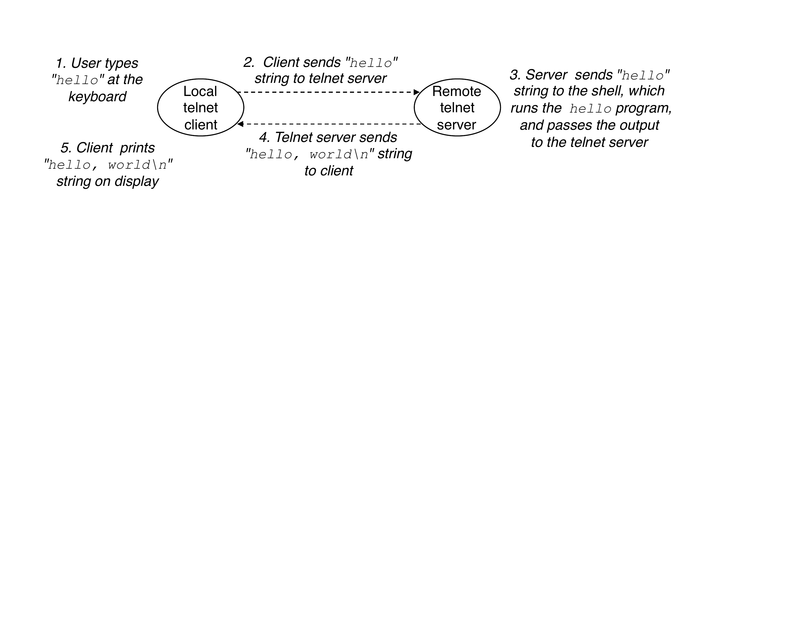
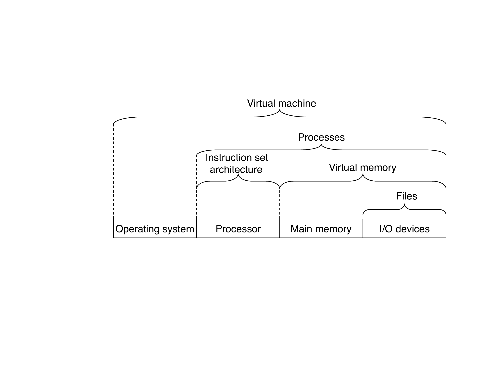

# CSAPP Chapter 1 — A Tour of Computer Systems

---

Q: What is a source program (source file)?
A: A source program is a file the programmer creates with an editor, saved as a sequence of bits organized into 8-bit chunks called <b>bytes</b>. Each byte represents a text character in the program. Example: <code>hello.c</code> is a source file.

Q: What is the ASCII standard and how does it apply to source files?
A: ASCII (American Standard Code for Information Interchange) represents each character with a unique byte-sized integer value. For example, <code>#</code> = 35, <code>i</code> = 105, newline <code>\n</code> = 10. Files consisting exclusively of ASCII characters are called <b>text files</b>; all others are <b>binary files</b>.

Q: What is the fundamental principle about information in a computer system?
A: All information in a system — disk files, programs in memory, user data, network data — is represented as a bunch of bits. The only thing that distinguishes different data objects is the <b>context</b> in which we view them. The same sequence of bytes might represent an integer, a float, a string, or a machine instruction depending on context.

Q: What is a text file vs a binary file?
A: A <b>text file</b> consists exclusively of ASCII characters — every byte maps to a printable or control character. A <b>binary file</b> is everything else — bytes that don't necessarily correspond to characters (e.g. compiled executables, images).

Q: What command compiles a C program using GCC, and what does it produce?
A: <code>unix&gt; gcc -o hello hello.c</code> This invokes the compilation system (preprocessor → compiler → assembler → linker) and produces an executable object file named <code>hello</code>.

Q: What are the 4 programs that make up the compilation system?
A: 1. <b>Preprocessor (cpp)</b> 2. <b>Compiler (cc1)</b> 3. <b>Assembler (as)</b> 4. <b>Linker (ld)</b>

Q: What does the preprocessor do, and what does it output?
A: The preprocessor (cpp) modifies the original C program according to directives beginning with <code>#</code>. For example, <code>#include &lt;stdio.h&gt;</code> causes it to read and insert the contents of <code>stdio.h</code> directly into the program text. Output: a modified C program with suffix <code>.i</code>.

Q: What does the compiler do, and what does it output?
A: The compiler (cc1) translates the <code>.i</code> text file into an <b>assembly-language program</b>. Each statement in assembly describes exactly one low-level machine instruction. Output: a <code>.s</code> text file.

Q: What does the assembler do, and what does it output?
A: The assembler (as) translates the assembly <code>.s</code> file into machine-language instructions, packaging them as a <b>relocatable object program</b>. Output: a binary <code>.o</code> file — bytes encode machine instructions, not characters.

Q: What does the linker do, and what does it output?
A: The linker (ld) merges separately compiled object files. For example, it merges the compiled <code>hello.o</code> with <code>printf.o</code> (precompiled standard library) into a single file. Output: an <b>executable object file</b> ready to be loaded into memory and run.

Q: Why should programmers understand how compilation systems work? (3 reasons)
A: 1. <b>Optimizing performance</b> — understand how C constructs map to machine code (switch vs if-else, loop ordering, pointer vs array) 2. <b>Understanding link-time errors</b> — know why "undefined reference" happens, static vs dynamic libraries, symbol conflicts 3. <b>Avoiding security holes</b> — understand how data and control info sit on the stack, enabling buffer overflow vulnerabilities

Q: What is a shell?
A: A shell is a <b>command-line interpreter</b> that prints a prompt, waits for you to type a command, and then executes it. If the first word of the command is not a built-in command, the shell treats it as the name of an executable file to load and run. Example: typing <code>./hello</code> causes the shell to load and run the <code>hello</code> executable.

Q: What are buses in a computer system?
A: Buses are electrical conduits that run throughout the system, carrying bytes of information back and forth between components. They are designed to transfer fixed-size chunks of bytes called <b>words</b>. Types: system bus (CPU ↔ I/O bridge), memory bus (I/O bridge ↔ DRAM), I/O bus (connects I/O devices).

Q: What is a word in computer hardware? What is word size?
A: A <b>word</b> is the fixed-size chunk of bytes that buses are designed to transfer. <b>Word size</b> is a fundamental system parameter — most modern systems use <b>4 bytes (32-bit)</b> or <b>8 bytes (64-bit)</b>. It determines the size of registers, memory addresses, and the maximum directly addressable memory.

Q: What are I/O devices? How do they connect to the system?
A: I/O devices are the system's connection to the external world (keyboard, mouse, display, disk). Each I/O device connects to the I/O bus via either a <b>controller</b> (chip set on the device or motherboard) or an <b>adapter</b> (a card that plugs into a motherboard slot). Both transfer information between the I/O bus and the device.

Q: What is main memory physically? What is it logically?
A: <b>Physically</b>: main memory is a collection of <b>DRAM (Dynamic Random Access Memory)</b> chips. <b>Logically</b>: memory is organized as a <b>linear array of bytes</b>, each with its own unique address (index) starting at zero.

Q: What does main memory hold during program execution?
A: Main memory is a <b>temporary storage device</b> that holds both the <b>program</b> (machine instructions) and the <b>data it manipulates</b> while the processor is executing the program.

Q: How many bytes do C primitive types occupy on a 32-bit (IA32) Linux system?
A: <code>short</code>: <b>2 bytes</b> <code>int</code>: <b>4 bytes</b> <code>float</code>: <b>4 bytes</b> <code>long</code>: <b>4 bytes</b> <code>double</code>: <b>8 bytes</b> Note: machine instructions themselves can consist of a <b>variable number of bytes</b>.

Q: What is the CPU / processor?
A: The <b>central processing unit (CPU)</b> is the engine that interprets and executes instructions stored in main memory. At its core is a word-sized register called the <b>program counter (PC)</b> that points to the next instruction to execute. From power-on to power-off, the processor repeatedly executes the instruction at the PC and updates the PC.

Q: What is the program counter (PC)?
A: The <b>program counter (PC)</b> is a word-sized register inside the CPU. At any point in time it contains the <b>memory address</b> of the next machine-language instruction to execute. After executing an instruction, the CPU updates the PC to point to the next instruction (which may or may not be contiguous in memory).

Q: What is the register file?
A: The <b>register file</b> is a small, very fast storage device inside the CPU. It consists of a collection of <b>word-sized registers</b>, each with its own unique name (e.g. <code>%eax</code>, <code>%ebx</code>). The CPU reads from and writes to registers far faster than from main memory.

Q: What is the ALU?
A: The <b>Arithmetic/Logic Unit (ALU)</b> is the part of the CPU that <b>computes new data and address values</b>. It performs arithmetic (add, subtract, multiply) and logical (AND, OR, NOT) operations on values from the register file. Results are stored back into a register.

Q: What are the 4 basic CPU operations?
A: <b>Load</b>: copy a byte/word from main memory into a register (overwrites the register). <b>Store</b>: copy a byte/word from a register to a main memory location (overwrites that location). <b>Operate</b>: copy two register values to the ALU, perform arithmetic, store result in a register. <b>Jump</b>: extract a word from the instruction and copy it into the PC (redirects execution).

Q: What is the difference between ISA and microarchitecture?
A: <b>ISA (Instruction Set Architecture)</b>: the abstract model — describes the <i>effect</i> of each machine instruction. Programs are written to the ISA; different CPUs can share the same ISA. <b>Microarchitecture</b>: describes <i>how</i> the processor actually implements the ISA in hardware (pipelining, caching, out-of-order execution). Modern processors appear sequential but execute many instructions in parallel internally.

Q: What happens step by step when you run ./hello from a shell?
A: 1. Shell reads typed characters (<code>./hello</code>) into registers, stores them in memory. 2. On Enter: shell uses <b>DMA</b> to copy the executable from disk → main memory (bypassing CPU). 3. CPU begins executing <code>hello</code>'s machine instructions. 4. Instructions copy the string <code>"hello, world\n"</code> from memory → register file → display device.

Q: What is DMA (Direct Memory Access)?
A: <b>DMA</b> is a technique where data travels directly from an I/O device (e.g. disk) to main memory <b>without passing through the processor</b>. This allows the CPU to do other work while the transfer happens. It is used when loading an executable from disk into main memory before execution.

Q: Why do caches exist? What problem do they solve?
A: The <b>processor-memory gap</b>: the CPU operates much faster than DRAM. Reading from a register is ~100× faster than reading from main memory; reading from disk is ~10,000,000× slower. Caches are small, fast staging areas placed between the CPU and slower storage, exploiting <b>locality</b> — programs tend to reuse recently accessed data and code.

Q: What hardware technology implements cache memories?
A: Caches are implemented using <b>SRAM (Static Random Access Memory)</b>. SRAM is faster and more expensive per byte than DRAM (used for main memory). L1 cache (on-chip): tens of KB, ~4 cycles. L2 cache (connected by special bus): hundreds of KB–MB, ~10 cycles — still 5–10× faster than DRAM.

Q: What is the principle of locality and why does it make caches effective?
A: <b>Locality</b> is the tendency for programs to access data and code in localized regions — recently accessed memory is likely to be accessed again soon. By pre-loading this likely-needed data into fast cache memory, the system can perform most memory operations using the cache rather than slow DRAM.

Q: Describe the memory hierarchy from L0 to L6.
A: <b>L0 — Registers</b>: few hundred bytes, ~1 cycle (inside CPU) <b>L1 — L1 cache (SRAM)</b>: tens of KB, ~4 cycles <b>L2 — L2 cache (SRAM)</b>: hundreds of KB–MB, ~10 cycles <b>L3 — L3 cache (SRAM)</b>: MB range, ~40 cycles <b>L4 — Main memory (DRAM)</b>: GB range, ~100 cycles <b>L5 — Local disk</b>: TB range, ~10M cycles <b>L6 — Remote storage / network</b>: unlimited, slowest

Q: What is the key idea of the memory hierarchy?
A: Storage at each level serves as a <b>cache for the level below</b>. Registers cache L1; L1 caches L2; L2 caches L3; L3 caches DRAM; DRAM caches disk. Higher levels are faster, smaller, and more expensive per byte; lower levels are slower, larger, and cheaper.

Q: What is the OS's role between application programs and hardware?
A: The OS is a layer of software <b>interposed between application programs and the hardware</b>. All attempts by an application to manipulate hardware must go through the OS. It has two primary purposes: (1) protect hardware from misuse, and (2) provide simple, uniform abstractions for complex hardware devices.

Q: What are the 3 fundamental OS abstractions, and what does each abstract?
A: <b>Files</b> → abstraction for I/O devices (disk, keyboard, display, network) <b>Virtual memory</b> → abstraction for both main memory AND disk <b>Processes</b> → abstraction for the processor + main memory + I/O devices

Q: What is a process?
A: A <b>process</b> is the OS's abstraction for a running program. It creates the illusion that the program has <b>exclusive use</b> of the processor, main memory, and I/O devices — even when multiple processes run concurrently. Concurrently means one process's instructions are interleaved with another's.

Q: What is a process's context?
A: The <b>context</b> is all the state information a process needs to run: the current values of the <b>PC</b>, <b>register file</b>, and <b>contents of main memory</b>. The OS saves and restores this context when switching between processes.

Q: What is context switching?
A: <b>Context switching</b> is how the OS transfers control between processes: 1. Save the context of the current process. 2. Restore the context of the new process. 3. Pass control to the new process — it picks up exactly where it left off. This creates the illusion of concurrent execution on a single CPU.

Q: What are threads, and how do they differ from processes?
A: A <b>thread</b> is an execution unit within a process. A process can have multiple threads, each running in the process's context and sharing the same <b>code and global data</b>, but with its own <b>PC, register file, and stack</b>. Threads are cheaper to create/switch than processes and share memory by default — important for network servers and multi-core programs.

Q: What is virtual memory?
A: <b>Virtual memory</b> is an abstraction giving each process the illusion it has <b>exclusive use of the entire main memory</b>. Each process sees the same uniform <b>virtual address space</b>. Implemented by storing a process's data on disk and using main memory as a cache for disk pages, with hardware translating every virtual address to a physical address.

Q: What are the regions of a Linux process's virtual address space, from lowest to highest address?
A: <b>0</b>: unused (null pointer trap) <b>Code &amp; data</b>: initialized from the executable — read-only code then read/write global variables <b>Heap</b>: expands/contracts at runtime via <code>malloc</code>/<code>free</code> <b>Shared libraries</b>: C stdlib, math lib, etc. (middle of space) <b>User stack</b>: grows downward; expands on function call, contracts on return <b>Kernel virtual memory</b>: top — invisible to user code, contains OS kernel

Q: What is the heap in a process's virtual address space?
A: The <b>heap</b> is a region of virtual memory that sits just above the code and data areas. Unlike fixed-size code/data regions, the heap <b>expands and contracts dynamically</b> at run time. It grows upward as a result of calls to <code>malloc</code> and shrinks on calls to <code>free</code>.

Q: What is the user stack in a process's virtual address space?
A: The <b>user stack</b> sits at the top of the user's virtual address space and grows downward. The compiler uses it to implement <b>function calls</b>: the stack grows (downward) each time a function is called, and contracts when a function returns. It expands and contracts dynamically during program execution.

Q: What is kernel virtual memory?
A: The <b>kernel virtual memory</b> is the topmost region of every process's address space, reserved for the OS kernel. It contains the kernel's code and data structures. Application programs are <b>not allowed</b> to read, write, or directly call functions in this area — all access must go through system calls.

Q: What is a file in Unix?
A: A file is simply a <b>sequence of bytes — nothing more and nothing less</b>. Every I/O device — disks, keyboards, displays, and networks — is modeled as a file. All input and output is performed by reading and writing files using a small set of system calls known as <b>Unix I/O</b>.

Q: Why is the Unix file abstraction powerful?
A: Because it provides applications with a <b>uniform view of all I/O devices</b>. A program that reads/writes files doesn't need to know the specific disk technology, display type, or network protocol. The same program runs unchanged on systems with different underlying hardware.

Q: How is a network viewed from the perspective of a single computer?
A: From a single system's viewpoint, a <b>network is just another I/O device</b>. Writing bytes to the network adapter sends data to another machine instead of a local disk. Reading from the network adapter receives data sent from a remote machine. All network applications (email, web, FTP) are built on copying bytes between machines.

Q: Describe the 5 steps of running hello remotely via telnet.
A: 1. User types <code>"hello"</code> at local keyboard → telnet client reads it. 2. Telnet client sends the string to the remote telnet server over the network. 3. Remote telnet server passes the string to the remote shell, which runs <code>hello</code>. 4. Remote shell passes <code>hello</code>'s output (<code>"hello, world\n"</code>) back to the telnet server. 5. Telnet server sends the output string back to the client, which displays it on screen.

Q: What is the difference between concurrency and parallelism?
A: <b>Concurrency</b>: a system with multiple, simultaneous activities — even a single CPU appears concurrent by rapidly switching between tasks. <b>Parallelism</b>: using concurrency to make a system run <b>faster</b> — actual simultaneous execution on multiple hardware units. All parallelism requires concurrency, but concurrency does not require parallelism.

Q: What is thread-level concurrency? What enables it in hardware?
A: <b>Thread-level concurrency</b> is having multiple threads/processes active at the same time. <b>Multi-core processors</b>: multiple complete CPU cores on one chip, each with its own L1/L2 cache, sharing L3 and main memory. <b>Hyperthreading</b>: a single core with multiple copies of PC and register file but shared execution units — switches between threads cycle-by-cycle.

Q: What is a uniprocessor vs multiprocessor system?
A: <b>Uniprocessor</b>: a single CPU — achieves concurrency by rapidly switching between processes/threads, but only truly runs one at a time. <b>Multiprocessor</b>: multiple CPUs under a single OS kernel — can execute multiple threads <b>truly simultaneously</b>. Includes multi-core chips and hyperthreaded processors.

Q: What is hyperthreading (simultaneous multi-threading)?
A: <b>Hyperthreading</b> allows a single CPU core to execute multiple threads simultaneously by duplicating some state (PC, register file) while sharing execution units (ALU, FPU). A conventional processor needs ~20,000 clock cycles to switch threads (OS context switch). A hyperthreaded processor decides which thread to run on a <b>cycle-by-cycle basis</b> — if one thread stalls on memory, the other runs immediately.

Q: What is instruction-level parallelism (ILP)?
A: <b>ILP</b> is a single CPU core's ability to execute multiple instructions simultaneously. <b>Pipelining</b>: splits instruction execution into stages (fetch, decode, execute, write-back) that overlap across instructions — like an assembly line — achieving ~1 instruction/cycle. <b>Superscalar</b>: multiple execution units that complete >1 instruction per cycle; modern CPUs may have 100+ instructions "in-flight" simultaneously.

Q: What is SIMD parallelism?
A: <b>SIMD (Single Instruction, Multiple Data)</b> is a mode where a single instruction operates on <b>multiple data values in parallel</b>. Example: modern Intel/AMD processors can add 4 pairs of single-precision floats (<code>float</code>) in a single instruction. Used primarily to accelerate image, sound, and video processing.

Q: What are the key abstractions in a complete computer system and what does each hide?
A: <b>Files</b> → hides differences between I/O devices <b>Virtual memory</b> → hides physical memory layout and disk paging <b>Processes</b> → hides CPU scheduling and hardware multiplexing <b>ISA</b> → hides the microarchitecture implementation from software <b>Virtual machine</b> → hides the entire system (OS + processor + programs), enabling multiple OSes on one machine

Q: What is a virtual machine, and why was it introduced?
A: A <b>virtual machine</b> provides an abstraction of the <b>entire computer</b> — including the OS, processor, and programs. Originally introduced by IBM in the 1960s. Became prominent as a way to run programs designed for multiple operating systems (Windows, macOS, Linux) or different versions of the same OS on a single physical machine.

