# CSAPP Chapter 1 — A Tour of Computer Systems

---

Q: What does a simple computer look like at the hardware level?
A: At its core, a computer has four components connected by <b>buses</b> (electrical wires that carry bytes between components): <b>CPU</b> — the engine that executes instructions. Contains a <b>program counter (PC)</b> pointing to the next instruction, a small set of <b>registers</b> for temporary values, and an <b>ALU</b> that performs arithmetic. <b>Main memory (DRAM)</b> — stores the running program and its data as a flat array of bytes. <b>I/O devices</b> — disk, display, keyboard, NIC — each connected via controllers. <b>Buses</b> — system bus, memory bus, I/O bus — ferrying data between all of the above.
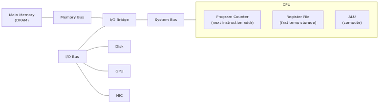

Q: How does the CPU actually execute a program? (the fetch-execute cycle)
A: The CPU runs one endless loop: 1. <b>Fetch</b>: read the instruction at the address stored in the <b>program counter (PC)</b> 2. <b>Decode</b>: figure out what operation the instruction encodes 3. <b>Execute</b>: carry it out — one of four things: <b>Load</b> (RAM → register), <b>Store</b> (register → RAM), <b>Operate</b> (ALU computes, result stays in register), or <b>Jump</b> (new value into PC) 4. Update PC to the next instruction (or jump target) and repeat Every line of your Go/Java code — after compilation — becomes a sequence of these primitive CPU operations.
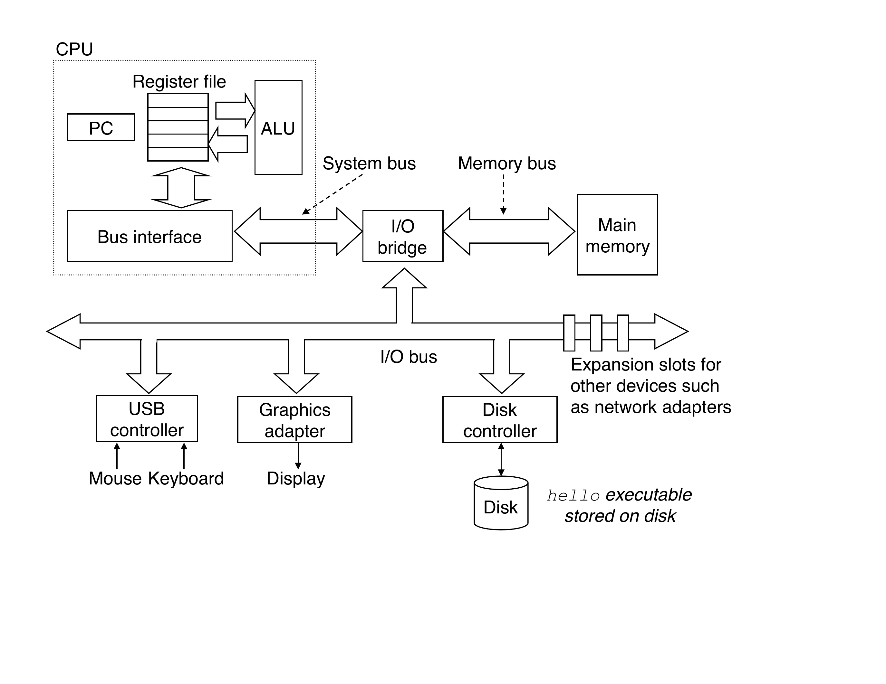

Q: Why did the processor-memory gap grow, and what was the engineering solution?
A: From the 1980s onward, CPU speeds improved roughly 60% per year following Moore's law — transistors halved in size every 18 months. DRAM (main memory) latency improved only ~7% per year — the physics of capacitor charging didn't scale the same way. By the 2000s, a CPU could issue billions of instructions per second but had to wait ~100 ns (hundreds of idle cycles) for every RAM access. The solution: <b>SRAM cache memories</b> placed between the CPU and DRAM — small enough to be fast (nanoseconds), large enough to hold the working set, and organized in levels (L1/L2/L3) as the gap kept widening.
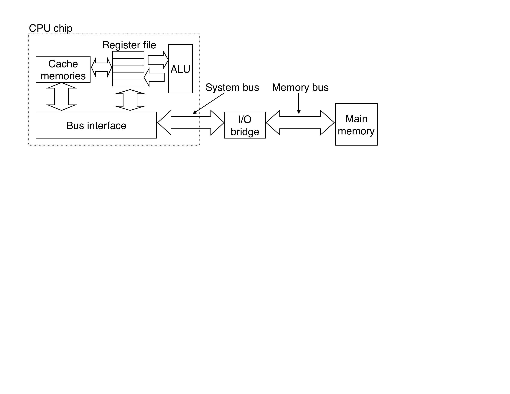

Q: What are the 4 stages of the compilation pipeline, and why should a Go/Java dev care?
A: <b>1. Preprocessor</b> — expands macros and <code>#include</code>s (C/C++ only; Go/Java skip this) <b>2. Compiler</b> — translates source code to assembly (or JVM bytecode / Go SSA IR) <b>3. Assembler</b> — turns assembly into machine code binary object files (<code>.o</code>) <b>4. Linker</b> — merges object files and libraries into a single executable Why care? Knowing this explains: <b>undefined symbol errors</b> (linker couldn't find a function), <b>shared vs static libraries</b> (when code is bundled), and <b>compiler optimizations</b> (inlining, escape analysis) that affect your code's runtime behavior — things you debug in Go and Java regularly.
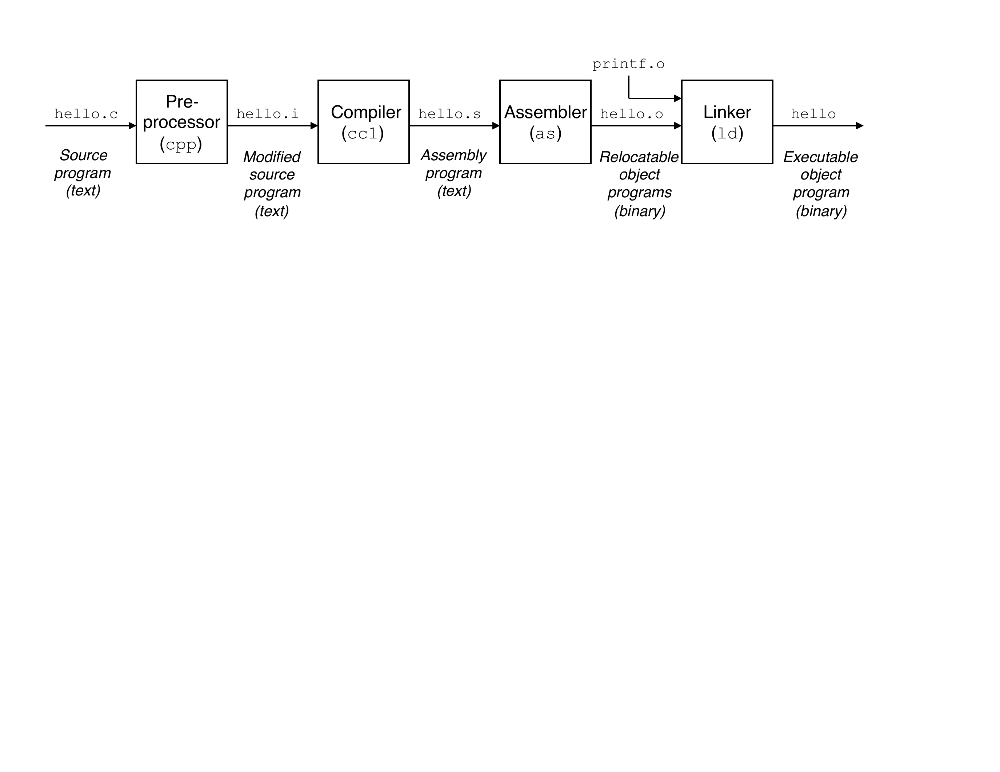

Q: Why does the CPU memory gap slow down your programs?
A: The CPU processes instructions far faster than RAM can supply data — roughly <b>100× faster</b>. This means that when the CPU needs data from main memory, it sits idle waiting for it. <b>Caches</b> (small, fast SRAM sitting between the CPU and RAM) exist to bridge this gap by keeping recently used data close to the processor. This is why reducing random memory access in hot loops matters in Go/Java as much as in C.

Q: What is the memory hierarchy?
A: Storage is organized in levels: the higher the level, the <b>faster, smaller, and more expensive</b> per byte; the lower, the <b>slower, larger, and cheaper</b>. <b>L0 — Registers</b>: ~1 cycle, bytes <b>L1 cache (SRAM)</b>: ~4 cycles, tens of KB <b>L2 cache (SRAM)</b>: ~10 cycles, hundreds of KB <b>L3 cache (SRAM)</b>: ~40 cycles, MB range <b>RAM (DRAM)</b>: ~100 cycles, GB range <b>SSD / HDD</b>: millions of cycles, TB range Each level caches the level below it.
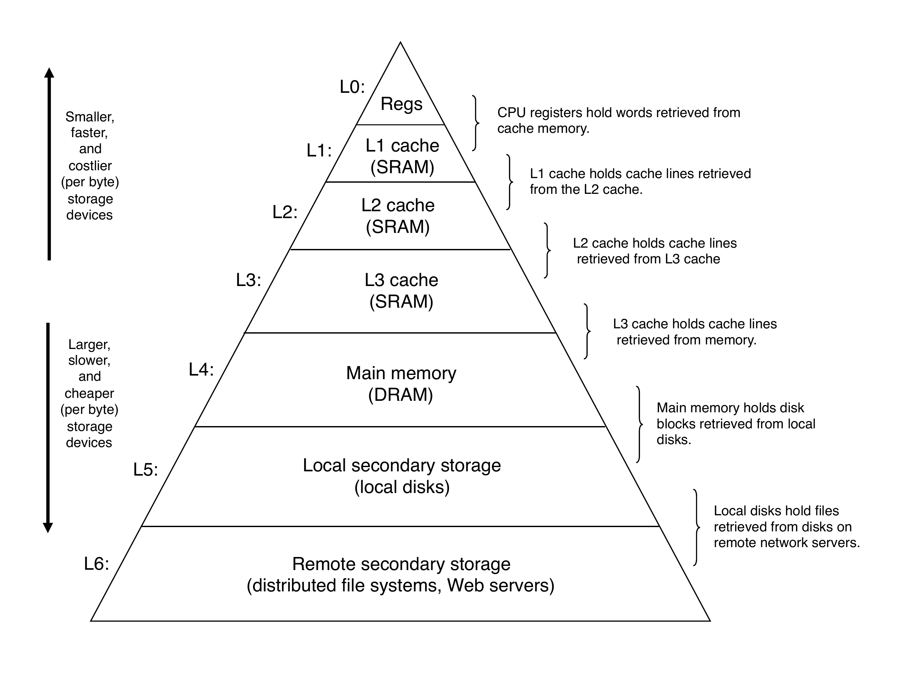

Q: What are the OS's 3 fundamental abstractions and what does each one hide?
A: <b>Files</b> → hides the differences between all I/O devices (disk, keyboard, display, network socket — all look the same to your code) <b>Virtual memory</b> → hides the physical layout of RAM and the fact that pages can live on disk <b>Processes</b> → hides the CPU scheduler and hardware multiplexing, giving each program the illusion of running alone These three abstractions are why your Go HTTP handler doesn't need to know what NIC is installed.
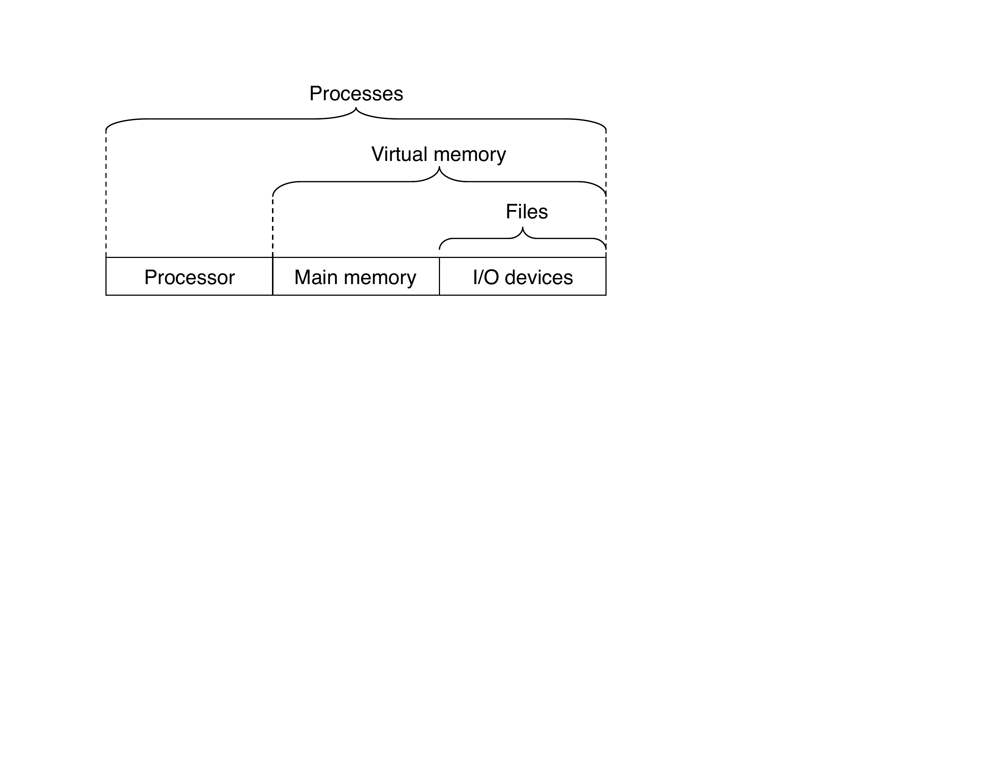

Q: What is a process and what illusion does it create?
A: A <b>process</b> is the OS's abstraction for a running program. It creates the illusion that the program has <b>exclusive use</b> of the CPU, main memory, and I/O devices — even when dozens of other processes are active. Each process has its own private <b>virtual address space</b>, so it can't accidentally read or write another program's memory. In Go, every program you run — including the Go runtime itself — runs as a process.
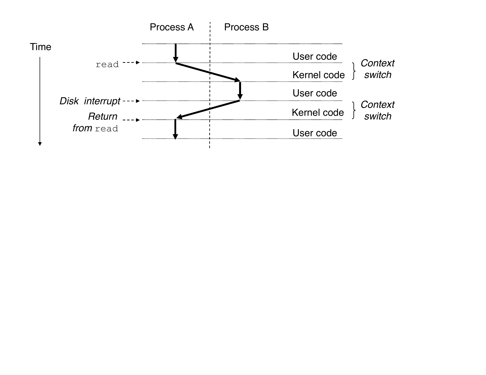

Q: What is context switching, and why does it matter to a backend developer?
A: <b>Context switching</b> is how the OS rapidly hands the CPU from one process (or thread) to another: 1. Save the current program's state (PC, registers, memory). 2. Restore the next program's state. 3. Resume it from exactly where it left off. This is what lets a single Go server appear to handle thousands of concurrent requests — the OS interleaves them on the same hardware. Context switches have overhead (~microseconds), which is why Go goroutines are cheap (they switch in user space, not kernel space).

Q: How are threads different from processes?
A: A <b>thread</b> is an execution unit inside a process. Multiple threads in the same process share: <b>code, heap, global variables, and open file descriptors</b>. Each thread has its own: <b>program counter, register file, and stack</b>. Threads are cheaper to create and switch than processes because they share the address space — no address-space copy needed. Go goroutines are user-space threads multiplexed onto OS threads by the Go scheduler.
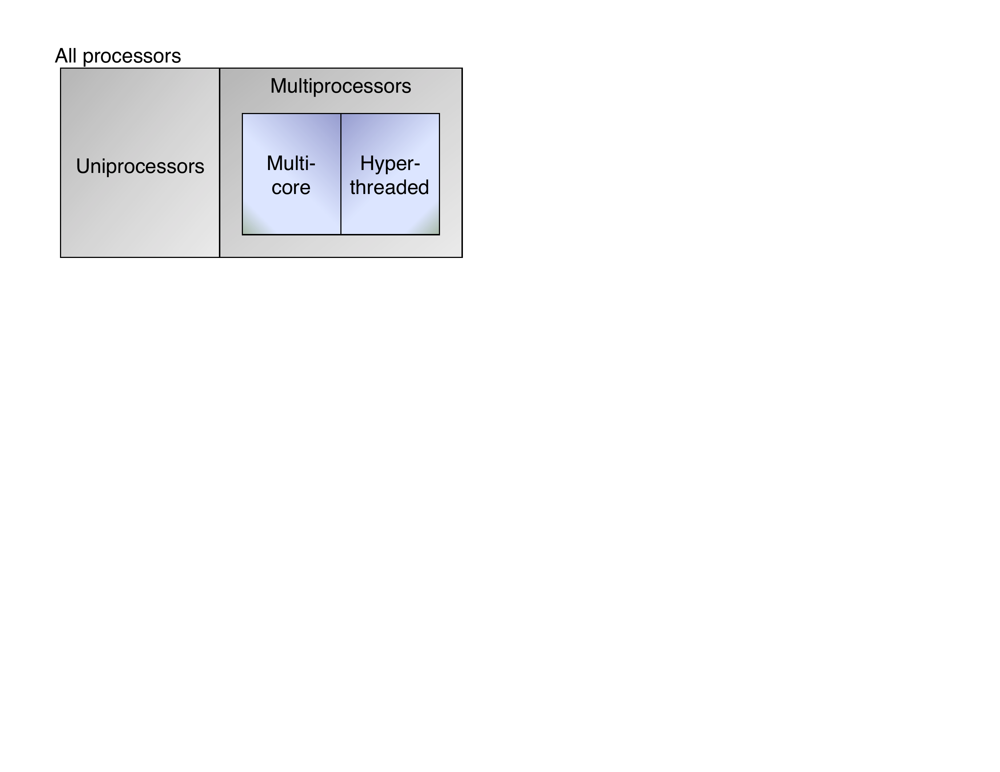

Q: What is virtual memory and what problem does it solve?
A: <b>Virtual memory</b> gives each process the illusion it owns the <b>entire address space</b> — from address 0 to 2^64 on a 64-bit machine. It solves two problems: 1. <b>Isolation</b> — processes can't read or corrupt each other's memory 2. <b>Capacity</b> — programs can use more memory than physically available RAM (overflow goes to disk) In practice, each JVM / Go runtime manages its heap entirely in virtual memory — physical RAM pages are mapped in on demand.
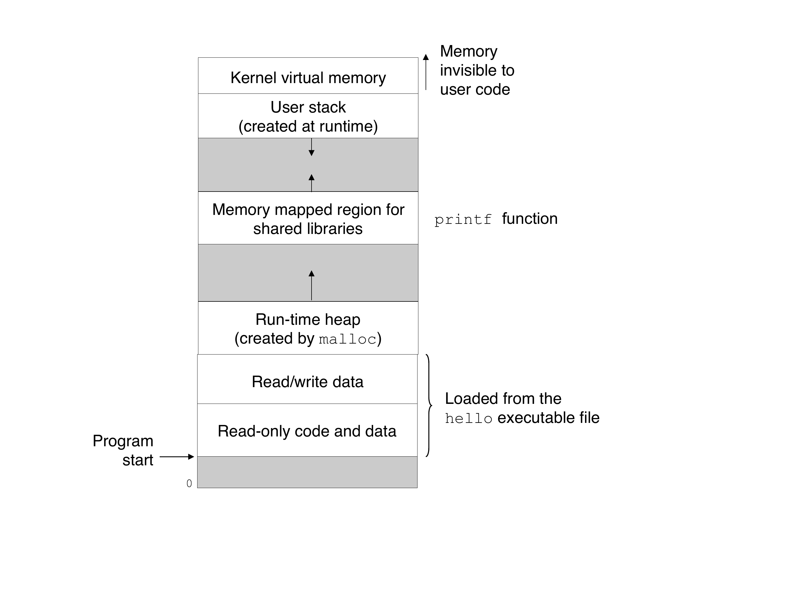

Q: What is a memory page, and why does the OS manage memory in pages rather than individual bytes?
A: A <b>page</b> is the smallest unit the OS moves between RAM and disk — typically <b>4 KB</b>. Instead of tracking billions of individual bytes, the OS groups them into fixed-size pages and manages those chunks. Your program's virtual address space is divided into pages; physical RAM is divided into matching <b>frames</b>. The OS maps virtual pages to physical frames as needed. Why 4 KB? It's a hardware-enforced granularity baked into the CPU's memory management unit (MMU). You can't go smaller without redesigning the chip.

Q: What is the page table and what does it do?
A: The <b>page table</b> is the OS's per-process dictionary that translates <b>virtual addresses → physical addresses</b>. Every memory access your program makes goes through the CPU's MMU, which looks up the page table to find where in physical RAM (or disk) that virtual page actually lives. If the page is in RAM → the MMU returns the physical address instantly. If the page is on disk → the CPU triggers a <b>page fault</b> and the OS steps in to fetch it. In Go/Java: the runtime's heap allocator hands you virtual addresses; the page table is what makes those addresses resolve to real memory.
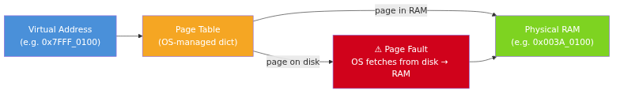

Q: What happens during a page fault?
A: A <b>page fault</b> is triggered when your program accesses a virtual address whose page is <b>not currently in RAM</b> (it's on disk in swap space). The sequence: 1. CPU detects the missing page, raises a page fault interrupt 2. OS pauses your program 3. OS finds the page on disk, loads it into a free RAM frame, updates the page table 4. OS resumes your program — from its perspective, nothing happened Page faults are invisible to your code but expensive (~milliseconds vs nanoseconds for RAM). Too many = your app stalls. This is why the JVM heap size matters: a heap too large for available RAM causes constant page faults.
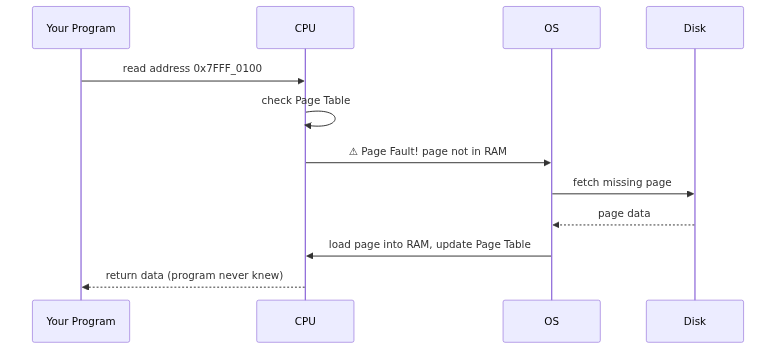

Q: What is thrashing and what causes it?
A: <b>Thrashing</b> happens when the OS spends more time swapping pages between disk and RAM than actually running programs. Cause: total memory demanded by all running processes exceeds physical RAM. The OS must constantly evict pages from RAM to disk to make room — only to immediately need them back. Symptom: CPU utilization collapses (it's waiting on disk I/O, not running code). Your machine feels frozen even though CPU usage reads near 100%. You've seen this when you open 30 Chrome tabs + Docker containers + VS Code: the system stops responding. The fix is either more RAM or fewer processes.
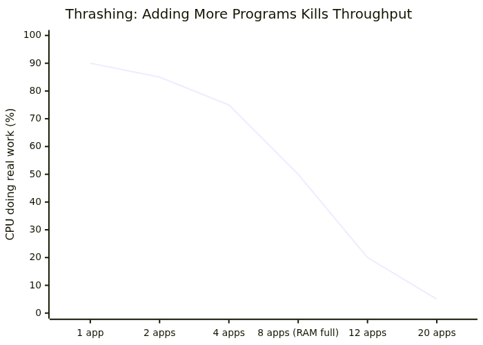

Q: What problem does the OS file abstraction solve for developers?
A: Without it, you'd need <b>device-specific code</b> for every piece of hardware — and that code would break every time a user plugged in a different brand. A keyboard produces individual keystrokes; an SSD reads/writes data blocks on silicon; a network card sends/receives packets. Physically, they all work differently. The OS hides this chaos behind a single uniform interface — <b>the file</b> — so your code never needs to know what hardware is actually present.

Q: What are the four universal I/O operations the Unix file abstraction exposes?
A: Every I/O device — disk, keyboard, network socket, display — is accessed through the same four calls: <b>Open</b> — establish a connection to the device <b>Read</b> — get data from the device <b>Write</b> — send data to the device <b>Close</b> — terminate the connection The OS translates these generic calls into whatever binary signals the specific hardware actually needs. In Go: <code>os.Open()</code>, <code>file.Read()</code>, <code>file.Write()</code>, <code>file.Close()</code> — and <code>net.Dial()</code>, <code>conn.Read()</code>, <code>conn.Write()</code>, <code>conn.Close()</code> follow the exact same pattern for a TCP socket.
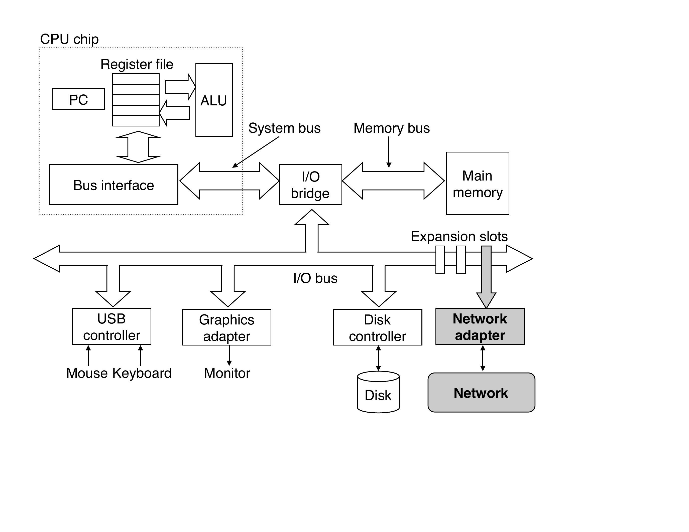

Q: What is a file descriptor, and why does it appear everywhere in Go and Java?
A: A <b>file descriptor</b> is the OS's generic integer handle for any open I/O resource — a disk file, a network connection, stdin, a pipe, a device. When you call <code>open()</code> or <code>socket()</code> the kernel returns a file descriptor (e.g. <code>3</code>). From that point on, <code>read(fd, ...)</code> and <code>write(fd, ...)</code> work identically regardless of what the fd points to. In Go, this is why <code>os.File</code>, <code>net.Conn</code>, and <code>http.Response.Body</code> all satisfy <code>io.Reader</code> and <code>io.Writer</code> — they're all backed by a file descriptor at the kernel level.

Q: Why is "everything is a file" in Unix so powerful for developers?
A: In Unix, a <b>file is just a sequence of bytes</b> — and every I/O device (disk, keyboard, display, network socket) is modeled as a file. This means the same <code>read()</code>/<code>write()</code> system calls work for <b>all I/O</b>. In Go, <code>io.Reader</code> and <code>io.Writer</code> work the same way whether the underlying source is a file, an HTTP response body, a gzip stream, or a TCP connection — because they're all files at the OS level.

Q: What is the difference between concurrency and parallelism?
A: <b>Concurrency</b>: a system has multiple tasks <i>in progress</i> at the same time — even a single CPU can be concurrent by rapidly interleaving tasks. <b>Parallelism</b>: tasks actually execute <i>simultaneously</i> on multiple hardware units (multiple cores or machines). All parallelism involves concurrency, but not all concurrency is parallel. Go's goroutines are concurrent even on a single core; they run in <i>parallel</i> only when <code>GOMAXPROCS > 1</code>.

Q: What does multi-core hardware mean for Go and Java programs?
A: Multi-core processors put <b>multiple complete CPU cores</b> on one chip, each with its own L1/L2 cache, sharing L3 and RAM. Programs gain real parallelism — different goroutines/threads run on different cores simultaneously. The catch: cores share L3 and RAM, so <b>cache coherence</b> and <b>memory bandwidth</b> become bottlenecks when many cores fight over the same data. In Go, <code>GOMAXPROCS</code> controls how many OS threads (and thus cores) run goroutines in parallel — it defaults to the number of CPUs.
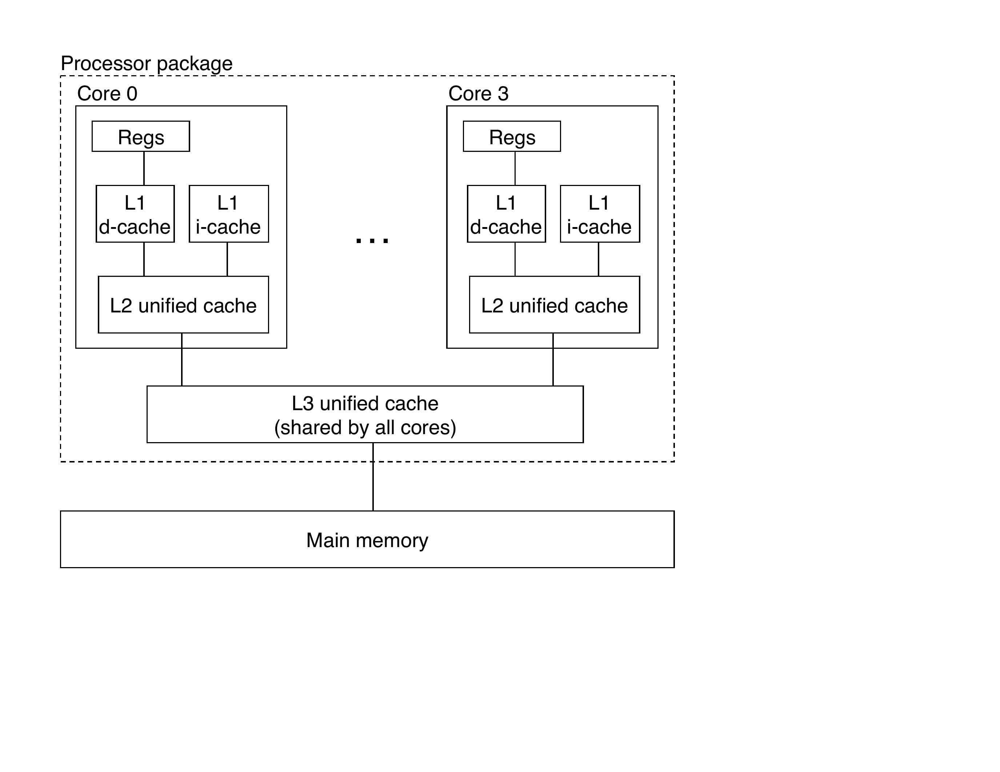
