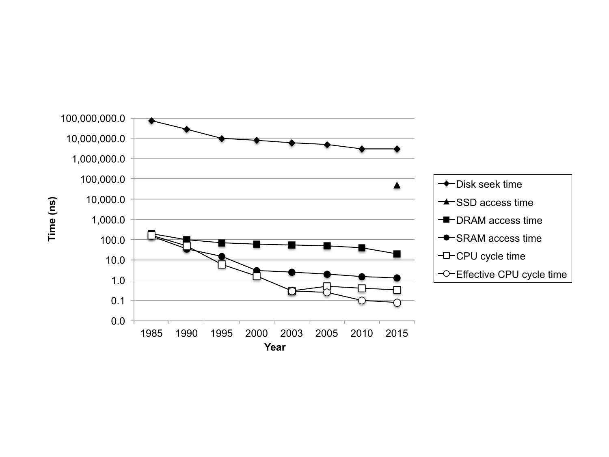
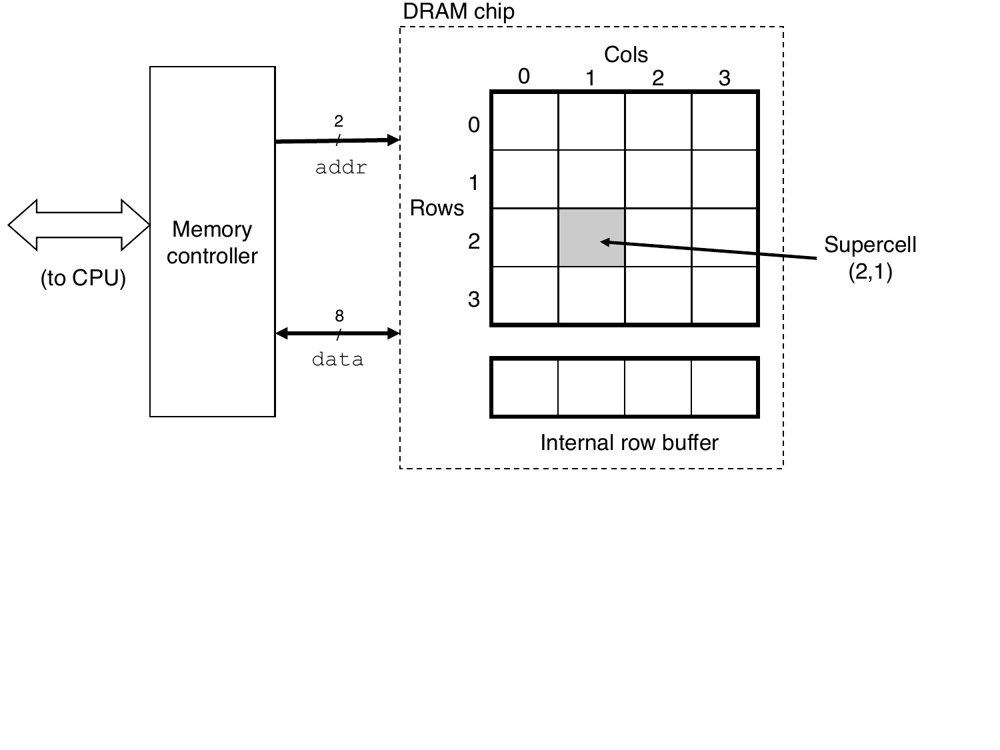
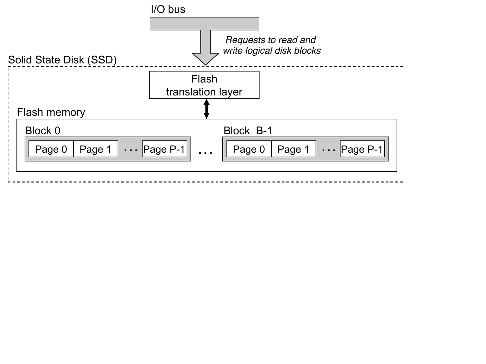
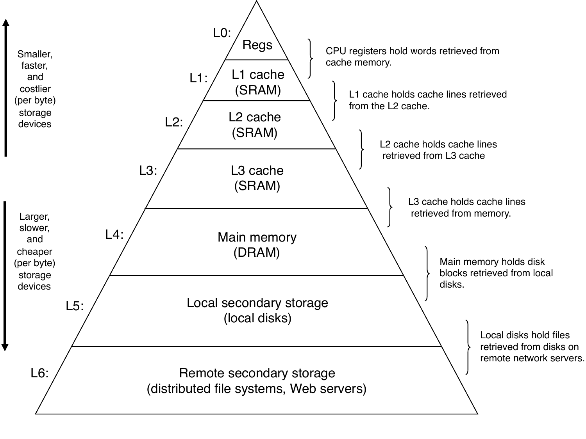
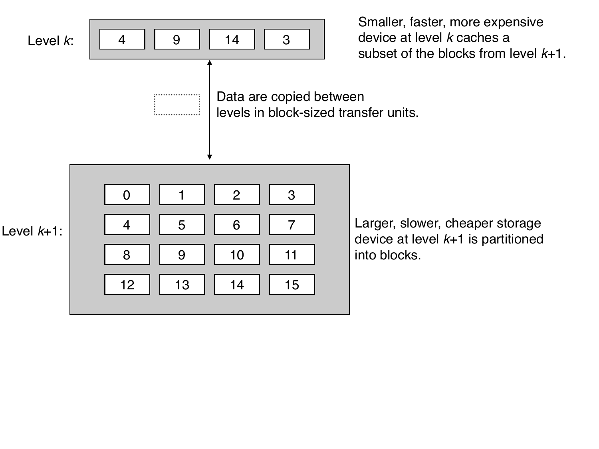
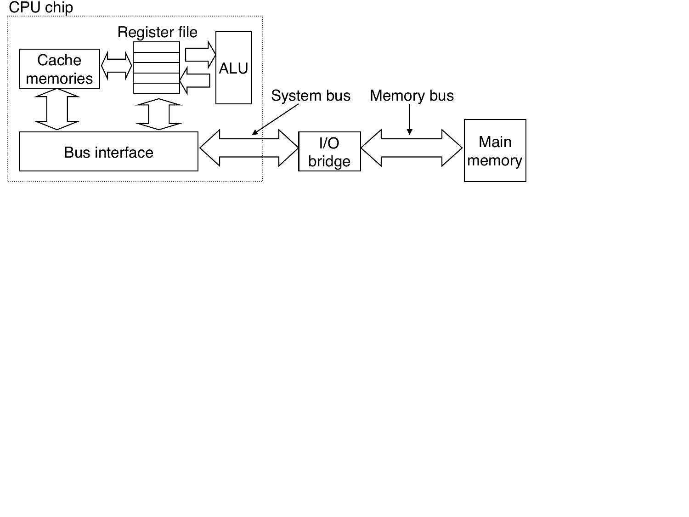
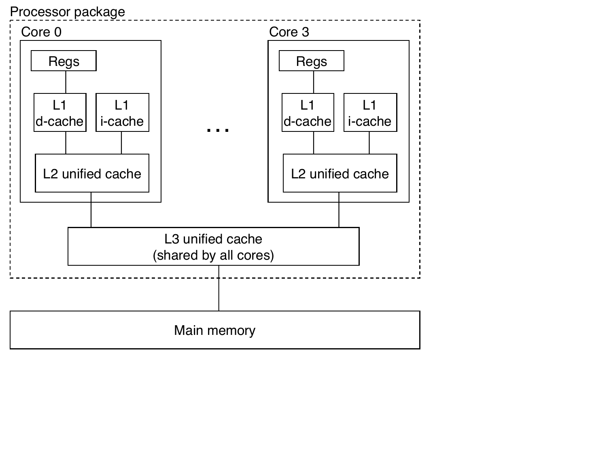

# CSAPP Chapter 6 — The Memory Hierarchy

---

Q: Why do CPU caches exist?
A: The CPU can execute billions of instructions per second, but fetching data from main memory (DRAM) takes ~100 CPU cycles — 100 cycles where the CPU is idle. Caches are small, fast memory banks placed <b>between the CPU and RAM</b> that store recently used data so most fetches take 4 cycles (L1) instead of 100. The processor-memory gap has widened every year as CPUs got faster but RAM latency barely improved — caches are the engineering answer to that gap.

Q: What are SRAM and DRAM, and which is used where?
A: <b>SRAM (Static RAM)</b>: stores each bit in 6 transistors — fast, stable, expensive. Used in <b>CPU caches</b> (L1/L2/L3). <b>DRAM (Dynamic RAM)</b>: stores each bit as a capacitor charge that leaks away and must be refreshed thousands of times per second — slower, cheap, dense. Used in <b>main memory</b> (your 16 GB RAM stick). Think of SRAM as a whiteboard right in front of you vs DRAM as a filing cabinet across the room you have to physically walk to.

Q: How do disk, SSD, and RAM compare in speed?
A: <b>RAM (DRAM)</b>: ~100 ns access time. <b>SSD</b>: ~100,000 ns — about <b>1,000× slower</b> than RAM. <b>HDD</b>: ~10,000,000 ns — about <b>100,000× slower</b> than RAM. If RAM access = 1 second, SSD access = 17 minutes, HDD access = 4 months. This is why keeping your app's working data in memory (and not spilling to disk swap) is critical for performance.

Q: What is the memory hierarchy?
A: Computers organize storage into levels, trading off speed vs size vs cost: <b>Registers</b> → <b>L1 cache</b> → <b>L2 cache</b> → <b>L3 cache</b> → <b>RAM (DRAM)</b> → <b>SSD</b> → <b>HDD</b> → <b>Network</b> Each level acts as a <b>cache for the level below it</b>. Speed drops and capacity grows as you go down — L1 is ~4 cycles / tens of KB; RAM is ~100 cycles / GB; disk is ~10M cycles / TB.

Q: What is locality and why do caches exploit it?
A: <b>Locality</b> is the observation that programs don't access memory randomly — they tend to use data that is: • <b>Temporally local</b>: recently used data will probably be used again soon • <b>Spatially local</b>: if you use one address, you'll soon use nearby addresses Caches exploit this by keeping recently accessed data and loading nearby data speculatively. If your code has poor locality (jumping around in memory), caches can't help — performance collapses.

Q: What is temporal locality? Give a Go example.
A: <b>Temporal locality</b> = "data used recently will likely be used again soon." Example: the loop variable <code>i</code> in <code>for i := 0; i &lt; n; i++</code> is read and written on <b>every iteration</b>. The CPU recognizes this and keeps <code>i</code> in a register or L1 cache — it never needs to go to RAM for it. Another example: a hot config struct read on every HTTP request benefits from temporal locality if it fits in L1/L2.

Q: What is spatial locality? Give a Go example.
A: <b>Spatial locality</b> = "if you access one address, you'll soon access nearby addresses." When the CPU loads one element, it pulls in a whole <b>64-byte cache line</b> of neighboring bytes for free. Example: iterating <code>for _, v := range mySlice</code> reads elements sequentially — each cache line load covers the next 8–16 elements, so most iterations are instant cache hits. Contrast: pointer-chasing (linked lists, maps) jumps around memory — no spatial locality, constant cache misses.

Q: What is a cache hit vs a cache miss?
A: <b>Cache hit</b>: the CPU looks up data and finds it already in the cache — served in 4 cycles (L1). Fast, the common case for well-written code. <b>Cache miss</b>: the data isn't in cache — the CPU must fetch it from a slower level (RAM: ~100 cycles, SSD: ~10M cycles) before execution can continue. A 1% miss rate can halve program speed because each miss costs 100+ cycles of idle time on a CPU that could run at 1 cycle/instruction otherwise.

Q: What is a cache line and why is it 64 bytes?
A: When the CPU fetches any byte from RAM, it loads the surrounding <b>64-byte chunk</b> (a cache line) into the cache in one transfer. This exploits spatial locality: if you read <code>arr[0]</code>, you automatically get <code>arr[1]</code>…<code>arr[7]</code> (for 8-byte ints) for free. 64 bytes is a hardware engineering sweet spot — large enough to amortize the transfer overhead, small enough that cache lines don't waste space on data you'll never use.

Q: Why does the order you loop through a 2D array change performance dramatically?
A: In Go (and most languages), a 2D array is stored <b>row by row</b> in memory (row-major order). Looping <b>row-by-row</b>: reads elements contiguously — each 64-byte cache line covers 8 adjacent elements. Nearly all hits. Looping <b>column-by-column</b>: jumps by a full row width on each access — each access lands in a different cache line. Nearly all misses. The result: column-major traversal of a large matrix can be <b>10× slower</b> than row-major for the exact same work.

Q: Why is <code>[]MyStruct</code> faster than <code>[]*MyStruct</code> in Go?
A: <code>[]MyStruct</code> lays all structs <b>side by side</b> in memory — iterating reads sequential bytes, fully exploiting spatial locality and cache lines. <code>[]*MyStruct</code> stores only pointers contiguously; the actual struct values can be <b>scattered anywhere</b> on the heap. Each pointer dereference likely lands in a different cache line → one cache miss per element → 100+ cycles each instead of ~4. For a hot loop over thousands of items, the flat slice wins by a significant margin.

Q: Why is linked list traversal slow even though it's O(n)?
A: Each linked list node stores a <code>next</code> pointer that can point <b>anywhere in the heap</b> — nodes are scattered randomly in memory. Traversing a linked list causes <b>one cache miss per node</b>: the CPU has to wait 100 cycles for RAM on every step. A Go slice or Java ArrayList stores elements contiguously — each cache line load covers ~8 elements, so traversal is mostly cache hits. O(n) complexity is the same, but the constant factor is dominated by memory access patterns, not CPU ops.

Q: What is thrashing and when does it happen?
A: <b>Thrashing</b> happens when your program's <b>working set</b> (the data it actively uses) is larger than the cache. The CPU is constantly evicting data from cache to make room, then immediately needing it back — the cache becomes useless and almost every access goes to RAM. Example: scanning a 500 MB array with only 8 MB of L3 cache — every access misses, throughput drops to RAM speed (~10 GB/s instead of ~100 GB/s). Signs: CPU is "busy" but throughput is low; cache miss rate spikes.

Q: Why do GC pause times grow when the Go/Java heap exceeds available RAM?
A: The GC has to scan a large portion of the heap to find live objects. If the heap fits in L3 cache or RAM, traversal is fast. If the heap is so large that pages have been <b>swapped to disk</b>, the GC triggers page faults as it scans — each fault costs ~10 million cycles, stalling the world-stop. Even without swapping: a heap much larger than L3 causes constant cache misses during GC scan, lengthening pauses. Rule of thumb: size your heap to fit comfortably in RAM and keep the <b>live set</b> much smaller than that.

