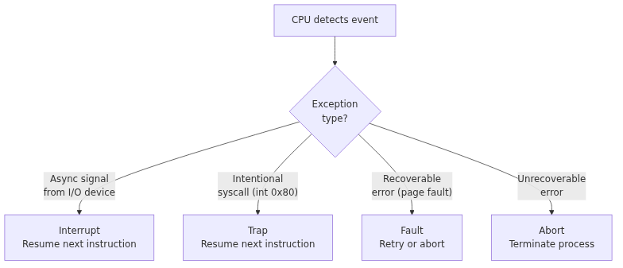
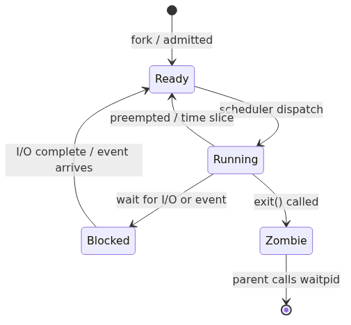
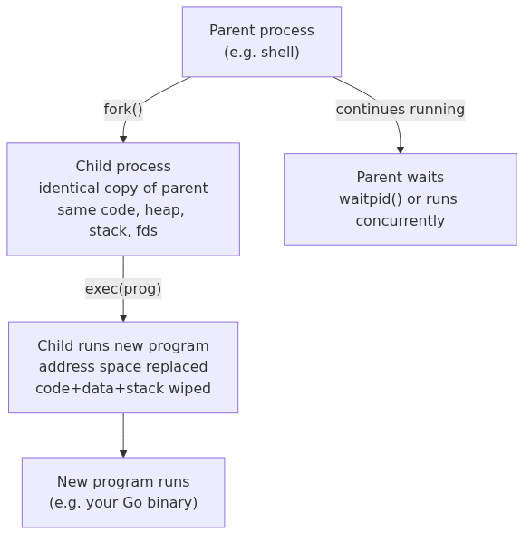
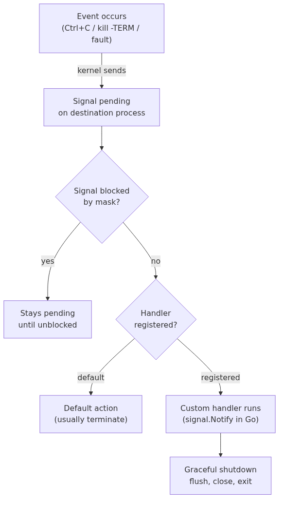

# CSAPP Chapter 8 — Exceptional Control Flow

## The flow
1. **Problem:** normal control flow only moves forward or jumps within your own program — it has no way to react when something outside your code happens (a key press, a disk finishing a read, a divide by zero, a request to talk to privileged hardware).
2. **Solution:** hardware exceptions — an abrupt, hardware-triggered transfer of control from your program to the OS kernel via a jump table (the exception table).
3. **Break:** not all exceptions are alike — some arrive from outside your code at any time, some are requests your code makes on purpose, some are recoverable errors, some are fatal — treating them all the same would be wrong.
4. **Solution:** four exception classes — interrupts (async, external), traps (sync, intentional), faults (sync, recoverable), aborts (sync, fatal).
5. **Break:** traps are how a single program asks the OS to do privileged work (syscalls) — but that says nothing about how the OS manages many independent running programs at once.
6. **Solution:** the process abstraction — each running program gets its own virtual address space and moves through a lifecycle (ready → running → blocked → zombie → terminated), scheduled and interrupted by that same exception machinery.
7. **Break:** a process can't get more programs running on its own — there has to be a way to create new ones.
8. **Solution:** fork() — clone the calling process into an exact copy (address space, fds, env, handlers), distinguished only by its return value.
9. **Break:** a forked child is just a copy of the parent — often you don't want a copy, you want to run a completely different program.
10. **Solution:** exec() — replace the child's entire address space with a new program; fork()+exec() together is how every shell launches a new command.
11. **Break:** once forked, the parent has no idea when — or whether — the child finished, and an exited-but-unacknowledged child (zombie) keeps occupying a process table slot forever; an orphaned child (parent already dead) has no one to ask.
12. **Solution:** wait()/waitpid() lets a parent reap its child, freeing the zombie's slot; orphans get auto-reparented to PID 1, which reaps them instead.
13. **Break:** none of this — syscalls, forking, waiting — covers a process being told about something asynchronously, outside the normal request/response flow (someone hit Ctrl-C, another process wants you to shut down).
14. **Solution:** signals — small async notifications the OS delivers to interrupt a process and run a registered handler (SIGTERM/SIGKILL/SIGINT) — the same mechanism a runtime like Go's uses to turn raw hardware faults (SIGSEGV) back into readable panics.
15. **Break:** all of this — interrupts, traps, blocking, signals — requires the OS to actually swap which process is running on the CPU, and that swap isn't free.
16. **Solution:** context switching — save/restore CPU state on every handoff; the real cost isn't the register save, it's the cold CPU cache afterward, which is exactly why goroutines (switched in user space) are so much cheaper.

---

Q: What is a hardware exception and how is it different from a try/catch exception?
A: This is the root problem the whole chapter answers: normal control flow can't react to anything outside your own code, so hardware needs its own escape hatch. A <b>hardware exception</b> is an abrupt transfer of control from your program to the OS kernel triggered by a hardware event — not a language construct. While try/catch is a language-level contract between your code and the runtime, a hardware exception is the CPU saying "something happened, I'm handing control to the OS now." Hardware exceptions are the mechanism underneath everything: system calls, page faults, division by zero, null pointer segfaults, and timer interrupts all work this way. The OS handles the exception via a jump table called the <b>exception table</b>, then either resumes your program or kills it.

Q: What are the 4 types of hardware exceptions?
A: Building on the exception mechanism: a single "abrupt transfer of control" isn't precise enough, because exceptions differ in where they come from and whether the program can resume — so they split into four classes. <b>Interrupt</b>: triggered <i>asynchronously</i> by an I/O device (NIC got a packet, disk read finished). Not caused by your code — CPU finishes its current instruction then handles it. Resumes next instruction. <b>Trap</b>: intentional, <i>synchronous</i>. Your code calls a syscall instruction (<code>syscall</code> / <code>int 0x80</code>) to ask the OS for something. Resumes next instruction. <b>Fault</b>: <i>potentially recoverable</i> error (page fault — OS loads the page, retries). Either fixes it and retries, or aborts. <b>Abort</b>: <i>unrecoverable</i> error (illegal memory access, machine check). Terminates the process.

Q: What is a system call, and how does your Go/Java code use them constantly without knowing it?
A: This is the trap class of exception in action — the controlled doorway a program uses on purpose to ask the OS for privileged work. A <b>system call</b> is how user-space code asks the OS kernel to do something privileged — write to a file, open a socket, allocate memory, spawn a process. Mechanically: your code executes a special <b>trap instruction</b> (e.g. <code>syscall</code> on x86-64) → CPU switches to kernel mode → OS executes the requested function → returns to user mode → your code continues. In Go: <code>os.Open()</code>, <code>net.Dial()</code>, <code>fmt.Println()</code> all ultimately issue syscalls. The Go runtime batches and abstracts them, but every I/O operation bottoms out here. Syscalls are expensive relative to function calls (~1000 ns vs ~1 ns) — why buffered I/O, goroutines, and batch operations matter.

Q: What is a process lifecycle? What states does a process move through?
A: This is the next layer up: syscalls explain how one program talks to the OS, but not how the OS runs many independent programs at once — that's what the process abstraction, and its lifecycle, is for. A process moves through these states: <b>Ready</b>: exists, waiting for the CPU scheduler to dispatch it <b>Running</b>: currently executing on a CPU core <b>Blocked</b>: waiting for an event (I/O completion, sleep, mutex) — not eligible for CPU <b>Zombie</b>: has exited, but its parent hasn't called <code>waitpid()</code> yet — its entry still occupies the process table <b>Terminated</b>: reaped by parent, fully gone The OS scheduler moves processes between Ready and Running; I/O and blocking syscalls move them to Blocked.

Q: What is fork() and what exactly does the child process inherit?
A: This is what closes the gap left by the process abstraction: a process exists, but nothing yet lets one process create another — fork() is that mechanism. <code>fork()</code> is a syscall that creates a new process as an <b>exact copy of the calling process</b>. The child inherits (copies): <b>virtual address space</b> (code, heap, stack), <b>open file descriptors</b> (including network sockets), <b>environment variables</b>, signal handlers. The child does <b>not</b> inherit: the parent's threads (only the calling thread is duplicated), pending signals, file locks. <code>fork()</code> returns <b>0 to the child</b> and the <b>child's PID to the parent</b> — the only way to tell them apart. Copy-on-write makes fork nearly instant even for large processes — physical pages are shared until one side writes.

Q: What is exec() and what does it do to the calling process?
A: Building on fork(): cloning the parent only gets you a copy of the same program — exec() is the next step, for when you need to become a different program entirely. <code>exec()</code> (actually a family: <code>execve</code>, <code>execl</code>, etc.) <b>replaces</b> the calling process's entire address space with a new program. After exec: the code, heap, stack, and data are wiped and replaced with the new program's. File descriptors (stdin/stdout/stderr and others) survive unless marked close-on-exec. The typical pattern: <code>fork()</code> creates a child → child calls <code>exec()</code> to become the new program → parent waits via <code>waitpid()</code>. This is exactly what happens when you type <code>go run main.go</code> in a shell: the shell forks, the child execs the Go compiler, which eventually execs your binary.

Q: What is a zombie process and why does it matter to a long-running Go server?
A: This is the gap fork()+exec() leaves open: once a child is spawned and runs, nothing yet tells the parent it's done — an unreaped exit becomes a zombie. When a process exits, the OS doesn't immediately free its entry in the process table — it waits for the parent to <b>acknowledge the exit</b> by calling <code>waitpid()</code>. A process that has exited but hasn't been reaped is called a <b>zombie</b> — it consumes no CPU or memory, but its PID slot stays occupied. If a Go server forks child processes (e.g. via <code>os/exec</code>) and never calls <code>cmd.Wait()</code>, zombies accumulate — eventually exhausting the OS's PID space and preventing new processes from being created. Fix: always call <code>cmd.Wait()</code> after <code>cmd.Start()</code>, or use <code>cmd.Run()</code> which waits automatically.

Q: What is an orphan process?
A: A related edge case in the same reaping problem: a zombie has a parent who hasn't reaped it yet, but an orphan's parent is already gone entirely, so something else must reap it. An <b>orphan</b> is a process whose parent has already exited. The OS automatically re-parents orphans to <code>PID 1</code> (init / systemd), which periodically calls <code>waitpid()</code> to reap them — so orphans don't accumulate into zombies. In containerized Go apps: the container's PID 1 is often your Go binary, not systemd. If your binary spawns subprocesses and exits, those subprocesses become orphans with no reaper — a common source of zombie buildup in Docker containers. Fix: use a proper init (e.g. <code>tini</code>) as PID 1 in your container.

Q: What is a signal?
A: This is the next problem fork/exec/wait don't solve: none of that covers a process being told about something asynchronously, outside the normal request/response of a syscall — that's what signals are for. A <b>signal</b> is a small asynchronous notification the OS delivers to a process to tell it something happened. Signals are identified by number (and name): <code>SIGINT (2)</code>, <code>SIGTERM (15)</code>, <code>SIGKILL (9)</code>, <code>SIGSEGV (11)</code>, etc. When a signal arrives, the OS interrupts the process (even if it's in the middle of a syscall), runs the registered signal handler, then resumes the process. Signals are the OS's way of asynchronously communicating with your process — from the terminal, from <code>kill</code>, from the kernel itself on faults.

Q: What is the difference between SIGTERM, SIGKILL, and SIGINT?
A: Building on signals: not all notifications carry the same weight — some can be caught and handled, some can't be refused, so the three most common signals differ exactly on that axis. <b>SIGTERM (15)</b>: "please terminate gracefully." Can be caught and handled. <code>kill &lt;pid&gt;</code> sends this by default. Your Go server should catch it to drain connections, flush logs, deregister from service discovery, then exit. <b>SIGKILL (9)</b>: "terminate immediately, no exceptions." Cannot be caught, blocked, or ignored — the kernel kills the process unconditionally. Used when SIGTERM is ignored or the process is stuck. <b>SIGINT (2)</b>: "interactive interrupt." Sent by Ctrl+C in a terminal. Can be caught. Go programs often catch this for the same graceful shutdown logic as SIGTERM. Rule: always handle SIGTERM (and SIGINT) in servers; never rely on SIGKILL for clean shutdown.

Q: How does Go handle OS signals? Show the pattern.
A: This is the practical side of signals: knowing SIGTERM/SIGINT exist doesn't help until you actually catch them, so here's the Go idiom for that. Go's <code>signal.Notify</code> routes OS signals into a channel:
<pre>
quit := make(chan os.Signal, 1)
signal.Notify(quit, syscall.SIGTERM, syscall.SIGINT)
&lt;-quit                  // block until signal arrives
// graceful shutdown: close listeners, drain, flush
</pre>
Why buffer the channel (<code>make(chan os.Signal, 1)</code>): if your goroutine isn't ready to receive exactly when the signal arrives, the runtime drops it — a buffered channel prevents that. Typical shutdown sequence for an HTTP server: call <code>server.Shutdown(ctx)</code> with a deadline → it stops accepting new connections and waits for in-flight requests to finish → exit. <code>signal.Reset()</code> / <code>signal.Stop()</code> unregisters the channel if you no longer need to handle the signal.

Q: What happens when a Go binary crashes with a segfault or stack overflow?
A: This ties the signal mechanism back to the very start of the chain: a fault (from the four exception classes) becomes a signal (SIGSEGV), which the Go runtime turns into a readable panic. The Go runtime sits on top of the OS's exception mechanism. A <b>nil pointer dereference</b>: the CPU accesses address 0 → page fault → OS sends <code>SIGSEGV</code> → Go runtime catches it → prints a stack trace and panics. A <b>stack overflow</b> (infinite recursion): the stack grows past its guard page → OS sends <code>SIGSEGV</code> → Go runtime catches it and prints "stack overflow". A <b>divide by zero</b>: CPU raises a fault → Go runtime converts it to a panic. The Go runtime's signal handlers convert these low-level OS events into panics with readable stack traces — the OS sees a crash; you see a Go-formatted error.

Q: What is a context switch, and what overhead does it actually carry?
A: This is the mechanism underneath everything else in the chapter: every interrupt, trap, block, and signal ultimately requires the OS to swap which process runs on the CPU, and that swap has a real cost. A <b>context switch</b> is the OS saving one process's CPU state (PC, registers, memory mappings) and restoring another's to run it next. Direct cost: saving/restoring registers — ~1–10 µs of pure CPU time. Indirect cost (usually larger): the incoming process's data is no longer in CPU caches — the first few hundred instructions pay cache miss penalties until the cache warms up again. This is why Go goroutines are cheap: goroutine switches happen in user space (the Go scheduler), saving only a minimal set of registers and reusing the same OS thread — no kernel involvement, no cache flush.

