# CSAPP Chapter 9 — Virtual Memory

## The flow
1. **Problem:** many processes need to share one pool of physical RAM without corrupting each other or being capped at whatever RAM actually exists.
2. **Solution:** give each process its own illusory, private virtual address space — virtual memory.
3. **Break:** a virtual address is just a made-up number inside a process — something has to actually locate the real byte in physical RAM.
4. **Solution:** virtual memory is divided into fixed-size pages, and each process's page table maps virtual pages to physical frames (or marks them invalid/on-disk).
5. **Break:** a page table only helps if hardware actually consults it on every access, and nothing stops a process from reading another's memory or a program dereferencing garbage.
6. **Solution:** the MMU translates every address by walking the page table, and per-entry permission bits (plus an unmapped page 0) enforce isolation and protection — this is why processes can't see each other's memory and null derefs segfault instead of corrupting data.
7. **Break:** walking the page table in RAM on every single memory access means doubling memory latency.
8. **Solution:** the TLB caches recent translations in fast on-chip hardware so hits skip the page table entirely.
9. **Break:** physical RAM is finite, so a page a program needs right now might not actually be resident.
10. **Solution:** a page fault traps to the OS, which loads the missing page from disk on demand (demand paging), evicting another page if RAM is full.
11. **Break:** if total demand keeps exceeding RAM, the OS spends nearly all its time evicting and reloading pages instead of running code.
12. **Solution:** recognize this as swapping/thrashing — why a heap sized larger than RAM devastates performance for Go/Java services.
13. **Break:** beyond faulting pages in, processes also need cheap ways to map a file's contents into memory and to duplicate a whole process without copying all its memory.
14. **Solution:** mmap maps files (or anonymous memory) directly into the virtual space with lazy, fault-driven loading; fork() uses copy-on-write so parent and child share physical pages until either writes.
15. **Break:** even with all these OS guarantees, application code can still misuse memory — the failure mode just looks different depending on the language.
16. **Solution:** in Go/Java the GC can only free objects with no live references, so a memory leak is really just forgotten references (a growing map, an unregistered listener); in C, an unchecked buffer write overflows into adjacent memory (a buffer overflow), which is why hardware permission bits like no-execute stack pages exist as a backstop.

---

Q: What problem does virtual memory solve?
A: This is where the chapter's whole chain starts:  Without VM, programs would share one pool of physical RAM — any program could accidentally read or overwrite another's data, and you couldn't run programs larger than RAM. Virtual memory solves this with two guarantees: 1. <b>Isolation</b>: each process has its own private address space — it can't touch another process's memory 2. <b>Capacity</b>: programs can use more memory than physically available RAM by silently overflow pages to disk Every process you've ever run — your JVM, Go binary, browser — gets this for free from the OS.
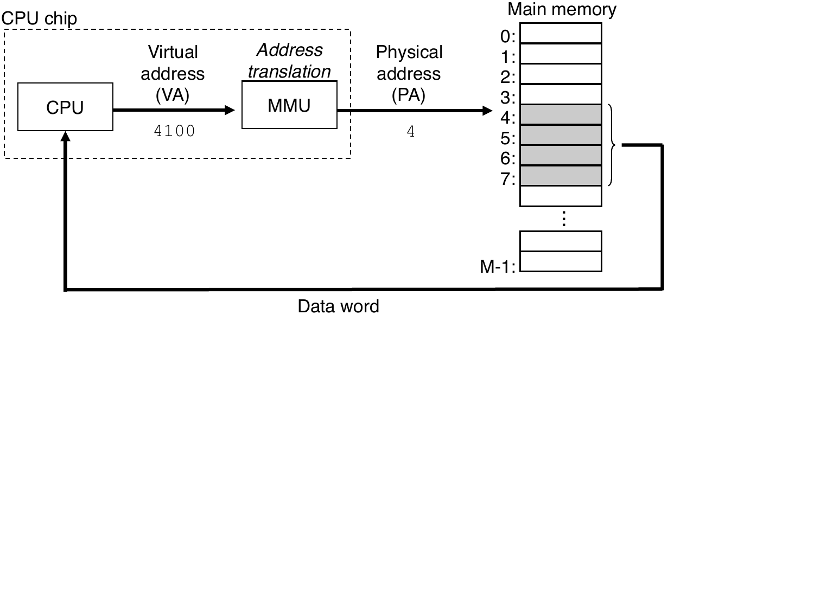

Q: What is the difference between a virtual address and a physical address?
A: Building on the private-address-space idea:  <b>Physical address</b>: the actual location of a byte in the RAM chips — a real hardware slot (e.g. byte 4096 in your RAM stick). <b>Virtual address</b>: a made-up address used inside a process. Hardware translates it to a physical address on every access. Two processes can both use virtual address <code>0x1000</code> in their code — the CPU maps them to completely different physical RAM locations. This is how process isolation is achieved: they live in separate virtual worlds.
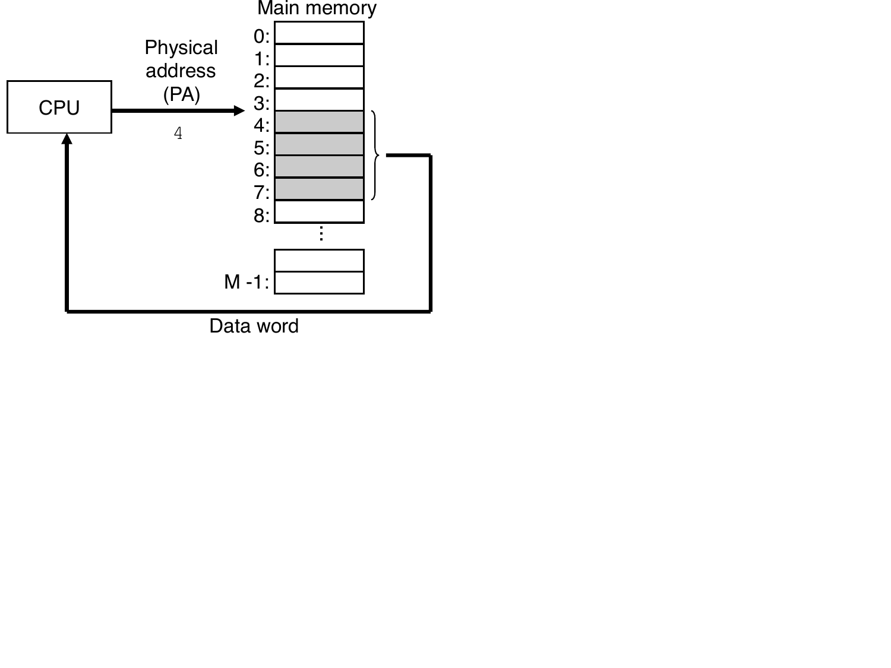

Q: What is a virtual address space?
A: Zooming into what that private space actually looks like:  Each process gets its own <b>virtual address space</b> — a private, contiguous-looking map of addresses from 0 to some huge maximum (2^64 bytes on a 64-bit system). The process thinks it owns all that space, but most pages are either not yet allocated, or backed by physical RAM only when first touched. Two Java processes with 4 GB heaps each can coexist — they have separate virtual spaces even though the machine may only have 8 GB of RAM.
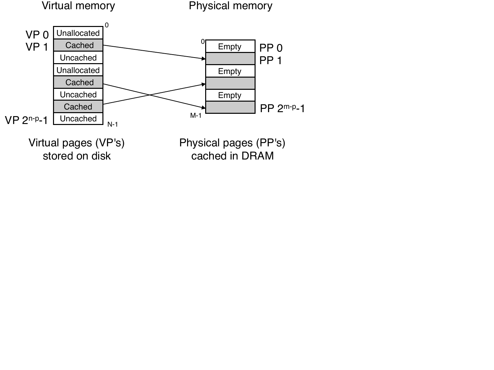

Q: What is a page in virtual memory?
A: This is how that virtual space and physical RAM get chunked so they can be mapped to each other:  Virtual memory is divided into fixed-size chunks called <b>pages</b> (typically <b>4 KB</b> each). Physical RAM is also divided into matching 4 KB chunks called <b>page frames</b>. The OS moves entire pages between RAM and disk — never partial chunks. Why fixed size? Simplifies the bookkeeping: the OS doesn't need to track variable-size gaps, and the hardware address translator can be a simple lookup.
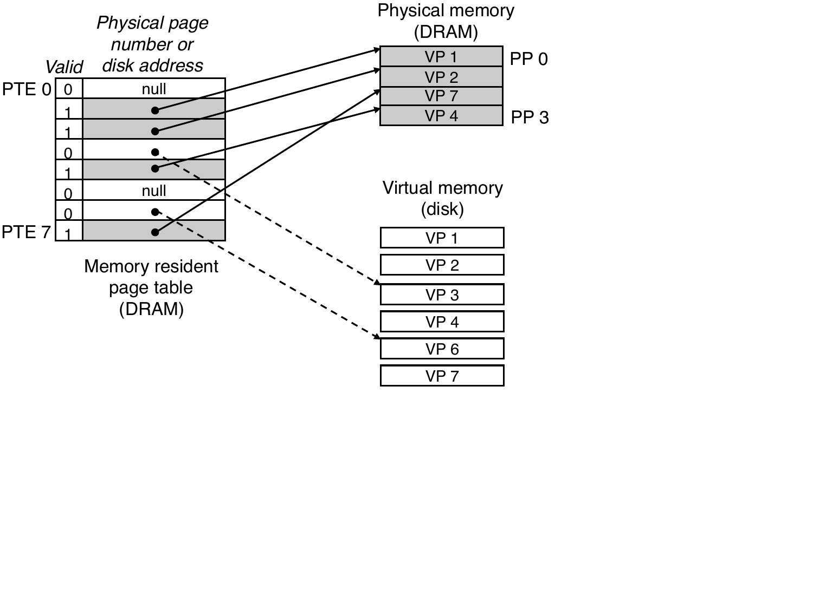

Q: What is a page table?
A: This is the structure that actually performs the page-to-frame mapping:  A <b>page table</b> is a per-process data structure (stored in RAM) that maps each virtual page to its physical location. Each entry says one of: "this page is in RAM at frame X" | "this page is on disk at offset Y" | "this address is invalid (unallocated)". The CPU's MMU reads the page table on every memory access to translate virtual → physical addresses. Every process has its own page table — that's how two processes can use the same virtual address and get completely different data.

Q: What is a page fault and what happens when one occurs?
A: This is what happens when the page table says a page isn't actually resident in RAM:  A <b>page fault</b> happens when the CPU accesses a virtual address whose page is <b>not currently in RAM</b> (it's on disk or unallocated). The sequence: 1. CPU raises a page fault exception — your program pauses 2. OS checks the page table: valid address on disk? Load it. Invalid? Kill the process (segfault). 3. OS picks a RAM frame to evict (writing dirty data to disk if needed), loads the needed page, updates the page table 4. Program resumes — it never knew this happened, just noticed a pause Heavy page faulting = the dreaded disk-speed pause.
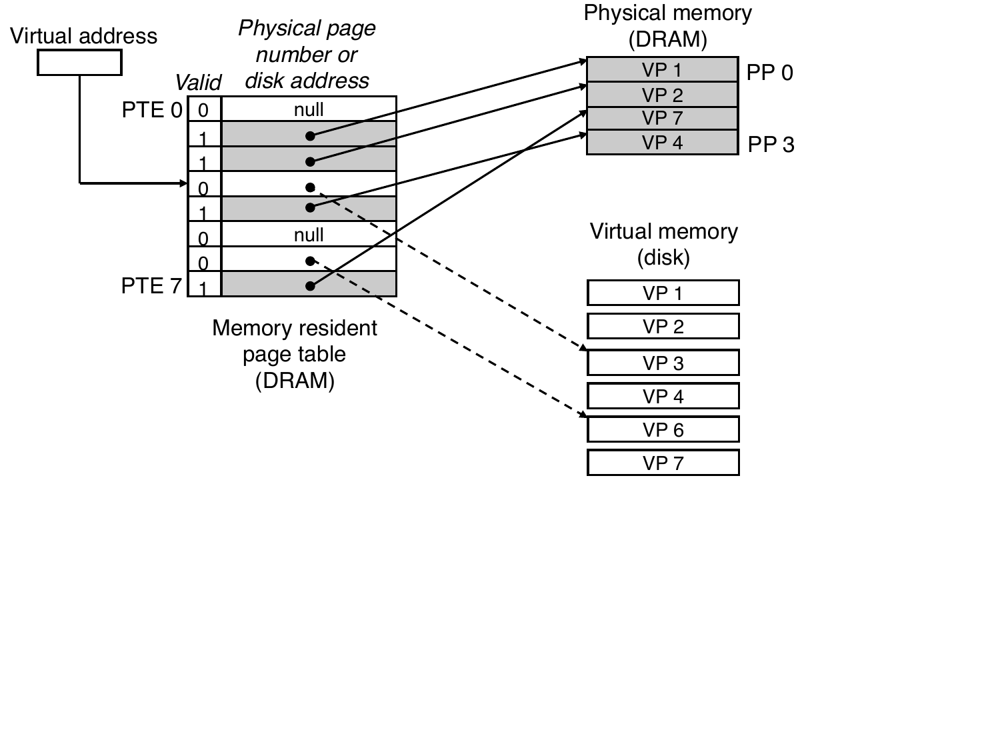

Q: Why does a null pointer crash your program instead of reading garbage?
A: Building on the page table's "invalid" entries:  Virtual page 0 (and the pages near address 0) are intentionally <b>never mapped</b> in any process's page table. When your code dereferences a null pointer, the CPU looks up page 0, finds "invalid", and raises a page fault for an unmapped address. The OS detects the invalid access and sends a <b>SIGSEGV (segmentation fault)</b> to the process — killing it. This is a safety feature, not a quirk: it turns silent memory corruption into an immediate crash you can debug.
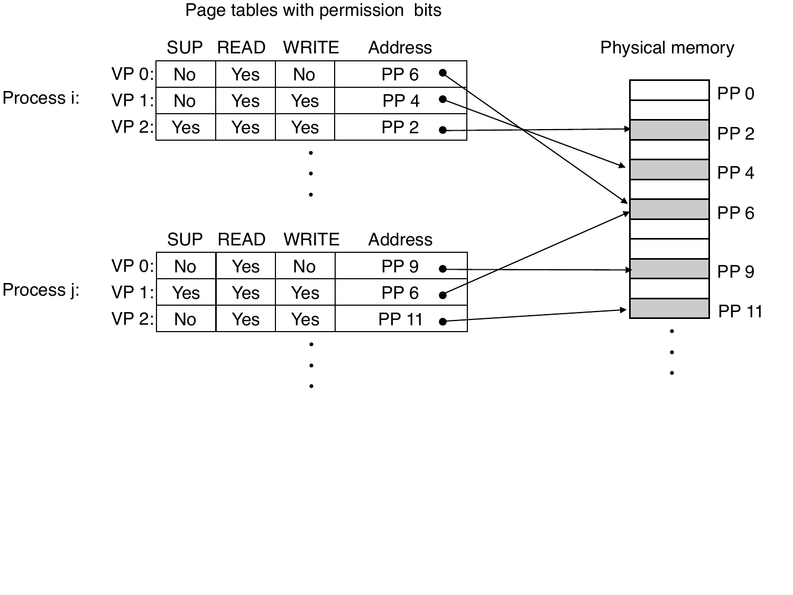

Q: How does virtual memory isolate processes from each other?
A: This is the isolation guarantee the page table/MMU machinery actually delivers:  Each process has its own page table pointing to different physical frames. Even if process A and process B both use virtual address <code>0x4000</code>, their page tables point to completely different physical RAM. Process A can never read or write process B's memory — the MMU simply won't translate to physical frames it doesn't own. This is why a crashed Java service doesn't corrupt your OS, and why separate JVM instances are truly isolated.
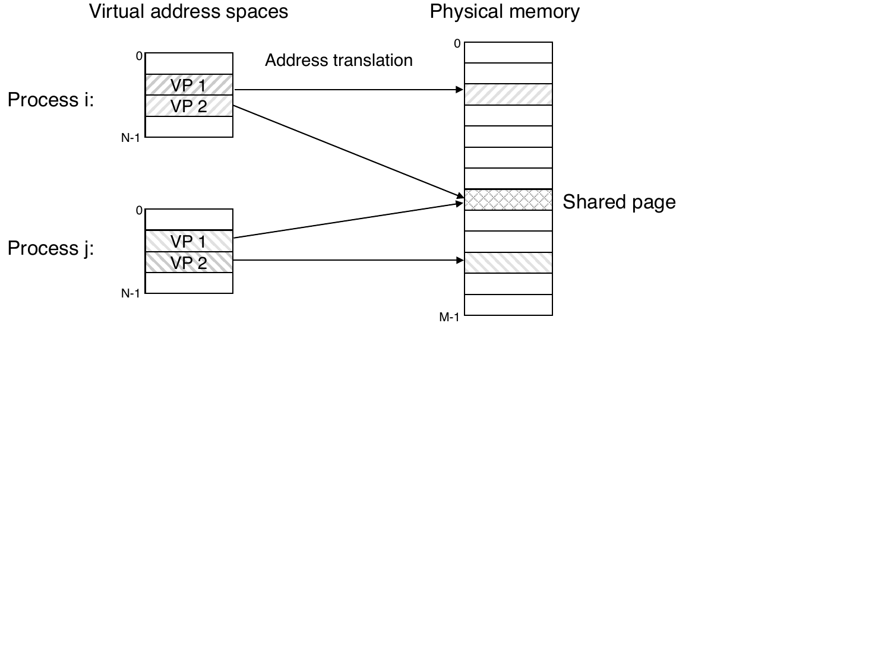

Q: How does virtual memory enforce memory protection?
A: This is the other half of what the page table enforces, alongside isolation:  Each page table entry has <b>permission bits</b>: read (r), write (w), execute (x). The MMU checks these on every memory access — if your code tries to write to a read-only page, the OS kills the process with SIGSEGV. Example: your program's code section is marked <b>read + execute, not write</b> — a buffer overflow can't overwrite instructions. In Java/Go, array bounds checks are language-level, but the underlying pages still have hardware permission enforcement as a backstop.

Q: What is address translation and what hardware does it?
A: This is the hardware that actually walks the page table to make isolation and protection real:  <b>Address translation</b> converts a virtual address into a physical address on <i>every single memory access</i>. It's performed by the <b>MMU (Memory Management Unit)</b> — a hardware unit built into the CPU chip. The MMU splits the virtual address into a <b>virtual page number</b> (looks up the page table) and a <b>page offset</b> (the byte within the page — copied unchanged to the physical address). This happens transparently to your code; you never see physical addresses.
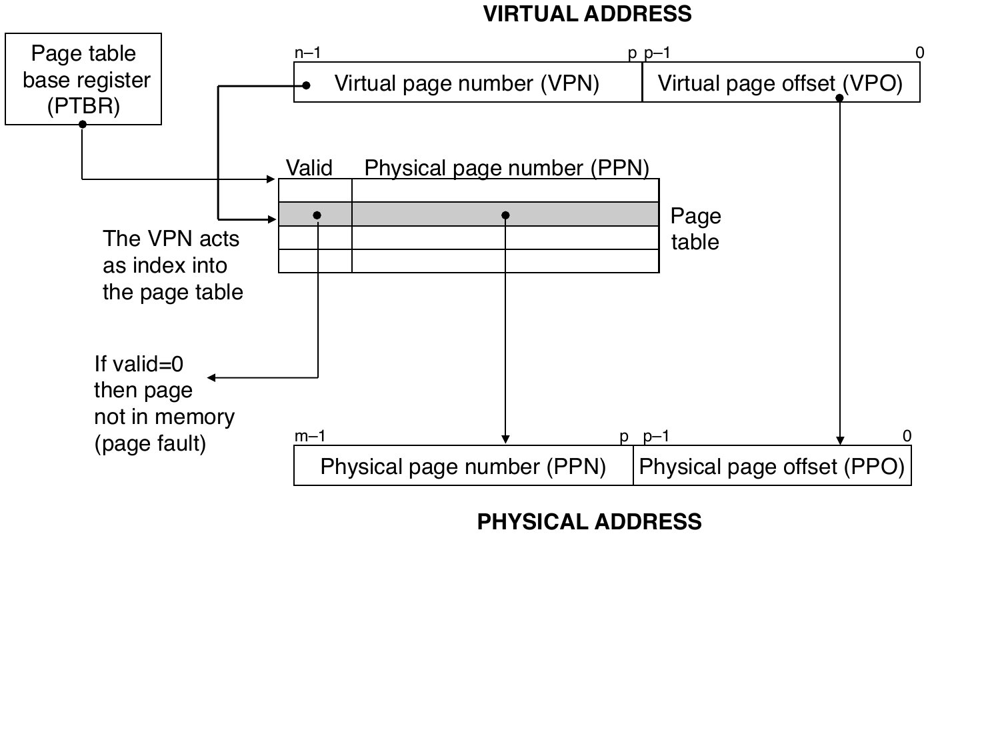

Q: What is the TLB and why does it exist?
A: This is what closes the gap left by walking the page table in RAM on every access:  Without the TLB, every memory access would need <b>two trips to RAM</b>: one to read the page table, one for the actual data — doubling memory latency. The <b>TLB (Translation Lookaside Buffer)</b> is a tiny, extremely fast cache inside the CPU that stores recent virtual→physical translations. A TLB hit (~4 cycles) means the MMU skips the page table entirely. A TLB miss means walking the page table in RAM, then caching the result. If the page isn't even in RAM, a page fault occurs next.
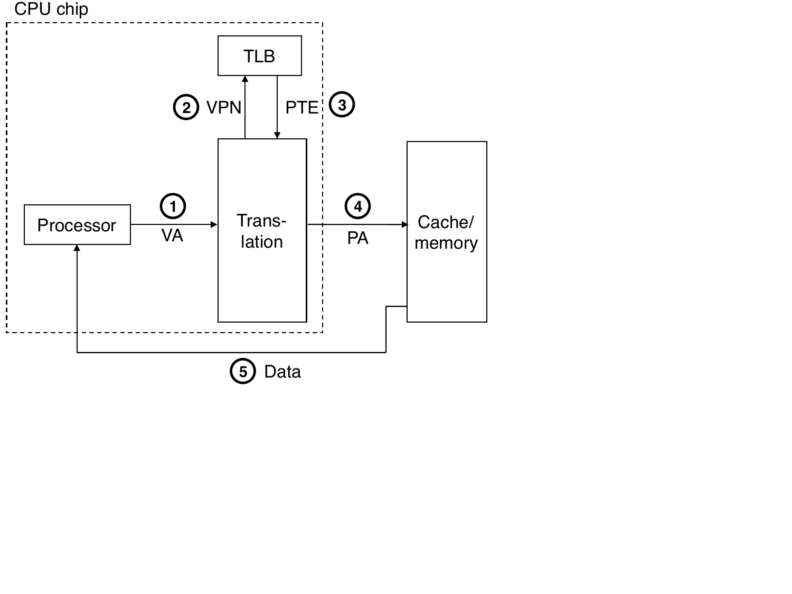

Q: What does a Linux process's virtual address space look like?
A: Zooming out to see where all these pieces actually sit inside one process's address space:  From low to high addresses: <b>Null guard</b> — address 0, unmapped to catch null dereferences <b>Code &amp; data</b> — your compiled binary, mapped from the executable file <b>Heap</b> — grows <i>upward</i> as you allocate memory (<code>malloc</code> / <code>new</code>) <b>Shared libraries</b> — libc, Go runtime, JDK core — mapped from files (one physical copy, shared between processes) <b>Stack</b> — grows <i>downward</i>, holds function call frames <b>Kernel space</b> — topmost region, invisible and inaccessible to user code
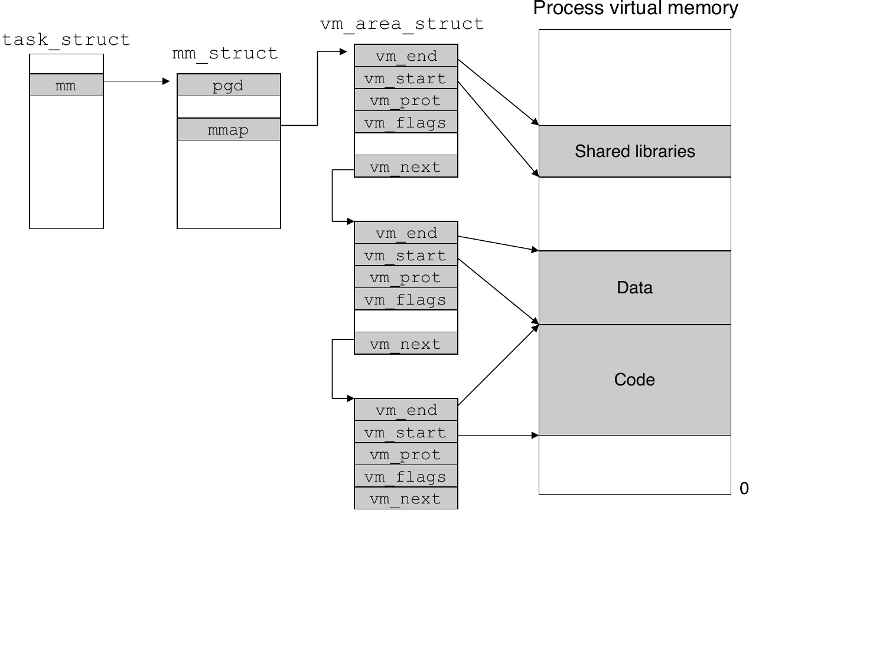

Q: What is memory mapping (mmap) and how do the JVM and Go runtime use it?
A: This is one more way pages get put into a process's address space beyond ordinary faulting-in:  <b>mmap</b> maps a file (or anonymous memory) directly into the virtual address space — reading from the mapped address reads the file, writing writes to it, with no explicit syscall per byte. The OS lazily loads pages from the file on demand (page fault → load → resume). The JVM uses mmap to load <code>.jar</code> files and the JDK's class data into the heap. The Go runtime uses mmap for large heap allocations — it requests virtual address space from the OS and lets the OS back it with physical pages as needed.
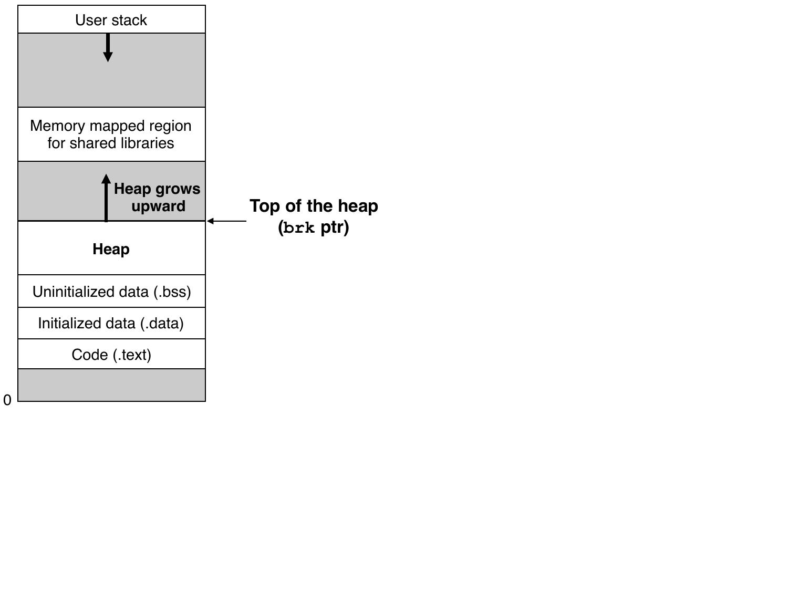

Q: What is copy-on-write (COW) and why does it make fork() fast?
A: Building on the same page-table machinery, applied to duplicating a whole process cheaply:  When a process forks, the child and parent start by <b>sharing the same physical pages</b> — no actual copy happens. Both page tables point to the same frames, but pages are marked <b>read-only</b>. Only when one process <i>writes</i> to a page does the OS copy that specific page and give the writer its own private copy — the other process keeps the original. This makes <code>fork()</code> nearly instant even for a 2 GB process: you only pay for the pages actually modified.
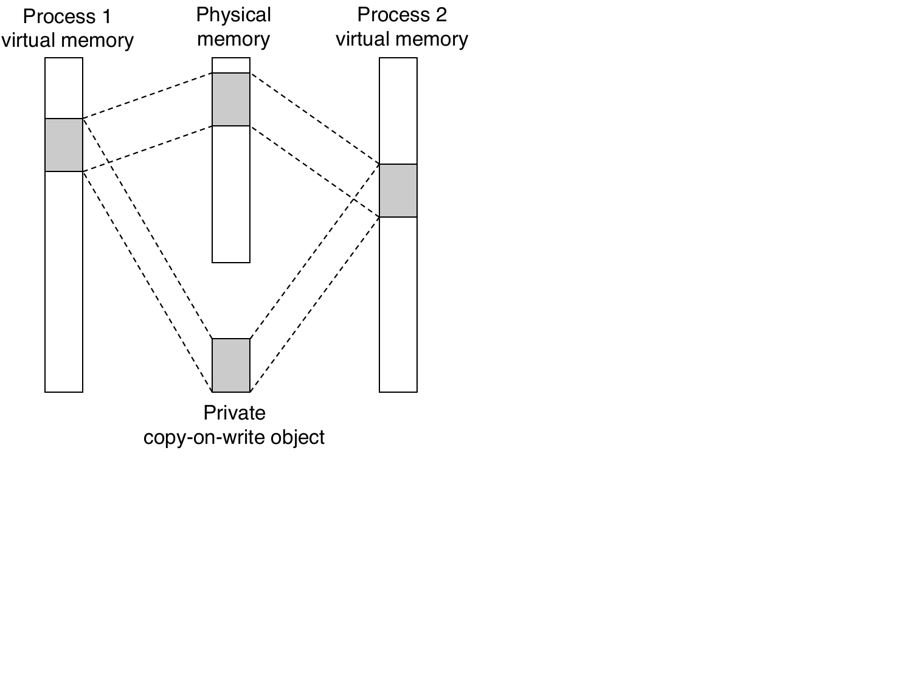

Q: What is swapping (paging to disk) and why is it devastating for performance?
A: This is what closes the gap left when demand for RAM keeps exceeding what's actually there:  When RAM is full, the OS picks a page that hasn't been used recently, writes it to a <b>swap partition on disk</b>, and frees that frame for another page. If the evicted page is needed again, a page fault reloads it from disk — taking ~10 million cycles instead of ~100 for RAM. A system that is heavily swapping appears "hung" because the CPU spends most of its time waiting for disk. For Go/Java services, a heap larger than available RAM means constant swap I/O — sizing the heap to fit in RAM is non-negotiable.

Q: Why do memory leaks still happen in Go and Java despite the garbage collector?
A: This is where the chain hands off from OS-level guarantees to application-level misuse:  The GC can only free memory that has <b>no live references</b>. A memory leak in a GC language means you're accidentally holding references to objects you'll never use again: • A global <code>map</code> or <code>slice</code> that keeps appending and never evicts entries • Event listeners or callbacks registered but never unregistered • Goroutines blocked forever, holding references on their stacks The heap grows, page faults increase, GC pauses lengthen, and the process eventually OOMs — the same symptoms as a C leak, just harder to see because you don't call <code>free()</code>.

Q: What is a buffer overflow and why can't it happen in Go or Java?
A: This is the other side of that same application-level misuse, in a language without automatic bounds checking:  A <b>buffer overflow</b> happens when a program writes more bytes into a buffer than it can hold, overwriting adjacent memory. In C: <code>char buf[8]; strcpy(buf, user_input)</code> — if input is longer than 8 bytes, it corrupts the stack, possibly overwriting the return address to redirect execution to attacker-controlled code. Go and Java prevent this by <b>checking array bounds on every access</b> — writing past the end throws a panic/exception rather than silently corrupting memory. VM permission bits (no-execute stack pages) are an OS-level backstop for C code.

