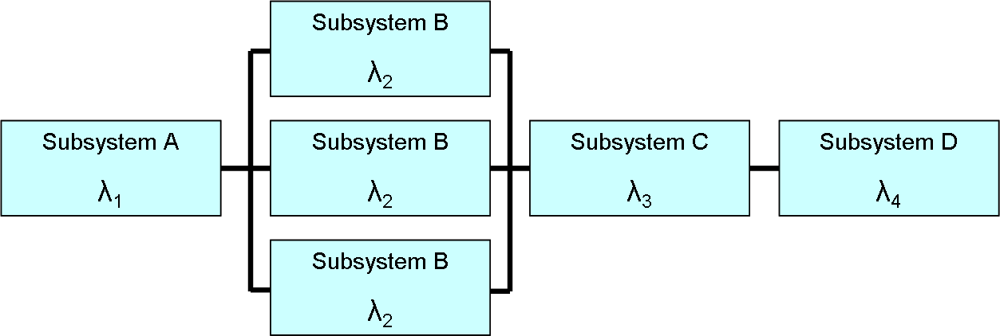
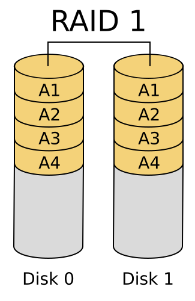
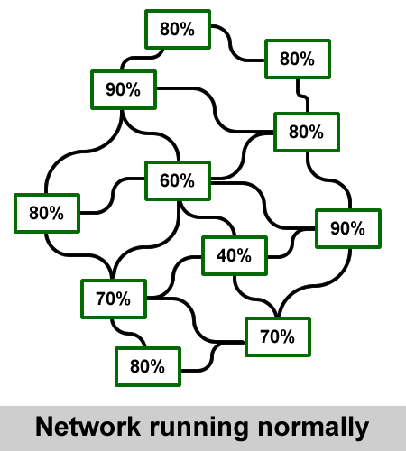
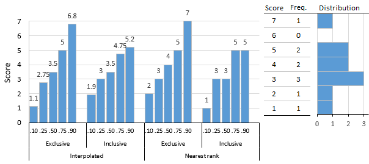
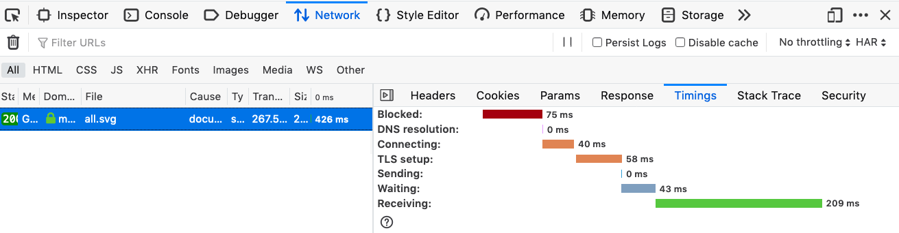
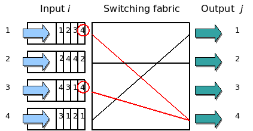
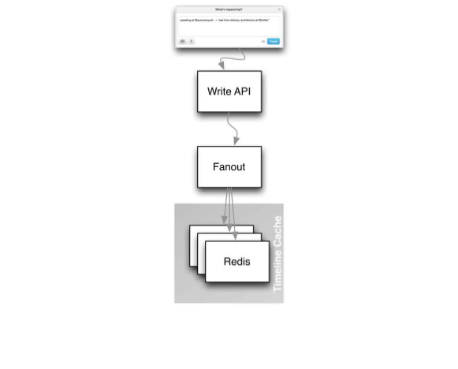
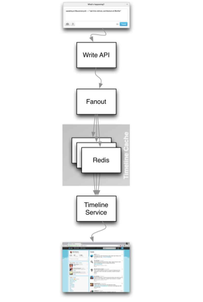
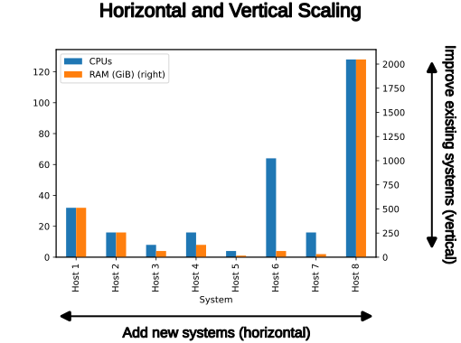
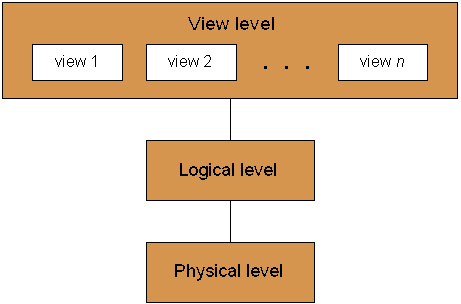

# DDIA Chapter 1 — Reliable, Scalable, and Maintainable Applications

## The flow

1. **Problem:** data-intensive apps used to reach for one tool (a database) for everything.
2. **Break:** modern apps combine caches, search indexes, queues, and databases — application code has to keep them all in sync, making you a de facto "data system designer."
3. **Framing:** three cross-cutting concerns judge any data system: reliability, scalability, maintainability.
4. **Reliability:** systems must keep working despite hardware faults, software bugs, and human error — the goal is stopping faults from becoming user-visible failures.
5. **Scalability:** even a reliable system today can buckle under tomorrow's load — first you must describe load and performance precisely (percentiles, not averages) before you can reason about coping strategies.
6. **Break:** naive designs (e.g. compute everything at read time) don't survive real load skew — worked example: Twitter's fan-out problem forced a shift from read-time computation to write-time precomputation, then to a hybrid.
7. **Maintainability:** software lives far longer in maintenance than initial development, so operability, simplicity (via abstraction), and evolvability determine whether a system stays sane to work on.

---

Q: What's the difference between a "fault" and a "failure" in DDIA's terms, and why does the distinction matter?
A: A <b>fault</b> is one component deviating from its spec (a disk dies, a service returns garbage). A <b>failure</b> is when the <i>system as a whole</i> stops providing its service to the user. You can't get the fault rate to zero, so the real engineering goal is <b>fault-tolerance</b>: design so faults don't cascade into failures — e.g. a retry + circuit breaker around one flaky downstream call keeps a single timeout from failing the whole request.

Q: Why has fault tolerance shifted from "buy redundant hardware" to "write software that tolerates losing a whole machine"?
A: Building on reliability's fault-tolerance goal: redundant hardware (RAID, dual power supplies) made a single machine reliable enough for years — but cloud platforms like AWS deliberately let VM instances disappear without warning to prioritize elasticity over single-machine reliability. So the responsibility moves into your software: if any node can vanish anytime, you design for that (health checks, replicas, stateless restarts) instead of hoping the hardware won't fail. Bonus: a system built this way can be patched one node at a time with zero downtime, instead of needing a maintenance window.

Q: Why are software bugs more dangerous at scale than random hardware faults?
A: Hardware faults (a disk dying) are usually random and uncorrelated across machines. Software bugs are <b>systematic</b> — the same bad input or edge case hits every instance running that code at once, so they're <b>correlated</b> and can cause cascading failures (one component's fault triggers the next). Real example from the book: a Linux kernel leap-second bug hung many applications simultaneously in 2012 — no amount of extra servers would have helped, because they all ran the same buggy code.

Q: Why would a well-run team deliberately trigger production failures on purpose (e.g. Netflix's Chaos Monkey)?
A: Building on the systematic-bugs problem: most critical bugs trace back to poor error handling that only shows up when a fault actually occurs. If you never trigger faults, your fault-tolerance code path silently rots and you find out it's broken during a real incident. Chaos engineering (randomly killing processes/instances in production) forces that path to run constantly, so you find the gaps on your schedule, not the user's.

Q: Why is average (mean) response time a misleading metric for "is my API fast"?
A: The mean gets dragged around by outliers and tells you nothing about how many actual users had a bad experience. If p50 (median) is 200ms but p99 is 4s, "average is fine" hides that 1 in 100 requests — often your heaviest users — are having a terrible time. This is why Datadog/Grafana dashboards default to percentile lines (p50/p95/p99), not a single average number, for any endpoint you actually care about.

Q: Why does Amazon (and most serious backends) care about p99/p999 latency instead of just the average?
A: Building on why averages mislead: high percentiles matter because they hit your most active users hardest — the customers making the most requests are the ones most likely to eventually land in that slow 1%. Amazon found a 100ms response-time increase cut sales by 1%; a 1s slowdown cut satisfaction by 16%. Practical takeaway: an SLA like "p50 under 200ms, p99 under 1s, uptime 99.9%" is the real contract — not "averages 150ms."

Q: What's the difference between "latency" and "response time," and why does it matter when debugging slowness?
A: <b>Response time</b> is everything the client experiences: network delay + queueing delay + actual processing (service time). <b>Latency</b> specifically means the time a request spends waiting to be handled, before service starts. If your server-side processing time looks fine in APM but users report slowness, the gap is almost always queueing or network — measure from the client, not just server-side instrumentation.

Q: What is "head-of-line blocking" and how does it quietly inflate your p99 latency?
A: A server can only process a limited number of things in parallel (e.g. bounded by CPU cores or a connection pool size). One slow request sitting at the front of the queue holds up every fast request stacked behind it — even though those later requests would've been quick on their own. This is why one slow downstream dependency (e.g. a single slow DB query) can drag down p99 for an entire endpoint, not just its own callers — and why load-testing tools must keep firing requests on a fixed schedule instead of waiting for each response, or they'll hide this effect.

Q: Twitter's home timeline: what's the tradeoff between "compute the timeline at read time" vs. "precompute it at write time," and why did Twitter switch?
A: Building on the scalability chain: approach 1 (query all followees' tweets and merge at read time) is simple but Twitter's read volume (300k req/s) vastly outweighed writes (4.6k req/s) — so approach 1 wasted huge read-time work redoing the same joins constantly. Approach 2 (fan-out on write: push each new tweet into every follower's precomputed timeline cache) makes reads cheap by shifting cost to write time — the same tradeoff behind denormalization, materialized views, or caching a computed feed in Redis when reads massively outnumber writes. The catch: a popular account with 30M followers turns 1 write into 30M cache writes — write cost now scales with followers, not tweets.

Q: Why did Twitter end up using a hybrid of both fan-out strategies instead of picking one?
A: Building on the fan-out-on-write tradeoff: pure write-time fan-out breaks for celebrity accounts — one tweet from a 30M-follower account means 30M timeline writes, which can't happen within Twitter's 5-second delivery target. The fix: fan out on write for normal users (cheap, since most people have few followers), but exempt high-follower accounts and merge their tweets in at read time instead. General lesson: when one strategy is great for the common case but catastrophic for a long-tail outlier, special-case the outlier rather than picking a single global strategy — the same reasoning behind hot-partition handling in sharded databases.

Q: What's the difference between "scaling up" and "scaling out," and why is there "no magic scaling sauce"?
A: <b>Scaling up</b> (vertical): move to a bigger single machine — simpler, but has a hard ceiling and gets expensive fast. <b>Scaling out</b> (horizontal / "shared-nothing"): spread load across many smaller machines — no hard ceiling, but distributing a stateful system (a database) is far more complex than distributing a stateless service. There's no one-size-fits-all "scalable architecture" because the right design depends entirely on your actual load parameters (read-heavy? write-heavy? huge objects vs. many small ones?) — a system for 100k req/s of 1KB payloads looks nothing like one for 3 req/min of 2GB payloads, even with identical total throughput.

Q: How does "abstraction" reduce accidental complexity, and what's a concrete example from your own stack?
A: Complexity is <b>accidental</b> when it comes from the implementation, not from the actual problem the user faces — and a good abstraction hides that accidental complexity behind a clean interface. Concrete examples: SQL hides on-disk data structures, concurrent access, and crash recovery; a high-level language hides machine code and registers; an ORM hides raw SQL and connection pooling. Payoff: you get to reuse a well-tested abstraction instead of re-solving the same hard problem in every project, and improvements to the abstraction (e.g. a faster query planner) benefit every application built on it for free.

