# Networking Chapter 1 — Computer Networks and the Internet

## The flow
1. **Problem:** many hosts need to share expensive, scarce communication links.
2. **Break:** circuit switching (reserve a whole dedicated path per call) wastes capacity during idle silence.
3. **Solution:** packet switching — chop data into packets and let many flows statistically share links, with every router picking its own next hop.
4. **Break:** connecting the whole world means physical transmission, addressing/routing, reliable delivery, and applications are wildly different concerns — no single monolithic protocol can handle all of them.
5. **Solution:** protocol layering splits the problem into independent layers (application/transport/network/link/physical), each blind to the others.
6. **Break:** the application layer still needs a structural pattern for who initiates contact with whom.
7. **Solution:** client-server (fixed, always-on server) vs peer-to-peer (every node is both client and server) — the two ways real apps are architected.
8. **Break:** even with a clean architecture, the physical distance to a server — especially the "last mile" into the home — is often the slowest, most variable part of the path.
9. **Solution:** CDNs place edge servers close to users to shrink everything the request has to cross before that slow last mile.
10. **Break:** "distance" isn't one number — delay actually splits into distinct components that add up differently.
11. **Solution:** transmission delay (bits onto the wire — controllable) vs propagation delay (physics — fixed by geography).
12. **Break:** those two delays assume a link is free and waiting, but links are shared, so packets queue up behind each other.
13. **Consequence:** queuing delay — unpredictable, bursty, the cause of bufferbloat and jittery calls.
14. **Break:** any one of these per-hop delays repeats at every router on the path, not just one.
15. **Consequence:** end-to-end delay is the sum of every hop's delay — exactly what traceroute visualizes.
16. **Break:** delay isn't the only ceiling on a request — the rate of data itself is capped somewhere too.
17. **Consequence:** throughput is capped by the single slowest link on the path — the bottleneck.
18. **Break:** a shared, best-effort link doesn't just delay packets — it sometimes drops them outright.
19. **Consequence:** packet loss forces retransmission, which costs a full extra round trip.
20. **Break:** whether to guarantee delivery/order at the cost of retransmission delay, or accept loss to avoid blocking, is a real protocol design choice.
21. **Solution:** TCP (reliable, ordered, retransmits) vs UDP (fire-and-forget) — pick per use case.
22. **Break:** none of that reliability engineering protects the data from anyone else sitting on the shared path.
23. **Solution:** TLS/HTTPS encryption stops eavesdroppers and MITM attackers from reading or tampering with traffic.
24. **Break:** encryption protects confidentiality, not availability — an attacker can just flood the target's capacity instead.
25. **Consequence:** DoS/DDoS attacks exploit that gap; rate limiting, load balancers, and CDNs absorb the flood.
26. **Break:** none of this — reliability, encryption, DoS defense — works if the network is one organization's infrastructure; no single entity can reach or defend the entire globe alone.
27. **Solution:** the internet is a network of networks — a tiered hierarchy of ISPs (Tier-1 backbone, Tier-2/3 regional) interconnecting via peering and IXPs.

---

Q: Why can packets from the same HTTP request take different routes and arrive out of order?
A: Solving the problem of many hosts sharing scarce links: the internet uses <b>packet switching</b>, not <b>circuit switching</b>. An old phone call reserved a dedicated line for the whole conversation — nobody else could use it, even during silence. The internet instead chops your data into <b>packets</b>, and every router independently decides the best next hop for each one — so packets can take different paths and arrive out of order. This is why TCP has to <b>resequence</b> packets on arrival, and why your Go/Java HTTP client never notices any of this — the transport layer hides it.
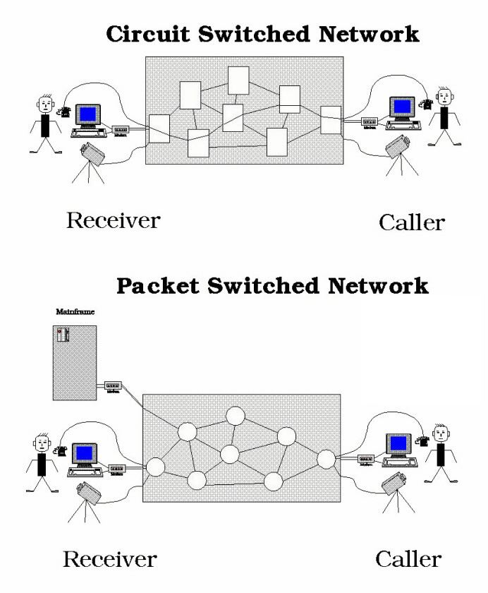

Q: What is the "5-layer" idea behind HTTP-over-TCP-over-IP, and why does it matter?
A: Building on packet switching: coordinating physical transmission, routing, reliable delivery, and applications is too much for one protocol, so the network stack is split into layers, each only responsible for its own job and blind to the layers above/below it: <b>Application</b> (HTTP, gRPC, WebSocket) — your app's message format. <b>Transport</b> (TCP, UDP) — reliability, ports, connections. <b>Network</b> (IP) — routing packets across networks, best-effort delivery. <b>Link</b> (Ethernet, WiFi) — moving frames across one physical hop. <b>Physical</b> — actual bits on wire/fiber/radio. Why it matters: when you debug "the API is slow," you can isolate the layer — DNS/TLS handshake (app), retransmits (transport), routing (network), or wifi signal (link) — instead of guessing blindly.
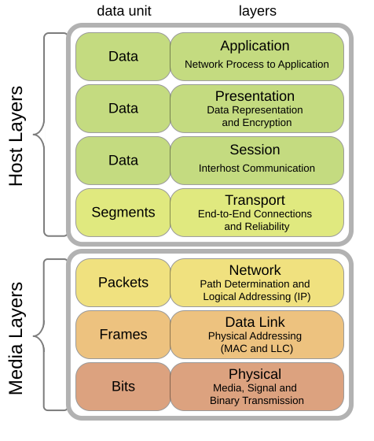

Q: Client-server vs peer-to-peer — what's the structural difference, and where does each show up in real systems?
A: Within the application layer, this is the structural choice apps make about who initiates contact: <b>client-server</b> — a fixed, always-on server with a known address; clients initiate connections to it. Almost every REST API, database, and web app works this way — easy to scale, secure, and reason about. <b>Peer-to-peer (P2P)</b>: every node can act as both client and server; there's no single always-on hub. Used by BitTorrent and WebRTC (direct video-call connections between browsers). Why it matters: P2P avoids a central bottleneck/cost but makes NAT traversal, discovery, and security much harder — which is why WebRTC needs STUN/TURN servers just to get two peers talking.
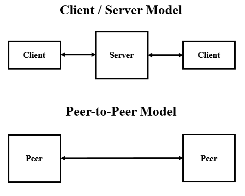

Q: What is "last-mile" latency, and why does it explain why CDNs exist?
A: Even with a clean client-server split, physical distance still bites: the <b>last mile</b> is the final hop from the ISP into your home or phone — DSL, cable, or mobile radio. It's almost always the <b>slowest and most variable</b> part of the entire path, far more than the fiber backbone in the middle. A <b>CDN</b> (Cloudflare, Akamai, CloudFront) places edge servers physically close to users specifically to shrink the distance the request has to travel <i>before</i> hitting that slow last mile — it can't fix the last mile itself, but it minimizes everything before it.

Q: What's the difference between transmission delay and propagation delay, and why can't you code your way out of the second one?
A: Unpacking what that distance actually costs: <b>transmission delay</b> is the time to push all the packet's bits onto the wire — depends on <b>packet size ÷ link bandwidth</b>. A bigger response body means more transmission delay; you control this (compression, smaller payloads). <b>Propagation delay</b>: time for a bit to physically travel across the link — depends on <b>distance ÷ speed of light in the medium</b>. This is fixed by geography. Why it matters: a Tokyo-to-New-York API call has a latency floor of roughly 50-60ms round trip no matter how fast your server code is — that's why global apps need regional deployments, not just faster code.
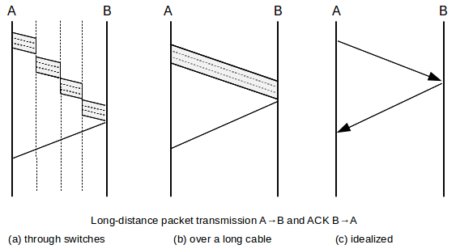

Q: What is queuing delay, and how does it explain bufferbloat and jittery video calls?
A: Layered on top of transmission and propagation delay: every router has an <b>output buffer</b> — packets waiting their turn to go out on a link that's currently busy. When traffic is light, the queue is empty and packets fly through. When traffic bursts (someone starts a big download), the queue fills up and every packet behind it waits longer. This delay is <b>unpredictable</b> — unlike propagation delay, it changes second to second depending on other traffic. <b>Bufferbloat</b> is when routers have oversized buffers that let queuing delay balloon during congestion — that's the classic "my video call stutters when someone else starts a big upload" problem.
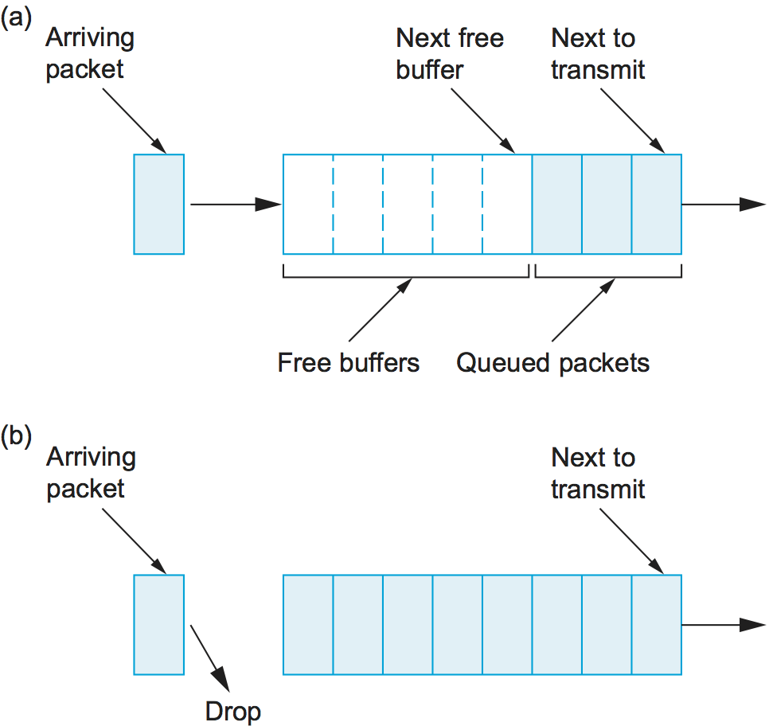

Q: Why does an API request feel slower the more network hops it crosses (e.g. through multiple proxies/load balancers)?
A: Zooming out from one router's queue to the whole path: end-to-end delay is the <b>sum of the per-hop delays</b> across every router on the path: processing + queuing + transmission + propagation, repeated at each hop. This is exactly what <code>traceroute</code>/<code>tracert</code> visualizes — each line is one hop adding its own chunk of delay. Why it matters: every extra reverse proxy, load balancer, or service-mesh sidecar you put in the request path adds a hop's worth of delay — it's not free, even if each one is individually fast.
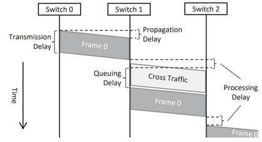

Q: If a request crosses a 10 Gbps server NIC, a 100 Gbps backbone, and a 50 Mbps home wifi link, what's the actual throughput?
A: Beyond delay, there's a separate ceiling on rate: throughput is capped by the <b>bottleneck link</b> — the slowest link in the entire path — not the average and not the fastest link. Here that's the 50 Mbps wifi, so the download will never exceed roughly 50 Mbps no matter how fast the server or backbone is. Why it matters: when debugging "why is this download slow," check the weakest link in the chain (often the client's wifi or a rate-limited proxy) instead of assuming the server needs to be faster.

Q: Why does a lossy network connection make API calls feel slow even when bandwidth is fine?
A: The other thing a shared, best-effort link does besides delaying you: it can drop packets outright — routers drop them when buffers overflow or bits get corrupted; there's no built-in guarantee of delivery at the network layer. <b>TCP</b> handles this by detecting a missing packet (via ACKs) and <b>retransmitting</b> it — but that costs a full extra round trip. On a flaky mobile or wifi connection, small amounts of packet loss cause repeated retransmit round trips, which is why a "slow" API call is often actually a <b>lossy</b> connection, not a bandwidth problem — this is also why WebSockets/video calls that use UDP instead see it as glitches, not stalls.
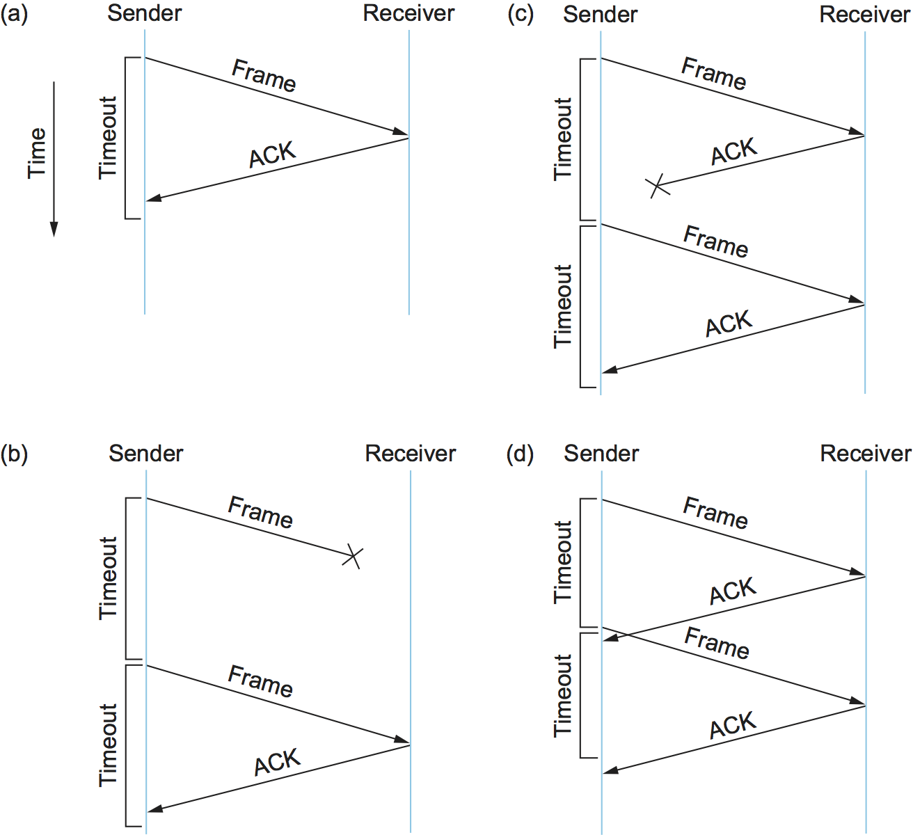

Q: TCP vs UDP — how does the choice actually show up in a real system design decision?
A: This is the design choice packet loss forces on every protocol — guarantee delivery or accept drops: <b>TCP</b> is connection-oriented (three-way handshake before any data flows), guarantees ordered, reliable delivery via ACKs and retransmission. Used by HTTP/gRPC/database connections — you want every byte to arrive correctly. <b>UDP</b>: no handshake, no delivery guarantee, no ordering — just fire packets and hope. Used by DNS, video/audio calls, and game state updates — you'd rather drop a stale frame than wait for a retransmit that arrives too late to matter. Why it matters: picking UDP for a live video feature (like WebRTC) instead of TCP is a deliberate trade — you accept occasional glitches in exchange for never blocking on a retransmission.
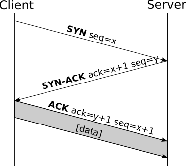

Q: Why does packet sniffing mean you should never trust plain HTTP for anything sensitive?
A: None of that reliability engineering protects confidentiality: packets on a shared or intermediate network (public wifi, a compromised router, an ISP) can be <b>read by anyone sitting in the path</b> — this is called <b>sniffing</b> or, when someone actively intercepts and possibly modifies traffic, a <b>man-in-the-middle (MITM) attack</b>. Plain HTTP sends everything — cookies, auth tokens, form data — as readable text. <b>TLS/HTTPS</b> encrypts the payload so an eavesdropper on the same network only sees ciphertext, not your session token. This is exactly why browsers flag plain HTTP as "Not secure" and why you should never send API keys over an unencrypted connection, even on your own local network.
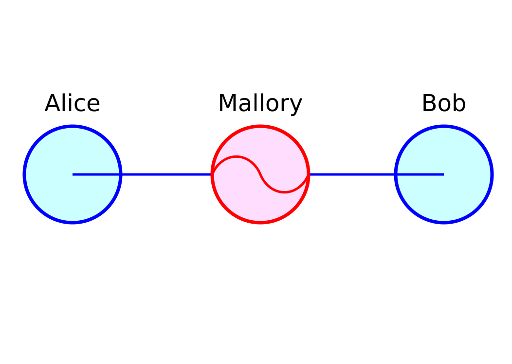

Q: What does a DoS/DDoS attack actually do at the network level, and why do rate limits and CDNs defend against it?
A: Encryption fixes eavesdropping but leaves this gap open — it protects confidentiality, not availability: a <b>denial-of-service (DoS)</b> attack floods a target with traffic or requests until it can't serve legitimate users — not by breaking in, just by <b>overwhelming capacity</b> (bandwidth, connection slots, or CPU handling requests). A <b>DDoS</b> (distributed) version does this from many machines at once (e.g. a botnet), making it much harder to block by simply blacklisting one IP. Why it matters: this is the real reason production systems need <b>rate limiting</b>, <b>load balancers</b>, and <b>CDN/WAF</b> in front of origin servers — they absorb and filter the flood before it reaches your actual application code.
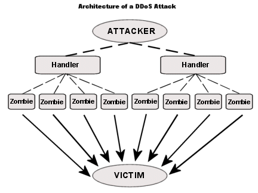

Q: What does "the internet is a network of networks" mean, and why does it matter for where you deploy a global service?
A: None of this — reliable delivery, encryption, DoS defense — works without a way to actually span the entire globe: there's no single owner, the internet is thousands of independently-run networks (<b>ISPs</b>) interconnected in tiers: <b>Tier-1</b> ISPs own the global backbone and connect to each other directly (peering) without paying anyone. <b>Tier-2/3</b> ISPs are regional/local providers who pay for transit up to Tier-1 (or peer directly at <b>Internet Exchange Points</b>, IXPs, to save cost and cut latency). Why it matters: this tiered, peered structure is exactly why cloud providers and CDNs deploy points-of-presence at major IXPs — being physically close to where networks already interconnect means fewer hops and lower latency to more users.
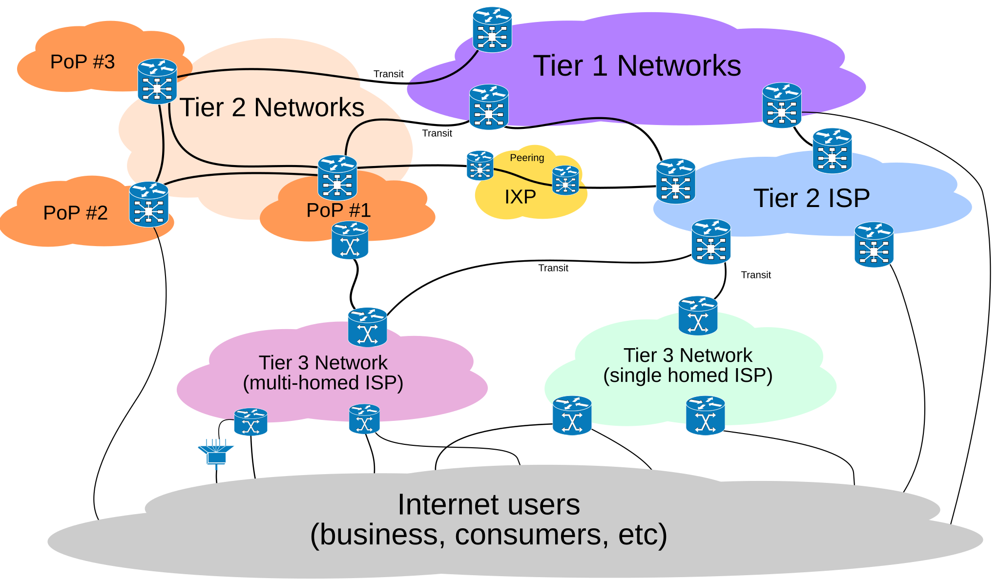
