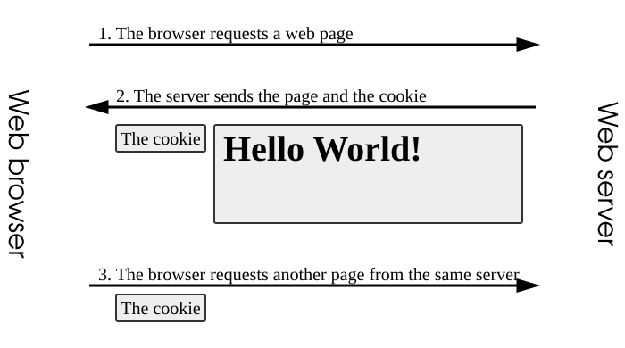
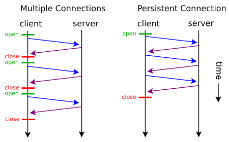
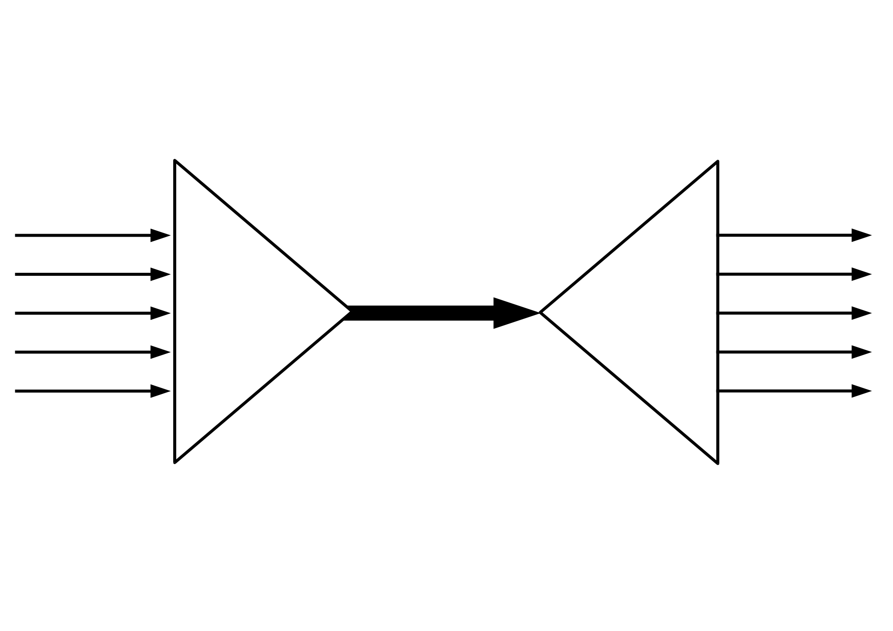
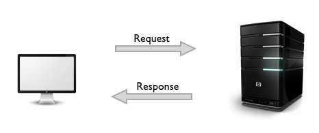
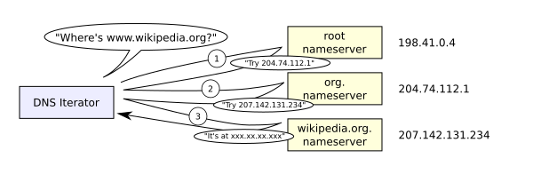
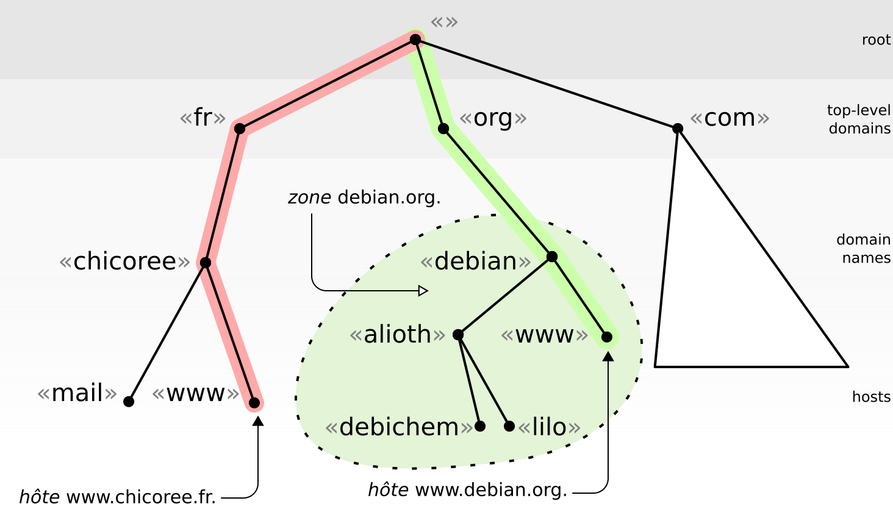
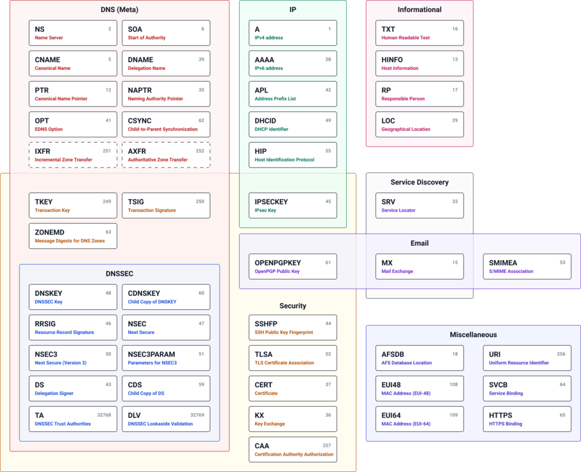
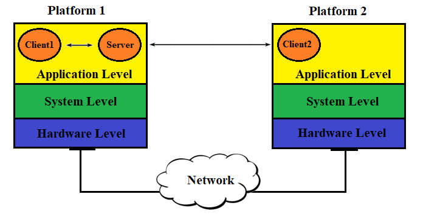
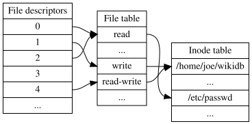
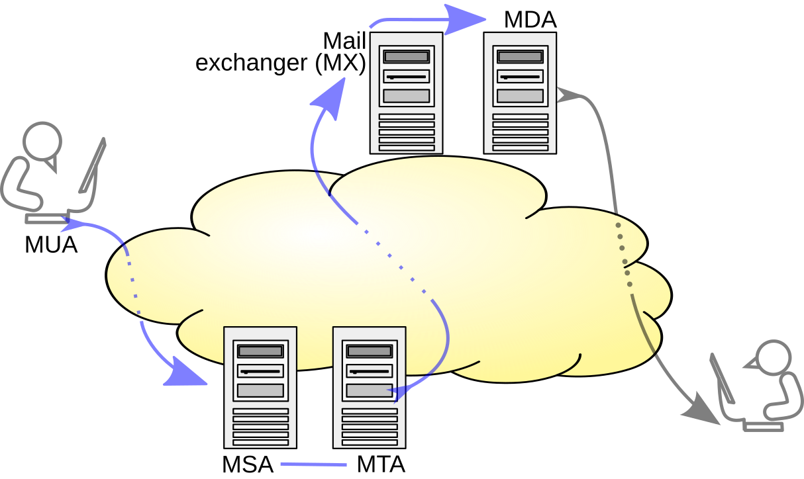

# Networking Chapter 2 — Application Layer

## The flow
1. **Problem:** applications need to talk to each other across a network without dealing with raw sockets and bytes.
2. **Solution:** the client-server paradigm — a simple request/reply model where clients never talk to each other directly (P2P is the alternative, trading central control for capacity that grows with users).
3. **Break:** every request still needs a way to name the machine you're talking to, and raw IP addresses are hard for humans to use or manage.
4. **Solution:** DNS maps names to addresses through a distributed hierarchy (root → TLD → authoritative, walked by your recursive resolver) using a small set of record types (A, CNAME, MX, NS).
5. **Break:** resolving a name is itself a round trip, and opening a fresh TCP connection for every request piles more round trips on top of that.
6. **Solution:** persistent (keep-alive) HTTP connections reuse one TCP connection — which underneath is just a socket/file descriptor the OS tracks — instead of paying a handshake per object.
7. **Break:** even on one reused connection, handling only one request at a time creates head-of-line blocking — a slow response queues up everything behind it.
8. **Solution:** HTTP/2 multiplexing interleaves many requests/responses as frames on a single connection so a slow one no longer blocks the rest.
9. **Break:** none of the above touches the fact that HTTP itself is stateless — the server has no memory of who you are between requests.
10. **Solution:** cookies bolt state onto a stateless protocol (Set-Cookie/Cookie, looked up server-side).
11. **Break:** even with identity solved, repeatedly re-fetching a resource that hasn't changed wastes bandwidth and time.
12. **Solution:** caching (Cache-Control, ETag/conditional GET) lets the browser or CDN skip or shortcut the trip.
13. **Break:** with connections, state, and caching all in play, you still need a way to tell what actually happened on any given request.
14. **Solution:** HTTP status codes (2xx/3xx/4xx/5xx) are the protocol's own signal for diagnosing exactly that.
15. **Aside:** not every protocol fits this client-pull shape — SMTP is a push protocol (sender-initiated, server-to-server) precisely because email delivery can't wait for the recipient to ask.

---

Q: Why is HTTP called a "stateless" protocol, and what does that mean for how you design sessions/cookies in a real app?
A: This is the break in the chain that cookies exist to patch: the HTTP server keeps <b>no memory</b> of previous requests from a client — each request is handled independently, even from the same browser tab. That's great for scalability (any server in a pool can handle any request), but it means <b>your app</b> has to invent state on top: a session ID stored in a <b>cookie</b>, sent back on every request, that your backend uses to look up user data (in Redis, a DB, or a signed JWT). This is exactly why Express (<code>express-session</code>), Spring (<code>HttpSession</code>), and Go frameworks all need a session/cookie layer bolted on — HTTP itself gives you nothing to remember who you are.

Q: How do cookies actually let a stateless protocol "remember" you?
A: This is what closes the gap left by HTTP's statelessness: on first response, the server sends <code>Set-Cookie: sessionId=abc123</code>. The browser stores it and automatically attaches <code>Cookie: sessionId=abc123</code> to <b>every subsequent request</b> to that domain. The server looks up <code>abc123</code> in its session store to know who's asking — the "memory" lives in the cookie + server-side lookup, not in HTTP itself. This is why cookie flags like <code>HttpOnly</code>, <code>Secure</code>, and <code>SameSite</code> matter — they control who can read/send that identity token.

Q: What's the difference between a non-persistent and a persistent (keep-alive) HTTP connection, and why do you care?
A: Building on DNS resolution: once a hostname resolves to an address, this decides how many TCP handshakes you pay for the requests that follow. <b>Non-persistent</b> (old HTTP/1.0 style): a new TCP connection is opened and closed for <b>every single object</b> (HTML, then CSS, then each JS file) — each one pays a fresh TCP handshake (extra round trips). <b>Persistent / keep-alive</b> (default since HTTP/1.1): one TCP connection stays open and handles many requests back-to-back. Why it matters: TCP handshakes cost real round-trip latency — that's why HTTP clients (browsers, Go's <code>http.Client</code>, Java's <code>HttpClient</code>) reuse connection pools instead of dialing fresh for every call. Forgetting to reuse a client/connection pool in your own service code is a classic self-inflicted latency bug.

Q: Why did HTTP/2 introduce multiplexing, and what problem did it actually fix?
A: This is what closes the gap left by persistent connections: reusing one connection isn't enough if requests still queue behind each other one at a time. In HTTP/1.1, even with keep-alive, a connection could only have one request <b>in flight waiting for its response</b> at a time (or browsers hacked around it by opening 6 parallel TCP connections per host) — if one response was slow, everything behind it queued up. That's <b>head-of-line (HOL) blocking</b>. HTTP/2 <b>multiplexes</b>: many requests and responses are broken into frames and interleaved on a <b>single TCP connection</b>, so a slow response no longer blocks the others. Practical effect: you stop needing hacks like spriting/bundling assets or domain sharding purely to dodge connection limits — though a slow TCP layer itself can still stall everything (that's what HTTP/3 over QUIC fixes next).

Q: How do HTTP caching headers (Cache-Control, ETag) actually change what the browser/CDN does on the next request?
A: Separately from the connection and statelessness threads, this closes a different gap — repeatedly re-fetching a resource that hasn't changed. <code>Cache-Control: max-age=3600</code> tells the browser/CDN "don't even ask the server again for 1 hour — just reuse your local copy." No network request at all. After it expires, a <b>conditional GET</b> is sent with <code>If-None-Match: &lt;etag&gt;</code>; if the server's current ETag matches, it replies <code>304 Not Modified</code> with <b>no body</b> — saving bandwidth even though a request still happened. This is why static assets get content-hashed filenames (<code>app.a1b2c3.js</code>) with far-future <code>max-age</code> — the filename itself changes when content changes, so caching can be maximally aggressive without ever serving stale code.

Q: What do the HTTP status code categories (1xx–5xx) actually tell you when debugging?
A: This is the diagnostic layer that sits on top of everything above — connections, caching, state — when something goes wrong. <b>2xx</b> — success (<code>200 OK</code>, <code>201 Created</code>). <b>3xx</b> — redirect, follow a different URL (<code>301</code> permanent, <code>302</code>/<code>307</code> temporary, <code>304 Not Modified</code> for caching). <b>4xx</b> — the <b>client's</b> fault (<code>400</code> bad request, <code>401</code> not authenticated, <code>403</code> forbidden, <code>404</code> not found, <code>429</code> rate-limited). <b>5xx</b> — the <b>server's</b> fault (<code>500</code> unhandled exception, <code>502</code> bad gateway, <code>503</code> unavailable, <code>504</code> gateway timeout). The 4xx/5xx split is the first thing to check when debugging: 4xx means fix the request (or the client code sending it), 5xx means go look at server logs.

Q: Why does DNS resolution add latency to the <b>first</b> request to a new host, and why does that matter for performance?
A: Building on the client-server model's need to name a machine: this is the first cost that naming adds before any request can even start. Before the browser can even open a TCP connection, it has to resolve the hostname to an IP — that's an extra round trip (sometimes several, if it's not cached anywhere along the resolver chain) <b>before</b> the real request even starts. Once resolved, the OS/browser caches the answer for the record's <b>TTL</b>, so later requests to the same host skip DNS entirely. This is why the first request to a new third-party domain (an API, a CDN, an analytics script) feels slower than the rest — and why techniques like <code>&lt;link rel="dns-prefetch"&gt;</code> or reusing one API host instead of many exist: they front-load or eliminate that lookup cost.

Q: What are the four levels of the DNS hierarchy, and what's the recursive resolver's job?
A: This is the distributed structure that resolves that first-request lookup cost. <b>Root servers</b> → know which server handles each top-level domain (.com, .org, .io). <b>TLD servers</b> → know which server is authoritative for each domain under that TLD. <b>Authoritative servers</b> → hold the actual DNS records for your specific domain (this is what you configure in Route53/Cloudflare/etc). Your <b>recursive resolver</b> (run by your ISP or a public one like 8.8.8.8) does the legwork of walking root → TLD → authoritative on your behalf and caches the result so it doesn't repeat that walk for every user.

Q: When you add a DNS record in your DNS provider's dashboard, what do A, CNAME, MX, and NS records actually each resolve to?
A: Building on that hierarchy: these are the actual record types you configure at the authoritative layer once you're in it. <code>A</code> record — hostname → an <b>IPv4 address</b> (e.g. <code>api.example.com → 203.0.113.5</code>). <code>CNAME</code> record — hostname → <b>another hostname</b> (an alias; useful for pointing a subdomain at a load balancer's changing address, e.g. <code>www → my-app.vercel.app</code>). <code>MX</code> record — domain → the <b>mail server</b> hostname that should receive email for that domain. <code>NS</code> record — domain → which <b>name servers</b> are authoritative for it. This is the exact set you touch every time you point a custom domain at Vercel, Netlify, or a mail provider like Google Workspace.

Q: What's the real difference between the client-server and P2P (peer-to-peer) paradigms, and why does it matter architecturally?
A: This is the foundational paradigm choice that everything else in this chapter assumes. <b>Client-server</b>: clients never talk to each other — everything routes through always-on servers you control and scale (this is what you build 99% of the time as a full-stack dev). <b>P2P</b>: peers (like BitTorrent clients) both request <b>and</b> serve data to each other, so the system's capacity <b>grows</b> as more users join instead of being a fixed bottleneck — but you give up central control, consistent uptime, and easy debugging. Almost everything you'll build professionally (REST APIs, web apps, mobile backends) is client-server; P2P shows up in niche cases like WebRTC data channels or blockchain nodes.

Q: How does a TCP socket in your Go/Java code map to something the OS actually tracks?
A: Underneath persistent connections, this is the OS-level mechanism that actually tracks a TCP connection. When you call <code>net.Dial(...)</code> in Go or open a <code>Socket</code> in Java, the kernel hands your process back a <b>file descriptor</b> — just an integer handle, same mechanism used for open files. The kernel is the one actually tracking the TCP connection's state (sequence numbers, buffers, etc.) behind that descriptor; your <code>read()</code>/<code>write()</code> calls just move bytes through it. This is why "too many open connections" crashes look identical to "too many open files" errors (<code>EMFILE</code>) — a leaked HTTP client that never closes its connections is leaking file descriptors, and every OS has a per-process limit (check with <code>ulimit -n</code>).

Q: How does SMTP actually move an email from your outbox to the recipient's inbox — and why can't you just "fetch" email from the sender like you would a webpage?
A: Stepping outside the request-pull shape this chapter has been building: SMTP is a <b>push</b> protocol: your mail client pushes the message to your outgoing mail server, which then pushes it onward, server-to-server, until it reaches the recipient's mail server — the sender always initiates. Retrieving mail is a <b>separate, second step</b> handled by a different protocol (IMAP, or the older POP3) that the recipient's client uses to pull messages down from their own mailbox. Practical relevance: when you configure transactional email (SendGrid, SES, Postmark) for a Go/Java/Node backend, you're really just handing your app's outgoing message to someone else's SMTP relay so you don't have to run and maintain a mail server yourself.

