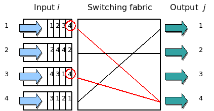
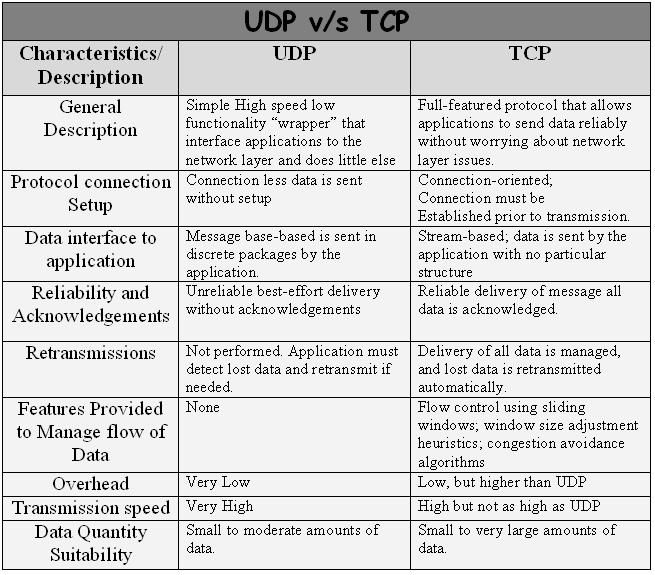
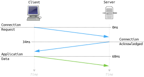
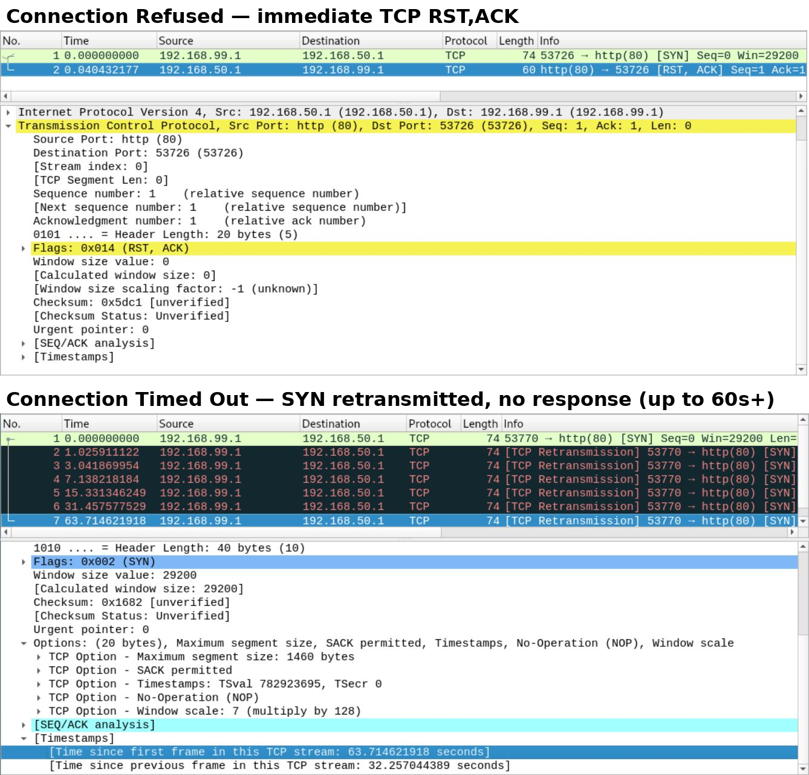
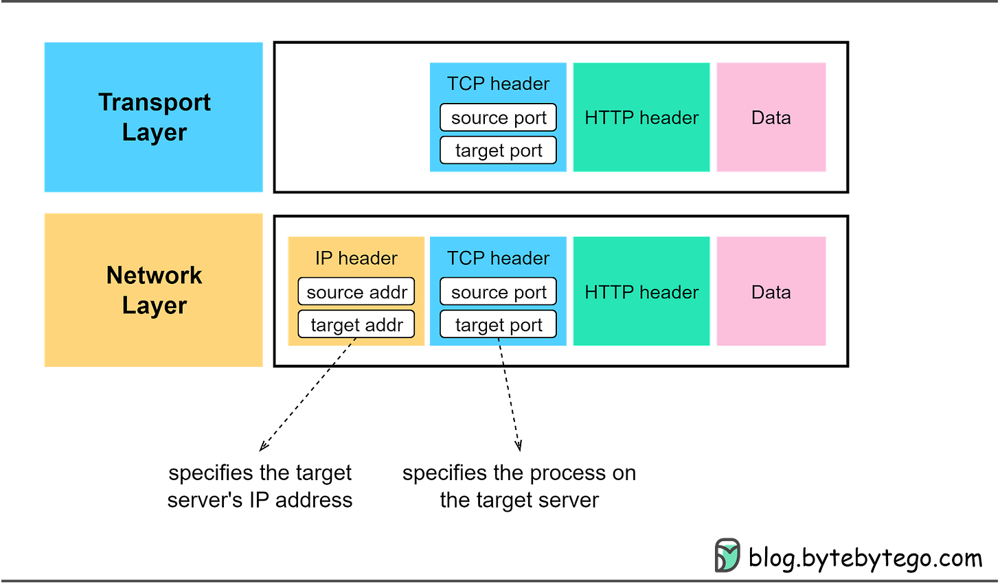
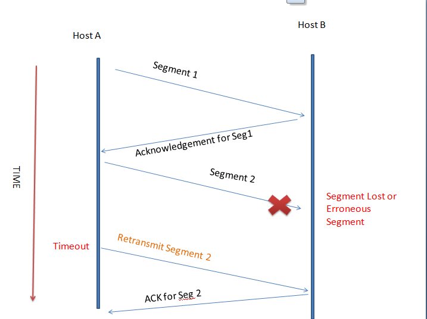
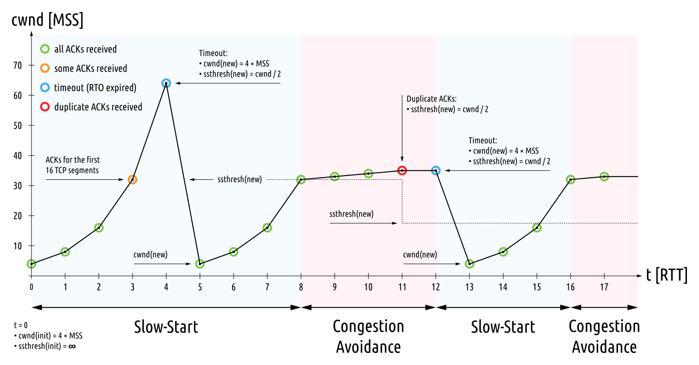
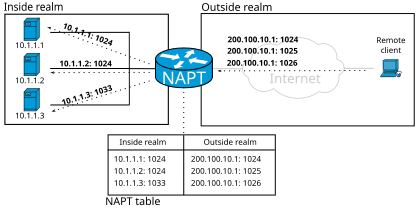
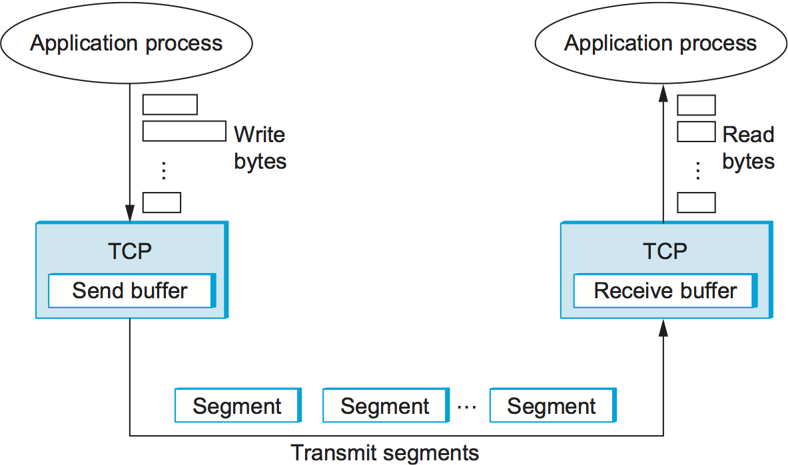
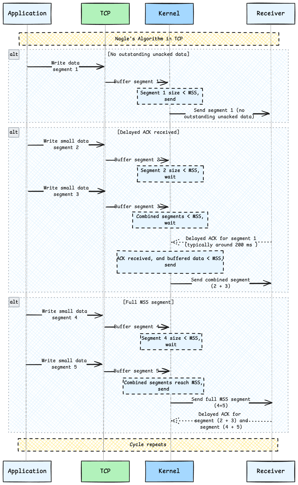

# Networking Chapter 3 — Transport Layer

## The flow
1. **Problem:** IP only moves packets between hosts — it has no notion of "which app on this host," but one machine needs to run many network apps at once.
2. **Solution:** ports + multiplexing/demultiplexing — the 4-tuple (src IP, src port, dst IP, dst port) lets one IP address fan out to thousands of concurrent connections.
3. **Break:** IP packets can still be lost, duplicated, or reordered in transit, and some apps can't tolerate that.
4. **Solution:** TCP adds reliability on top — sequence numbers + ACKs let the sender detect and retransmit lost data.
5. **Break:** that reliability isn't free — strict in-order delivery means one lost segment head-of-line-blocks everything behind it, and some apps would rather drop stale data than wait for it.
6. **Solution:** UDP opts out of all of it — connectionless, best-effort, no ordering or retransmission — for apps where latency matters more than perfect delivery.
7. **Break:** but a reliable, ordered TCP stream has to be explicitly opened in a way both sides agree on, or sequence numbers mean nothing.
8. **Solution:** the three-way handshake (SYN, SYN-ACK, ACK) establishes that shared starting state before any data flows.
9. **Solution:** the four-way close (FIN, ACK, FIN, ACK) plus TIME_WAIT tears the connection down cleanly, guarding against stray late packets.
10. **Break:** middleboxes (NAT devices, firewalls) need to track when a connection is alive, and they can only do that reliably for protocols with an explicit handshake/close.
11. **Solution:** NAT/firewalls key off the TCP handshake and FIN/RST as clear connection-state signals; UDP has none of that, so tracking (and NAT traversal) becomes guesswork.
12. **Break:** depending on how a connection attempt or teardown actually fails, the practical symptom on the wire looks different.
13. **Solution:** connection refused (an active RST — fast) vs. connection timed out (silence — slow) are the two failure signatures, and they point to different root causes.
14. **Break:** even once a connection is up and reliable, a fast sender can still overwhelm a slow receiver's buffer.
15. **Solution:** flow control (the receiver's advertised sliding window) throttles the sender based on the receiver's capacity.
16. **Break:** a receiver-side limit doesn't protect the shared network itself — many senders together can still overwhelm the links between them.
17. **Solution:** congestion control (slow start, AIMD) throttles the sender based on the network's capacity, not the receiver's.
18. **Break:** none of this reliability/ordering/flow-control machinery gives an app any notion of "message boundaries" — TCP is just a stream of bytes.
19. **Solution:** apps built on TCP must add their own framing (e.g. length-prefixing) to know where one message ends and the next begins; UDP's datagram model sidesteps this since each send() is already a discrete unit.
20. **Break:** separately, TCP's default habit of buffering small writes to batch them into fewer, larger segments (Nagle's algorithm) trades latency for efficiency.
21. **Solution:** disable it with `TCP_NODELAY` when sending small, latency-sensitive messages (a websocket ping, a chatty RPC call) where every millisecond of buffering hurts.

---

Q: What does TCP actually guarantee, and what does that guarantee cost you?
A: This is TCP's answer to unreliable IP delivery: TCP guarantees your bytes arrive <b>reliably, in order, with no duplicates</b> — the app never has to think about lost or reordered packets. The cost is <b>head-of-line (HOL) blocking</b>: if segment 2 of 4 is lost, segments 3 and 4 sit buffered and unusable until segment 2 is retransmitted and arrives — even though 3 and 4 are already at the receiver. This is why a single dropped packet can stall an entire HTTP/1.1 or HTTP/2 connection, and why HTTP/3 moved to QUIC (over UDP) — QUIC multiplexes streams so one lost packet only blocks its own stream, not everything sharing the connection.

Q: Why would you ever choose UDP over TCP?
A: This is the escape hatch from TCP's reliability cost above: UDP is <b>connectionless</b> (no handshake) and <b>best-effort</b> — no ordering, no retransmission, no flow/congestion control. You send a datagram and hope. That sounds worse, but for some workloads TCP's guarantees are actively harmful: retransmitting a video frame that's already too late to display just adds lag. Use UDP when <b>low latency matters more than perfect delivery</b>: video/audio streaming, real-time gaming, WebRTC, and DNS queries (a single small request/response where retrying at the app level is cheaper than a full TCP handshake). gRPC/HTTP APIs, database connections, and file transfers still want TCP — you need every byte, in order.

Q: What actually happens during the TCP three-way handshake, and why should you care about its cost?
A: Before any of TCP's reliability guarantees mean anything, both sides need to agree on a starting state — that's what this handshake does: <b>SYN</b> (client → server: "let's connect, here's my starting sequence number") → <b>SYN-ACK</b> (server → client: "ok, here's mine") → <b>ACK</b> (client → server: "confirmed"). That's a full <b>round trip before a single byte of your actual request is sent</b> — and if you're using TLS on top (HTTPS), you pay another 1-2 round trips for the TLS handshake. This is exactly why <b>HTTP keep-alive and connection pooling</b> (or gRPC's persistent HTTP/2 connections) matter so much: reusing an already-open TCP connection skips the handshake entirely, which on a high-latency mobile connection can save 100s of milliseconds per request.

Q: What is TIME_WAIT and why can a server sometimes refuse to rebind a port right after restart?
A: Tearing down that same connection state is just as coordinated as the handshake that opened it. Closing a TCP connection is a <b>four-way handshake</b> (FIN, ACK, FIN, ACK) because each side closes its own direction independently (TCP is full-duplex). After sending the final ACK, the side that initiated the close enters <b>TIME_WAIT</b> and holds that (IP, port) pair reserved for a couple of minutes — in case a duplicate/delayed packet from the old connection shows up and would otherwise confuse a new connection reusing the same ports. This is why restarting a server fast can throw <code>"address already in use"</code> — the OS is still holding the old socket in TIME_WAIT. <code>SO_REUSEADDR</code> is the common fix, which is why you'll see it set in most production server code.

Q: What's the practical difference between "connection refused" and "connection timed out"?
A: This is what you actually observe when a handshake (or connection attempt) fails, rather than succeeds. <b>Connection refused</b> means a machine at that IP <b>actively replied</b> — with a TCP RST — because nothing is listening on that port. Fails fast (milliseconds). This means the host is up but your service isn't running, or you have the wrong port. <b>Connection timed out</b> means <b>nobody replied at all</b> — the host is unreachable, a firewall is silently dropping your SYN packets, or a route is broken. This fails slow (you wait out the full OS timeout, often 10-30 seconds). Reading this distinction correctly is one of the fastest ways to triage an outage: "refused" → check if the process/container is actually running; "timed out" → check network path, security groups, or firewall rules.

Q: How does one server handle thousands of simultaneous connections on a single IP address?
A: This is the first problem the transport layer solves, before reliability even enters the picture. <b>Ports</b> are the multiplexing key. A connection is uniquely identified by the <b>4-tuple</b>: (source IP, source port, destination IP, destination port). Your server listens on one fixed port (443 for HTTPS), but each client connects from a different ephemeral source port — so the OS can demultiplex thousands of concurrent sockets that all share the same destination IP and port. This is the mechanism behind every load balancer and every <code>net.Listen(":8080")</code> in Go: the port you bind is just where new connections arrive; each accepted connection gets its own full 4-tuple identity.

Q: How does TCP actually detect and recover from lost data?
A: Building on port multiplexing getting packets to the right app, this is how TCP fixes IP's underlying loss and reordering. Every byte TCP sends gets a <b>sequence number</b>. The receiver sends back an <b>ACK</b> containing the next sequence number it expects — effectively saying "I have everything up to here." If the sender doesn't get an ACK advancing past a certain point (or gets repeated duplicate ACKs for the same number), it assumes that data was lost and <b>retransmits</b> it. This sequence-number-plus-ACK loop is the entire mechanism behind "reliable delivery" — there's no magic, just bookkeeping and retries. It's also why TCP has a minimum latency floor: loss recovery always costs at least one extra round trip.

Q: What is TCP flow control and what problem does it solve?
A: Once a reliable connection is established, a new problem shows up — a fast sender can flood a slow receiver. <b>Flow control</b> stops a fast sender from overwhelming a slow receiver. The receiver advertises a <b>window size</b> in every ACK — "I have this much free buffer space left" — and the sender is not allowed to have more than that much unacknowledged data in flight at once. This is purely about the <b>receiver's capacity</b> (e.g. a slow consumer, a small buffer), separate from network congestion. You see the practical effect of this whenever a client app is slow to read a response body: the server's writes eventually block because the receiver's advertised window has shrunk to zero.

Q: Why does a big file upload/download often start slow and speed up over the first few seconds?
A: Flow control protects the receiver, but the shared network itself needs its own throttle: TCP doesn't know how much bandwidth is available, so it <b>probes for it gradually</b> instead of blasting data at full speed immediately (which would flood the network and cause mass packet loss). <b>Slow start</b>: the congestion window starts small and roughly doubles every round trip. <b>Congestion avoidance</b>: once losses start appearing, growth slows to linear, gently probing for more capacity. <b>AIMD</b> (additive increase / multiplicative decrease): on packet loss, the window is slashed (e.g. halved), then grows additively again — producing the classic sawtooth throughput graph. This is exactly why a large upload "ramps up" instead of hitting full speed instantly, and why very short-lived connections (small API calls) never get to enjoy full bandwidth — they finish before the window ever grows large.

Q: Why do NAT devices and firewalls care about TCP more than UDP, and why does that make peer-to-peer UDP (WebRTC, VoIP) harder?
A: The same handshake and close signals that set up and tear down a TCP connection are also what NAT devices and firewalls rely on to track state. A NAT/firewall keeps a <b>connection table</b> mapping your private (IP, port) to a public (IP, port), and it can safely open/track that table entry by watching the TCP handshake (SYN → SYN-ACK → ACK) as a clear "connection started" signal, then close it when it sees FIN/RST. UDP has <b>no handshake and no connection state</b> at the protocol level — the NAT has to guess when a "session" starts and ends, usually via an idle timeout. This is exactly why peer-to-peer UDP apps need techniques like <b>STUN/TURN and hole punching</b> to work reliably through NAT, while a plain outbound TCP connection almost always "just works."

Q: Why does TCP force you to add your own message framing (like length-prefixing) to a protocol, while UDP doesn't?
A: None of the reliability or ordering machinery above tells an app where one message ends and the next begins — that's a separate gap TCP leaves open: TCP is a <b>byte stream</b> — it has no concept of "messages." If you call <code>write()</code> twice, the receiver's <code>read()</code> might return both writes concatenated, or split across multiple reads. There are no boundaries. UDP is <b>datagram-based</b> — each <code>send()</code> call is a single, distinct <code>recv()</code> on the other end (or the whole thing is dropped). This is exactly why protocols built on raw TCP (like gRPC/HTTP2 framing, or any custom binary protocol) need an explicit <b>length prefix or delimiter</b> to know where one message ends and the next begins — a bug you only hit once you try to read framed messages off a raw TCP socket and get "half a message."

Q: Why can small, frequent writes over TCP feel laggy, and what's the fix?
A: Related but separate from framing — TCP's default habit of batching small writes has its own latency cost. By default, TCP uses <b>Nagle's algorithm</b>: it buffers small writes for a short window, hoping to coalesce them into fewer, larger segments to reduce packet overhead. That's great for bulk throughput but adds latency for latency-sensitive small messages — like a websocket ping, a keystroke-by-keystroke live update, or a tiny RPC call — because your write can sit buffered for tens of milliseconds before actually going out. The fix is setting <code>TCP_NODELAY</code> on the socket to disable Nagle (Go's <code>net.TCPConn</code> actually has this on by default; Java needs an explicit <code>socket.setTcpNoDelay(true)</code>) — worth knowing what it controls next time you're chasing mystery latency in a chatty RPC protocol.

