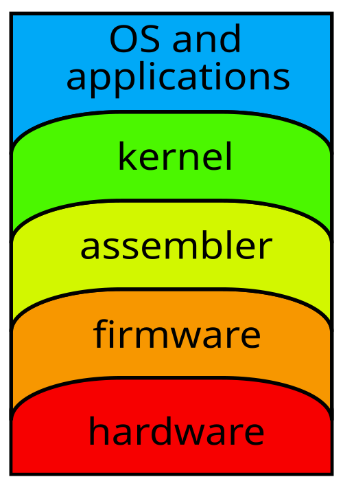
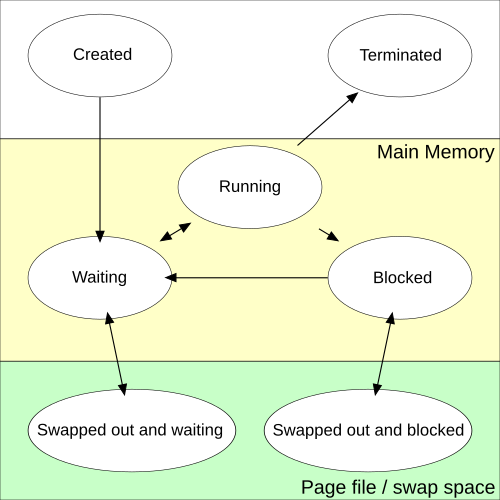
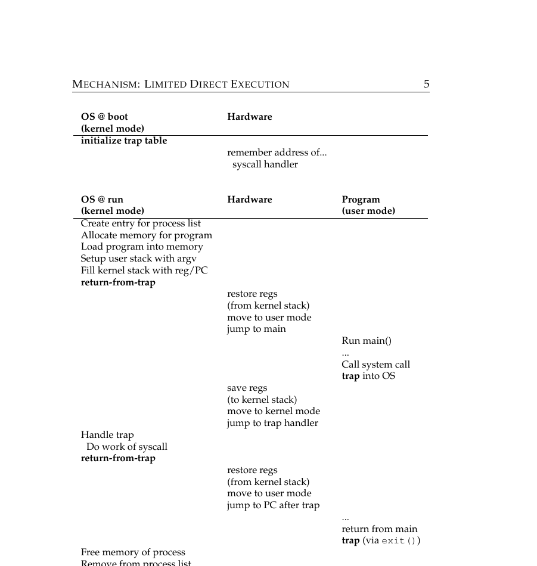
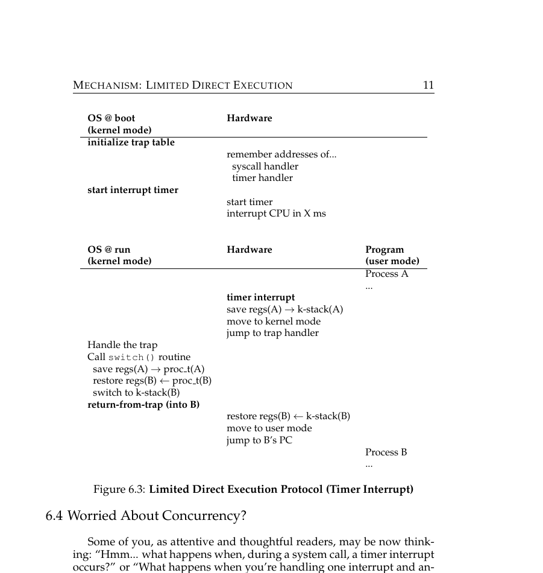
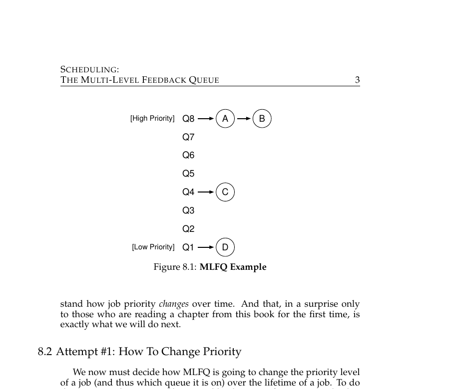

# OSTEP Part 1 — CPU Virtualization

## The flow

1. **Problem:** run many processes on one machine while each still feels like it owns the CPU alone → the OS virtualizes the CPU (and memory, and storage) to create that illusion.
2. **Break:** virtualizing the CPU means the OS has to track each process's own code, memory, and execution state so it can be paused and resumed → the process abstraction, with Running/Ready/Blocked states.
3. **Problem:** the fastest way to run a process is to hand it the CPU directly.
4. **Break:** unrestricted direct access means the process can freely manipulate hardware and do real harm.
5. **Solution:** limited direct execution — run directly on the CPU for speed, but restrict what the process can do.
6. **Break:** a restricted process still needs *some* controlled access (files, memory) — it needs a doorway into the OS that user code can't forge.
7. **Solution:** syscalls via a trap instruction, jumping only into a trap table the OS installed at boot in kernel mode — trusted by construction.
8. **Break:** a process that never syscalls (e.g. an infinite loop) never gives control back to the OS.
9. **Solution:** timer interrupts force a periodic trap into the OS no matter what the process is doing.
10. **Break:** interrupting a process mid-execution loses its state.
11. **Solution:** context switching — save the interrupted process's registers/PC, load the next one's, and resume it.
12. **Problem:** now that the OS can always regain control, it has to decide *which* ready process to run next.
13. **Solution:** MLFQ scheduling — start every job at the highest-priority queue, demote it if it burns its full time allotment (CPU-bound behavior), keep it at the same level if it gives up the CPU early (interactive behavior) — approximating "run short jobs first" without knowing job behavior in advance.

---

Q: What are the OS's three core jobs?
A: This is the top-level goal the whole chapter chases: <b>Virtualizing the CPU</b>, <b>virtualizing memory</b>, and <b>persistence</b> (the file system).

Q: What illusion does CPU virtualization give a process?
A: The specific illusion behind job #1, CPU virtualization: that it owns the entire processor alone, even while sharing it with many other processes.

Q: What illusion does memory virtualization give a process?
A: The matching illusion for the OS's second core job, memory virtualization: that it has its own private, exclusive address space, isolated from every other process.

Q: What is a process, concretely?
A: The concrete unit the OS is virtualizing when it "virtualizes the CPU": a running program — its code, its private memory (heap/stack/data), and its current execution state.

Q: What two pieces of state does the OS save to pause a process?
A: This is what makes pausing and resuming a process possible: the <b>program counter</b> (next instruction) and the <b>register values</b>.

Q: What are the three basic states a process can be in?
A: Tracking process state means every process sits in one of three buckets: <b>Running</b> (on the CPU), <b>Ready</b> (could run, not picked yet), <b>Blocked</b> (waiting on something external).

Q: What causes a process to go from Running to Blocked?
A: One of the transitions between those three states: it makes a blocking call — e.g. a synchronous disk read or network request.

Q: What causes a process to go from Blocked back to Ready?
A: The reverse transition: the event it was waiting on completes (e.g. the disk read finishes).

Q: What causes a process to go from Running to Ready (without it choosing to)?
A: This transition is the one that foreshadows the whole rest of the chapter — the OS has to be able to force it: the scheduler preempts it, its time slice ran out.

Q: What is "Limited Direct Execution," in one sentence?
A: This is the resolution of the speed-vs-safety tension: let the process run directly on the CPU for full speed, but pre-install hardware traps so the OS can safely regain control.

Q: What is a trap table, and when is it set up?
A: This is what makes limited direct execution's "controlled doorway" trustworthy rather than forgeable: a table telling the CPU where to jump on a syscall or fault; installed once at boot, in kernel mode.

Q: What CPU mode does your application code normally run in?
A: The restricted side of limited direct execution: <b>user mode</b> — restricted, can't touch hardware or privileged instructions directly.

Q: What instruction does a system call use to enter the kernel?
A: This is how a user-mode process reaches into the trap table: a <code>trap</code> instruction, carrying a syscall number.

Q: What happens to the CPU's mode during a system call?
A: The mode transition that makes the trap safe: it switches from user mode to kernel mode, then back to user mode via "return-from-trap" once the OS is done.

Q: How does the OS regain control from a process stuck in an infinite loop?
A: This closes the gap traps alone leave open — a process that never calls a syscall would never trap: a hardware <b>timer interrupt</b> fires periodically, forcing a trap into the OS no matter what the process is doing.

Q: What does a context switch actually do?
A: This is what makes it safe to interrupt a process mid-execution via a timer interrupt: save the current process's registers, load the next process's saved registers, and resume it.

Q: Why are goroutine switches cheaper than OS thread context switches?
A: A practical payoff of understanding context switching's cost: goroutine switches happen inside the Go runtime (user space), skipping the kernel trap entirely.

Q: Why does MLFQ use multiple priority queues instead of one fixed priority per job?
A: With the OS now able to regain control at will via timer interrupts and context switches, this is the next problem it faces — deciding who runs next: the scheduler can't know in advance whether a job is short/interactive or long/CPU-bound — behavior has to be observed.

Q: Where does a new job start in MLFQ?
A: MLFQ's starting assumption, before it has observed anything: at the <b>highest-priority</b> queue.

Q: What is a job's "allotment" in MLFQ?
A: This is the mechanism MLFQ uses to observe job behavior: the amount of CPU time it's allowed to use at its current priority level before being demoted.

Q: What happens if a job uses its entire allotment while running?
A: The demotion rule that punishes CPU-bound behavior: it gets demoted to a lower-priority queue (longer time slice, less priority).

Q: What happens if a job gives up the CPU (e.g. blocks on I/O) before using its full allotment?
A: The counterpart rule that rewards interactive behavior: it stays at the same priority level — this looks like interactive behavior, not CPU-hogging.

