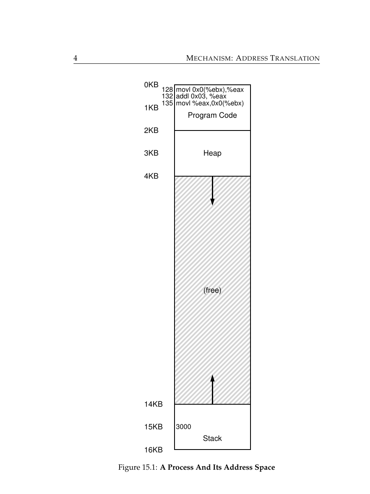
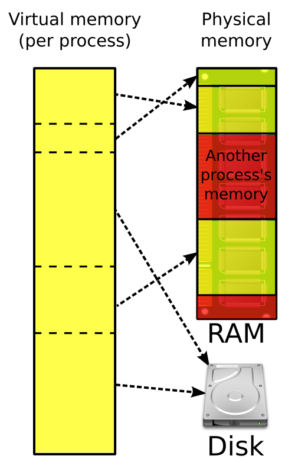
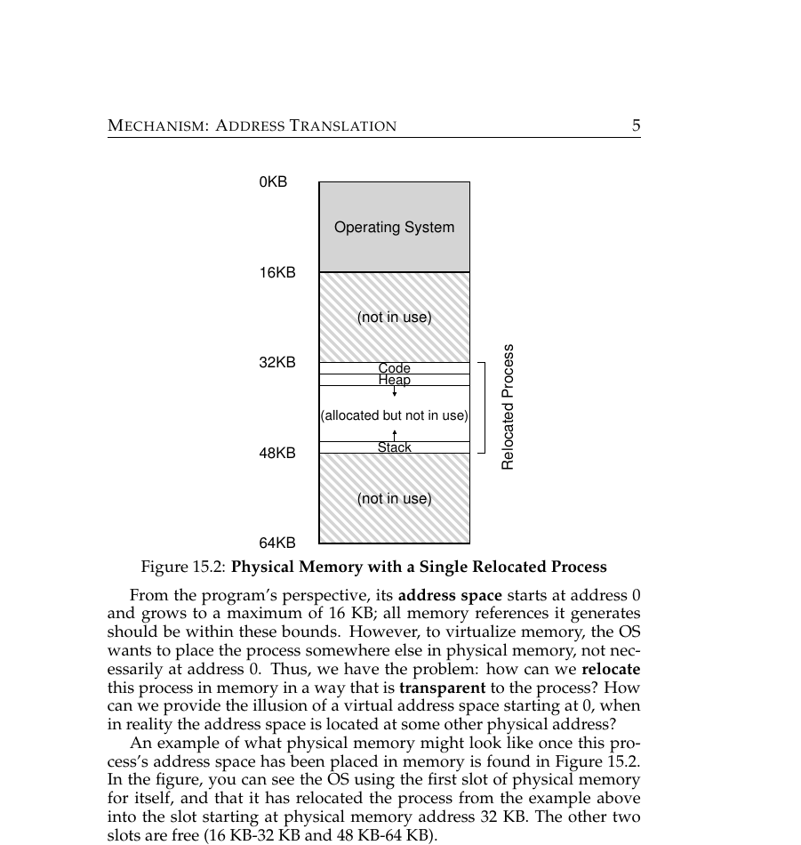
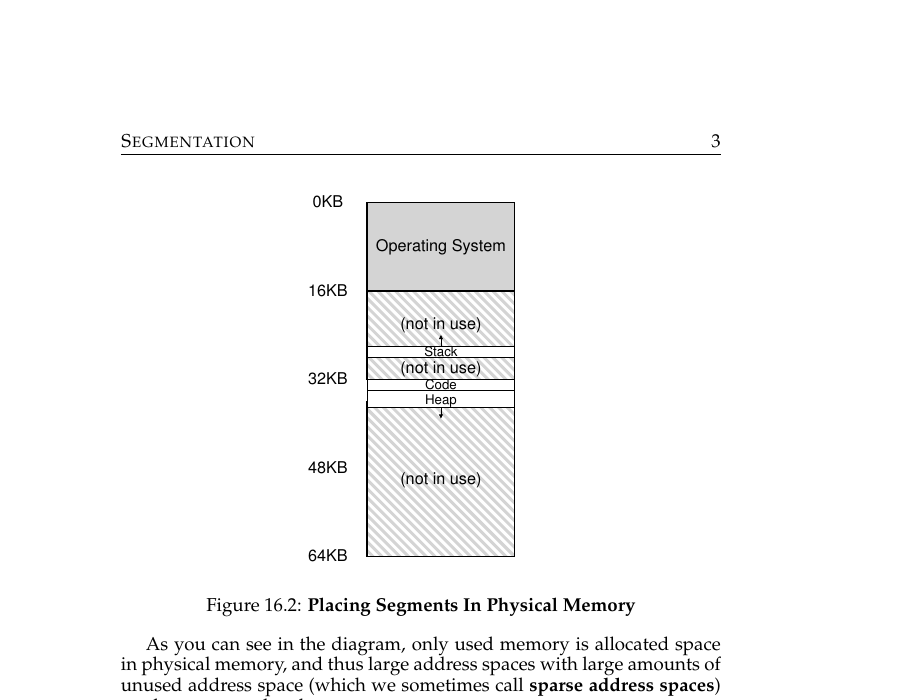
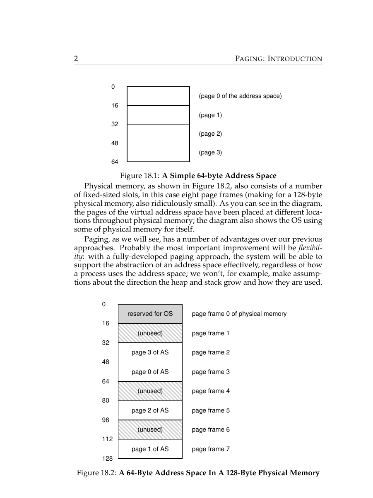
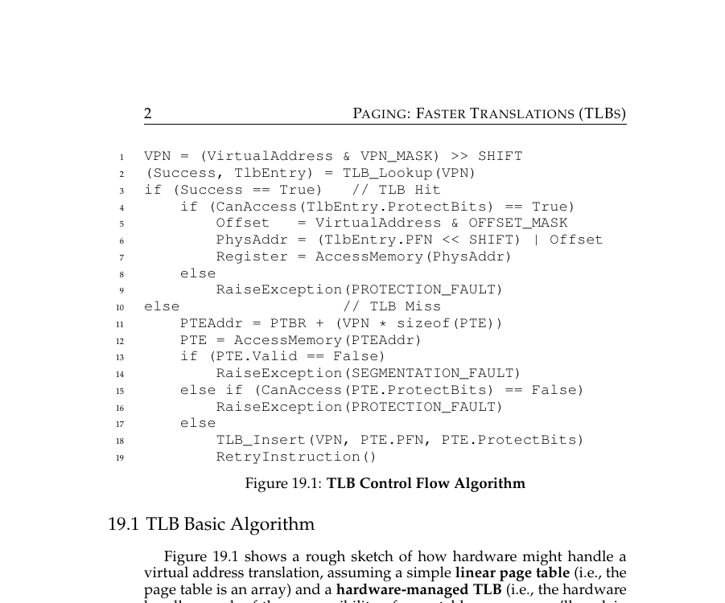
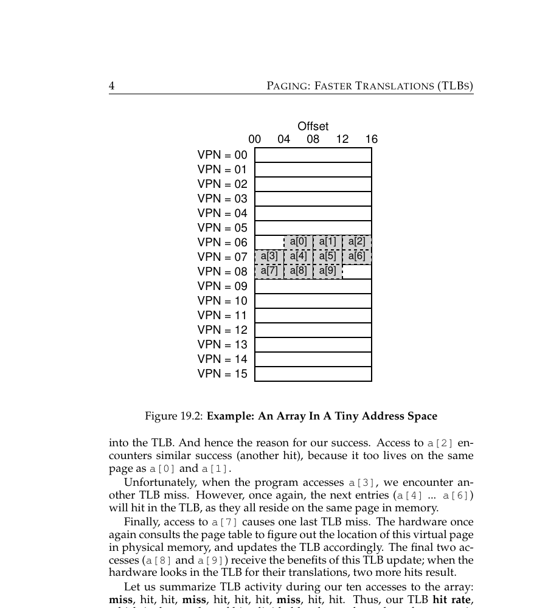
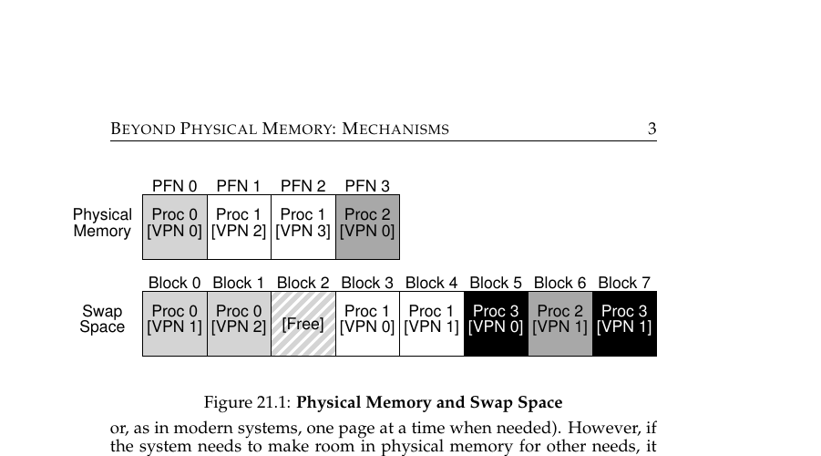
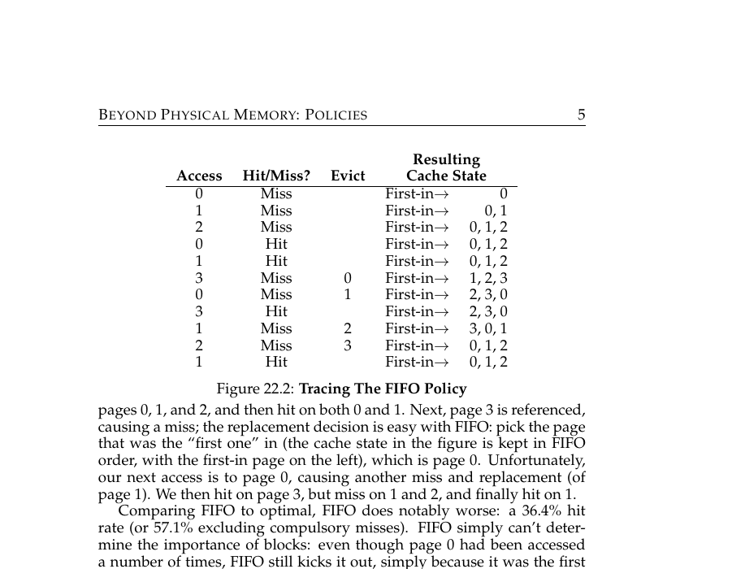

# OSTEP Part 2 — Memory Virtualization

## The flow
1. **Problem:** many processes need to run at once without stepping on each other's memory or needing to know the machine's real physical layout.
2. **Solution:** give each process its own private virtual address space — the illusion of owning all of memory alone (isolation + transparency).
3. **Break:** a virtual address still has to be translated to a real physical one, and the simplest scheme — base+bounds — treats the whole address space as one contiguous chunk, wasting RAM on the unused gap between heap and stack.
4. **Solution:** segmentation — separate base/bounds pairs per logical segment (code/heap/stack), each placed and sized independently.
5. **Break:** independently-placed segments fragment physical memory into scattered free chunks (external fragmentation) — an allocation can fail even with plenty of total free memory.
6. **Solution:** paging — divide the address space and physical memory into small fixed-size chunks (pages/frames), so any page fits any free frame and external fragmentation disappears.
7. **Break:** translating every address now needs a page table, but a lookup in RAM on every single memory access would double the cost of that access.
8. **Solution:** the TLB — a small, fast on-chip cache of recent VPN→PFN translations, effective because of spatial locality.
9. **Break:** physical RAM is finite, so not every page can stay resident at once.
10. **Solution:** swapping — a present bit marks whether a page is in RAM or on disk, and a page fault brings a missing page in on demand.
11. **Break:** when too many processes' combined working sets exceed RAM, the system thrashes — constant swapping instead of real work.
12. **Solution (partial):** the real fix is reducing memory pressure or adding RAM, not scheduling around it — but the OS also needs a policy for *which* resident page to evict when memory fills up.
13. **Break:** the simplest policy, FIFO, evicts whichever page arrived first regardless of whether it's still heavily used.
14. **Solution:** LRU (or approximations like Clock) evicts based on recency of access, a much better predictor of near-future use.

---

Q: What is a virtual address space?
A: This is the OS's core answer to processes needing to coexist safely: the illusion that a process owns the entire address space (0 to max) completely alone.

Q: What are the three main regions inside a process's address space?
A: Inside that private virtual address space: <b>Code</b> at the bottom, <b>heap</b> growing upward, <b>stack</b> growing downward from the top.

Q: What two problems does virtual memory solve?
A: This is the payoff of giving each process its own virtual address space: <b>Isolation</b> (processes can't touch each other's memory) and <b>transparency</b> (a process doesn't need to know where it physically sits in RAM).

Q: What do "base and bounds" registers do?
A: This is the simplest way to implement the virtual-to-physical translation a virtual address space needs: translate a virtual address to a physical one: <code>physical = virtual + base</code>, checked against the bounds register.

Q: What's the main weakness of base-and-bounds relocation?
A: This is the gap base-and-bounds leaves open: it treats the whole address space as one contiguous chunk — wasting physical RAM on the unused gap between heap and stack.

Q: How does segmentation improve on plain base-and-bounds?
A: Segmentation closes that wasted-space gap: it uses <b>separate</b> base/bounds pairs for code, heap, and stack, so each can be placed independently and sized to actual usage.

Q: What is external fragmentation?
A: This is the new problem segmentation's independent placement introduces: free memory split into scattered chunks, each too small to satisfy a request — even though total free space would be enough.

Q: Why can a JVM throw OutOfMemoryError even with 60% of the heap free?
A: This is external fragmentation showing up in a real runtime: no single contiguous region is large enough for the allocation.

Q: What is paging?
A: Paging is the fix for segmentation's fragmentation problem: dividing both the virtual address space and physical memory into small, fixed-size chunks (pages and page frames).

Q: Why does paging eliminate external fragmentation entirely?
A: This is why paging closes the gap segmentation left open: any virtual page can go into any free physical frame — no contiguous placement is ever required.

Q: What is a page table?
A: Making paging work requires a per-process map from virtual page number (VPN) to physical frame number (PFN).

Q: What does the "valid" bit in a page table entry protect against?
A: Building on that page table structure: it protects against illegal memory accesses — this is the mechanism behind a C segfault or a safely-contained Go/Java NPE.

Q: Why isn't a plain page-table lookup fast enough for every memory access?
A: This is the new cost paging introduces: the page table itself lives in RAM, so translation would double the cost of every single memory access.

Q: What is a TLB?
A: The TLB is the fix for that per-access lookup cost: a small, very fast on-chip cache of recent virtual-to-physical (VPN→PFN) translations.

Q: What kind of locality does the TLB rely on to be effective?
A: The TLB's speed depends on <b>spatial locality</b> — nearby memory addresses tend to share the same page.

Q: Why does looping over a Go slice (`[]int`) beat chasing a linked list, at the hardware level?
A: This is the TLB's spatial-locality principle showing up in real code: the slice's contiguous memory keeps hitting the same pages (TLB hits); the linked list's scattered heap nodes cause repeated TLB misses.

Q: What does the "present bit" in a page table entry indicate?
A: Beyond translation, the page table also has to track a further constraint — finite RAM: whether the page is currently in physical RAM, or swapped out to disk.

Q: What happens, step by step, on a page fault?
A: This is what happens when the present bit says a page is missing: OS pauses the process, loads the missing page from disk into a free frame, updates the page table, then resumes the process.

Q: What is thrashing?
A: This is where swapping breaks down under enough memory pressure: when too many active processes' combined working sets exceed RAM, causing constant swapping instead of real work.

Q: What's the telltale symptom of a thrashing machine?
A: This is the telltale sign of that breakdown: CPU utilization near 0% while disk I/O utilization is near 100%.

Q: What's the actual fix for thrashing?
A: Since thrashing isn't something a smarter policy can schedule away: reduce memory pressure (fewer processes, smaller heaps) or add more RAM — you can't schedule your way out of it.

Q: What does a page replacement policy decide?
A: Separately from swapping itself, whenever memory fills up the OS still needs to decide which resident page to evict when a new page needs to be brought in.

Q: Why does FIFO page replacement perform poorly?
A: This is the simplest replacement policy's obvious flaw: it evicts whichever page arrived first, regardless of whether it's still being used heavily.

Q: What replacement policy do real systems use instead of FIFO, and why?
A: This is the fix for FIFO's blind spot to actual usage: <b>LRU</b> (or approximations like Clock) — recent access is a much better predictor of near-future access than arrival order.

