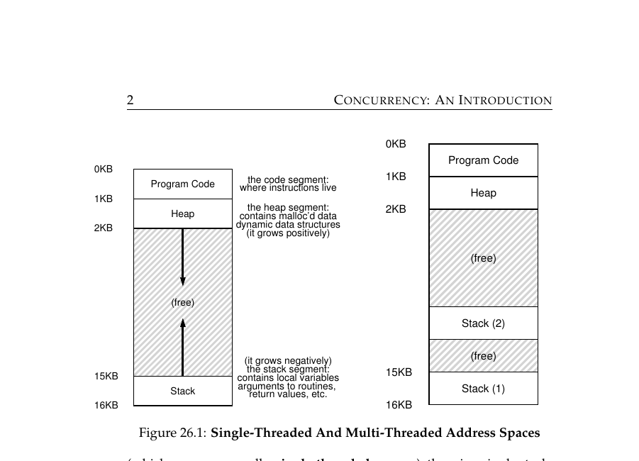
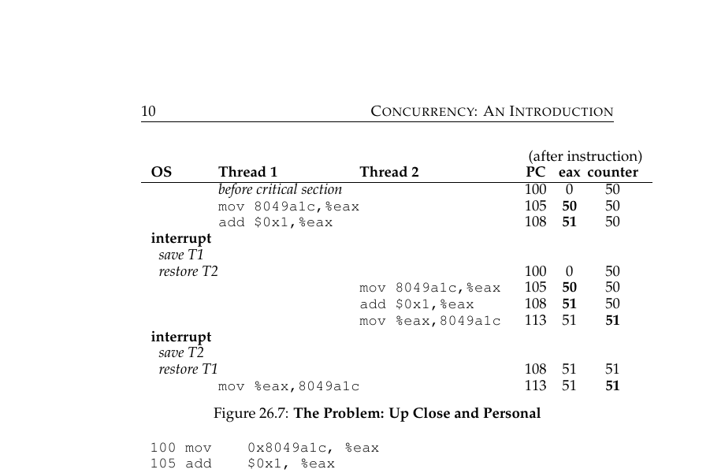
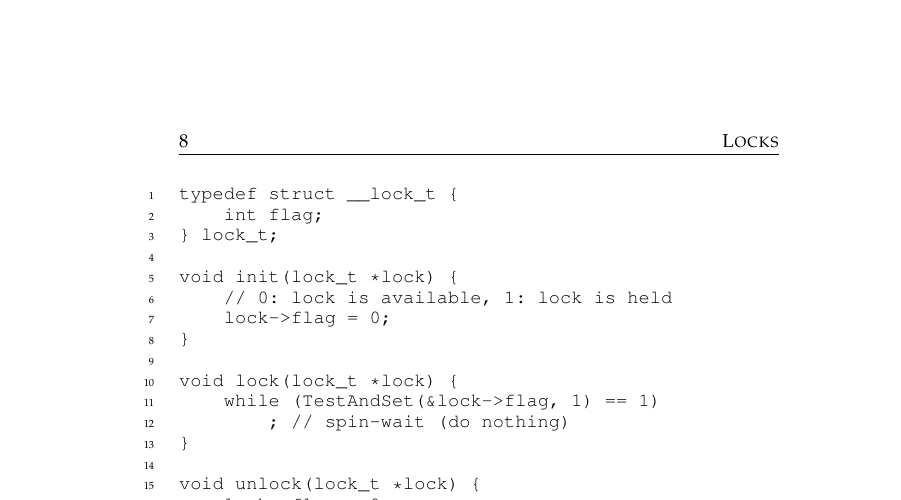
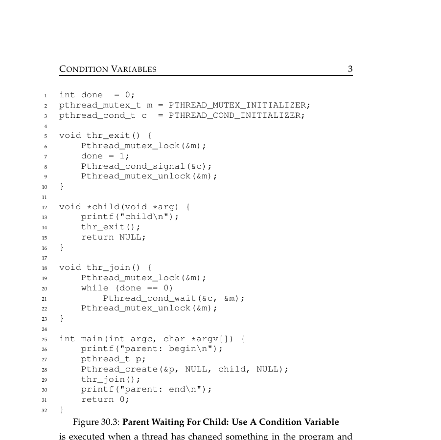
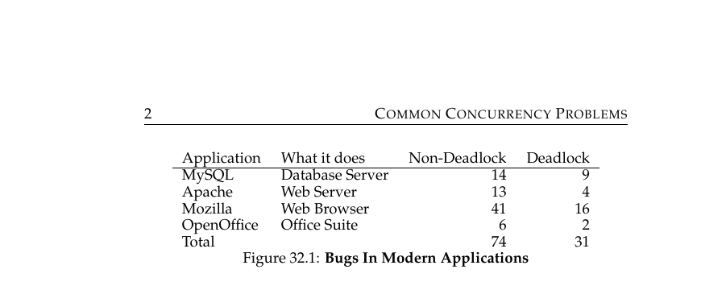
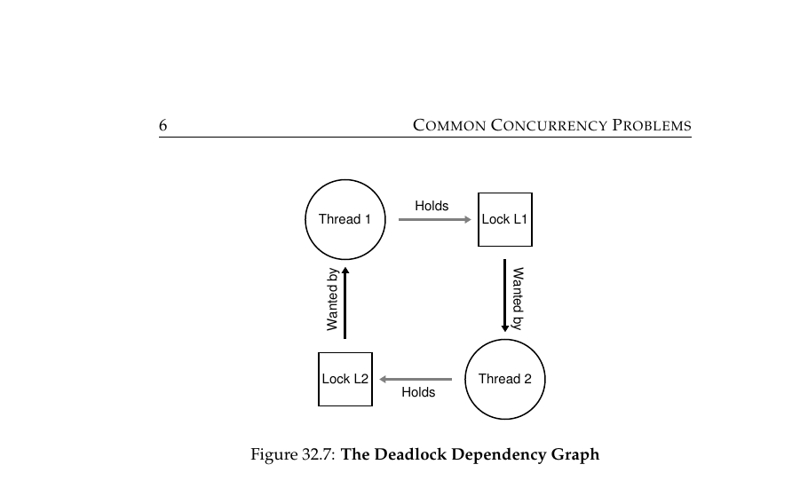

# OSTEP Part 3 — Concurrency

## The flow
1. **Problem:** get more work done by overlapping I/O and computation → run multiple concurrent execution paths inside one process.
2. **Solution:** threads — each gets its own stack, but shares code, heap, and global variables with the rest of the process.
3. **Break:** squeezing multiple stacks into one address space wrecks the clean single-stack layout a single-threaded process had.
4. **Break (the bigger one):** because threads share memory and run concurrently, their instructions can interleave unpredictably on shared data → race conditions (e.g. two threads incrementing a counter and losing an update).
5. **Solution:** mark the shared-data code as a critical section and enforce mutual exclusion — only one thread inside at a time.
6. **Break:** mutual exclusion needs an operation that can't itself be interrupted mid-way, or two threads can both think they got in.
7. **Solution:** build locks on a hardware primitive like test-and-set, which reads-and-sets in one atomic, uninterruptible step.
8. **Break:** the simplest lock built this way (a spinlock) makes a waiting thread burn 100% CPU in a busy loop instead of sleeping.
9. **Solution:** condition variables — a thread calls `wait()` to atomically release the lock and sleep until another thread calls `signal()`, no spinning.
10. **Break:** a single condition variable can wake the wrong kind of waiter (e.g. waking a producer when a consumer needed to run), stalling a bounded-buffer pipeline.
11. **Solution:** use two condition variables in producer/consumer — one for "buffer has space," one for "buffer has data."
12. **Break (different angle):** even with locks and CVs in place, most real-world concurrency bugs aren't deadlocks at all — they're atomicity violations, where a sequence assumed to be uninterruptible (check-then-use) actually isn't.
13. **Break (the scarier minority):** the bugs that are deadlocks come from using multiple locks — hold-and-wait plus circular wait among threads.
14. **Solution:** prevent deadlock by always acquiring locks in the same global order — and watch for hidden locks buried inside encapsulated library calls.

---

Q: What's the key difference between a thread's memory and a process's memory?
A: This is the building block the whole chapter's chain starts from: Threads inside the same process <b>share</b> code, heap, and global variables — but each thread gets its <b>own stack</b>.

Q: Why does adding threads "ruin" the clean address-space layout a single-threaded process has?
A: This is the first thing threads break: Instead of one stack growing down from the top, each thread needs its own stack squeezed somewhere into the address space.

Q: What is a "race condition" (data race)?
A: This is the deeper break threads cause — sharing memory across concurrent execution paths: A bug where the result of concurrent code depends on the timing/interleaving of threads — the same code can produce different outputs on different runs.

Q: Why can two threads incrementing the same shared counter lose an update?
A: A concrete case of that race: Reading, incrementing, and writing back a variable is <b>three separate CPU instructions</b>; a context switch between them lets both threads read the same stale value.

Q: What is a "critical section"?
A: The fix for races starts with naming the danger zone: A piece of code that accesses a shared resource and must not be run by more than one thread at the same time.

Q: What does "mutual exclusion" guarantee?
A: What a critical section actually needs enforced: If one thread is executing inside a critical section, all other threads are prevented from entering it.

Q: What is the simplest possible way to build a lock, and why is it "atomic"?
A: Enforcing mutual exclusion needs an atomic primitive underneath it: A <code>test-and-set</code> instruction that reads the old value and sets a new one in a single, uninterruptible hardware step.

Q: What does a thread do while a spinlock is held by someone else?
A: The simplest lock built on test-and-set has a cost: It "spins" — sits in a tight loop repeatedly checking the flag, burning CPU instead of sleeping.

Q: Why is test-and-set alone (without atomicity) not a valid lock?
A: Why you can't skip the atomicity: A regular read-then-write can be interrupted between the two steps, letting two threads both believe they acquired the lock.

Q: What real cost does a spinlock have that a smarter lock avoids?
A: Restating the break that motivates the next tool: Wasted CPU cycles — a spinning thread burns 100% CPU doing nothing useful while it waits.

Q: What problem do condition variables solve that a plain lock can't?
A: The solution to spinlocks' wasted cycles: Waiting for <b>some condition to become true</b> (e.g. "child thread finished") without burning CPU in a spin loop.

Q: What does calling `wait()` on a condition variable actually do?
A: How a condition variable actually avoids spinning: It atomically releases the lock and puts the calling thread to sleep; it re-acquires the lock before returning.

Q: What does calling `signal()` on a condition variable do?
A: The other half of the wait/signal pair: It wakes up one thread that's sleeping in `wait()` on that same condition variable.

Q: Why must you always re-check the condition in a `while` loop after `wait()`, not a single `if`?
A: A gotcha in using condition variables correctly: Because the thread can wake up and find the condition still false (e.g. another thread grabbed the resource first) — `while` re-checks; `if` doesn't.

Q: In the producer/consumer pattern, why do you need two separate condition variables instead of one?
A: Where a single condition variable breaks down: One CV signals "buffer has space" (for producers), the other signals "buffer has data" (for consumers) — using one CV can wake the wrong kind of thread and stall the pipeline.

Q: According to real-world bug studies, which class of concurrency bug is more common: deadlock or non-deadlock bugs?
A: Stepping back from CVs to real-world bug data: Non-deadlock bugs (atomicity and ordering violations) are the majority — deadlocks are the minority but far scarier.

Q: What is an "atomicity violation" bug?
A: The more common bug even with locks and CVs in place: A sequence of memory accesses that's assumed to be atomic (uninterruptible) but isn't — e.g. checking a pointer for non-null, then dereferencing it, with another thread free to nullify it in between.

Q: What are the four necessary conditions for deadlock?
A: The scarier minority bug, and what has to be true for it to happen: <b>Mutual exclusion</b> (locks are exclusive), <b>hold-and-wait</b> (holding one lock while waiting for another), <b>no preemption</b> (locks can't be forcibly taken away), <b>circular wait</b> (a cycle of threads each waiting on the next).

Q: What does a deadlock dependency graph cycle mean in practice?
A: A concrete picture of circular wait: Thread 1 holds Lock A and wants Lock B; Thread 2 holds Lock B and wants Lock A — neither can ever proceed.

Q: What's the simplest way to prevent lock-ordering deadlocks?
A: The fix for the chain's final break: Always acquire multiple locks in the same global order, everywhere in the codebase.

Q: Why do deadlocks often sneak in through encapsulation, even with careful developers?
A: A trap that undermines even careful lock ordering: A method like Java's `Vector.addAll()` acquires a lock internally — a caller holding another lock and calling it can create a hidden circular dependency without seeing any lock calls in their own code.

