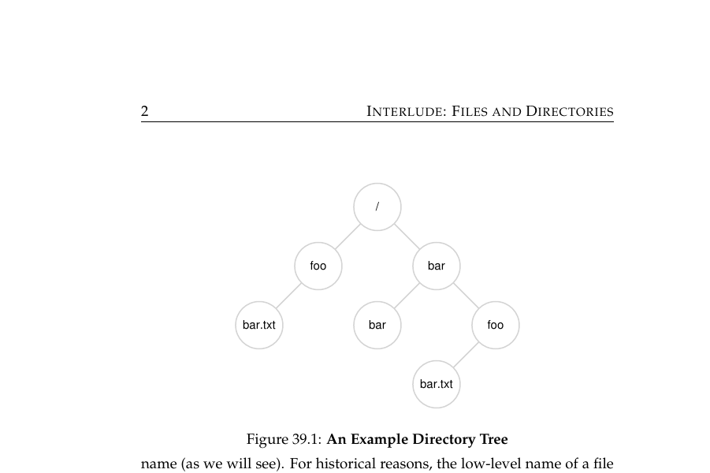
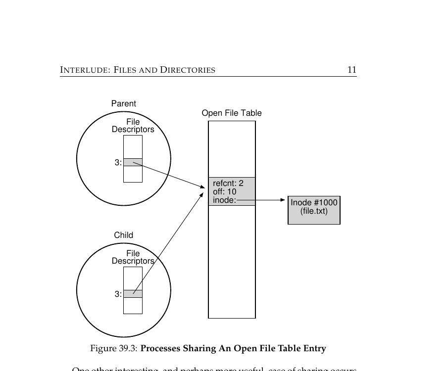
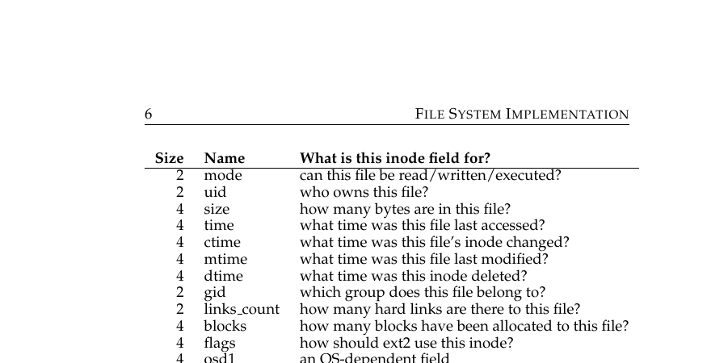
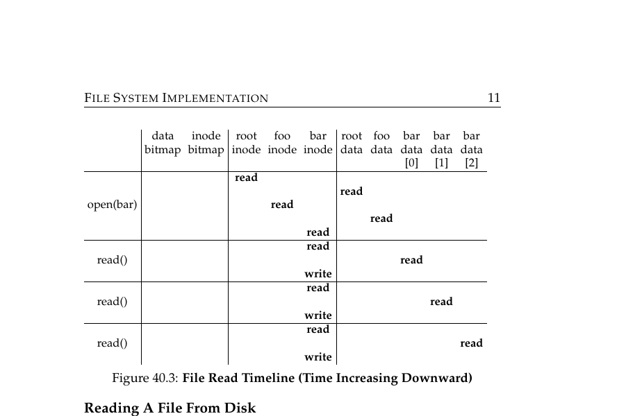
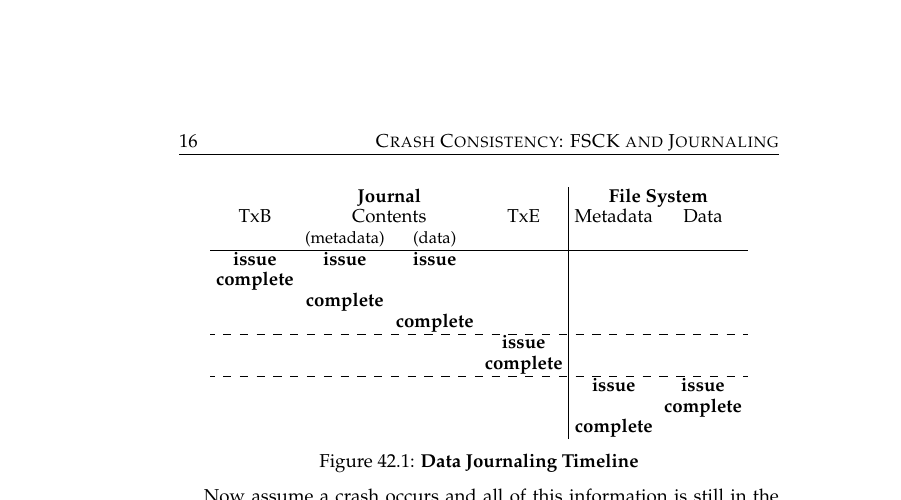

# OSTEP Part 4 — Persistence

---

Q: What does the OS's file system abstraction actually hide from you?
A: The physical layout of data on disk — you interact with logical names and byte offsets, never actual disk blocks.

Q: What is an inode number (i-number)?
A: The low-level, unique identifier the file system uses internally to refer to a file — separate from its human-readable name.

Q: What does a directory actually store?
A: A list of (human-readable name → inode number) pairs — nothing more.

Q: When a child process is forked, what does it inherit about its parent's open files?
A: The child shares the same <b>open file table entry</b> — including the current file offset — with the parent.

Q: What three things does an open file table entry track?
A: A reference count, the current file offset, and a pointer to the file's inode.

Q: What does the `dup()` system call do?
A: Creates a new file descriptor number that points to the <b>same</b> underlying open file table entry as an existing one — used for things like shell output redirection.

Q: What is an inode, in plain terms?
A: A per-file record on disk holding all its metadata (size, permissions, timestamps) plus pointers to where its actual data blocks live.

Q: Why can't an inode just store a fixed list of direct pointers to every data block for very large files?
A: A fixed number of direct pointers caps file size at (pointer count × block size) — too small for large files.

Q: What is an "indirect pointer" in an inode, and what does it solve?
A: A pointer to a block that itself holds hundreds more pointers to data blocks — letting a file grow far past what direct pointers alone could address.

Q: When you call `open("/foo/bar")`, why does the file system need to read multiple inodes before it can even start?
A: It must traverse the path component by component — reading the root inode, then foo's inode, then bar's inode — to resolve human-readable names into disk locations.

Q: Why is a single `read()` call on an already-open file usually cheaper than the initial `open()`?
A: `open()` pays the cost of path traversal (multiple inode/directory reads); a subsequent `read()` just reads the file's inode plus the specific data block.

Q: What's the "update problem" that makes file systems vulnerable to crashes mid-write?
A: A single logical file update often requires multiple separate disk writes (inode, bitmap, data block); a crash between those writes can leave the file system in an inconsistent state.

Q: What is the core idea behind write-ahead logging (journaling)?
A: Write the intended changes to a separate log first and mark it complete, then apply (checkpoint) those changes to their real on-disk locations — so a crash mid-update can be recovered by replaying the log.

Q: Why does a journaled file system recover instantly after a crash, instead of needing a full disk scan?
A: On reboot it only has to replay the journal — the log tells it exactly what was in-flight, without needing to scan the entire disk for inconsistencies (which is what the older `fsck` approach had to do).

