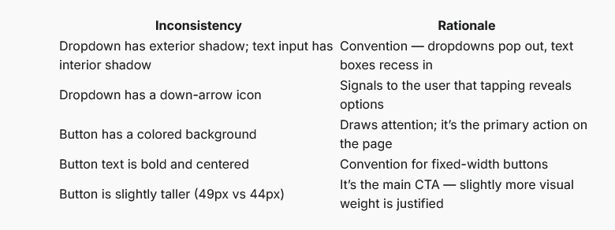

For lesson 02-fundamentals-of-ui-design/04-consistency

1. I've added topics in there => re-run vtt-to-notes to have a new note version
2. Re-extract screenshots with the updated skill
3. Create md.anki file
4. upload anki
5. publish the newer version of note for this lesson
6. this is the table on the page, looks off, add some formatting in this 
7. Commit and push in both repos: this learn-ui-desing repo and the blog repo
