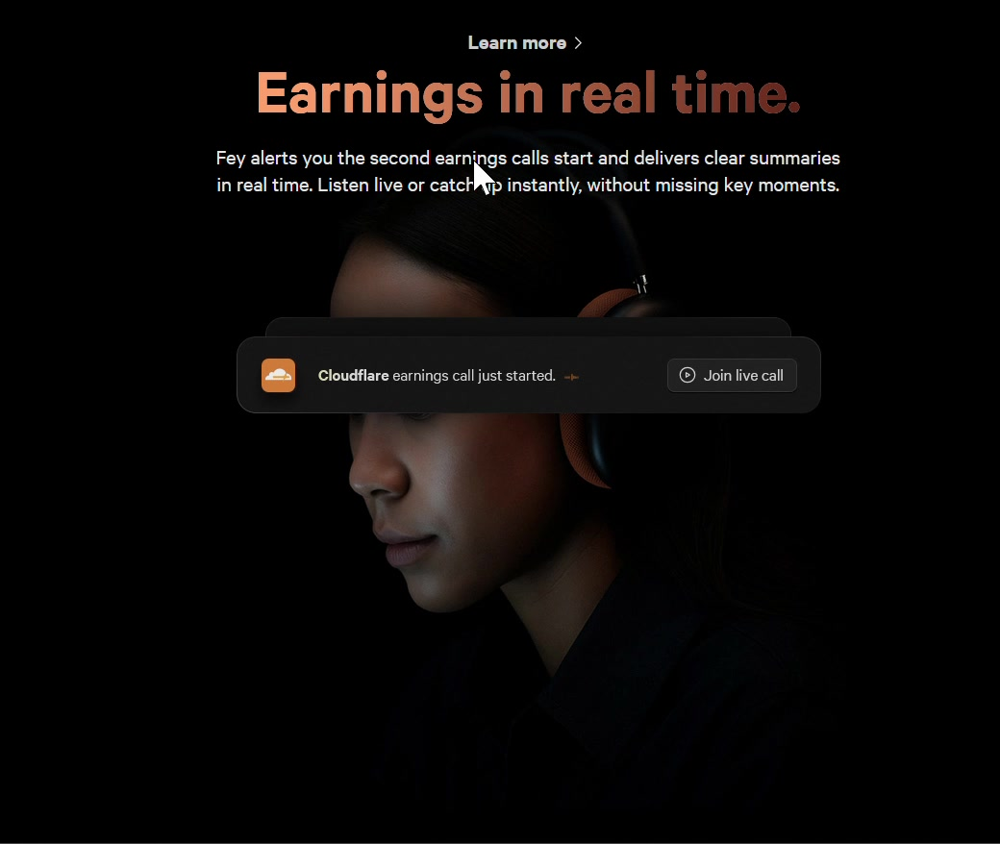
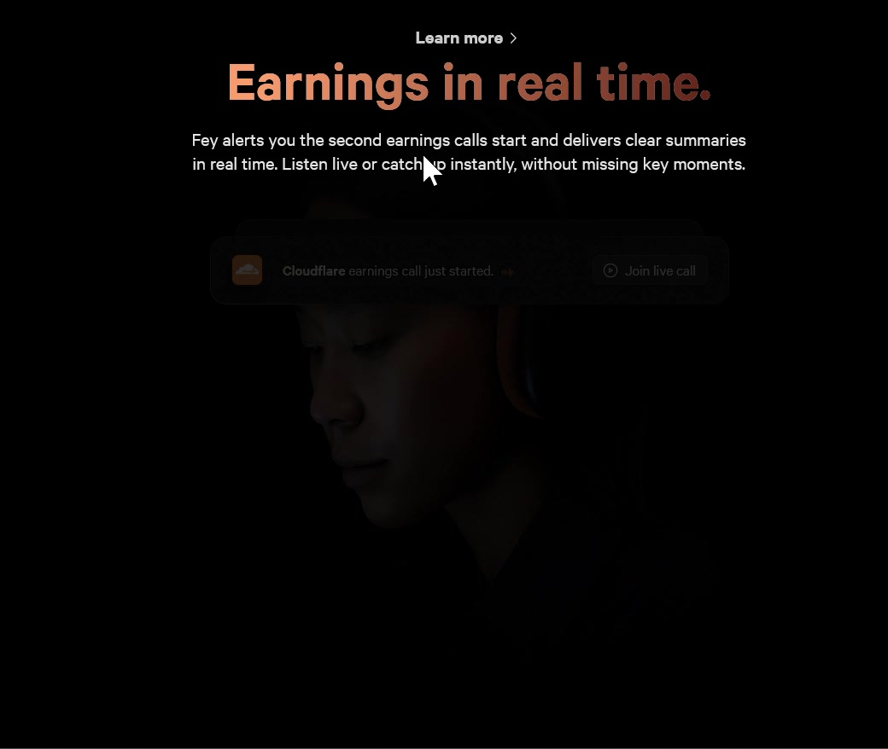
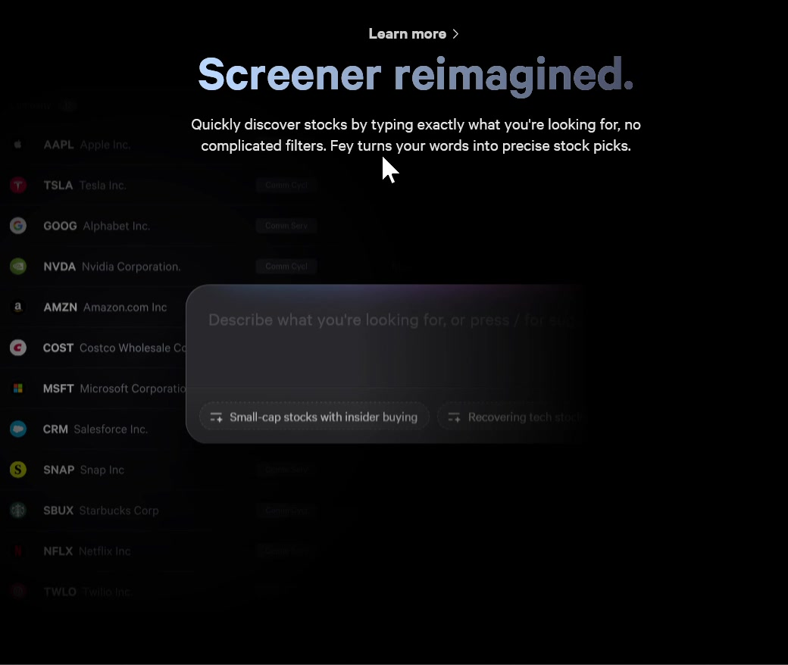
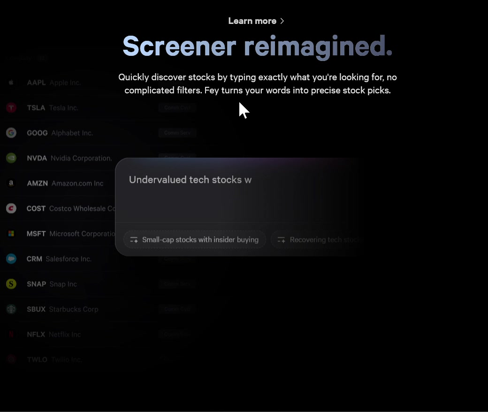
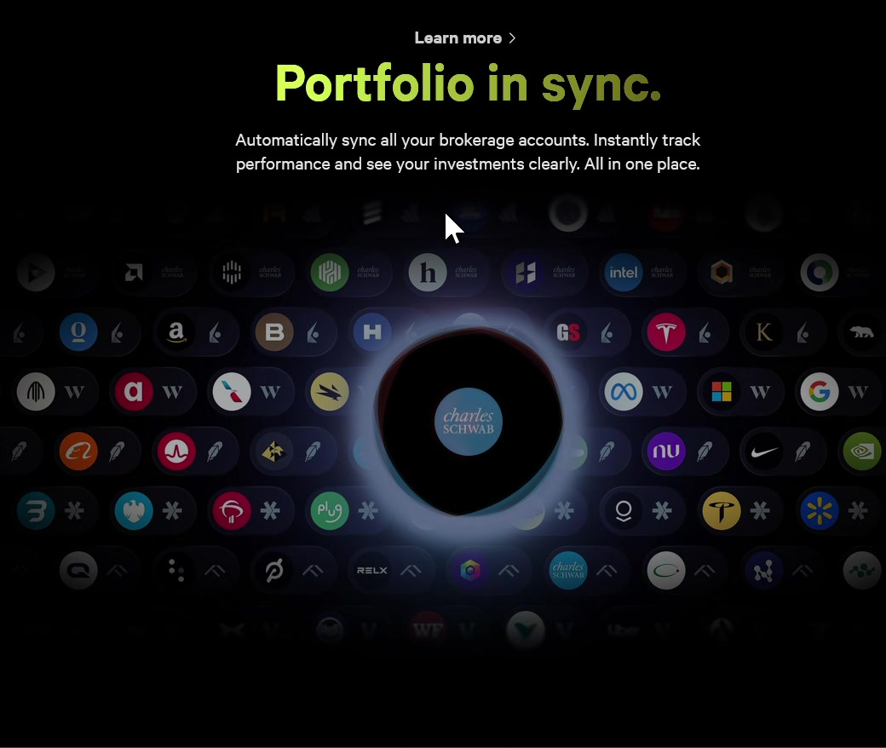
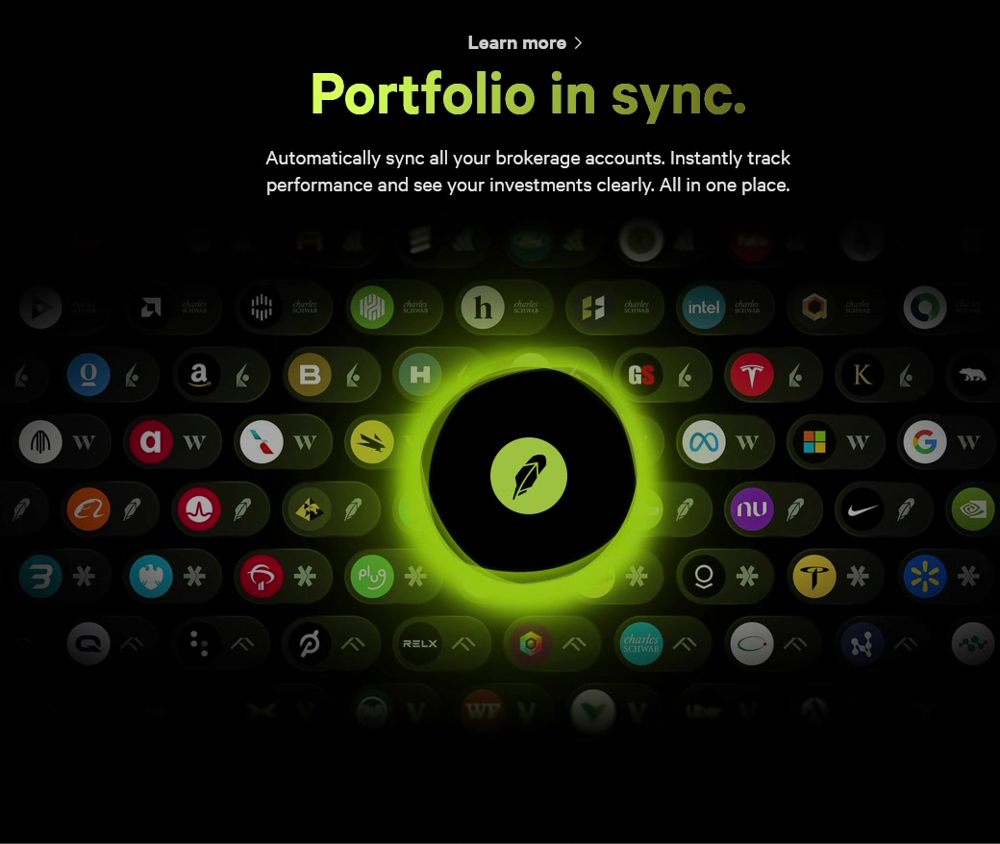

# Fey — Design Analysis

**Site:** [fey.com](https://fey.com)
**Type:** Stock portfolio / Finance SaaS landing page

---

## Scroll-Spy Pattern

The scroll-spy section uses a single scroll gesture to drive three different illustrations in sequence — no tabs, no clicks, just continuous momentum through the marketing story.

---

### Illustration 1 — Pull Up and Fade Out

> First thing I see is the scroll-spy pattern. As we scroll, the illustration is like pulled up and faded out.

The pull-up-and-fade is the classic **parallax exit**: the illustration moves faster than the scroll speed, creating depth as it disappears above the viewport. Fading while translating softens the cut — it feels like the content is being *swept away* rather than abruptly replaced. It primes the user for the next thing without jarring them.

**Pattern:** Multi-layer parallax exit

**Trick:** Give illustration, text, and foreground card each a different scroll speed + fade rate. Three layers moving at three speeds creates depth without any 3D CSS.

**Apply it:** Any hero-to-section transition where you want to avoid a hard cut. Works best when moving from an emotional visual (person, product shot) to a more functional section below.

---

### Illustration 2 — Frame-Swap Text Fill

> The second illustration — as pulled up, the text are typed and filled the sentence there. Not sure what the trick to do that here? Like as we pull they swap a new frame but very cool.

This is a **scroll-linked text reveal** — most likely implemented by snapping through pre-rendered frames (or CSS clip-path/mask) tied to scroll position. Each pixel of scroll maps to a new state of the sentence, making it feel like the text is being typed in real time. The illusion works because the rate of reveal matches human reading speed at a comfortable scroll pace — it feels responsive to *you*, not like a canned animation.

**Pattern:** Scroll-controlled frame swap

**Trick:** Pre-render N states of the UI, swap on scroll position. The user's scroll speed controls the playback rate — slow scroll = slow typing, fast scroll = instant fill. Feels like agency, not animation.

**Apply it:** Any product demo section where you want to show a sequence of states (form being filled, AI generating a response, data loading in). Better than autoplay because the user stays in control.

---

### Illustration 3 — Broker Carousel (Masterful)

> Last illustration is masterful — it's an interval to show what broker that they connect to. The color of the edge of the circle changes based on the main color of the logo of the shit. The background is carefully chosen to blend-in with the dark theme. The big title changes its brightness from very bright to very dark starting from left to right — pretty niche trick. Not sure what the purpose here. But these are sure well-thought out.

The broker carousel does three things at once. First, the **logo-matched ring color** is a subtle trust signal: it shows that Fey has a real, considered relationship with each broker — not a generic integration list. The accent color says "we know who these are." Second, the **background blending** keeps the dark base theme from fighting with each logo's color palette; the background shifts to complement rather than clash, which is why each state feels cohesive instead of garish. Third, the **left-to-right brightness gradient on the title** is likely a visual pacing cue — the eye reads from bright (high contrast) to dark (fading out), subtly directing attention leftward toward where the next interaction begins. It may also echo the feeling of a spotlight landing on whatever broker is currently active.

**Pattern:** Logo-sourced accent color

**Trick:** Pull the primary brand color from each partner's logo and apply it to the spotlight ring. Background subtly shifts to complement each state. Every broker gets its own color identity without breaking the dark theme.

**Apply it:** Any integrations or "works with" section. Instead of a static logo wall, spotlight each partner with its own color. Signals that you genuinely know your integrations — not just a checkbox grid.

---

## Overall

> These are sure well-thought out.

Fey's scroll-spy section is one of the more technically ambitious marketing sections you'll find on a SaaS landing page — each illustration does something mechanically different (exit, fill, cycle) while the scroll gesture ties them into a single unbroken experience. The care in the details — color-matched rings, tuned backgrounds, brightness gradients — signals that Fey is a product for people who care about precision. The design is doing the same thing the product does: making complex financial data feel polished and in control.
