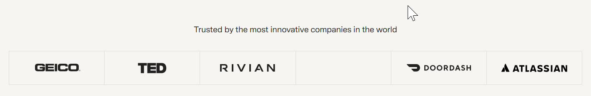
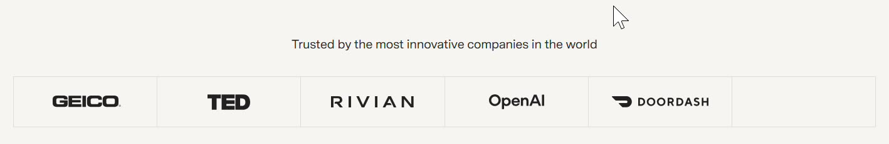
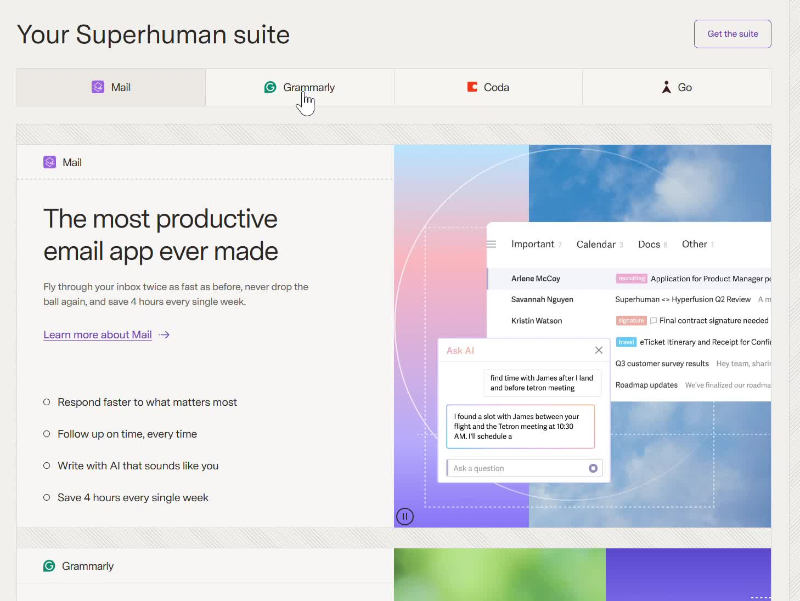
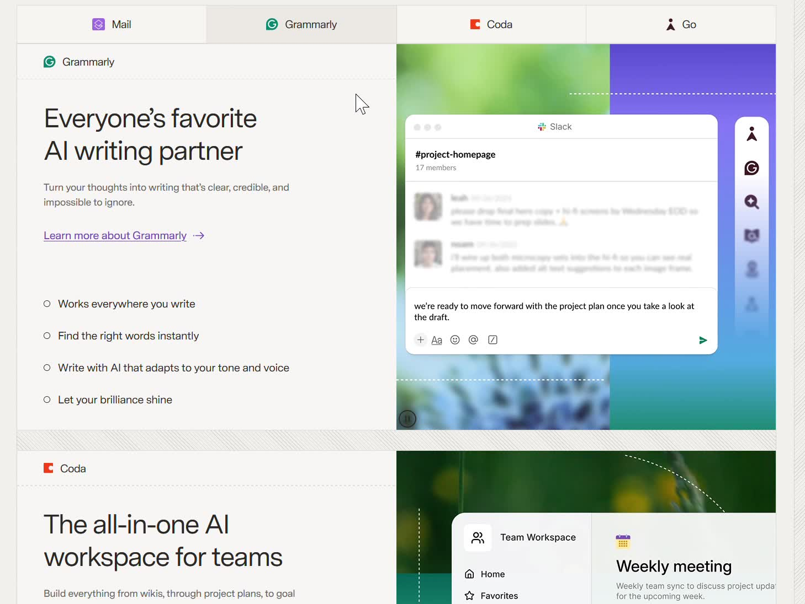
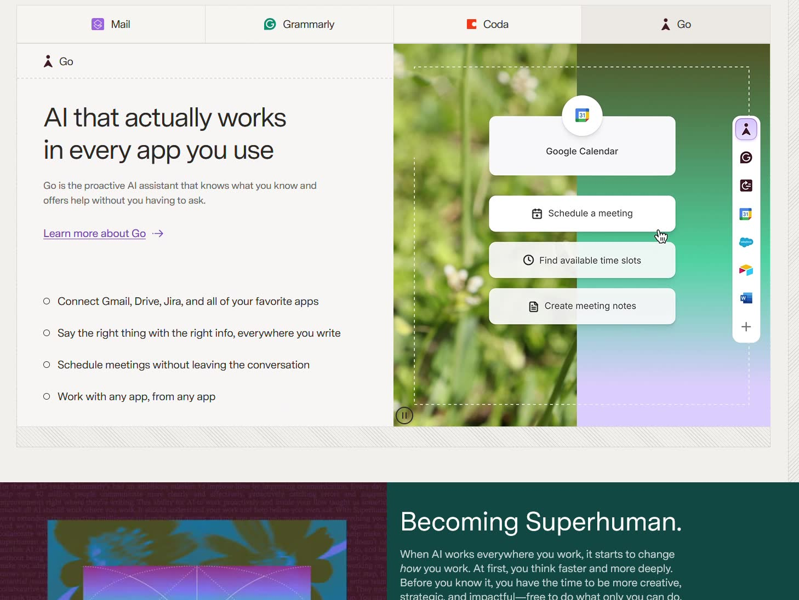

# Superhuman — Design Analysis

**Site:** [superhuman.com](https://superhuman.com)
**Type:** Productivity SaaS / Email & AI tools

---

## Logo Ticker — Fade-in-Place vs Marquee

> It's way better than the Marquee component often used for Reviews/Credits section. My eye is static and I dont like things that are moving — not a fan of too much motion, i have to catch things.

**Marquee moves content through space** — your eye has to physically track it like watching a car drive past. If you blink or look away, you missed something. It puts the burden on you to chase the content.

**Superhuman's version moves content in place** — the layout doesn't shift at all. Six logo slots stay fixed. Only the rightmost slot swaps, fading the outgoing logo to gray then fading the incoming one to full black. Your eye sits still and the change comes to you — a notification, not a chase.

There's also a confidence signal: a static layout feels settled. A scrolling marquee feels like it's nervously trying to fit more in. Fade-in-place says "we have enough credible names, we don't need to rush them past you."

**Pattern:** Minimum-motion signaling

**Trick:** Use the smallest possible animation to communicate change. For a logo ticker: fade-in-place instead of scrolling. For demos: animate inside a fixed frame so the layout stays still.

**Apply it:** Any section with repeated motion — logo tickers, testimonial carousels, feature demos. Ask: does this animation demand the user's attention, or just signal that something changed?

---

## Scroll-Synced Navigation (Scrollspy)

> Instead of tabs-like implementation, they use scroll-to-section technique. When we scroll to a section => the header is highlighted for that particular service. It's like a table of content on the left and when i scroll down to each section in the paragraph, the header title in the table of content is highlight. quite nice.

The technical name for this is **scrollspy** — the active tab tracks your scroll position and highlights to reflect where you are on the page. What makes it powerful is that it works in both directions: scroll down and the tab updates to tell you where you are; click a tab and it jumps you to that section. Most tab implementations only do the second. Scrollspy does both, so navigation feels like *reading*, not *operating a UI*.

The sticky tab bar is load-bearing here. Without it staying fixed at the top, the highlight change would be invisible — you'd have scrolled past the tabs long before reaching the section. Stickiness is what keeps the feedback visible at all times.

**Pattern:** Scrollspy navigation

**Trick:** Sticky tab bar that highlights the active section as scroll position changes. Works in both directions — scrolling updates the highlight, clicking a tab jumps to the section.

**Apply it:** Any long feature page with multiple distinct sections. Especially effective when sections are long enough that the user loses context of where they are in the page.

---

## Animated Product Demos (GIF-like Illustrations)

> combination of gif-like illustration, not static is nice, since this is a tool, and a short gif showing them the sequence of action on how to use is better than a static illustration. I also feels like a scrolling smoothness is very easy to feel.

**Static screenshots show what a tool looks like. Animation shows what it does.** For productivity software, the sequence of actions — type a prompt → AI responds → result appears — *is* the value proposition. A screenshot of an inbox is just an inbox. The animation shows the moment of magic.

Crucially, the motion is **contained** — it lives entirely inside the right-side demo box. The layout doesn't move. The tab bar doesn't move. The text doesn't move. The only thing animating is inside a bounded frame, so users who want to read can ignore it, and users who want to watch can focus on it. Motion that respects the reader's position rather than demanding their attention.

The consistent left-text / right-demo structure across all four products also creates the scrolling smoothness. Every new section is instantly readable — no reorientation needed. The eye already knows the layout before the content loads.

---

## Overall

> It's way better than the Marquee. I also feels like a scrolling smoothness is very easy to feel.

Superhuman's page is built around a single principle: **motion serves the user, not the design**. The logo ticker swaps in place rather than scrolling past. The product demos animate inside a box rather than across the screen. The scrollspy highlights rather than jumping. Every animation is the minimum needed to communicate the change — no more. The result is a page that feels fast and calm to scroll through, never anxious, never demanding.

