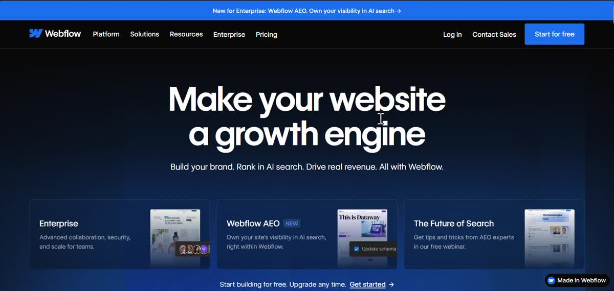
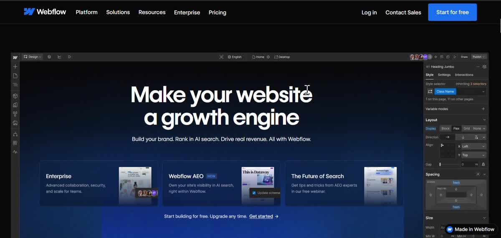
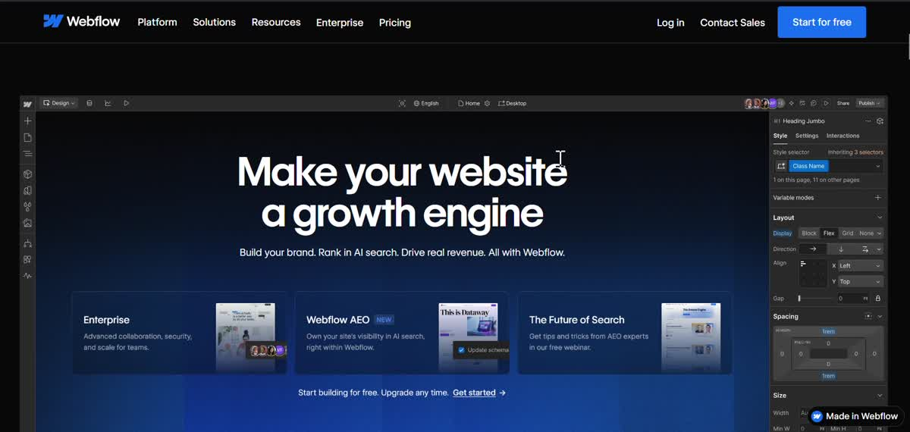
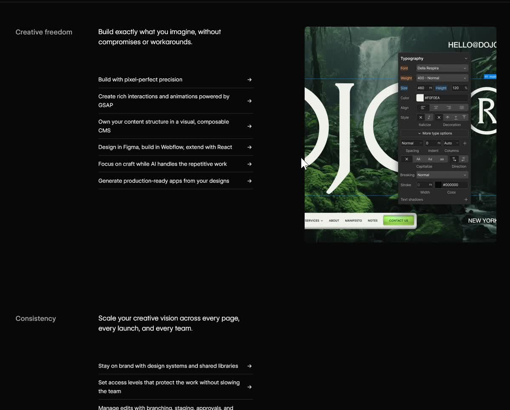
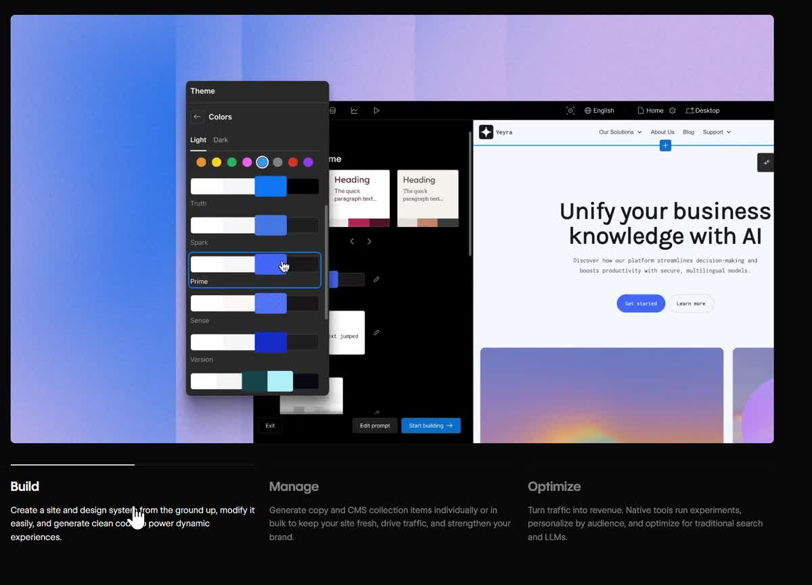
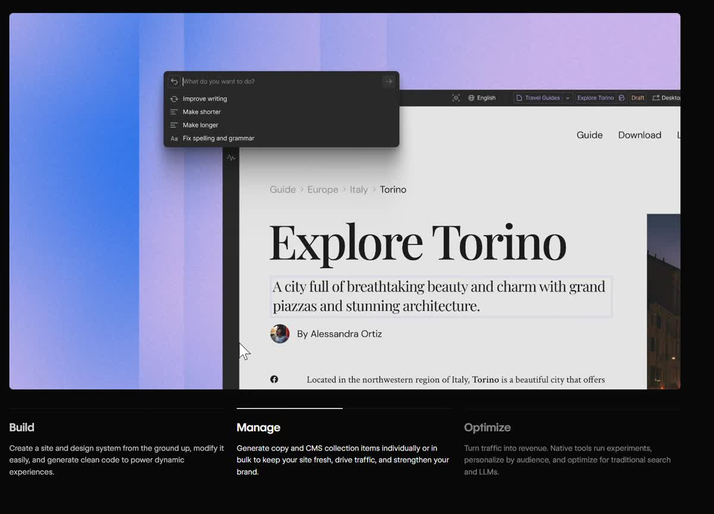
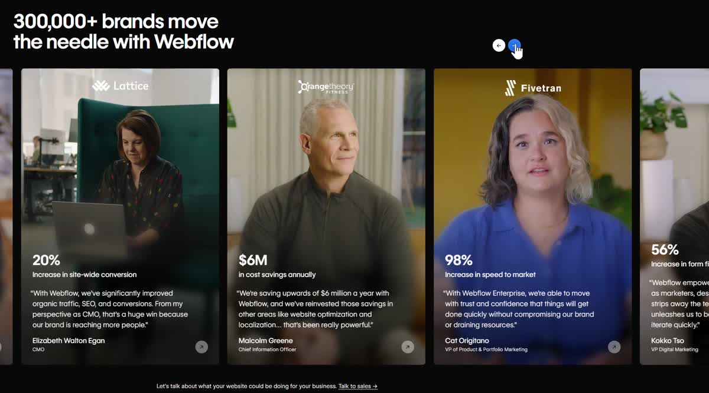
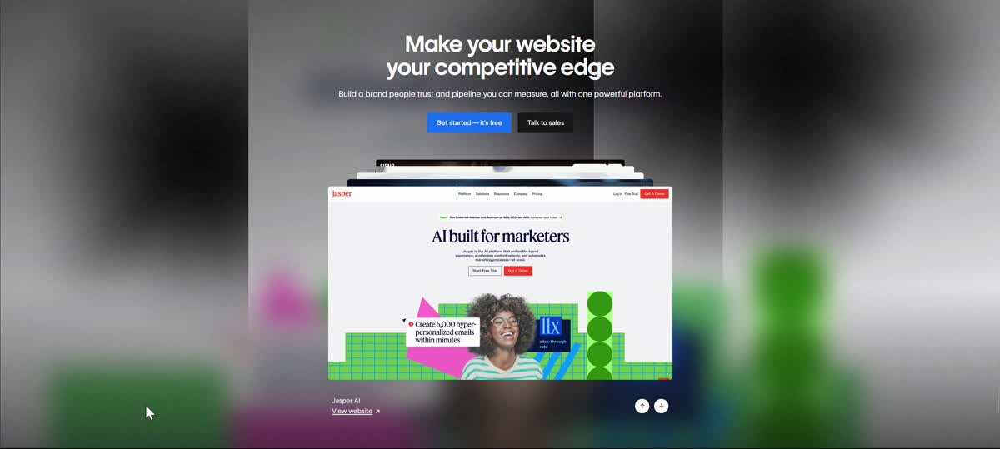

# Webflow — Design Analysis

**Site:** [webflow.com](https://webflow.com)
**Type:** No-code web builder SaaS

---

## Scroll-Driven Editor Reveal

> First thing I was impressed is the first section of the page, as I scroll down, the section turned into something like the workground of Webflow => showing a glimpse to the workground of webflow. This is so interactive and high-brand, just the feeling, this tool is crazy good, and different.

The hero doesn't just introduce the product — it **becomes** the product. As you scroll, the dark marketing hero dissolves into the Webflow designer interface, complete with the canvas, the left panel, and the right-side property inspector. You go from reading about it to feeling like you're inside it, without clicking anything.

This works because of the brand promise alignment: Webflow's value proposition is that the gap between design and code disappears. The animation enacts that collapse literally — the boundary between "the website about Webflow" and "Webflow itself" is made to dissolve on screen. It's not decoration. It's the argument.

The execution is expensive — it requires sticky scroll-pinning, precise layer compositing, and careful tuning to feel seamless rather than glitchy. That investment is visible, which is itself a brand signal: a tool that ships this says "we care about every detail of this craft."

> **Pattern:** When your hero *is* the product demo, let the scroll drive the transition. Show the tool in use, not just its marketing surface.

---

## Inline Select in Headline + Scrollspy

![Headline: "Everything [design teams ▼] love about Webflow" — dropdown embedded in prose](images/inline-select-2.jpg)

> The pattern of scrollspy, the illustration changes when we scroll is not new, I saw this in almanac, but the clever thing is the inline select input there, it fit so well and so natural. => 1 more thing make me feel like it's next level. the pattern of using inline select input can be reused in different places.

The scrollspy section below the hero uses the same **scrollspy** pattern seen in Almanac and Superhuman — the category tab updates to reflect your scroll position, and clicking a tab jumps you there. What's genuinely novel is the line above it: **"Everything [design teams ▼] love about Webflow"** — a dropdown embedded directly in the headline prose.

Switching the audience selector from "design teams" to "developers" or "marketers" presumably re-filters the scrollspy sections below, tailoring the feature tour to that persona. But the deeper move is syntactic: the selector sits *inside a sentence*, not in a separate filter row. It reads as natural language with a choice inside it. You feel like you're filling in a sentence, not operating a form control. That's the reusable insight — the moment a filter or dropdown can be written into a sentence instead of extracted to UI chrome, it feels dramatically more natural.

> **Pattern:** When a UI control can live inside prose syntax instead of adjacent chrome, embed it there. The interaction cost drops, the feel of control rises.

---

## Process Timer Illustration (Build → Manage → Optimize)

> Cool things about this is it's a process illustration. There is a timer for each step before go to another stage with the progress bar for each step and the repeat the cycle is real nice. it makes me feels everything is connected in the process, it's continuous, and it's a loop cycle => endless. feel so high-brand.

Three tabs at the bottom — **Build**, **Manage**, **Optimize** — each with a progress bar that fills over several seconds, then auto-advances to the next. When Optimize completes, it loops back to Build. The demo window above updates to show the product in action for each step.

Two things make this feel high-brand. First, the loop: there's no end state, which communicates that the product is a continuous workflow, not a one-time build. Second, the progress bar creates gentle urgency — you watch it fill and want to see what comes next. It holds attention without demanding it. Compared to a static illustration of the same three steps, the timed animation turns a feature list into a felt experience of the workflow.

> **Pattern:** For multi-step workflows, animate the transitions with a visible timer. It turns a diagram into a live demo and communicates "this is ongoing, not a one-time task."

---

## Video Credits Section

> The credits-section here is also nice. it's a combination of the videos, when i hover on the video running without sound, and it has a link to the detail page of the credit section. feel very complete and full-fledged, not sure the simple marquee component with name of the partners or success story.

A marquee of partner logos tells you the names. This section tells you the story. Each card is a **silent video** of a real person from the company — when you hover, it plays without sound. Below the person: a bold metric (20% conversion increase, $6M saved annually, 98% speed to market), a quote from a named executive, and a "View website →" link to the actual site built in Webflow.

The hover-to-play mechanic is the key decision. Autoplay across all cards would be visually chaotic. Hover-to-play means each card is dormant until you bring attention to it — the video rewards curiosity rather than demanding it. And linking to the real built site closes the loop: you go from hearing the testimonial to seeing the actual work. Most social proof sections stop at the quote. This one lets you verify the claim.

> **Pattern:** Testimonials with a verifiable output (the actual work) are more credible than testimonials alone. Give people a way to check.

---

## Cursor-Following Background Effect

> There are patterns I see that cursor following thing, like this, we have 2 black shadows following the cursor, or there are some bubles that will sparkle everywhere the cursor go. This is also a way to make the background less static and boring? In almanac we have a quite similar things with some touch and curves to the background.

A flat dark background is a *passive surface*. Your cursor moves across it and nothing responds. Cursor-following effects turn the background into an **ambient response layer**: the page acknowledges you before you've interacted with anything significant.

Webflow's implementation uses two large blurred color blobs (implemented with CSS radial gradients updated on mousemove) that lazily trail the cursor. The blobs create a sense of ambient light — as if a glow source is beneath the canvas following your hand. Bubble versions take this further: small particles spawn at the cursor and drift outward, making every move feel slightly celebrated.

What makes this especially right for Webflow is the brand promise: *"you can build living, dynamic, interactive things."* If the homepage itself is interactive before you've clicked anything, you believe the product before reading a feature. Almanac used the same principle with SVG blob shapes that breathe in the background. Both say: *this background is not wallpaper, it's a surface*.

> **Pattern:** Cursor-reactive backgrounds turn the hero from something to scroll past into somewhere to be. Reserve for high-craft contexts — done poorly it looks cheap; done well it communicates the product's capability through the medium itself.

---

## Overall

> I feel like this is next level. just the feeling, this tool is crazy good, and different.

Every interactive element on Webflow's homepage is a proof of capability. The scroll-reveal says "we can animate anything." The inline select says "we think about interfaces at the sentence level." The process loop says "our product has no finish line." The video credits say "here's the actual work, go check." The cursor background says "even our marketing site is a live demo." It's not a list of features — it's an experience designed to make you feel what the product can do before you've signed up.
