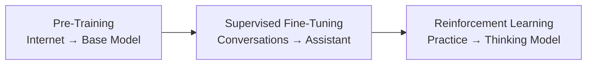
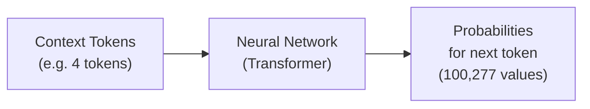
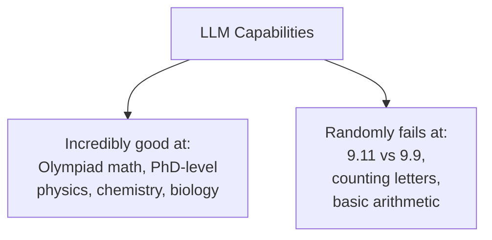
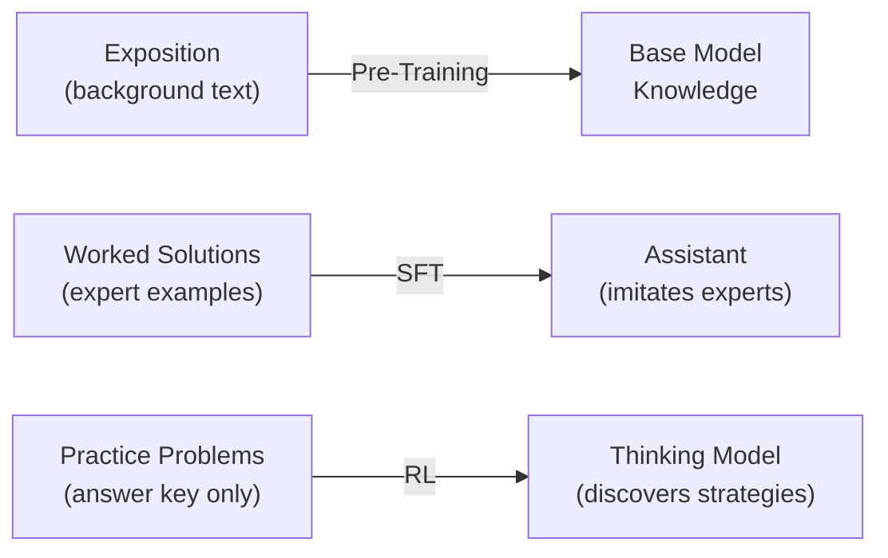
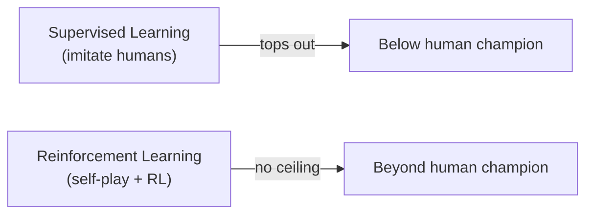
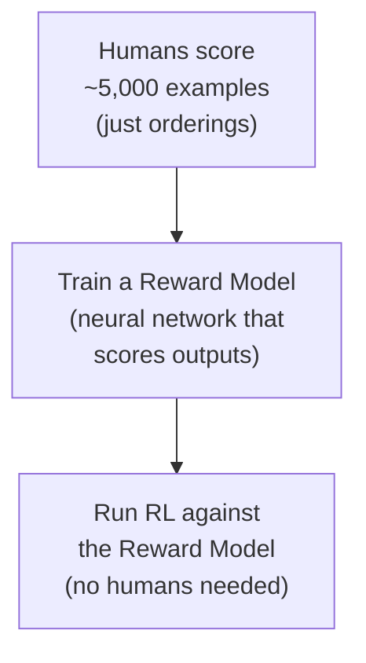

# Deep Dive into LLMs like ChatGPT

**Source:** YouTube — Andrej Karpathy  
**Video:** Deep Dive into LLMs like ChatGPT

---

## Introduction

> "Hi everyone, so I've wanted to make this video for a while. It is a comprehensive but general audience introduction to large language models like ChatGPT."

The goal: give you **mental models** for thinking through what this tool is. It is obviously magical and amazing in some respects. It's really good at some things, not very good at other things, and there's also a lot of **sharp edges** to be aware of.

> "So what is behind this text box? You can put anything in there and press enter. But what should we be putting there? And what are these words generated back? How does this work? And what are you talking to, exactly?"

The plan: go through the entire pipeline of how this stuff is built, keeping everything accessible to a general audience. Three major stages, arranged sequentially:

---

## Stage 1: Pre-Training

### Step 1: Download and Process the Internet

The first step of the pre-training stage is to **download and process the internet**.

A good public example: Hugging Face's **FineWeb** dataset. All major LLM providers (OpenAI, Anthropic, Google) have some equivalent internally.

The goal is to get:
- A **huge quantity** of very high quality documents
- **Very large diversity** of documents — because we want a lot of knowledge inside these models
- **Many, many** of them

Achieving this is quite complicated and takes multiple processing stages.

> "The fine web data set, which is fairly representative of what you would see in a production-grade application, actually ends up being only about 44 terabytes of disk space. You can get a USB stick for like a terabyte very easily, or I think this could fit on a single hard drive almost today."

Even though the internet is very very large, we're working with text and filtering it aggressively — so you end up with about 44 terabytes.

#### The FineWeb Processing Pipeline

Starting point: **Common Crawl** — an organization that has been scouring the internet since 2007. As of 2024, it has indexed **2.7 billion web pages**. Their crawlers start from a few seed pages, follow all links, and keep indexing.

Processing stages applied to Common Crawl data:

1. **URL Filtering** — block lists of domains you don't want: malware sites, spam, marketing, racist sites, adult sites, etc.
2. **Text Extraction** — raw HTML from crawlers has all the markup, CSS, etc. What we want is just the text, not the navigation and everything else. A lot of filtering and heuristics go into extracting just the good content.
3. **Language Filtering** — FineWeb uses a language classifier and only keeps web pages that are more than 65% English. This is a design decision — different companies take different stances on multilingual performance.

> "If we filter out all of the Spanish as an example, then you might imagine that our model later will not be very good at Spanish because it's just never seen that much data of that language."

4. **Deduplication** and other filtering steps
5. **PII Removal** — personally identifiable information: addresses, Social Security numbers, etc. You try to detect and filter those web pages out.

What's left looks like: an article about tornadoes in 2012, a medical article about adrenal glands, random web pages. Just think of these as web pages on the internet, filtered just for the text.

Result: **15 trillion tokens** in the FineWeb dataset.

### Step 2: Tokenization

Before feeding text into neural networks, you have to decide how to represent it. Neural networks expect a **one-dimensional sequence of symbols** from a **finite set** of possible symbols.

#### From text to bits to bytes to tokens

Raw text → UTF-8 encoding → raw bits (just zeros and ones, two possible symbols, very long sequences). But long sequences of just two symbols are inefficient.

**Trade-off:** more symbols in the vocabulary → shorter sequences.

- **Bytes:** Group 8 bits → 256 possible combinations (symbols). Sequences are 8× shorter. But can think of each byte as a unique emoji — there are 256 possible emojis.
- **Byte Pair Encoding (BPE):** Look for consecutive bytes that occur very frequently. Mint a new symbol for that pair (e.g., symbol ID 256), rewrite all occurrences, iterate. Each iteration: shorter sequences, bigger vocabulary.

In practice, a good vocabulary size is about **100,000 symbols**. GPT-4 uses exactly **100,277 tokens**.

> "This process of converting from raw text into these symbols — or as we call them, tokens — is the process called tokenization."

Good tool to explore: **Tiktokenizer** (tiktokenizer.vercel.app). Select "cl100k_base" for GPT-4.

Example: "Hello world" → two tokens: `hello` (ID 15339) and ` world` (ID 11917). Capital H is different. Two spaces between words gives a different tokenization. Case sensitive.

The model essentially sees a sequence like: `[62, 183, 4201, ...]` — just numbers. Think of them as unique IDs, not numbers.

### Step 3: Neural Network Training

Now we have a **15-trillion-token sequence**. We want to **model the statistical relationships** of how these tokens follow each other.

#### The training procedure

Take windows of tokens from the data. Window length can range from 0 up to some maximum (say 8,000 tokens for a practical model). Feed these tokens into the neural network as context. The output: a probability distribution over all 100,277 possible next tokens.

In the beginning, the network is **randomly initialized** → random predictions. But we know the correct next token from the data (that's the label). We calculate a loss, and do an update: nudge the parameters so the correct token gets slightly higher probability.

This happens simultaneously for all tokens in large batches. Repeat millions of times. The parameters slowly adjust until the model's predictions match the statistical patterns in the training data.

#### Neural Network Internals: The Transformer

Inside the neural network: inputs (token sequences) → sequence of mathematical transformations → output probabilities.

Parameters (weights): billions of numbers. In the beginning, randomly set. Think of them as knobs on a DJ set — twiddling the knobs gives different predictions for every possible input.

> "Training a neural network just means discovering a setting of parameters that seems to be consistent with the statistics of the training set."

The specific architecture used is called the **Transformer**. Information flows through:
- Token embeddings (each token gets a vector representation)
- Attention blocks
- MLP (multi-layer perceptron) blocks
- Layer norms, matrix multiplications, softmaxes

> "I would caution you not to think of it too much like neurons, because these are extremely simple neurons compared to the neurons you would find in your brain. Your biological neurons are very complex dynamical processes that have memory and so on — there's no memory in this expression. It's a fixed mathematical expression from input to output, with no memory, it's just stateless."

Still: you can loosely think of it as "a synthetic piece of brain tissue."

The important thing: it's a **mathematical function**, parameterized by a fixed set of parameters, transforming inputs into outputs.

#### Inference: Generating New Text

Once trained, inference works by:
1. Start with some prefix tokens
2. Feed into the network → get probability distribution
3. **Sample** from the distribution (flip a biased coin — more probable tokens are more likely to be picked)
4. Append the sampled token to the context
5. Repeat

> "These systems are stochastic. We're sampling and we're flipping coins. Sometimes we get a token stream that's very different from anything in the training documents. Statistically they will have similar properties but they are not identical to your training data — they're kind of like inspired by the training data."

Key distinction: **training** (parameters update) vs. **inference** (parameters fixed, just generating). When you use ChatGPT, the model was trained months ago by OpenAI. All of that is inference — no more training.

### GPT-2 as a Concrete Example

**GPT-2** (2019, OpenAI) — the first recognizably modern stack. All the pieces are recognizable today by modern standards; it's just everything has gotten bigger.

| Property | GPT-2 (2019) | Modern (2025) |
|---|---|---|
| Parameters | 1.6 billion | Hundreds of billions to ~1 trillion |
| Context length | 1,024 tokens | Hundreds of thousands to ~1 million |
| Training tokens | ~100 billion | ~15 trillion (FineWeb) |

> "The reason I like GPT-2 is that it is the first time that a recognizably modern stack came together."

Karpathy reproduced GPT-2 for fun (lm.c project on GitHub). Cost in 2019: ~$40,000. Today: ~$600 in one day. With more effort: possibly down to ~$100.

Why cheaper? Better datasets, refined preprocessing — but really the biggest difference is **hardware** (much faster GPUs) and **software** (better at squeezing performance out of hardware).

#### What Training Actually Looks Like

Watching the training loop as a researcher:
- Each line = one update to the model (improving prediction on ~1 million tokens simultaneously)
- Watch the **loss** number — lower is better
- Every 20 steps: run inference to see what the model generates

At step 1 (20 updates): completely random gibberish text.  
At 1% through training: slight local coherence, still mostly gibberish.  
After full training (~32,000 steps, ~1 day): fairly coherent English.

> "So you're twiddling your thumbs, drinking coffee, and making sure that this looks good."

### The Compute Side: GPUs

Training happens on cloud GPUs, not laptops.

- **GPU of choice:** Nvidia H100
- **Single node:** 8× H100s
- **Cost:** ~$3 per GPU per hour (Lambda Labs)
- Stack up 8 GPUs → single node → many nodes → entire data center

Why Nvidia's stock price is $3.4 trillion:

> "All of these GPUs are just trying to predict the next token in the sequence and improve the network by doing so."

This is the **Gold Rush**: companies racing to get enough GPUs to collaborate on this optimization. The more GPUs, the more tokens you can process, the bigger the network you can train, the faster you can iterate.

A recent article: Elon Musk getting 100,000 GPUs in a single data center — all just trying to predict the next token.

### The Base Model

The model that comes out at the end of pre-training is called a **base model**. What is it?

> "It's a token simulator. It's an internet text token simulator."

It's not an assistant — it won't answer questions. It just creates remixes of the internet. It **dreams internet pages**.

A **model release** contains two things:
1. **Python code** — describes the sequence of operations (the Transformer architecture). Usually just a few hundred lines. Fairly standard.
2. **Parameters** — the actual value. A list of 1.5 billion numbers (in GPT-2's case) — the precise setting of all the knobs such that the tokens come out well.

**Llama 3** (Meta): 405 billion parameters, trained on 15 trillion tokens. Much bigger, much more modern. Available as a base model at **hyperbolic.xyz**.

#### Playing with a Base Model (Llama 3.1 405B)

Key behaviors to understand:

**It is NOT an assistant.** Ask "What is 2+2?" → it won't say "4, what else can I help you with?" It just autocompletes the tokens.

> "It's just a glorified autocomplete. A very, very expensive autocomplete of what comes next, depending on the statistics of what it saw in its training documents, which are basically web pages."

**It is stochastic.** Same prefix → different answer every time. We're sampling from a probability distribution.

**It can regurgitate memorized text.** Copy the first sentence of the Wikipedia entry for "zebra" → the model will recite the entire article almost perfectly, because it has seen Wikipedia many many times (maybe ~10 epochs on high-quality sources).

**It has a knowledge cutoff.** Llama 3's data ends at 2023. Give it tokens from after its cutoff → it will hallucinate. Example: ask about the 2024 election outcome → one run says Mike Pence was VP pick, ran against Hillary Clinton. Another run says Ron DeSantis was VP pick, ran against Biden/Harris. All of this:

> "...is what's called hallucination. The model is just taking its best guess in a probabilistic manner."

**It has implicit world knowledge.** Even though the base model is not an assistant, it has stored a huge amount of knowledge in its parameters. Prompt: "Here's my top 10 list of the top landmarks to see in Paris:" → it continues the list with reasonable landmarks. The knowledge is vague, probabilistic, statistical — things that occur often are more likely to be remembered correctly.

> "You can think of the 405 billion parameters as a kind of compression of the internet. Like a zip file — but it's not a lossless compression, it's a lossy compression. We're kind of left with kind of a gestalt of the internet."

**Few-shot prompting works.** Give it 10 English→Korean translation pairs, then "teacher:" → it continues with the correct translation. **In-context learning**: the model reads the pattern in the context and learns in place to continue it.

**You can fake an assistant with prompting.** Construct a prompt that looks like a web page with a conversation between a helpful AI assistant and a human, give it a few example turns, then append your actual question. The model will continue the pattern in that role. (This is how you can build apps from a base model.)

---

## Stage 2: Post-Training — Supervised Fine-Tuning (SFT)

The base model is an internet document simulator. We need an **assistant** — something that answers questions. This is the post-training stage.

> "We take our base model, our internet document simulator, and hand it off to post-training."

The cost comparison:
- **Pre-training:** months of training on thousands of computers, millions of dollars
- **Post-training:** algorithmically identical, but the dataset is much smaller — can take as little as 3 hours

The only change: **swap out the dataset** from internet documents to a curated dataset of conversations.

### Tokenizing Conversations

Conversations are structured objects. They need to be encoded into one-dimensional token sequences.

GPT-4's format uses special tokens: `<|im_start|>` (imaginary monologue start), role (`user`, `assistant`), `<|im_sep|>` (separator), content, `<|im_end|>`. A simple 2-turn conversation ends up being ~49 tokens.

> "I don't actually know why it's called 'imaginary monologue,' to be honest."

These special tokens are **new tokens** introduced in the post-training stage — they were never in pre-training data.

During inference on ChatGPT: the server constructs the token sequence with your query, appends `<|im_start|>assistant<|im_sep|>`, and then lets the model sample — that's how the response is generated.

### Where the Conversation Data Comes From

First major effort: **InstructGPT** paper (OpenAI, 2022). Human contractors hired through Upwork or Scale AI. Their job: come up with prompts, then write the ideal assistant response.

Prompts that labelers came up with: "List five ideas for how to regain enthusiasm for my career." "What are the top 10 science fiction books I should read?" "Translate this sentence to Spanish."

Labelers follow **labeling instructions** — documents written by the company (OpenAI, etc.) that describe how the ideal assistant should behave. High level: be helpful, truthful, harmless. In practice, these instructions are **hundreds of pages long** and labelers study them professionally.

> "So roughly speaking the company comes up with the labeling instructions — usually they are not this short, usually there are hundreds of pages — and people have to study them professionally and then they write out the ideal assistant responses following those labeling instructions. This is a very human-heavy process."

Open-source example: **Open Assistant** — people on the internet creating these conversations similarly. Someone writes "Can you write a short introduction to the relevance of the term 'monopoly' in economics?" and another person writes the ideal response.

### The Modern Stack: LLMs Helping Build LLM Datasets

Since InstructGPT (2019–2022), the state of the art has advanced. Humans rarely write responses fully from scratch anymore. LLMs are used extensively to:
- Generate draft responses that humans then edit
- Create conversations synthetically

Example: **UltraChat** — mostly synthetic, millions of conversations across diverse topics.

> "It's all kind of like constructed in different ways... the only thing I want to show you is that these data sets have now millions of conversations, these conversations are mostly synthetic but they're probably edited to some extent by humans."

### What You're Actually Talking to on ChatGPT

> "It's not coming from some magical AI. Roughly speaking, it's coming from something that is statistically imitating human labelers, which comes from labeling instructions written by these companies. So you're kind of getting — it's almost as if you're asking a human labeler."

The human labelers are not random people from the internet — companies hire experts. For code questions, the labelers involved in creating those conversations are usually educated, expert people.

> "So you're not talking to a magical AI. You're talking to an average labeler. This average labeler is probably fairly highly skilled, but you're talking to kind of like an instantaneous simulation of that kind of person."

When you ask ChatGPT for the top 5 landmarks in Paris: you're getting a statistical simulation of a labeler hired by OpenAI who read their labeling instructions, spent ~20 minutes researching, and wrote a list.

---

## LLM Psychology

### Hallucinations

Models make stuff up. Why?

Training data example:
- "Who is Tom Cruise?" → confident, correct answer
- "Who is John Barrasso?" → confident, correct answer (he's a senator)

The format: questions of the form "Who is [X]?" are confidently answered with correct information. So the model has learned that *this question format deserves a confident answer*. When you ask about a totally made-up name like "Orson Kovats":

> "The assistant will not just tell you 'oh, I don't know' — even if some part of the network kind of knows that in some sense... because statistically, the questions of the form 'who is blah' are confidently answered with the correct answer."

Demo with **Falcon 7B** (older model): "Who is Orson Kovats?" → Run 1: "He's an American author and science fiction writer." Run 2: "He's a fictional character from a 1950s TV show." Run 3: "He's a former minor league baseball player." Complete nonsense, different each time.

> "These are statistical token tumblers. [The model] is just trying to sample the next token in the sequence."

#### Mitigation 1: Teach the Model to Say "I Don't Know"

Meta's approach for Llama 3: **interrogate the model** to find the boundary of its knowledge.

Process:
1. Take a random document from the training set
2. Use an LLM to generate factual questions about that document (plus correct answers)
3. Ask your model those questions 3–5 times
4. If the model consistently gets the right answer → it knows. If not → it doesn't know.
5. For questions it doesn't know: add a conversation to the training set where the correct response is "I'm sorry, I don't know / I don't remember."

> "If you just have a few examples of that in your training set, the model will know and has the opportunity to learn the association of this knowledge-based refusal to this internal neuron somewhere in its network that we presume exists — and empirically this turns out to probably be the case."

#### Mitigation 2: Tool Use — Web Search

Teach the model to emit special tokens that trigger a web search:
- Model emits `<search_start>` + query + `<search_end>`
- The inference program pauses, queries Bing/Google, gets results
- Results are pasted into the context window as text
- Model resumes generating, now with direct access to that information

> "Think of the knowledge inside the neural network inside its billions of parameters as kind of a vague recollection of the things that the model has seen during its training — like something you read a month ago. But what you and I do is we just go and look it up."

This is taught through training data: conversations that show the model, by example, when and how to use web search.

**Critical psychology point:**

> "Knowledge in the parameters of the neural network is a vague recollection. The knowledge in the tokens that make up the context window is the working memory."

Practical implication: if you want the model to reason about a specific document, paste it in. Don't ask it to recall — give it to the model directly. A summary of Chapter 1 of Pride and Prejudice will be higher quality if you paste in the text than if you just ask the model to remember it.

### Self-Knowledge

People often ask LLMs: "What model are you? Who built you?"

> "This question is a little bit nonsensical and the reason I say that is that this thing is not a person. It doesn't have a persistent existence in any way. It sort of boots up, processes tokens, and shuts off. It does that for every single person — it just kind of builds up a context window of conversation and then everything gets deleted."

If you don't explicitly program the model to answer these questions, you get its statistical best guess. Falcon (old model) example: claims it was "built by OpenAI based on the GPT-3 model." Not necessarily true — just its best guess, because ChatGPT is extremely prominent in the pre-training data.

Solutions:
1. **Hardcoded conversations in SFT data** — e.g., 240 conversations: "Tell me about yourself" → "I'm OLMo, an open language model developed by Allen AI..." (seen in the OLMo model)
2. **System message** — a hidden message prepended to every conversation at inference time, reminding the model of its identity

> "It's all just kind of like cooked up and bolted on in some way. It's not actually like really deeply there in any real sense, as it would be for a human."

### Models Need Tokens to Think

**Key insight:** There is only a finite, fixed amount of computation that happens per token. Think of the Transformer layers — say 100 layers — that transform the previous token sequence into probabilities for the next token. This is not a lot of computation.

**Implication:** You can't have too much computation or reasoning happening in any single token. You have to **distribute computation across many tokens**.

Bad answer format for the math problem "Emily buys 3 apples and 2 oranges...":
> "The answer is $3."

This asks the model to cram all the arithmetic into a single forward pass at the moment it emits "3." It can't.

Good answer format:
> "The total cost of oranges is $4. So $13 - $4 = $9. Dividing by 3 apples, each apple costs $3."

This distributes computation. Each intermediate step is a small, manageable computation. Each result enters the context window for subsequent steps.

> "These intermediate results are not for you — these are for the model. If the model is not creating these intermediate results for itself, it's not going to be able to reach three."

Karpathy demonstrated: give the model a version with bigger numbers and tell it to answer in a single token → it gets the wrong answer. Tell it to show its work → it gets it right.

When possible: **use tools instead of mental arithmetic**. Ask the model to write Python code and run it. The Python interpreter does the computation, not the model's mental arithmetic.

### Counting and Spelling Failures

**Counting:** Models are bad at counting. Why? Same reason — counting requires work that can't fit in a single token. The model sees groups of dots as tokens, not as individual dots. It's expected to count in a single forward pass.

Fix: say "use code." The model copy-pastes the input into a Python string and calls `str.count()`. The interpreter counts. The model just does the easy copy-paste.

**Spelling:** Models don't see characters — they see tokens. "ubiquitous" = 3 tokens. The model has to figure out individual letters from those token IDs. Very simple character-level tasks often fail.

Famous example: **How many R's in "strawberry"?**

> "Models would insist that there are only two R's in strawberry. This caused a lot of ruckus because: why are the models so brilliant and they can solve Math Olympiad questions but they can't count R's in strawberry?"

Answer: the model doesn't see characters, it sees tokens. And it's bad at counting. Combining two weaknesses simultaneously.

Fix: say "use code." The model copy-pastes "strawberry" into Python and calls `.count('r')`.

### The Swiss Cheese Model of LLM Capabilities

Example: "Which is bigger, 9.11 or 9.9?" — the model often says 9.11 and justifies it incorrectly.

Research finding: neurons inside the network that are usually associated with **Bible verse notation** light up for this prompt. In Bible verses, 9:11 would indeed come after 9:9 (chapter:verse). The model is somehow cognitively distracted by this.

> "It's not fully understood. There's a few jagged issues like that. So treat this as what it is: a stochastic system that is really magical, but that you can't also fully trust."

**The right mental model:** Swiss cheese. Incredibly capable across an enormous surface area, but with unpredictable holes. Don't letter-rip on a problem and copy-paste the results. Use as a tool, check the work.

---

## Stage 3: Reinforcement Learning (RL)

### Motivation: The Textbook Analogy

In a textbook:
- **Exposition** = background knowledge → equivalent to pre-training (reading the text, building a knowledge base)
- **Worked solutions** = expert shows how to solve problems → equivalent to SFT (imitate the expert's solutions)
- **Practice problems** (answer only, no solution given) = you practice, discover your own methods → equivalent to RL

> "Practice problems are critical for learning because they're getting you to practice and discover ways of solving these problems yourself. You know the final answer but you don't have the solution."

### Why SFT Isn't Enough

When creating conversation training data for math problems, the human labeler writes a solution. But:

> "Fundamentally, we don't know which solution is best for the LLM. What is easy for you or I as human labelers — what's easy for us or hard for us — is different than what's easy or hard for the LLM. Its cognition is different."

Human labelers might:
- Write intermediate steps that are too big for the model to replicate
- Write steps that are trivially easy for the model and waste tokens
- Miss strategies that work well for the model's specific compute budget per token

> "We are not in a good position to create these token sequences for the LLM. They're useful by imitation to initialize the system, but we really want the LLM to discover the token sequences that work for it — it needs to find for itself what token sequence reliably gets to the answer given the prompt."

### How RL Works for LLMs

For a verifiable problem (math, code — where there's a checkable answer):

1. Take a prompt
2. Sample **many different solutions** from the model (the model is stochastic, so each run gives a different attempt)
3. Check each solution against the correct answer (e.g., answer = 3)
4. Mark solutions as correct (green) or incorrect (red)
5. **Train on the correct solutions** — nudge the model toward the token sequences that led to right answers

> "The model is practicing here. It's tried out a few solutions, four of them seem to have worked, and now the model will kind of like train on them. This corresponds to a student basically looking at their solutions and being like, 'okay, this one worked really well, so this is how I should be solving these kinds of problems.'"

No human annotator decides which solution is correct — the **correct answer** does that automatically.

Repeat across tens of thousands of diverse prompts. The model discovers, for itself, which kinds of token sequences reliably reach correct answers.

### DeepSeek R1: RL in Practice

The **DeepSeek R1 paper** (from Deepseek/DC Kai, China) was a big deal because it publicly revealed details about RL fine-tuning for LLMs — something companies like OpenAI had been doing internally but not discussing publicly.

Key finding from DeepSeek R1: As you update the model with RL over thousands of steps, accuracy on math problems continues to climb. But also: **response length grows**. The model learns to use more tokens.

What those longer responses look like:

> "'Wait, wait, wait — that's a notable moment. I can flag here. Let's reevaluate this step by step to identify the correct sum.'"

> "The model is basically re-evaluating steps. It has learned that it works better for accuracy to try out lots of ideas, try something from different perspectives, retrace, reframe, backtrack. It's doing a lot of the things that you and I are doing in the process of problem solving for mathematical questions — but it's rediscovering what happens in your head."

These are called **chains of thought**. They're an **emergent property** of the optimization. No human hardcoded them. The model discovered them by trying to get correct answers.

> "What's incredible here is basically the model is discovering ways to think. It's learning what I like to call cognitive strategies of how you manipulate a problem. This is discovered by RL. Extremely incredible to see this emerge in the optimization without having to hardcode it anywhere."

### Thinking Models vs. SFT Models

- **SFT model** (e.g., GPT-4o): Mostly imitating expert human labelers. Does RHF (more on that below) but not real RL. Good at many tasks. Doesn't show its thinking.
- **Thinking/reasoning model** (e.g., DeepSeek R1, GPT o1, o3): Trained with RL on verifiable domains. Internally generates long chains of thought before answering. Higher accuracy on hard reasoning problems.

Example: give the apple/orange math problem to DeepSeek R1:
> "'Let me try to figure this out... Emily buys three apples and two oranges, each orange costs $2, total is $13, I need to find... wait a second, let me check my math again to be sure... let me see if there's another way to approach the problem... yep, same answer. Definitely each apple is $3. Alright, confident that's correct.'"

Then it writes up a clean presentation for the human.

DeepSeek R1 is **open weights** — anyone can download and run it. Available on **together.ai** (among others) if you don't want to use the Chinese company's servers directly.

In ChatGPT, the thinking models are o1, o3, o3-mini. GPT-4o → mostly SFT.

> "OpenAI chooses not to show the exact chains of thought in the web interface — it shows little summaries. I think partly because they're worried about 'distillation risk': someone could come in and try to imitate those reasoning traces and recover a lot of the reasoning performance by just imitating the chains of thought."

### The AlphaGo Analogy

The discovery that RL is extremely powerful is not new — we've seen it in **AlphaGo** (DeepMind).

- **Supervised learning only** (imitating expert human Go players) → gets good but never beats top players
- **Reinforcement learning** (playing against itself, reinforcing winning moves) → crushes even Lee Sedol

> "You can't fundamentally go beyond a human player if you're just imitating human players. But reinforcement learning is significantly more powerful."

**AlphaGo's Move 37**: In a match against Lee Sedol, AlphaGo played a move that no human expert would play. Probability of a human playing it: 1 in 10,000. In retrospect, a brilliant move.

> "Basically, people are kind of freaking out because it's a move that a human would not play that AlphaGo played — because in its training, this move seemed to be a good idea. It just happens not to be the kind of thing that a human would do."

Implication for LLMs: in principle, RL-trained models could discover reasoning strategies that no human has thought of. Analogies no human has made. Maybe even a new language for thinking that's better than English.

> "In principle, the behavior of the system is a lot less defined — it is open to do whatever works, and it is open to also slowly drift from the distribution of its training data which is English."

This is still early. We're only seeing hints of this in reasoning domains like math and code.

### RL in Unverifiable Domains: RLHF

Not all tasks have checkable correct answers. Creative writing, summarization, joke writing — how do you score these?

Native approach: ask a human to judge every output. But if you're doing 1,000 updates × 1,000 prompts × 1,000 roll-outs = **1 billion human evaluations**. Totally unscalable.

**RLHF (Reinforcement Learning from Human Feedback)** solves this with indirection:

1. For each prompt, generate ~5 roll-outs
2. Ask a human to **order** them (not assign scores — ordering is easier)
3. Train a **reward model** (separate neural network) to predict scores consistent with human orderings
4. Run RL against the reward model — query it billions of times automatically

> "We basically train simulators of humans and RL with respect to those simulators."

**Upside of RLHF:**
- Allows RL in domains without verifiable answers
- Empirically results in better models
- Humans contribute supervision without having to do the hard generation task (just rank, don't write)

> "My best guess is that this is possibly mostly due to the discriminator-generator gap. In many cases it is significantly easier to discriminate than to generate."

**Downside of RLHF: Reward Hacking**

The reward model is a giant neural network. **RL is extremely good at finding inputs that trick it.**

Run RLHF for too long → after some point, the model discovers **adversarial examples** that score 1.0 on the reward model but are complete nonsense. Example: the top-scoring "joke about pelicans" becomes "the the the the the." The reward model somehow loves this.

> "RLHF is not RL. What I mean by that is RHF is RL obviously, but it's not RL in the magical sense. This is not RL that you can run indefinitely."

In verifiable domains (math answers), you can run RL for hundreds of thousands of steps — the scoring function can't be gamed (either the answer is correct or it isn't). In RLHF, you run for a few hundred updates and then stop.

> "RLHF is like a little fine-tune that slightly improves your model — that's maybe the way I would think about it."

GPT-4o has gone through RLHF. It works, it's better — but it's not the same kind of RL that gives you thinking models.

---

## Summary: The Three Stages

| Stage | Data | Output | Analogy |
|---|---|---|---|
| **Pre-Training** | 15T tokens of internet text | Base Model (token simulator) | Reading all the exposition in every textbook |
| **SFT** | Millions of human-curated conversations | Assistant (imitates labelers) | Reading all the worked solutions |
| **RL** | Practice problems with answer keys | Thinking Model (discovers strategies) | Doing all the practice problems yourself |

> "On a high level, the way we train LLMs is very much equivalent to the process that we use for training of children."

Pre-training and SFT are standard — everyone does them. **RL is still early, nascent, and non-standard.** Getting the details right is non-trivial.

---

## Future Capabilities

### Multimodality

Models will handle text, audio, and images natively. This is not fundamentally different from everything above — you just tokenize audio (slices of the spectrogram) and images (patches) and add them to the context window.

> "What is an image? An image is just a sequence of tokens."

### Agents

Currently models handle individual tasks handed to them one at a time. The next step: **agents** that perform tasks over time, string together subtasks, run for minutes or hours, and report back.

> "We're going to start to see human-to-agent ratios — similar to human-to-robot ratios in factories — where humans become supervisors of agent tasks in the digital domain."

Still requires supervision — models are not infallible.

### Test-Time Training

Current models: train (update parameters) → deploy (parameters fixed, only context window changes).

Humans: continue updating parameters (learning) even at "inference time" — especially when sleeping.

> "There's no kind of equivalent of that currently in these models."

Context windows will eventually become too large for very long multimodal tasks. New ideas needed.

---

## Where to Follow the Field

- **LM Arena** (lmarena.ai) — leaderboard based on human comparisons, blind pairwise evaluations
- **AI News newsletter** — comprehensive newsletter by Swyx, produced almost daily, partially automated with LLMs
- **X/Twitter** — follow researchers and builders you trust

> "I will say that this leaderboard was really good for a long time. I do think that in the last few months it's become a little bit gamed, and I don't trust it as much as I used to."

---

## Where to Run Models

| Use case | Where |
|---|---|
| Biggest proprietary models | chat.openai.com, gemini.google.com, claude.ai |
| Open-weight models (DeepSeek, Llama, etc.) | together.ai |
| Base models (not chat/assistant) | hyperbolic.xyz |
| Local inference (small models) | LM Studio |

LM Studio: you can load models locally (e.g., Llama 3.2 1B instruct) and run them completely on your GPU, no internet. Karpathy uses it despite finding the UI confusing.

> "I think it's got a lot of UI/UX issues and it's really geared towards professionals almost — but if you watch some videos on YouTube I think you can figure out how to use this interface."

---

## Final Thought: What You're Actually Talking To

When you type a query into ChatGPT and hit enter:

1. Your query is tokenized
2. It's inserted into the conversation protocol format
3. The full token sequence is fed into the model
4. The model samples the next token, appends it, samples again — until it's done

**GPT-4o (SFT model):** What comes back is a neural network simulation of a human data labeler at OpenAI following labeling instructions. Skilled, knowledgeable — but a simulation, with the cognitive differences and limitations that implies.

**o3 or other thinking models (RL model):** What comes back is something new and interesting — chains of thought that emerged from reinforcement learning, not from imitation of any human. Novel reasoning strategies discovered through trial and error.

> "This is actually not just an imitation of a human data labeler — it's actually something that is kind of new and interesting and exciting in the sense that it is a function of thinking that was emergent in a simulation."

But even thinking models: the RL work so far has mostly been on verifiable domains (math, code). Whether those reasoning strategies transfer to unverifiable domains (creative writing, general questions) is an open question.

> "It's very early and these are primordial models for now. They will mostly shine in domains that are verifiable like math and code."

The right disposition:

> "Use it as a tool in a toolbox. Don't trust it fully, because they will randomly do dumb things — they will randomly hallucinate, randomly skip over some mental arithmetic and not get it right, randomly can't count or something like that. Use them for inspiration, for first draft, ask them questions — but always check and verify, and you will be very successful in your work if you do so."

> "I hope this video was useful and interesting to you. I hope you had fun. It's already very long so I apologize for that, but I hope it was useful, and yeah — I will see you later."
